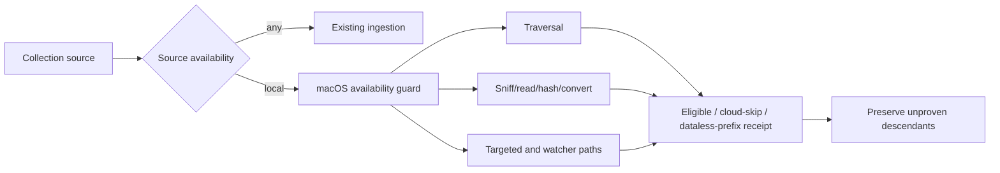

# Cloud-placeholder-safe indexing

## Overview

Add an opt-in source-availability policy for macOS File Provider collections so GNO can index materialized files without implicitly downloading cloud-only content. Physical macOS evidence is the mandatory first proof point: provider behavior, no-materialization semantics, and scan overhead must be measured before production ingestion changes begin.

## Goal & context

A macOS user may keep a broad Google Drive, iCloud Drive, or OneDrive tree locally visible while only part of it is materialized. Scheduled indexing must not turn cloud-only placeholders into an implicit sync job. Source availability is distinct from GNO's egress/privacy policy: it controls whether source bytes may be materialized, not whether data may leave the machine.

## Architecture & data flow

Model source availability as a collection/index policy with `any` and `local` semantics. `any` preserves current behavior. `local` enables one platform-aware availability boundary shared by traversal, targeted sync, watcher ingestion, sniffing, hashing, conversion, and record import.

On macOS File Provider storage, local mode must combine supported filesystem materialization state with a process/thread I/O policy that refuses dataless materialization. Classification alone is insufficient because availability may change between discovery and content access. A dataless directory is not enumerated; reconciliation preserves previously indexed descendants when absence cannot be proven.



## Quick commands

```bash
bun run lint:check
bun test
bun scripts/macos-file-provider-smoke.ts --help
```

## Boundaries / non-goals

- Initial guarantee: macOS File Provider storage only; Windows Cloud Files and Linux/FUSE require independent evidence.
- No provider-specific SDK integration unless physical evidence disproves a provider-neutral filesystem approach.
- Local-source mode never pins, evicts, downloads, or otherwise changes provider availability as product behavior.
- The smoke study may create and manipulate only dedicated disposable fixtures; it must not read existing user-file contents or retain credentials, source names, or source bytes.
- Metadata/provider bookkeeping may still occur. The guarantee concerns GNO-triggered file-content materialization, not zero provider-process activity.
- This feature does not redefine GNO's egress/privacy policy.

## Strategy Alignment

Active tracks served by this plan:
- **Local knowledge lifecycle** — makes broad cloud-backed local collections safe and dependable to index.
- **Controlled portability** — keeps source-content network movement explicit rather than hidden behind indexing.
- **Coherent agent and application surfaces** — applies one source-availability contract across full, targeted, scheduled, and watcher ingestion.

## Decision context

- Physical macOS smoke evidence comes before production implementation because File Provider behavior depends on real filesystem/provider interactions.
- Use the provider-neutral macOS filesystem contract first; provider SDK integrations are rejected as premature complexity.
- Keep the default mode behaviorally unchanged; the new guarantee is opt-in and fail-closed where support cannot be proven.
- A cloud-only source produces a distinct skip rather than a conversion error. A low-level guarded open may return a refusal error, which the ingestion boundary translates into that skip.
- Google Drive, iCloud Drive, and OneDrive require independent physical evidence. OneDrive is proven only for the tested OS/provider configuration and both installed immediate SharePoint library roots; unavailable or irreproducible states are reported as blocked or not available, never inferred from another provider.

<!-- Updated by plan-sync: fn-118-cloud-placeholder-safe-indexing.5 proved guarded OneDrive cloud-only refusal in both installed immediate library roots, not the planned unclaimed state -->
- fn-114 overlaps the converter boundary but creates no ordering dependency; its eventual adapter must consume the same guarded source-read contract.

## Acceptance Criteria

- **R1:** Before production implementation, a physical-macOS study records OS, hardware, Bun/GNO/provider versions and exercises dedicated fixtures for local, pinned/offline, cached-but-unpinned, cloud-only, nested dataless-directory, partial-content where reproducibly available, and state-race cases. It verifies Google Drive and iCloud Drive independently and verifies OneDrive before claiming OneDrive support. Every provider/state row is PASS, FAIL, BLOCKED, or NOT AVAILABLE with evidence; unavailable providers or irreproducible states are never inferred. The guarded probe must refuse cloud-only content without changing independently observed availability state. Errors/boundaries: unsupported filesystem, unavailable provider, policy setup failure, permission denial, provider offline, timeout, unknown flags, and race-time refusal are recorded explicitly without reading existing user content.
- **R2:** A user can opt a collection or index run into source availability `local`; `any` remains the default and preserves existing behavior. Local mode indexes materialized content and skips content that would require materialization. Errors/boundaries: unsupported platform/filesystem or inability to establish the guard fails closed with an actionable result; malformed configuration is rejected; no ambiguous fallback claims safety.
- **R3:** Local mode checks directory availability before descent and rechecks at the content-read boundary. Sniffing, hashing, conversion, record import, targeted sync, and watcher-triggered ingestion cannot bypass the guard or fetch missing ranges. Errors/boundaries: intermediate dataless directories, eviction between classification and read, partial content, symlinks, permissions, and provider races resolve without materialization.
- **R4:** Receipts distinguish eligible content, cloud-placeholder skips, dataless directory prefixes, and actual errors. Previously indexed sources remain searchable when later evicted or hidden below an unenumerated dataless prefix; never-indexed placeholders remain absent until local. Errors/boundaries: unknown availability and incomplete enumeration never masquerade as proven deletion.
- **R5:** Full indexing, targeted sync, scheduled indexing, and watch-triggered ingestion enforce identical source-availability semantics through one guarded boundary. Errors/boundaries: direct-path and watch paths cannot bypass traversal policy, and concurrent availability changes produce the same skip/error taxonomy.
- **R6:** Performance evidence uses at least two warmups and nine measured samples per lane, reports corpus shape, run order, median, p95, min, max, standard deviation, and raw samples, and separates discovery/traversal, availability metadata, sniff/read/hash, conversion, and embedding time. Before implementation it establishes the current all-local baseline and candidate guard cost; after implementation the unchanged `any` mode regresses by no more than 3% median scan time and `local` mode adds no more than 10% median scan time on the controlled all-local corpus. Errors/boundaries: contaminated samples, changed provider state, thermal/system load, and fixture drift are flagged or discarded with reasons rather than silently averaged.
- **R7:** User-facing contracts and receipts state the macOS guarantee, provider evidence, unsupported-provider behavior, stale-index behavior after eviction, performance findings, and the distinction between source availability and egress policy. Errors/boundaries: documentation must not claim providers or zero-download behavior beyond the physical evidence.

## Early proof point

Task fn-118-cloud-placeholder-safe-indexing.1 proves whether macOS can refuse dataless materialization across installed providers at acceptable scan cost. If it fails, re-evaluate the provider-neutral filesystem strategy and product guarantee before fn-118-cloud-placeholder-safe-indexing.2 or later begins.

## Requirement coverage

| Requirement | Planned task |
| --- | --- |
| R1 | fn-118-cloud-placeholder-safe-indexing.1 |
| R2 | fn-118-cloud-placeholder-safe-indexing.2, fn-118-cloud-placeholder-safe-indexing.4 |
| R3 | fn-118-cloud-placeholder-safe-indexing.2, fn-118-cloud-placeholder-safe-indexing.3 |
| R4 | fn-118-cloud-placeholder-safe-indexing.3 |
| R5 | fn-118-cloud-placeholder-safe-indexing.3 |
| R6 | fn-118-cloud-placeholder-safe-indexing.1, fn-118-cloud-placeholder-safe-indexing.4 |
| R7 | fn-118-cloud-placeholder-safe-indexing.4 |

## References

- Apple TN3150, Getting ready for data-less files.
- Existing ingestion walker, per-file read pipeline, targeted-sync path, reconciliation path, watcher snapshot traversal, and watcher reconciliation benchmark identified in task investigation targets.
- Overlap: fn-114-selective-anydoc-adoption-for-document; no dependency edge.