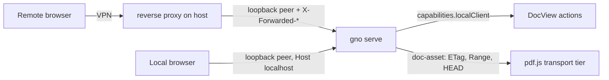

# PDF viewing over a remote link

> Closed on 2026-09-06 at Gordon's request. PR #206 was merged on 2026-09-02; Gordon confirmed the remaining remote verification and hosted documentation work was completed. Historical blocked observations below describe the original implementation session, not the final acceptance state. No new remote measurements were performed during this reconciliation.

## Overview

A PDF opened in the `gno serve` web UI from another machine over a mesh VPN loads slowly, renders blurry, and offers actions that only work on the server host. The measured link to the remote host is a relayed VPN path at about 200 ms per round trip, and the viewer pays one round trip per 64 KB chunk plus one full geometry pass before it draws page 1. This plan fixes the transport, the first paint, the HTTP cache and compression posture of the server, and the locality of the document actions, then measures the result over the real link.

`gno serve` refuses a non-loopback bind, so every remote client reaches it through a same-host proxy (for example a mesh-VPN `serve` proxy) or a tunnel. That fact shapes the locality rule in R4.

## Conversation Evidence

> user (turn 1, part 1): "i tried to open the pdf on my [remote host] through [vpn] and i found some issues."
> user (turn 1, part 2): "First of all the pdf loads very very slowly."
> user (turn 1, part 3): "Second the preview is too low res to see anything."
> user (turn 1, part 4): "And 3rd the open original button links to the local file which ofc doesn't work through [vpn]."
> user (turn 1, part 5): "Can you investigate this as prep work for a new spec"
> user (turn 8): "so what would you suggest we spec here?"
> user (turn 9): "why not /capture?"

## Goal & Context
<!-- scope: business -->
<!-- Source-tag breakdown: 60% [user] / 25% [paraphrase] / 15% [inferred] -->

A user opened a PDF in the `gno serve` web UI from another machine over a mesh VPN link and hit three problems. The PDF loads very slowly, the rendered page is too low resolution to read, and the "Open original" button links to a file on the server's disk, which the remote browser cannot open. [user]

The web UI's PDF path was built and tested on localhost, where a round trip costs under a millisecond. The measured link to the remote host runs through a VPN relay at about 200 ms per round trip with no direct connection, and the viewer pays one round trip per 64 KB of PDF data before it can draw the first page. [paraphrase]

The outcome this spec chases is that a PDF opened over a high-latency link becomes readable within a few round trips, renders sharp at the viewer's screen resolution, and only offers actions that work from where the user is sitting. [inferred]

## Architecture & Data Models
<!-- scope: technical -->

Findings from the investigation (measured 2026-09-02, confirmed by the planning research pass):

- The PDF loader disables streaming and background fetching, so pdf.js cancels the initial full-body GET as soon as the server advertises byte ranges and then requests every chunk on demand as separate Range requests. The parser discovers chunks sequentially, so a page needing k scattered chunks costs roughly k round trips.
- Before painting anything, the page hook resolves geometry for every page (four at a time) and only then publishes page slots and the fit-width scale. An N-page PDF therefore issues on the order of N chained fetches before page 1 draws.
- Every Range request re-runs the document lookup and path containment checks on the server, and the asset response carries a no-store cache policy, so reopening the same PDF refetches everything.
- The SPA bundle is served with only a content type. There is no cache validator, no cache lifetime, and no compression anywhere in the server. The committed snapshot is 12.2 MB of JavaScript across 408 files, about 2.5 MB if gzipped, and the largest chunk is 1 MB. The entry HTML and the hashed chunks share one dispatch path, so cache and compression logic must branch on the request path.
- The render math itself is sound. Pages render at zoom times device pixel ratio (capped at 2) with a 16 megapixel canvas clamp, and a scale change cancels and re-renders. A blurry page is therefore a runtime state, most likely a placeholder or early render shown while data trickles in, or a first render at zoom 1.0 before the container width is measured.
- "Open original" is a `file://` link built from the server's absolute path, and "Reveal" opens a file manager on the server host. Neither reaches a remote viewer. Only "Download original", which streams through the asset endpoint, works remotely. The capabilities handler receives neither the request nor the server today, so no route can tell where a request came from.
- The server already has a loopback-address predicate and a socket-peer lookup in the clipper security boundary; the locality rule reuses that predicate rather than adding a second parser.

Target shape:

- **Transport tier by file size.** The PDF loader learns the file size before loading (HEAD on the asset, through a raw fetch, since the JSON API helper cannot carry a HEAD). Files under a size bound load in one request with ranges disabled. Files above it keep range mode with a chunk size in the hundreds of kilobytes to low megabytes and background fetching enabled, so pdf.js pulls the remainder without waiting for the parser to ask.
- **First paint from page 1.** Page slots publish as soon as page 1 geometry is known, using page 1 dimensions as the placeholder for pages not yet measured, and correct themselves as geometry resolves. The fit scale is recomputed against the widest measured page when the full pass lands.
- **HTTP hygiene.** The asset endpoint emits a cache validator and a private cache lifetime. Hashed SPA chunks are served compressed with an immutable cache policy. The entry HTML keeps its current behaviour.
- **Client locality signal.** The capabilities response reports whether the current request is a same-host client, judged from the socket peer, the Host header, and the absence of forwarding headers. The document view uses it to decide which host-local actions to show.



## API Contracts
<!-- scope: technical -->

- The capabilities response gains one boolean, `localClient`. It is true only when all three hold: the socket peer address is loopback (IPv4 127.0.0.0/8, IPv6 ::1, or an IPv4-mapped form of either), the Host header names a loopback host (`localhost`, `127.x.x.x`, or `[::1]`, with or without a port), and the request carries no `Forwarded`, `X-Forwarded-For`, `X-Forwarded-Host`, or `X-Forwarded-Proto` header. Any other combination yields false. No other field changes. A shared client-side capabilities type replaces the duplicated per-page interfaces.
- The document asset endpoint keeps its existing query shape and Range semantics (single range 206, suffix ranges, multi-range 416, HEAD mirrors GET headers). It additionally returns a strong `ETag` derived from file size and modification time, answers a matching `If-None-Match` with 304 and no body, and replaces `Cache-Control: no-store` with `private, max-age=0, must-revalidate`. Conditional handling applies to full and ranged GET alike; a mismatched validator serves the requested bytes normally.
- Hashed SPA chunk responses gain `Cache-Control: public, max-age=31536000, immutable`, a gzip-encoded body when the request accepts gzip, `Vary: Accept-Encoding`, and a `Content-Length` matching the encoded body. The entry HTML keeps its current headers so a new snapshot is picked up on reload.
- In the document view, the "Open original" action for a remote client links to the asset endpoint, which already sends `Content-Disposition: inline`, and opens it in a new tab with `rel="noopener"`. The `file://` form and both "Reveal" action sites render only when `localClient` is true.
- The reveal endpoint (`POST /api/docs/:id/reveal`) applies the same locality rule server-side and answers 403 with the existing error envelope for a non-local client. Hiding the button is not access control; a remote client must not be able to open windows on the server host.

## Edge Cases & Constraints
<!-- scope: technical -->

- Whole-file loading must stay bounded. A PDF above the size bound must never be pulled entirely into memory by the transport change; the range path remains the ceiling.
- Background fetching must not starve the visible page. pdf.js requests the chunks the parser needs first; the plan relies on that ordering and does not add its own scheduler.
- A HEAD failure, a non-2xx status, or a missing `Content-Length` falls back to the current range-mode load rather than failing the document.
- Page 1 as a placeholder size is wrong for mixed-size documents. Slot heights must correct without a visible jump of the page in view once real geometry lands, and fit-width must recompute against the widest measured page.
- A file that changes on disk between visits must not be served stale. The ETag changes with size or modification time, and `must-revalidate` forces the browser to ask. A file that changes within the same millisecond with the same size is an accepted limit of an mtime validator (Bun reports modification time at millisecond resolution).
- Locality fails closed across the known ways a remote client can reach a loopback-only server. Reverse proxies (including mesh-VPN `serve` features) add forwarding headers; a plain port forwarder such as `socat` on the host presents a loopback peer but a non-loopback Host header; a kernel-level redirect presents the real remote peer. All three report remote. A client that tunnels to `localhost` through SSH is indistinguishable from a local client and is an accepted, documented limit.
- The HEAD size probe runs once per document load, not per navigation within the viewer, and costs one round trip.
- A file edited on disk in the middle of a ranged load can serve mixed bytes, exactly as today. The plan adds no `If-Range` handling; that risk is unchanged by this spec.
- The locality rule must not weaken any existing security header. Content Security Policy, frame headers, and the realpath containment check on the asset path stay byte-identical.
- Password-protected and unrenderable PDFs keep their existing fallback to extracted text. This spec changes nothing on those paths.
- The measured 200 ms round trip is a relay path. A direct VPN peer connection would be faster, but the fix must not depend on it.

## Quick commands

```bash
bun install --frozen-lockfile   # node_modules is absent in a fresh checkout
bun test test/serve/api-doc-assets.test.ts test/serve/fn112-doc-asset-bytes.test.ts
bun test test/serve/spa-bundle-source.test.ts test/serve/spa-first-chunk.test.ts
bun test test/serve/public/hooks test/serve/public/lib
bun run lint:check
bun run build:spa                # refresh assets/spa-production.json.gz after client changes
```

## Acceptance Criteria
<!-- scope: both -->

- **R1:** A PDF whose HEAD reports a `Content-Length` under the size bound (8 MB) loads through a single asset GET with no Range requests. A PDF at or above the bound loads through range mode with a chunk size of 1 MB and background fetching enabled. Errors: HEAD failure, non-2xx status, or absent `Content-Length` falls back to the current range-mode load; a file that grows past the bound between HEAD and GET is still served in full by the existing full-body path.
- **R2:** The first page renders before geometry for the remaining pages has resolved. When the full geometry pass completes, slot sizes and the fit-width and fit-page scales are corrected in one commit, and the scroll position is adjusted so the top edge of the page currently in view stays where it was. Errors: a geometry failure on a later page surfaces as the existing page error state and does not blank pages already drawn; the current all-or-nothing geometry invariant is replaced deliberately, with its test rewritten.
- **R3:** The document asset endpoint returns a strong `ETag`, answers a matching `If-None-Match` with 304 and an empty body, and sends `private, max-age=0, must-revalidate` instead of `no-store`, so every open revalidates once and unchanged files come from cache. Hashed SPA chunks are served gzip-encoded with `Vary: Accept-Encoding` and an immutable one-year cache policy, and a second load of a document page transfers under 100 KB of JavaScript. Errors: a client without `Accept-Encoding: gzip` receives the identity body with the same cache headers; a Range request with a mismatched `If-None-Match` receives the normal 206.
- **R4:** [strategy:Coherent agent and application surfaces] The capabilities response reports `localClient`, true only for a loopback peer with a loopback Host header and no forwarding headers. The document view shows both "Reveal" sites and the `file://` "Open original" only when it is true, and the reveal endpoint answers 403 for a non-local client. Errors: when the capabilities call fails, the view treats the client as remote and hides the host-local actions; a proxied request with a loopback peer but forwarding headers or a non-loopback Host header reports false; a direct POST to the reveal endpoint from such a client is refused.
- **R5:** [paraphrase] Over the remote link, "Open original" opens the PDF inline in a new browser tab through the asset endpoint, and "Download original" keeps working. No error surface beyond R4.
- **R6:** Measured over the relayed VPN link to the remote host (about 200 ms round trip), a 50-page PDF of about 5 MB paints its first page in under 2 seconds and completes its load with fewer than 30 requests, captured from the browser's network panel before and after the change. Errors: if the host is unreachable the verification is recorded as blocked, never as passed.
- **R7:** [paraphrase] The rendered page over the remote link is sharp at the viewer's device pixel ratio, verified with a screenshot from the remote browser alongside its reported DPR and viewport. Errors: if the blur persists after R1 and R2, the capture (DPR, viewport, browser, page count) is attached to the spec and a follow-up task is filed instead of marking this criterion met.

## Boundaries / non-goals
<!-- scope: business -->

- No server-side page rasterisation endpoint in this spec. It is only worth building if R6 still fails after the transport and first-paint changes.
- No change to the text fallback, password handling, or the pdf.js worker, cmap, and font delivery, which already carry immutable caching.
- No trust of forwarding headers to identify a client as local. Forwarding headers only ever make a client remote.
- No change to the loopback-only bind of `gno serve`, and no built-in remote access feature. Remote reachability stays the user's proxy or tunnel.
- No new configuration keys. The size bound and chunk size are constants.
- Non-PDF document views are untouched beyond the shared action-button visibility rule in R4.

## Strategy Alignment

Active tracks served by this plan:
- **Coherent agent and application surfaces** — the web UI stops exposing host-local actions that silently fail for a remote client, keeping the surface truthful about where it runs.
- **Local knowledge lifecycle** — the ETag validator keeps edited-on-disk documents fresh while allowing the browser to cache unchanged ones.

## Decision context

- The user asked for an investigation first and a spec second, so this spec records measured causes rather than guesses. The 200 ms relay round trip and the one-request-per-64 KB transport are the load-bearing facts.
- Transport tiering by size was chosen over a single global chunk size because small PDFs are the common case and one request beats any chunking, while very large PDFs must not be pulled whole into memory.
- The locality rule combines peer address, Host header, and forwarding headers because `gno serve` cannot bind beyond loopback, so every remote client arrives through a same-host proxy whose socket peer is loopback. A peer-only check would report those clients as local. The rule fails closed to remote.
- Replacing `no-store` with an ETag plus `must-revalidate` is a deliberate override of the fn-112 decision, which chose `no-store` because files change on disk. The validator catches the same changes and lets unchanged files come from cache.
- The loopback predicate is reused from the clipper security boundary rather than duplicated. Extracting it to a shared module is part of the locality task.
- Rejected a client-side hostname check as unreliable: the browser cannot tell a VPN hostname from a local one, and the server sees the peer directly.
- Rejected server-side rasterisation for now as overkill: it duplicates the pdf.js renderer and is only justified if the cheaper fixes fail the measured target.
- Rejected a config knob for the size bound as overkill: constants are enough until a real document proves otherwise.
- `max-age=0, must-revalidate` was chosen over a bounded lifetime so freshness matches the `no-store` behaviour fn-112 wanted: the browser asks on every open and pays one round trip, then reuses the cached bytes on 304.
- gzip only, no brotli: Bun ships gzip natively and every browser accepts it; brotli would add a dependency for a marginal gain on an already-cached bundle.
- Encoding negotiation lives in the public fetch fallback, not in the private SPA source: the private source re-issues internal requests with only the method, so `Accept-Encoding` never reaches it. Compressing at the public edge keeps the source untouched and sees the real client headers.
- Task completion and requirement completion are separate for R7. The verification task may finish having captured evidence and filed a follow-up, but R7 stays unmet in the coverage table and the spec does not close until the page is sharp.
- The viewer's single error state is split into fatal and nonfatal because the viewer today unmounts every page on any hook error; R2's "keep drawn pages" is impossible without that split.

## Early proof point

Task fn-136-pdf-viewing-over-a-remote-link.3 validates the core approach (fewer, larger requests make first paint round-trip bound rather than chunk bound over the relay) and ends with a measured first paint over the VPN link to the remote host. Task .4 depends on it. If the measurement fails (a 5 MB PDF still takes more than a few seconds to first paint with the transport change alone), stop and decide whether server-side rasterisation replaces the client-side path before tasks .4 and .5 continue. A blocked measurement (host unreachable) is recorded as BLOCKED and does not gate .4; only a failed measurement does.

## Open questions

- The R6 targets (2 seconds, 30 requests, 50 pages, 5 MB) are provisional. The first measurement over the relay sets the baseline; if the targets prove unrealistic for the chosen fixture, revise the numbers in the spec with the measured evidence rather than the other way round.
- The exact cause of the low-resolution page is unconfirmed until the remote screenshot in R7 is captured.
- Which mechanism exposes `gno serve` on the remote host over the VPN (a reverse proxy, a port forwarder, or an SSH tunnel) is unconfirmed. The locality rule covers the first two; if it is an SSH tunnel to `localhost`, the host-local actions will still show and that is the documented limit. Confirm during the R6 measurement.

## Requirement coverage

| Req | Description | Task(s) | Gap justification |
|-----|-------------|---------|-------------------|
| R1  | Transport tier by size with HEAD probe | fn-136-pdf-viewing-over-a-remote-link.3 | — |
| R2  | First paint from page 1 geometry | fn-136-pdf-viewing-over-a-remote-link.4 | — |
| R3  | ETag/304 on doc-asset, gzip + immutable SPA chunks; warm reload under 100 KB | fn-136-pdf-viewing-over-a-remote-link.1 (headers, tests), fn-136-pdf-viewing-over-a-remote-link.5 (warm-reload measurement) | — |
| R4  | `localClient` capability, reveal 403, action gating | fn-136-pdf-viewing-over-a-remote-link.2 | — |
| R5  | Remote "Open original" inline link | fn-136-pdf-viewing-over-a-remote-link.2 | — |
| R6  | Measured first paint and request count over the relay | fn-136-pdf-viewing-over-a-remote-link.3 (proof measurement), fn-136-pdf-viewing-over-a-remote-link.5 (final measurement) | Completed; owner confirmed on 2026-09-06 (task .6). |
| R7  | Sharp render over the remote link, with capture | fn-136-pdf-viewing-over-a-remote-link.5 | Completed; owner confirmed on 2026-09-06 (task .6). |

## References

- fn-112 (Native PDF.js Document Renderer, done): the invariants this plan preserves are same-origin only, CSP and frame headers untouched, Range semantics, HEAD mirrors GET, realpath containment, inline Content-Disposition, and the password fallback.
- Investigation notes: `notes/pdf-remote-viewing-investigation.md` (gitignored dev notes).
