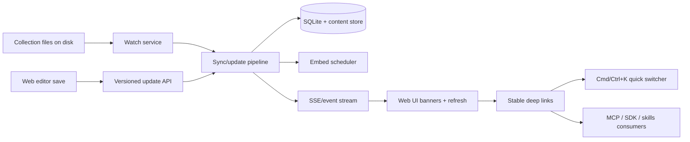

# Document Workspace Foundation for Desktop + Agents

## Overview

Build the foundation that lets GNO graduate from "excellent retrieval layer" to a trustworthy local document workspace for non-technical teams and agentic desktop apps.

This epic focuses on six foundation areas:

1. Safe editing semantics for source-of-truth vs converted documents.
2. Conflict-safe editing with durable local history.
3. Instant reindex and external-change awareness.
4. Deep links and exact-hit navigation across surfaces.
5. Markdown authoring upgrades for linked-note workflows.
6. Fast `Cmd/Ctrl+K` workspace switching on top of deep links and fresh index state.

## Stakeholders

- End users: safer editing, less drift, better open/search/jump flows, no need to keep a separate markdown app open for basic work.
- Developers: clearer document capability contract, fewer unsafe shell workarounds, stable deep-link format for integrations.
- Operations/support: simpler local rollout story, fewer "why did my file get overwritten?" incidents, clearer desktop support boundaries.

## Goals

- Markdown/text documents remain first-class editable sources.
- Converted Word/PDF documents become trustworthy read-only sources unless explicitly copied into an editable markdown note.
- Internal edits refresh search/index state immediately.
- External edits surface quickly with a non-destructive banner and reload path.
- Search, MCP, SDK, and the desktop shell can all point to the same document/heading/line targets.
- A `Cmd/Ctrl+K` quick switcher can jump to exact notes/targets using the same deep-link and freshness primitives as the rest of the workspace.

## Non-goals

- Full round-trip PDF/DOCX editing.
- New agent-only write primitives for Codex/Claude/Cursor; shell + existing MCP remain sufficient for now.
- Native desktop shell packaging and default-app OS handoff. Keep that as a follow-on once the workspace contracts are stable.
- Full file lifecycle parity (trash/move/rename across every surface). Existing follow-on epics like `fn-28` stay separate unless pulled in later.

## Current state and reuse points

- Converted content is stored as canonical markdown after source hashing and conversion; current architecture already distinguishes `sourceHash` from `mirrorHash`: `docs/ARCHITECTURE.md:56-77`, `docs/ARCHITECTURE.md:167-174`.
- Web edit saves currently send raw content to `PUT /api/docs/:id` with no optimistic concurrency marker: `src/serve/public/pages/DocumentEditor.tsx:223-255`.
- The update route only special-cases tag writeback for markdown, but still writes arbitrary content back to the source file path whenever `content` is provided: `src/serve/routes/api.ts:929-963`.
- Non-markdown documents still expose the same edit entry point from Doc View today: `src/serve/public/pages/DocView.tsx:272-275`, `src/serve/public/pages/DocView.tsx:385-390`.
- Search already has a BM25-only fast path and snippet line metadata, but search hits still open the doc root instead of the exact location: `src/serve/public/pages/Search.tsx:341-346`, `src/serve/public/pages/Search.tsx:1035-1067`.
- The SPA router already keys on pathname + query string and can support durable deep-link params without a router rewrite: `src/serve/public/app.tsx:40-60`.
- Existing shadcn/Radix-style primitives are already present and should remain the UI baseline: `src/serve/public/components/ui/dialog.tsx:1-142`, `src/serve/public/components/ui/command.tsx:1-183`.
- The editor and related-notes surfaces already expose useful extension points: `src/serve/public/components/editor/CodeMirrorEditor.tsx:26-39`, `src/serve/public/components/RelatedNotesSidebar.tsx:52-65`.
- The web server currently starts as a loopback-only Bun app; desktop packaging should wrap this lifecycle rather than replace it initially: `src/serve/server.ts:119-205`.

## Docs / website touchpoints

- `docs/` remains the source of truth for these product/architecture decisions; do not introduce a separate ADR track for `fn-41`.
- `docs/WEB-UI.md`, `website/features/web-ui.md`, and `website/_data/features.yml` currently describe broad create/edit/delete behavior and already advertise keyboard-first claims including `Cmd+K`; these surfaces must be updated as the actual editing contract, watcher behavior, and quick switcher land: `docs/WEB-UI.md:97-159`, `website/features/web-ui.md:34-57`, `website/_data/features.yml:56-74`.
- `docs/comparisons/obsidian.md` and the FAQ still frame GNO primarily as complementary to Obsidian. `fn-41` needs those pages rewritten to explain the new trajectory and the remaining limits honestly: `docs/comparisons/obsidian.md:5-6`, `docs/comparisons/obsidian.md:36-54`, `docs/comparisons/obsidian.md:164-166`, `website/_data/faq.yml:19-21`.
- `website/index.md`, `README.md`, and homepage feature copy should be updated as workspace features ship so the marketing surface matches the actual product contract, especially around agent-companion positioning, exact-hit navigation, read-only converted docs, and the quick switcher: `website/index.md:16-34`, `website/index.md:83-105`.
- Contract-bearing docs need to move with the code: `docs/API.md`, `docs/MCP.md`, `docs/SDK.md`, `docs/WEB-UI.md`, and any website feature pages that mirror those capabilities.

## Approach

### 1. Introduce an explicit document capability contract

Every surfaced document should declare whether it is:

- editable in place
- read-only source material
- derived/converted content that requires "make editable copy"

This contract should be enforced server-side first, then reflected in Web UI, MCP, SDK, and desktop-shell entrypoints.

### 2. Move from blind save to versioned save

Use the existing content-addressed model as the base for optimistic concurrency. Web saves should include expected source metadata (`sourceHash`, modified time, or equivalent durable version marker). Conflicts must return structured information instead of overwriting silently.

### 3. Add a live document event loop

Introduce a filesystem watch service for configured collection roots. Reuse the sync/update/index pipeline and embed scheduler to coalesce changed files and publish document/index events to the browser. Internal edits should feel immediate; external edits should surface as "changed elsewhere" banners with reload/review affordances.

### 4. Standardize deep-link shape before higher-level navigation

Define one stable deep-link contract for:

- document URI
- optional heading anchor
- optional line range / snippet target
- optional edit/view mode

All surfaces should consume the same link shape so the quick switcher and any later desktop shell can rely on it.

### 5. Upgrade markdown authoring inside the existing UI system

Keep using existing shadcn/Radix primitives and CodeMirror. Wire the existing wiki-link autocomplete component into the editor, support create-linked-note flows, and expose live related-note context while editing.

### 6. Add a fast `Cmd/Ctrl+K` workspace switcher on top of the existing UI kit

Use the existing shadcn/cmdk command primitive and the already-present fast BM25 path to provide a keyboard-first jump surface for:

- opening notes by title/path
- jumping to recent documents
- exact-match and near-match lookup
- creating a new markdown note from the palette
- routing into deep-linked doc targets

## Data flow



## Task map

1. `fn-41-document-workspace-foundation-for.1` Safe document capability model and read-only/editable separation.
2. `fn-41-document-workspace-foundation-for.2` Conflict-safe editing and local history.
3. `fn-41-document-workspace-foundation-for.3` Watch service, instant reindex, and external-change banners.
4. `fn-41-document-workspace-foundation-for.4` Deep links and exact-hit navigation across web/API/MCP/SDK.
5. `fn-41-document-workspace-foundation-for.5` Markdown authoring foundation using existing shadcn/Radix + CodeMirror surfaces.
6. `fn-41-document-workspace-foundation-for.6` Fast `Cmd/Ctrl+K` workspace switcher on top of deep links and watch-driven freshness.

## Related epics

- `fn-7` Desktop App: keep deferred as a follow-on once this epic stabilizes the workspace contracts.
- `fn-8` Scheduled Indexing: watch/instant reindex work here may reduce or supersede parts of the older scheduled-indexing idea.
- `fn-28` File deletion from Web UI: remains follow-on scope; do not pull into this epic unless the foundation tasks expose a clean trash contract.

## Risks and mitigations

- Risk: converted-file safety rules break current assumptions for non-markdown editing.
  Mitigation: enforce contract at API layer first; UI only mirrors capability flags.
- Risk: watch events create duplicate sync/embed work after internal saves.
  Mitigation: coalesce by path + sourceHash and suppress self-originated no-op cycles.
- Risk: deep-link changes drift across web/API/MCP/SDK.
  Mitigation: define one canonical link shape and cover it with schema/contract tests.
- Risk: the quick switcher becomes stale or misleading if index freshness lags behind editor state.
  Mitigation: land it only after the watch/event and deep-link foundations are in place.

## Quick commands

```bash
bun run lint:check
bun test
bun run docs:verify
bun run serve
./.flow/bin/flowctl show fn-41-document-workspace-foundation-for
./.flow/bin/flowctl tasks --epic fn-41-document-workspace-foundation-for
```

## Acceptance

- Converted PDF/DOCX-style documents can no longer be edited in place by accident.
- Versioned save conflicts are surfaced explicitly instead of silently overwriting newer disk state.
- Internal markdown edits trigger immediate index refresh behavior without manual `gno update`.
- External file changes are detected and surfaced in the active web session.
- Search hits can open to precise document targets and those targets are linkable across integrations.
- Editor-side linked-note workflows are materially better without introducing a new UI kit.
- A `Cmd/Ctrl+K` quick switcher can open/create/jump through the workspace using the same fast BM25 path, deep-link contract, and fresh index state.
- User-facing docs, API/spec docs, comparison docs, FAQ/homepage copy, and website feature pages reflect the new positioning and behavior.

## Open questions

- Scope of editable file types beyond markdown/plaintext (`.txt`, `.mdx`, maybe code files).
- Whether local history should live in SQLite, adjacent snapshots on disk, or both.
- Whether deep links should be pure web routes first, plus optional `gno://` desktop protocol later, or defined together from the start.
- Exact quick-switcher scope for v1: notes only vs notes + collections + tags + create actions.
