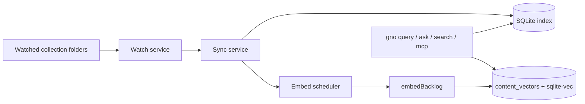

# Headless daemon and watch mode for continuous indexing

## Goal

Make continuous indexing a first-class CLI capability without requiring `gno serve` to stay open.

## Why this matters

Today GNO already has the core mechanics for live refresh:

- filesystem watching
- debounced sync per collection
- post-sync embedding scheduler
- graceful shutdown inside the web server lifecycle

But the only public way to access that behavior is `gno serve`, which is the wrong UX for users who want:

- a terminal-only background process
- long-running local indexing without a browser tab
- a service-manager friendly process for launchd/systemd later
- fresh CLI/MCP results without manually running `gno update` + `gno embed`

This epic turns the existing watcher/scheduler into a supported headless mode.

## Product decision

### V1 command shape

V1 should ship as a dedicated command:

```bash
gno daemon
```

This command should:

- run in the foreground as a normal long-running process
- reuse the existing watch/sync/embed machinery
- not start the web server
- not open any port
- not require a browser session

### Explicit V1 non-goals

Do **not** build a full process manager into GNO in this epic.

V1 should **not** include:

- `gno daemon start/stop/status`
- PID-file management as a core feature
- tray/menu-bar behavior
- built-in launchd/systemd/Windows-service installers
- cron/interval scheduling

Those can be follow-ons. V1 should be a clean foreground process that works well under:

- `nohup`
- launchd
- systemd user services
- supervisor-like wrappers

### Relationship to older `fn-8`

`fn-8` is an older broad “scheduled indexing” placeholder covering both watch mode and interval mode.

This epic should absorb the **watch/continuous indexing** part and leave **interval-based scheduling** as a future follow-on if it is still needed after daemon mode lands.

## Current state and reuse points

Existing reusable pieces:

- watcher logic already exists in [src/serve/watch-service.ts](/Users/gordon/work/gno/src/serve/watch-service.ts)
- embedding debounce scheduler already exists in [src/serve/embed-scheduler.ts](/Users/gordon/work/gno/src/serve/embed-scheduler.ts)
- `gno serve` already wires DB + context + scheduler + watcher lifecycle in [src/serve/server.ts](/Users/gordon/work/gno/src/serve/server.ts)
- CLI already has a `serve` command entry point in [src/cli/commands/serve.ts](/Users/gordon/work/gno/src/cli/commands/serve.ts) and [src/cli/program.ts](/Users/gordon/work/gno/src/cli/program.ts)

Current gap:

- watcher/scheduler lifecycle is coupled to the web server startup path
- `CollectionWatchService` currently requires an event bus even though the daemon does not need browser refresh events
- docs/specs only present `gno serve` as the live-refresh path
- there is no CLI contract for a headless long-running process

## Stakeholders

- CLI users who want always-fresh indexes without manual commands
- agent users who want CLI/MCP calls to hit a live-updating local index
- future desktop/packaging work that needs a non-HTTP background runtime boundary
- support/ops users who need a deterministic long-running process shape

## Goals

- Continuous file watching is available from the CLI without the Web UI.
- The daemon reuses the same sync/embed behavior as `gno serve`.
- The process is safe to run for long periods and exits cleanly on signals.
- The command is easy to wrap with launchd/systemd/nohup.
- User-facing docs clearly explain when to use:
  - one-shot `gno update`
  - one-shot `gno embed`
  - long-running `gno daemon`

## Non-goals

- Interval-based scheduling (`every 5 minutes`) in the first slice
- Remote/HTTP control APIs for daemon management
- Native desktop background service UX
- Cross-process coordination between multiple daemon instances
- Config hot-reload while the daemon is already running

## Start here

A fresh agent should be able to execute this epic cold in this order:

1. Inspect current watcher/scheduler lifecycle in:
   - `src/serve/watch-service.ts`
   - `src/serve/embed-scheduler.ts`
   - `src/serve/server.ts`
2. Define the CLI contract and service boundary
3. Extract a reusable headless runtime from the current `serve` startup path
4. Implement `gno daemon`
5. Add tests for lifecycle, watching, and restart-safe behavior
6. Update CLI/spec/docs/website copy together

## CLI contract

### Synopsis

```bash
gno daemon [--no-sync-on-start]
```

### Behavior

On startup, `gno daemon` should:

1. load config and open the selected index DB
2. initialize the same runtime dependencies used by `gno serve`
3. start the watcher service for configured collections
4. perform an initial sync pass by default
5. schedule embedding when changed/backlog content exists
6. remain running until SIGINT/SIGTERM

### Options

V1 should add only one dedicated option:

- `--no-sync-on-start`
  - skip the initial full sync pass
  - useful when the user knows the index is already current and only wants future watch events

Global options like `--config`, `--index`, `--verbose`, `--quiet`, and `--offline` should continue to apply.

### Logging contract

Default text logs should be concise and service-friendly.

Minimum events to log:

- daemon start (index/config summary)
- watcher armed / failed collections
- initial sync start/finish summary
- watch-triggered sync start/finish summary
- embed run summary (`embedded`, `errors`, backlog if available)
- fatal startup/shutdown errors
- graceful shutdown on signal

### Exit behavior

- `0` on graceful shutdown
- `2` on startup/runtime failure that prevents daemon operation

## Runtime design

### Required extraction

Create a reusable headless runtime/service boundary that both `gno serve` and `gno daemon` can use.

Likely shape:

- runtime factory that owns:
  - DB
  - store adapter
  - context holder or equivalent runtime object
  - embed scheduler
  - watch service
  - optional event bus
- explicit `start()` and `dispose()` lifecycle

The web server should become one consumer of this runtime, not the only place where it exists.

### Event bus handling

`CollectionWatchService` should not require a browser-oriented event bus when used headlessly.

Options:

- make event bus optional
- or inject a no-op bus adapter

Either is fine, but the daemon path must not invent fake browser events just to satisfy type shape.

### Config reload policy

V1 should use **read-on-start** config semantics.

If the user changes collections/config while the daemon is running, the documented behavior should be:

- restart the daemon to pick up config changes

Do not attempt live config mutation in the first slice.

## Data flow



## Implementation requirements

### Reuse, not rewrite

- Reuse `CollectionWatchService`
- Reuse `createEmbedScheduler`
- Reuse `defaultSyncService`
- Reuse existing context/model initialization
- Avoid a second background indexing implementation

### Service-manager friendliness

The process should be friendly to external supervision:

- no hidden daemonization
- deterministic stdout/stderr logs
- signal-driven shutdown
- no interactive prompts
- no browser-only assumptions

### Offline/model behavior

If embed/generation models are unavailable:

- daemon should still be able to run watcher + BM25 sync behavior
- logs should make clear whether embeddings are active, skipped, or backlogged
- startup should not hard-fail just because vector/LLM pieces are unavailable unless the base runtime itself cannot initialize

## Testing requirements

Must include:

- CLI command wiring test for `gno daemon`
- lifecycle test for startup/shutdown
- temp-dir integration test where a watched file change triggers sync
- test that changed files schedule embedding
- test for `--no-sync-on-start`
- test for watch-failure reporting on an invalid/unwatchable collection
- regression coverage proving daemon path does not require the web server

Where practical, reuse temp-fixture patterns already present in `test/serve` and `test/ingestion`.

## Docs and website requirements

This epic must include full docs/spec updates in the same change set.

Minimum required updates:

- [README.md](/Users/gordon/work/gno/README.md)
  - mention headless daemon mode in the CLI/dev workflow sections
- [docs/CLI.md](/Users/gordon/work/gno/docs/CLI.md)
  - add `gno daemon` command reference and examples
- [spec/cli.md](/Users/gordon/work/gno/spec/cli.md)
  - add canonical synopsis/options/exit behavior
- [docs/QUICKSTART.md](/Users/gordon/work/gno/docs/QUICKSTART.md)
  - explain one-shot vs continuous indexing paths
- [docs/TROUBLESHOOTING.md](/Users/gordon/work/gno/docs/TROUBLESHOOTING.md)
  - daemon not refreshing / stale config / duplicate process guidance
- [docs/WEB-UI.md](/Users/gordon/work/gno/docs/WEB-UI.md)
  - clarify that `gno serve` is not the only live-refresh path anymore
- website docs sync
  - run normal docs-to-website sync path so the site reflects the new command

Optional but likely useful:

- dedicated `docs/DAEMON.md` if the command needs service-manager examples (`launchd`, `systemd`, `nohup`)

## Task map

1. `fn-55-headless-daemon-and-watch-mode-for.1`
   - finalize CLI contract and reusable runtime boundary
2. `fn-55-headless-daemon-and-watch-mode-for.2`
   - extract a shared background runtime from `gno serve`
3. `fn-55-headless-daemon-and-watch-mode-for.3`
   - implement `gno daemon` lifecycle, logging, and initial-sync behavior
4. `fn-55-headless-daemon-and-watch-mode-for.4`
   - tests, CLI/spec/docs/website updates, and supervisor examples

## Related epics

- `fn-8` Scheduled Indexing
  - this epic should absorb the watch/continuous-indexing part of that older placeholder
- `fn-48` Desktop Beta: Background Service and Watch Hardening
  - reuse its reliability expectations and existing hardening work
- `fn-57` Mac and Linux packaging matrix and support tiers
  - daemon mode becomes a packaging/support surface there

## Risks and mitigations

- Risk: daemon implementation drifts from `gno serve` behavior
  - Mitigation: shared runtime boundary, no duplicate watch/sync/embed logic
- Risk: users expect built-in process management (`stop/status`) immediately
  - Mitigation: be explicit in docs that v1 is foreground and service-manager friendly, not a full supervisor
- Risk: config changes while running create confusion
  - Mitigation: document restart-required config semantics in v1
- Risk: missing embed model causes perceived daemon failure
  - Mitigation: degrade to sync-only mode with explicit logging

## Acceptance

- `gno daemon` exists and runs as a long-lived headless watcher process.
- It reuses the existing watcher/sync/embed behavior instead of duplicating it.
- It does not require the web server or browser session.
- Initial sync behavior is explicit and documented.
- Signal handling and shutdown are clean and supportable.
- CLI/spec/docs/website updates land in the same implementation.
- Users can clearly choose between one-shot indexing and continuous indexing.

## Open questions

- Whether `docs/DAEMON.md` should be added immediately or the examples can live inside `docs/CLI.md`
- Whether service-manager example files should live in `contrib/` later
- Whether a future `gno daemon status` belongs in a follow-on once long-running process UX proves necessary
