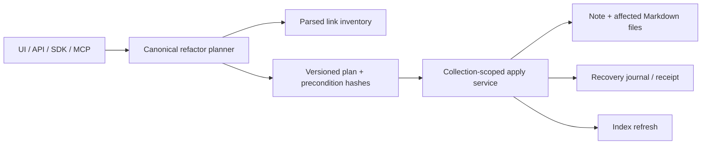

# fn-60 Reference-safe file operations and note refactors

## Goal & Context
<!-- scope: business -->

Finish the trust-critical part of note refactoring: renaming or moving an editable Markdown note must preserve every reference that GNO can prove safe to rewrite, and must make every unsupported or ambiguous reference visible before mutation.

The workspace operations themselves are already shipped and reconciled in fn-60.1–fn-60.4: rename, move, duplicate, folder creation, capability checks, warning counts, UI/API/SDK/MCP surfaces, and index refresh. The remaining defect is that `src/core/file-refactors.ts` only predicts target paths and emits generic counts. It does not enumerate affected documents, plan link edits, preserve wiki/Markdown references, or execute a multi-file refactor with stale-plan protection.

Target users are people who treat a local Markdown workspace as durable source material. The product promise is conservative: rewrite only parsed, resolved references; leave opaque syntax byte-identical; and fail closed instead of silently retargeting a link.

## Architecture & Data Models
<!-- scope: technical -->

One canonical server-side refactor service owns preview and apply semantics for rename and same-collection move:



The plan contains the operation, source and target URIs, affected-document edits, unresolved/opaque references, warnings, source-content fingerprints, and a stable plan digest. Link edits identify the parsed token span and replacement destination; unchanged prose, labels, aliases, query text, fragments, escaping, and percent encoding remain untouched.

The filesystem commit boundary covers the moved note plus every accepted reference-file rewrite. The apply service verifies precondition hashes immediately before writing, stages replacements, and either commits the complete file set or restores the pre-apply bytes. Index refresh follows the durable filesystem commit. A refresh failure returns an explicit `applied_with_sync_pending` result and recovery instruction; it does not pretend the refactor failed or roll back already committed user files.

Reuse:

- path planning and warning compatibility in `src/core/file-refactors.ts:42-180`;
- link parsing in `src/core/links.ts` and indexed resolution in the SQLite store;
- write capability checks in `src/core/document-capabilities.ts`;
- narrowly scoped filesystem primitives in `src/core/file-ops.ts:7-79`;
- lock and journal patterns in `src/core/file-lock.ts` and `src/store/sqlite/change-journal-store.ts:74-130`.

## API Contracts
<!-- scope: technical -->

Preview and apply use one versioned structured contract across applicable surfaces.

Preview input:

- editable source document URI;
- `rename` or same-collection `move` target;
- optional conflict policy limited to explicit, documented values.

Preview output:

- schema version, plan digest, source/target URI;
- affected documents with parsed link kind, original destination, proposed destination, and source span;
- unresolved, ambiguous, malformed, or unsupported references with reason codes;
- precondition fingerprints and safety summary;
- `canApply` false whenever the destination, permissions, capability, or reference state makes execution unsafe.

Apply input includes the exact plan digest and confirmation. Apply never recomputes a materially different plan silently. Results distinguish `applied`, `applied_with_sync_pending`, `conflict`, `stale_plan`, `unsupported`, and `failed_rolled_back`, with content-free recovery metadata.

REST remains the Web UI transport. SDK and MCP adapt the same core contract; MCP keeps the existing write gate and destructive confirmation. A new generic CLI action layer is not part of this spec.

## Edge Cases & Constraints
<!-- scope: technical -->

- Rewrite only references recognized by GNO's parser and resolved uniquely to the moved note. Regex replacement is forbidden.
- Preserve wiki aliases, heading/block fragments, Markdown labels/titles, query text, escapes, and URI encoding except for the target path bytes that must change.
- Relative Markdown destinations are recalculated from each referring document, not from the moved note.
- Reference-style Markdown definitions are rewritten at the definition, never at each use.
- Duplicate filenames, case-only renames, Unicode normalization, spaces, parentheses, nested folders, occupied targets, and path traversal have explicit fixtures.
- Fenced code, inline code, HTML, external URLs, malformed syntax, unsupported Obsidian extensions, and ambiguous links are unchanged and reported.
- The first release is same-collection only. Cross-collection moves and bulk refactors are out of scope.
- One collection-scoped lock serializes preview/apply-sensitive mutations across REST, UI, SDK, and MCP. A changed source or affected file invalidates the plan.
- SIGINT, disk-full, permission failure, cross-device behavior, and client disconnect cannot leave a mixed old/new file set without a detectable recovery journal.
- Bun-first: use `Bun.file()`/`Bun.write()` for content; `node:fs/promises` remains limited to filesystem-structure operations and requires the repository's explanatory comment.

## Acceptance Criteria
<!-- scope: both -->

- **R1:** Preview enumerates every parsed incoming wiki/Markdown reference GNO examined, classifies each as rewriteable, unchanged, ambiguous, unsupported, or invalid, and exposes stable reason codes without mutating disk or index state.
- **R2:** Applying a valid rename or same-collection move preserves uniquely resolved wiki and relative Markdown links, including aliases, labels, fragments, titles, escaping, and encoding, while leaving unrelated bytes unchanged.
- **R3:** Apply verifies plan/source fingerprints, uses one collection-scoped mutation boundary, and produces either a complete filesystem refactor or a verified rollback/recovery state; concurrent or stale plans never partially apply.
- **R4:** Read-only documents, cross-collection moves, occupied/unsafe targets, ambiguous resolutions, and unsupported syntax fail closed or remain unchanged with explicit diagnostics.
- **R5:** REST/Web UI, SDK, and write-gated MCP expose the same preview/apply semantics, result states, plan digest, and safety summary through transport-specific adapters.
- **R6:** Index refresh converges automatically after a successful filesystem commit; refresh failure is observable as `applied_with_sync_pending` and is recoverable without repeating file mutation.
- **R7:** Contract, unit, integration, and live workspace tests cover the reference matrix, failure injection, concurrent plans, and cross-surface parity; repo docs, `assets/skill/`, and `/Users/gordon/work/gno.sh` describe the exact safety boundary before release.

## Boundaries
<!-- scope: business -->

- No cross-collection move, bulk/multi-select refactor, arbitrary Markdown formatter, or plugin-specific syntax guessing.
- Duplicate and folder creation retain their shipped semantics; duplicating a note does not retarget existing links.
- No generic action bus or new CLI command family in this spec.
- No promise to rewrite references GNO cannot parse and resolve uniquely.
- No silent rollback of a durable filesystem commit solely because reindexing is temporarily unavailable.

## Decision Context
<!-- scope: both — conditionally substructured -->

The shipped warning-only workflow met the original conservative acceptance boundary, but it does not deliver the stronger trust feature users expect from serious workspace ownership. The revision keeps the proven surfaces and replaces generic warning counts with an auditable plan/apply engine. Parser-backed minimal edits are chosen over regexes or full-document reserialization because preserving user-authored bytes is part of the product contract. Atomic filesystem mutation and index convergence are modeled separately because pretending they share one transaction would create false safety.

## Quick commands

```bash
bun test test/core/file-ops.test.ts test/core/links.test.ts test/store/links.test.ts
bun test test/serve/api-docs-lifecycle.test.ts test/mcp/tools/workspace-write.test.ts test/sdk/client.test.ts
bun run lint:check
```

## Early proof point

Task fn-60.5 freezes the preview/apply contract and proves, with a representative fixture matrix, that GNO can identify exact rewrite spans without changing unrelated bytes. If that proof cannot handle wiki aliases, relative Markdown links, fragments, duplicates, and opaque syntax conservatively, stop before building the executor.

## Requirement coverage

| Req | Description | Task(s) | Gap justification |
|---|---|---|---|
| R1 | Complete classified preview | fn-60.5, fn-60.6 | — |
| R2 | Reference-preserving minimal rewrites | fn-60.6, fn-60.7 | — |
| R3 | Stale-plan protection and atomic/recoverable apply | fn-60.5, fn-60.7 | — |
| R4 | Fail-closed boundaries | fn-60.5, fn-60.6, fn-60.7 | — |
| R5 | Cross-surface semantic parity | fn-60.8, fn-60.10 | — |
| R6 | Observable index convergence | fn-60.7, fn-60.8, fn-60.10 | — |
| R7 | Full verification and truth-surface parity | fn-60.9 | — |

## References

- `src/core/file-refactors.ts:42-180`
- `src/core/file-ops.ts:7-79`
- `src/core/links.ts`
- `src/core/document-capabilities.ts`
- `src/core/file-lock.ts`
- `src/store/sqlite/change-journal-store.ts:74-130`
- `src/mcp/tools/workspace-write.ts:161-332`
- `src/serve/routes/api.ts:2385-3026`
- `src/sdk/client.ts:1620-1825`
- CommonMark 0.31.2 links: https://spec.commonmark.org/0.31.2/#links
