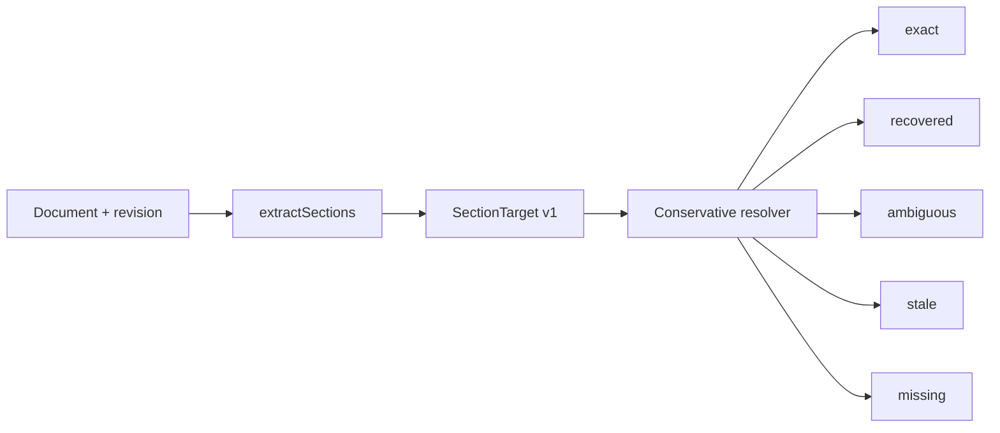

# fn-61 Document structure navigation and section addressability

## Goal & Context
<!-- scope: business -->

Finish section addressability for citations and agents without rebuilding the already-shipped outline experience. Main already has shared heading extraction, deterministic duplicate slugs, DocView outline/current-section tracking, readable `#anchor` deep links, QuickSwitcher section navigation, REST sections, and SDK `getSections()`; fn-61.1–fn-61.4 are reconciled as delivered.

The remaining user problem is durability and parity. A readable fragment identifies the current rendering, but a heading rename, inserted duplicate, or structural edit can silently retarget it. Agents also lack one canonical section locator/resolution contract in MCP. This revision adds versioned, evidence-carrying section targets that resolve conservatively and remain compatible with current human-readable links.

The product promise is not “anchors never change.” It is “GNO never silently cites the wrong section”: exact and safely recovered targets navigate; ambiguous or stale targets report why and preserve the evidence needed for a human or agent to recover.

## Architecture & Data Models
<!-- scope: technical -->

`src/core/sections.ts` remains the only heading extraction and display-anchor source. Add a browser-safe section target/resolver beside it:



A v1 target carries document identity, schema version, the readable anchor at capture time, normalized heading ancestry and duplicate occurrence, exact heading/section quote with bounded prefix/suffix context, a source-content fingerprint, and line/offset hints. Hints accelerate resolution but are not identity.

Resolution order is deterministic: same-revision structural match; exact heading path/occurrence; unique quote plus context recovery; otherwise `ambiguous`, `stale`, or `missing`. No fuzzy threshold may silently choose among multiple candidates. Results include confidence/status, current anchor and line range when navigable, candidates when safe to expose, and the original target evidence.

The first release computes targets from document content and does not persist opaque section rows in SQLite. Human URLs retain readable fragments. Transport-specific encodings may carry the versioned target alongside the fragment, but old `#anchor` links remain valid and current rendering IDs do not change.

## API Contracts
<!-- scope: technical -->

Shared core types:

- current `DocumentSection` remains backward compatible;
- `SectionTargetV1` is an immutable/versioned locator;
- `SectionResolution` returns `exact`, `recovered`, `ambiguous`, `stale`, or `missing`, plus current section/citation metadata when navigable.

REST and SDK expose target creation/resolution without reimplementing parsing. MCP adds a read-only section-resolution/retrieval surface or extends the existing document retrieval contract through the versioned schema. It returns canonical document URI, heading, anchor, line range, source fingerprint, and resolution status so answers can cite what was actually resolved.

Ambiguous/stale results are non-navigable by default and never masquerade as not-found success. Existing `/api/doc/:id/sections`, SDK `getSections()`, `#anchor` links, and `gno_get` line-range behavior stay compatible.

## Edge Cases & Constraints
<!-- scope: technical -->

- Duplicate headings are distinguished by ancestry, occurrence, quote/context, and revision evidence—not current slug alone.
- Heading rename, heading insertion before a duplicate, section reorder, deleted heading, repeated identical sections, and changed body context have explicit expected statuses.
- Setext headings, inline HTML headings, ATX closing markers, fenced content, and heading normalization must be either supported consistently or documented as unsupported; renderer and extractor cannot diverge.
- Resolution is local, deterministic, network-free, and LLM-free.
- Targets are bounded in size and do not embed entire private sections in URLs, logs, analytics, or error messages.
- Copy-link UX must remain readable and safe to share; any opaque selector is additive to the fragment, versioned, and privacy-reviewed.
- A source content fingerprint mismatch is evidence of staleness, not automatic failure if the locator still recovers uniquely.
- Current anchor IDs remain unique per rendered document as required by HTML; GNO owns the slug compatibility contract because Markdown does not standardize heading IDs.

## Acceptance Criteria
<!-- scope: both -->

- **R1:** GNO can create a bounded, versioned section target containing enough structural, quote/context, revision, and human-anchor evidence to distinguish duplicate headings without persisting section rows.
- **R2:** One deterministic resolver returns `exact`, `recovered`, `ambiguous`, `stale`, or `missing`; it never silently selects a different section when evidence is non-unique.
- **R3:** Existing readable `#anchor` links, rendered heading IDs, outline navigation, QuickSwitcher jumps, REST sections, and SDK `getSections()` remain backward compatible.
- **R4:** REST, SDK, and read-only MCP expose the same target and resolution semantics, including canonical document URI, current anchor, line range, source fingerprint, and non-success diagnostics suitable for citations.
- **R5:** Section target creation/resolution is browser-safe, deterministic, local, LLM-free, bounded in output size, and covered for duplicate/edit/reorder/delete/parser-renderer cases.
- **R6:** Repo contracts/docs/skill and `/Users/gordon/work/gno.sh` explain readable anchors versus durable section targets; live UI/API/MCP QA proves copy, resolve, recover, and fail-closed behavior.

## Boundaries
<!-- scope: business -->

- No block-level identity, transclusion, collaborative annotation store, canvas, or general-purpose fuzzy anchoring platform.
- No database table of persistent section IDs in the first release.
- No change to current heading slug/render IDs unless compatibility tests prove a required parser bug fix.
- No automatic navigation for ambiguous or stale targets.
- No rebuild of the shipped outline, current-section highlighting, or QuickSwitcher UI.

## Decision Context
<!-- scope: both — conditionally substructured -->

Readable slugs are excellent navigation affordances but weak citation identity. Replacing them with opaque IDs would harm URLs and break compatibility; pretending slugs survive semantic edits would create false trust. The chosen composite target keeps the current fragment for humans and adds bounded evidence for conservative recovery by APIs and agents. A content-derived first release avoids premature persistent identity/schema work while leaving a versioned migration path if usage later proves it necessary.

## Quick commands

```bash
bun test test/core/sections.test.ts test/sdk/client.test.ts
bun test test/serve/public/components/QuickSwitcher.dom.test.tsx
bun run lint:check
```

## Early proof point

Task fn-61.5 proves a bounded target can recover the intended section after representative heading edits while returning `ambiguous` for indistinguishable duplicates. If that cannot be achieved deterministically without excessive private text or persistent IDs, revisit the locator design before exposing it through transports.

## Requirement coverage

| Req | Description | Task(s) | Gap justification |
|---|---|---|---|
| R1 | Versioned bounded target | fn-61.5 | — |
| R2 | Conservative deterministic resolver | fn-61.5 | — |
| R3 | Backward-compatible UI/fragments | fn-61.5, fn-61.7 | — |
| R4 | REST/SDK/MCP citation parity | fn-61.6, fn-61.8 | — |
| R5 | Local deterministic safety/performance | fn-61.5, fn-61.7 | — |
| R6 | Documentation and live QA | fn-61.7 | — |

## References

- `src/core/sections.ts:9-92`
- `src/serve/public/components/editor/MarkdownPreview.tsx:190-217`
- `src/serve/public/pages/DocView.tsx:566-610,1169-1235`
- `src/serve/public/components/QuickSwitcher.tsx:103-130,338-367`
- `src/serve/routes/api.ts:1919-1948`
- `src/sdk/client.ts:1832-1836`
- W3C Web Annotation Data Model selectors: https://www.w3.org/TR/annotation-model/
- HTML `id` contract: https://html.spec.whatwg.org/multipage/dom.html#the-id-attribute
