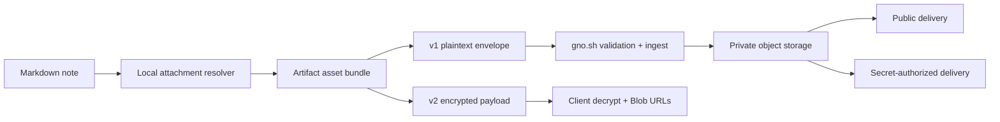

# fn-71 Bundled image attachments in publish export

## Goal & Context
<!-- scope: business -->

Make published capsules preserve local raster images referenced from Markdown, including Obsidian-style embeds, without weakening GNO's public/secret/encrypted sharing guarantees.

Today the producer deliberately drops local image embeds (`image-embed-dropped`), the v1/v2 artifact note shape has no asset bytes, and gno.sh builds an empty asset manifest. This is a real product gap: a note that reads correctly in a vault can become incomplete when published. The feature is valuable and concrete, but it crosses a security boundary and two independently deployed repos; its contract and rollout must be settled before implementation.

First release supports PNG, JPEG, GIF, WebP, and AVIF. SVG and other active/document formats remain explicitly unsupported and are reported rather than sanitized speculatively. The user sees a pre-publish asset/egress summary, exact final upload size, and any unresolved or unsupported embeds before confirmation.

## Architecture & Data Models
<!-- scope: technical -->

Keep publish artifact versions 1 and 2 backward compatible by adding optional asset descriptors/bytes and a versioned capability marker. Markdown is rewritten to internal `gno-asset:<asset-id>` sentinels only inside the artifact; sentinels never reach rendered browser HTML or public metadata.



Each asset has a deterministic content identity, owning note/reference mapping, media type determined from validated bytes, exact raw and encoded lengths, SHA-256 digest, and payload bytes in the appropriate envelope. Duplicate content may share one asset object while retaining every source reference.

Visibility semantics:

- **public v1:** validated assets may be delivered through immutable public URLs only after the share is classified public;
- **secret v1:** object storage remains private and asset delivery is authorized by the same secret-share capability as the snapshot—no guessable/public object URL;
- **encrypted v2:** plaintext image bytes remain inside the encrypted client payload; after decryption the browser creates scoped Blob URLs and revokes them on replacement/unmount. The server never needs plaintext asset objects for this path.

The producer and consumer enforce the limit on the exact final serialized upload bytes, including JSON/base64/encryption overhead. There is no fixed raw “90 MB” allowance. The current gno.sh 100 MiB upload cap is the external ceiling unless the cross-repo contract intentionally changes it.

Publishing is one logical transaction. Snapshot/catalog visibility cannot point to missing assets. Re-publish and delete define object reference counting or equivalent ownership, orphan cleanup, rollback receipts, and idempotency. Storage success followed by ingest failure must not leak permanent orphan objects.

## API Contracts
<!-- scope: technical -->

The cross-repo handoff contract owns:

- optional asset schema and capability/version negotiation for old producers/consumers;
- supported raster media types and byte-sniffing rules;
- `gno-asset:` sentinel grammar and the guarantee that every sentinel is resolved or fails ingest before Markdown rendering;
- exact serialized-byte budget and deterministic oversize diagnostics;
- SHA-256 integrity checks, immutable storage identity, visibility class, and delivery authorization;
- publish/republish/delete idempotency, rollback, and orphan handling;
- v2 encrypted payload and client Blob URL lifecycle.

Producer result includes notes/assets counts, raw and final serialized bytes, dedup savings, unresolved/unsupported embeds, and egress classification before upload. Consumer rejects unknown required capability versions, missing asset bytes, digest/length mismatch, invalid image signatures, traversal-like references, duplicate/conflicting IDs, and unresolved sentinels. Failure is whole-artifact; no silently partial capsule.

## Edge Cases & Constraints
<!-- scope: technical -->

- Resolve Obsidian embeds and Markdown image destinations relative to the source note and collection root; reject traversal outside approved collection roots and symlink escapes.
- External HTTP(S) images remain external and are never fetched/bundled implicitly.
- Duplicate basenames, spaces, Unicode, parentheses, aliases, width hints, fragments, and percent encoding have fixtures.
- Extension and declared MIME are untrusted. Validate signatures/content, exact byte length, digest, and supported raster dimensions before ingest.
- SVG, PDF, HTML, data URLs, malformed images, decompression bombs, and unsupported formats remain unbundled with explicit diagnostics in v1.
- Secret shares never expose a public object URL or use a presigned URL as the sole authorization decision.
- Encrypted shares do not upload decrypted assets to object storage; Blob URLs are revoked deterministically and CSP continues to permit only the required `blob:` image source.
- Re-publish, concurrent publish, delete, ingest retry, storage timeout, quota failure, and client disconnect cannot leave a visible mixed snapshot/assets generation.
- An old consumer either ignores optional assets safely while preserving existing note text/warnings or rejects a declared required capability; it never renders raw sentinels.
- Use `Bun.file()` and `Bun.write()` for producer byte I/O; new runtime dependencies require the repository health review.

## Acceptance Criteria
<!-- scope: both -->

- **R1:** The versioned publish contract supports optional, integrity-checked raster assets and deterministic `gno-asset:` references while remaining compatible with asset-free v1/v2 artifacts.
- **R2:** Producer resolution is collection-root confined, parser-aware, deterministic, Bun-first, deduplicates identical bytes, and reports unresolved/unsupported/local-versus-external references without implicit network fetches.
- **R3:** Export enforces the gno.sh limit on exact final serialized upload bytes—including encoding/encryption overhead—and reports a stable breakdown before upload; oversize artifacts fail before network egress.
- **R4:** Public, secret, and encrypted shares follow distinct delivery rules: public immutability, secret capability authorization with private storage, and v2 client-only plaintext with revoked Blob URLs.
- **R5:** Consumer validates signatures/media type, dimensions/limits, length, digest, IDs, schema capability, and every sentinel before visibility; any validation failure rejects the whole generation.
- **R6:** Publish, retry, republish, delete, rollback, and orphan cleanup are idempotent and cannot expose snapshots with missing/wrong-generation assets.
- **R7:** Cross-repo fixtures prove plaintext public/secret rendering and encrypted client rendering in real `` DOM, old artifact compatibility, hostile-path/MIME rejection, CSP/Blob cleanup, and the serialized-byte boundary.
- **R8:** GNO specs/docs/skill/CHANGELOG and gno.sh handoff/PRD/docs/product pages are reconciled; both repos pass gates and driven QA before their respective merge/deploy/release steps.

## Boundaries
<!-- scope: business -->

- Raster images only in v1; SVG, PDF, video, audio, fonts, arbitrary attachments, remote downloading, and archive/ZIP publishing are out of scope.
- No public URL for secret assets and no server-side plaintext extraction from encrypted v2.
- No production storage migration or gno.sh deploy merely from completing the GNO-side task; each repo keeps its own merge/deploy authorization and rollback.
- No promise that arbitrary Obsidian plugin embed syntax is understood.
- No new upload-cap increase unless separately justified by operational evidence.

## Decision Context
<!-- scope: both — conditionally substructured -->

Inline optional assets preserve the existing JSON artifact/envelope workflow and allow encrypted v2 assets to remain client-private. The earlier raw-byte cap was rejected because base64/JSON/encryption overhead can exceed the consumer's 100 MiB limit. Visibility-specific delivery is explicit because “secret link” is an authorization property, not a naming convention. SVG is deferred: safe active-content handling would materially enlarge the threat surface, while raster preservation closes the dominant user gap.

## Quick commands

```bash
bun test test/publish
bun run lint:check
cd /Users/gordon/work/gno.sh && bun run check && bun run typecheck && bun test && bun run smoke:publish:gno
```

## Early proof point

Task fn-71.1 produces an executable cross-repo contract fixture proving an asset-free artifact, a small raster v1 artifact, and an encrypted v2 artifact can be classified, size-accounted, validated, and negotiated without exposing raw sentinels. If the two repos cannot agree on this boundary or the final-envelope budget, stop before implementing resolver/storage paths.

## Requirement coverage

| Req | Description | Task(s) | Gap justification |
|---|---|---|---|
| R1 | Backward-compatible asset contract | fn-71.1, fn-71.2, fn-71.3 | — |
| R2 | Safe deterministic producer resolver | fn-71.2 | — |
| R3 | Exact serialized-byte budget | fn-71.1, fn-71.2 | — |
| R4 | Visibility-specific delivery | fn-71.1, fn-71.3, fn-71.6 | — |
| R5 | Strict whole-generation validation | fn-71.1, fn-71.4 | — |
| R6 | Transactional lifecycle | fn-71.4 | — |
| R7 | Cross-repo runtime proof | fn-71.5 | — |
| R8 | All truth surfaces and gates | fn-71.5 | — |

## References

- `src/publish/artifact.ts:36-42`
- `src/publish/export-service.ts:178-203`
- `src/publish/obsidian-sanitize.ts:22,86,162`
- `src/publish/encrypted-export.ts:50-52,193`
- `/Users/gordon/work/gno.sh/src/lib/publish-artifact.ts:47-98,211-228`
- `/Users/gordon/work/gno.sh/src/lib/publish-artifact-client.ts:11`
- `/Users/gordon/work/gno.sh/src/lib/server/storage.ts:53-83`
- `/Users/gordon/work/gno.sh/docs/handoffs/gno-publish-artifact-contract.md:10-49`
- OWASP File Upload Cheat Sheet: https://cheatsheetseries.owasp.org/cheatsheets/File_Upload_Cheat_Sheet.html
- MDN object URLs: https://developer.mozilla.org/en-US/docs/Web/API/File_API/Using_files_from_web_applications
