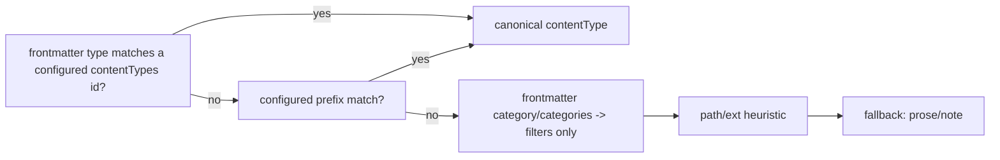

# Second-brain page types and synthesis templates

## Overview

Give GNO a lightweight second-brain writing model on top of the shipped `fn-82` capture/provenance foundation: typed pages that distinguish **current synthesis** from **evidence/timeline**, plus type hints that improve search, graph, and authoring — without a heavy ontology. This spec ships **presets + the typing layer together** (opt-in, additive). Inspiration: `garrytan/gbrain` (`/tmp/gbrain`) — inspiration only, no code copied.

`fn-82` status: **complete**. Capture has one shared provenance contract across CLI/REST/SDK/MCP/Web. This spec **extends** that contract — no parallel capture/source/receipt concepts.

## Decisions (this plan)

1. **Scope:** Ship new presets AND the typing layer (`contentTypes` config + frontmatter `type`→canonical `contentType` inference + per-result `contentType` in search) in this spec. Empty `contentTypes` config == today's behavior (binary upgrade alone changes nothing).
2. **Two distinct frontmatter writers — keep them separate:**
   - **Preset templates stay FLAT.** The note-preset serializer (`src/core/note-presets.ts:46-72`) is flat-only (`Record<string,string|string[]>`). New presets emit only flat keys: `type`, `category`, `tags`. They must **not** hand-author a `source:` block (nesting is silently dropped here).
   - **Provenance is written by the fn-82 capture path, not the preset.** When capture supplies a source, `sourceFrontmatterLines()` (`src/core/capture.ts:499-508`) already emits the nested `source:` block and `mergeCaptureFrontmatter()` merges it. fn-83 reuses that path unchanged — it does not duplicate or re-serialize provenance.
3. **`source.label` contract gap:** the spec's earlier example `source.label` is **not** a field on `CaptureSource` (it has `title`/`author`). Resolve by reusing existing fields — do not invent a new field, do not author `source` in presets.
4. **Synthesis/evidence split sentinel:** split on the `## Timeline` heading, **not** a bare `---` (which collides with the YAML fence and prose `<hr>`).
5. **MCP enum drift:** `gno_capture` presetId enum (`src/mcp/tools/index.ts:175-185`) is the only hardcoded preset list — derive it from `NOTE_PRESETS.map(p => p.id)` so new IDs never silently fail via MCP.
6. **Canonical-type rule (R5, exact):** frontmatter `type` sets canonical `contentType` **only when `type` matches a configured `contentTypes[].id`**. A free-text/unconfigured `type` keeps today's behavior (merged into `categories` only) — additive, no regression. Empty `contentTypes` ⇒ zero behavior change.
7. **`searchBoost` / `graphHints` are reserved, no-op in fn-83.** The config schema accepts and validates them, but nothing consumes them this phase (`searchBoost` → future search-ranking phase; `graphHints` → fn-84 typed graph). Documented as reserved so they don't imply unshipped behavior.

## Architecture & Data Models

Extend the existing note preset system. `NotePresetId` is a TS union in `src/core/note-presets.ts:11-17`; `NOTE_PRESETS` is data-driven and every surface imports it from core (one exception: the MCP enum, Decision 5). New preset IDs:

- `idea-original` — exact phrasing, context, related concepts, publish potential.
- `person` — current state, relationship, assessment, open threads, timeline.
- `company-project` — state, what changed, decisions, people, timeline.
- `meeting` — analysis above the separator, transcript/notes/action items below.
- `decision-note`, `source-summary` — **preserve IDs**; refine bodies in place only (aliases only with compat tests + docs).

Page pattern (flat preset frontmatter; `## Timeline` is the split sentinel; provenance added later by the capture path, never by the template):

```markdown
---
type: person
category: person
tags: []
---

# Title

## Current Synthesis

## Open Threads

## Assessment

## Timeline

- YYYY-MM-DD | Evidence item. [Source: ...]
```

Schema-lite `contentTypes` config (NOT a mutable ontology) — mirror `ModelPresetSchema`/`DEFAULT_MODEL_PRESETS` at `src/config/types.ts:171-229`:

```yaml
contentTypes:
  - id: person
    prefixes: ["people/", "contacts/"]
    preset: person
    graphHints: [mentions, works_at, attended] # reserved (fn-84) — no-op this phase
    searchBoost: 1.15 # reserved (future ranking) — no-op this phase
  - id: meeting
    prefixes: ["meetings/"]
    preset: meeting
    temporal: true
```

**Config validation transport (R6):** `loadConfigFromPath()` hard-fails on Zod validation errors and its success result is `{ ok: true; value }` — there is **no warning channel today**. So closed-graph checks must NOT be Zod `.refine()` hard-fails. Keep the Zod schema permissive (`preset: string`, etc.); then **normalize/resolve post-parse**: warn on an unknown `preset` ref, drop/disable invalid entries, **dedupe exact-duplicate prefixes only** (retain genuinely overlapping prefixes like `people/` vs `people/team/`), and sort longest-prefix-wins. Task .2 must **add a warnings transport**: extend the load result to `{ ok: true; value; warnings: ConfigWarning[] }` and update callers + tests to surface them — exceptions are not the channel.

Type inference priority (additive; canonical mapping gated on configured `contentTypes` — Decision 6):



**Ingestion plumbing + backfill (R4/R5 — Task .3 owns):** `extractDocumentMetadata(markdown, relPath, ext)` (`src/ingestion/sync.ts:246`) has no config access today, and `SyncService` only receives `Collection[]`. Resolved content-type rules must be threaded through `SyncOptions` (defined in `src/ingestion/types.ts:118`) to `extractDocumentMetadata` (`sync.ts:246,426,565`) — and through **every sync entrypoint** (MCP `sync`/`index-cmd`, CLI `shared`, SDK `client`, serve `background-runtime`/`watch-service`/`routes/api.ts`), each passing the normalized rules or explicitly defaulting to `[]`. Because unchanged files skip reprocessing when `ingestVersion >= INGEST_VERSION` (`sync.ts:70`, currently `5`), a one-time `INGEST_VERSION` bump only backfills the first fn-83 upgrade — it does **not** catch later user edits to `contentTypes`. Task .3 must therefore add a **config fingerprint or explicit force-resync path** (INGEST_VERSION bump alone is insufficient) so a prefix/preset change re-derives `contentType` for affected docs.

**Search exposure (R7 — Task .3 owns):** the store persists `contentType` (`src/store/types.ts:110,258`) but the BM25/result path does not select/return it. Per-item exposure requires coordinated updates across `FtsResult` (`store/types.ts:330`), the SQLite `SELECT`, `SearchResult`, the BM25/vector/hybrid builders (`src/pipeline/{search,hybrid,vsearch,fusion}.ts`), the output schemas (`spec/output-schemas/search-results.schema.json`, `search-result.schema.json`), fixtures, and the JSON formatters. Scope: expose `contentType`+`categories` on **JSON + schema surfaces**; plain-text `md/xml/csv` formatters stay as-is unless trivial.

## API Contracts

- `GET /api/note-presets` (`src/serve/routes/api.ts:1413-1427`) is data-driven — new presets appear automatically.
- All capture surfaces accept the new preset IDs: CLI `gno capture`, REST `/api/capture` + `/api/docs`, SDK `client.capture()`, MCP `gno_capture`, Web quick capture.
- Capture receipts remain the `fn-82` receipts — **no new receipt schema**.
- `gno ls/search/query --category` continues to work with typed pages.
- Search/query result shapes expose `contentType` and `categories` consistently (new per-item `contentType`, JSON/schema surfaces).

## Edge Cases & Constraints

- Existing notes stay valid; inference is additive and read-time (no auto-rewrite of user files).
- `type` becomes reserved/semantic **only for configured IDs** (Decision 6) — a pre-existing free-text `type:` is unaffected until the user adds it to `contentTypes`.
- Reuse `fn-82` `CaptureSource` + capture merge path; do not duplicate provenance or author `source` in presets.
- Preserve `decision-note`/`source-summary` IDs.
- Preserve GNO's collection-oriented model; no brain/source axes.
- Inference must be observable: `extractDocumentMetadata` returns a `contentTypeSource` discriminator (`frontmatter-type|prefix|path-ext|fallback`) surfaced in sync verbose/debug and asserted in tests (Task .3).

## Quick commands

```bash
# Preset core + flow-through (incl. MCP enum)
bun test test/core/note-presets.test.ts test/core/capture.test.ts test/mcp
gno capture --preset person  --title "Jane Doe"     --folder people/
gno capture --preset meeting --title "Weekly sync"  --folder meetings/

# Typing + search exposure (requires a contentTypes entry configured)
gno search --category person --json | jq '.results[0].contentType'

# Full gate
bun run lint:check && bun test
```

## Boundaries / non-goals

- No autonomous page rewriting; no migration that rewrites user files.
- No nested-frontmatter serializer upgrade — presets stay flat (Decision 2).
- `searchBoost`/`graphHints` are reserved/no-op this phase (Decision 7); no ranking or graph consumption in fn-83.
- No external enrichment; no multi-user schema authoring.
- No gbrain-style full schema mutation/audit; no `gno types` command this phase (config + docs only).
- No requirement that users adopt the templates.

## Decision context

- **Typing now, not deferred:** downstream `fn-84` (typed graph) and `fn-85` (recipes) want the typed vocabulary; gating canonical mapping on configured `contentTypes` makes it safe to ship now (additive, zero behavior change until configured).
- **Flat preset frontmatter, nested provenance via capture:** the note-preset serializer is flat-only; the fn-82 capture path already serializes nested `source:`. Keeping them separate avoids a risky serializer rewrite while still reusing fn-82 provenance verbatim.

## Acceptance Criteria

- **R1:** New preset IDs (`idea-original`, `person`, `company-project`, `meeting`) added to the shared preset core and accepted by CLI/API/SDK/MCP/Web capture and new-note flows (MCP enum derived from `NOTE_PRESETS`, not hardcoded; verified by an MCP schema-parse test).
- **R2:** Existing `decision-note` and `source-summary` remain valid (IDs unchanged; refinements in place; any alias has compat tests + docs).
- **R3:** New presets emit flat `type`/`category`/`tags` frontmatter and do NOT author a `source:` block; provenance continues to flow through the unchanged fn-82 capture path (`sourceFrontmatterLines`/`mergeCaptureFrontmatter`); `source.label` gap resolved via existing `CaptureSource` fields.
- **R4:** Typed frontmatter is indexed into existing metadata/category filters (`gno --category <type>` matches typed pages), with content-type rules plumbed through `SyncOptions` (and every sync entrypoint) and a **config-fingerprint / force-resync** backfill path (not just an `INGEST_VERSION` bump) so later `contentTypes` edits re-derive affected docs.
- **R5:** Frontmatter `type` controls canonical `contentType` **iff `type` matches a configured `contentTypes[].id`**; unconfigured/free-text `type` keeps legacy category-only behavior; tests distinguish `contentType` from category filters; existing notes stay valid.
- **R6:** `contentTypes` config ships: permissive Zod schema + post-parse closed-graph normalization (warn-and-drop, not hard-fail) surfaced via a new config-load **warnings transport** (`{ ok: true; value; warnings }`), exact-duplicate-prefix dedupe with overlapping prefixes retained + longest-prefix-wins, documented + tested. `searchBoost`/`graphHints` accepted but documented as reserved/no-op.
- **R7:** Search/query results expose `contentType` + `categories` per item across the BM25/vector/hybrid path and output schemas (+ contract test); plain-text formatters unchanged.
- **R8:** Docs explain the compiled-synthesis/timeline pattern and when to use each preset.
- **R9:** Hosted `gno.sh` docs and agent skill assets synced (final consolidated sweep in `.4`).

## Early proof point

Task `fn-83-second-brain-page-types-and-synthesis.1` validates the core approach: the 4 new presets flow through all 5 capture surfaces (CLI/REST/SDK/MCP/Web) — proven by an MCP schema-parse test plus core preset tests — while `decision-note`/`source-summary` stay valid and the MCP enum drift is eliminated. If a surface rejects a new preset or the existing IDs break, re-evaluate the shared-core extension strategy before building the typing layer in `.3`.

## Requirement coverage

| Req | Description                                                                 | Task(s) | Gap justification                   |
| --- | --------------------------------------------------------------------------- | ------- | ----------------------------------- |
| R1  | New presets accepted across all surfaces (+ MCP enum + MCP test)            | .1      | —                                   |
| R2  | decision-note/source-summary preserved                                      | .1      | —                                   |
| R3  | Flat preset frontmatter; provenance via unchanged fn-82 path                | .1      | —                                   |
| R4  | Typed frontmatter feeds category filters; SyncOptions plumbing + backfill   | .3      | —                                   |
| R5  | Frontmatter `type` → canonical contentType (gated on configured id)         | .3      | —                                   |
| R6  | `contentTypes` config + post-parse closed-graph validation; reserved fields | .2      | —                                   |
| R7  | Search/query expose contentType + categories (JSON/schema)                  | .3      | —                                   |
| R8  | Docs explain synthesis/timeline pattern                                     | .1, .4  | repo prose in .1; hosted/site in .4 |
| R9  | Hosted gno.sh + skill synced                                                | .4      | —                                   |

## Documentation Requirement

- **In-repo reference docs ship with the behavior:** each implementation task (`.1`–`.3`) updates the repo `docs/` + `spec/` surfaces it changes, in the same commit (per project DoD).
- **Cross-repo hosted docs + skill assets are synced in the final task `.4`:** the hosted website repo `/Users/gordon/work/gno.sh` and `assets/skill/*` are updated as a consolidated sweep once behavior is final. The **spec is not complete** while hosted website docs remain stale — `.4` is a hard gate on spec completion, and no spec-completion claim is valid before `.4` lands.

## References

- Preset core: `src/core/note-presets.ts:11-17` (union), `:46-72` (serializeFrontmatter, flat-only), `:74-139` (NOTE_PRESETS), `:141-183` (get/resolve).
- MCP enum drift: `src/mcp/tools/index.ts:175-185`. Consumers verified: `src/serve/routes/api.ts:72-76`, `src/sdk/types.ts:10`, `src/cli/commands/capture.ts:18`, Web `CaptureModal.tsx:25`.
- Provenance (nested `source:` writer): `src/core/capture.ts` `CaptureSource` (:53-65), `sourceFrontmatterLines()` (:499-508), `mergeCaptureFrontmatter()` (:510-516), `splitFrontmatter()` (:358).
- Ingestion: `SyncOptions` defined `src/ingestion/types.ts:118` (imported `sync.ts:27`); `sync.ts:70` (INGEST_VERSION=5), `:213-228` (inferContentType), `:246-261`/`:426` (extractDocumentMetadata + SyncOptions), `:565` (call site). Sync entrypoints: `src/mcp/tools/{sync,index-cmd}.ts`, `src/cli/commands/shared.ts`, `src/sdk/client.ts`, `src/serve/{background-runtime,watch-service}.ts`, `src/serve/routes/api.ts`. Flat parser `src/ingestion/frontmatter.ts:125`.
- Config: `src/config/types.ts:171-229` (ModelPreset pattern), `:252-270` (ConfigSchema); `src/config/loader.ts:51-131` `loadConfigFromPath` returns `{ ok: true; value } | { ok: false; error }` — **no warnings channel today** (R6 adds one).
- Store/search: `src/store/types.ts:110,258,330` (contentType, FtsResult); `src/pipeline/{search,hybrid,vsearch,fusion}.ts`; `spec/output-schemas/search-results.schema.json`, `search-result.schema.json`.
- API: `src/serve/routes/api.ts:1413-1427` (note-presets), `:2960+`/`:3006-3007` (POST /api/docs).
- Deps/coordination: fn-84 (`graphHints` vocab), fn-85 (downstream consumer), fn-68 (also edits `config/types.ts` — keep additive), fn-60 (also edits `sync.ts` — fn-83 owns only the contentType/type field logic).
- gbrain inspiration: `/tmp/gbrain/test/e2e/fixtures/concepts/compiled-truth.md`, `/tmp/gbrain/src/core/schema-pack/base/gbrain-base-v2.yaml`.
