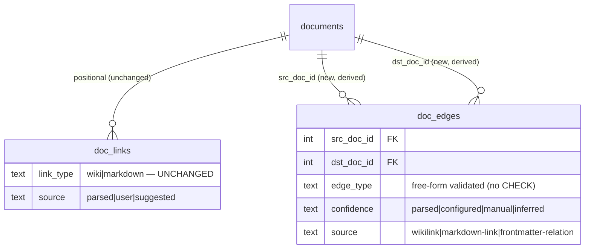

# Typed graph traversal and retrieval diagnostics

## Overview

Make GNO's graph useful for reasoning and debugging — not only visualization or optional retrieval expansion. Add deterministic **typed edges**, bounded **graph traversal** (`gno graph query`), and targeted **retrieval diagnostics** (`gno query diagnose --target`) that explain why a named document does or does not surface.

Builds directly on GNO-1 (`fn-83`, shipped v1.9.0) and `fn-79` graph infra. Lineage is documented here, not wired as a hard dep (fn-83 is still `open`; a hard dep would falsely block this work — both are shipped in code).

**Stakeholders:** agents/end users (relationship questions become explicit; "why didn't doc X surface?" becomes answerable), developers (new read surfaces + typed-edge data model, no breaking changes), operations (no new runtime config; `contentTypes[].graphHints` becomes active).

## Shipped substrate to reuse (do NOT reinvent)

- `contentTypes[]` config + `graphHints` vocab `[mentions, works_at, attended, decided, related_to]` — `src/config/types.ts:252-277`; normalize/fingerprint in `src/config/content-types.ts` (note: `fingerprintContentTypeRules` currently hashes `preset`+`prefixes` only — does NOT yet include `graphHints`).
- `contentType`/`contentTypeSource`/`categories`/`contentTypeRulesFingerprint` derived at ingest — `src/ingestion/sync.ts:293` `extractDocumentMetadata`; `INGEST_VERSION=5` (`sync.ts:73`).
- `getGraph()` link-resolution + confidence engine (capped, **global** export — NOT a per-root traversal) — `src/store/sqlite/adapter.ts:2301`; link resolver (`wikiBestMatch`, path/title fallbacks, ambiguity) lives in this path + `src/core/links.ts`.
- Stage explainers `explainBm25/Vector/Fusion/Rerank` + `buildExplainResults` — `src/pipeline/explain.ts`. **But** `searchHybrid` (`src/pipeline/hybrid.ts:250`) discards raw per-source scores, per-stage candidate lists, and absent-target info after RRF — diagnose needs new opt-in trace capture, not just explain.
- BFS / `findShortestPath` — `src/cli/commands/graph.ts:227`, `src/mcp/tools/links.ts:918` (reference only).
- Migration idiom (PRAGMA-guarded, additive, idempotent) — `src/store/migrations/009-content-type-rule-fingerprint.ts`; register in `migrations/index.ts` (**next version = 10**).
- CLI command registry + format matrix — `src/cli/options.ts:21` `CMD`. New commands MUST register here.
- Output-schema + contract-test pattern — `spec/output-schemas/*.json` (draft-07, `$id: gno://schemas/<name>@<ver>`), `test/spec/schemas/*.test.ts`. **`backlinks.schema.json` already exists** (extend, don't create). `spec/cli.md` and `spec/mcp.md` exist (extend).
- Ref resolution — `parseRef`/`resolveDocRef` (`src/cli/commands/ref-parser.ts`).

## Architecture & data model

Keep three axes **distinct** — overloading them is the central trap:

| Axis                   | Field                        | Values                               | Meaning                                  |
| ---------------------- | ---------------------------- | ------------------------------------ | ---------------------------------------- |
| Syntax                 | `link_type` (`doc_links`)    | `wiki` \| `markdown`                 | how the link was written — **unchanged** |
| Graph kind             | `GraphLinkType`              | `wiki` \| `markdown` \| `similar`    | existing graph projection — unchanged    |
| **Relationship (new)** | `DocEdgeType`/`RelationType` | free-form validated lowercase string | semantic relationship                    |

**Distinct new types (avoid collision with existing `GraphEdgeConfidence = explicit|inferred|ambiguous|similarity`, `src/store/types.ts:428`):**

- `DocEdgeType`/`RelationType` — **free-form validated** lowercase snake_case string (NOT a CHECK-constrained enum). Recommended vocabulary = `graphHints` set + `founded`, `advises`, `source`, `decision_for`, … but new values are allowed without a migration. Normalization lowercases/trims/validates; **no `CHECK` constraint on `edge_type`** (avoids migration churn as vocab grows).
- `DocEdgeConfidence` — `parsed` \| `configured` \| `manual` \| `inferred`.
- `DocEdgeSource` — `wikilink` \| `markdown-link` \| `frontmatter-relation`. (graphHints do NOT have a target and never create standalone edges — see Edge derivation.)

**Recommended storage: a derived `doc_edges` table** referencing `documents(id)` with:

- `UNIQUE(src_doc_id, dst_doc_id, edge_type, source)` — **source included** so distinct provenance for the same logical edge coexists losslessly. Traversal/read dedups by `(src_doc_id, dst_doc_id, edge_type)` with **confidence precedence `manual > configured > parsed > inferred`**, tie-broken by `edgeSource` then docid/uri.
- Dual indexes `(src_doc_id, edge_type)` and `(dst_doc_id, edge_type)` (mandatory for traversal).

**Stale-edge handling (critical — `doc_edges` caches a resolved `dst_doc_id`, unlike `doc_links` which resolves at query time):** because `markInactive()` soft-deletes (`documents.active = 0`, not a row delete), `ON DELETE CASCADE` will **not** clean stale edges. So:

- Edge derivation is a **post-sync projection pass** that runs _after_ all docs in the batch are upserted/marked inactive — so `dst` resolution sees the final document set (a `relations:` target created in the same sync resolves correctly). Per-document `setDocEdges(documentId, edges, source)` is replace-by-source; the projection orchestrates it across the settled batch.
- **Reads/traversal join `documents.active = 1` for both `src` and `dst`** so inactivated/renamed targets never surface stale.
- A re-projection (`backfillDocEdges()` service) re-derives affected edges on doc add/rename/inactivation or content-type-rule fingerprint change — idempotent + transactional, callable after the v10 migration and from sync repair. `dst_doc_id` is a derived cache rebuilt by projection, not a hard referential contract.
- Also persist a **`content_type_source` column** on `documents` (currently sync-result-only) so diagnose can report it from the DB.



**Backfill must not diverge from `getGraph`.** The resolver (`wikiBestMatch`/path/title fallbacks) is currently embedded as local SQL helpers **inside** `getGraph()` (`adapter.ts:2301`) — migrations can't call it without adapter coupling. So task .1 first **extracts the resolver/projection helper out of `getGraph()`** into a shared, behavior-preserving function used by both `getGraph()` and backfill; the schema migration and the data backfill stay separable. A parity test asserts backfilled edges match the edges `getGraph` derives for the same data.

## Edge derivation (deterministic, additive, never mutates user files)

1. **Wiki/markdown links** → projected as semantic edges (default `mentions`/`related_to`) on sync, idempotent via replace-by-source.
2. **`relations:` frontmatter** → `frontmatter-relation` edges at index time:

   ```yaml
   relations:
     works_at: [gno://notes/companies/acme.md]
     attended: [gno://notes/meetings/2026-06-04-sync.md]
   ```

   **Gotcha:** `src/ingestion/frontmatter.ts:197` is a hand-rolled line parser (`parseMetadataValue:173`, scalars/flat-arrays only) that cannot read nested maps. **Preferred fix: extend the line parser for one level of nesting** (lower regression risk than swapping to `Bun.YAML`, which would change scalar/date/boolean/tag coercion and the never-throw + Logseq fallback behavior). Either way, add regression tests for existing date/category/type/tag parsing.

   **Source of truth for re-projection:** unlike `doc_links`, unresolved `relations:` refs aren't persisted today. The post-sync projection therefore **re-parses each doc's stored frontmatter from its mirror content** when re-deriving — so a relation to a not-yet-created target resolves later once that target appears, without losing the ref. (No separate raw-refs table needed; the mirror is the source of truth.)

3. **`contentTypes[].graphHints`** are **NOT standalone edges** (they have no target). They are consumed two ways (additive, no-op for ranking): (a) **projection-typing modifiers** and (b) **traversal/diagnostic hints** surfaced in `graph query`/`diagnose` output. **Deterministic multi-hint rule:** `graphHints` is an **ordered priority list**; a doc's plain wiki/markdown links project to the **single primary (first) hint** as their `relationType` (`confidence: configured`) — they do NOT fan out into one edge per hint. The remaining hints are exposed as traversal/diagnostic hints only, never as projected edges — surfaced via an explicit **`graphHints` field on graph-query node output and on the diagnose typed-metadata block** (so "surfaced" is backed by a real field, not just prose). Frontmatter `relations:` always wins over graphHint projection for the same link target. Because graphHints affect derivation, `fingerprintContentTypeRules` must include normalized `graphHints`, and `INGEST_VERSION` must bump (5 → 6) so unchanged files re-derive. Multi-hint docs are explicitly tested.

## Shared core services (consumed by CLI + REST + MCP)

To avoid REST/MCP depending on CLI internals or duplicating logic, each compute feature ships a **non-CLI entry point**:

- **Ref resolution** (prereq, task .1): `parseRef`/`resolveDocRef` currently live under `src/cli/commands/ref-parser.ts` — wrapping them from REST/MCP cores would import CLI internals. Extract the pure parse/resolve logic to `src/core/ref-parser.ts` (or `doc-ref.ts`); the CLI re-exports it. Shared cores resolve roots/targets via the core module.
- **Bounded traversal** (task .3): a store/core function over `doc_edges` SQL — a **recursive CTE BFS from a resolved root** (root via the core ref module, NOT the global `getGraph` export), with mandatory depth/node/edge caps, cycle-safety (`UNION` + delimiter-wrapped `instr`), separate inbound/outbound UNION arms for direction, deterministic `ORDER BY` before `LIMIT`, and a `truncated` flag. **Bounded frontier mechanics (hub-node safety):** a hard depth clamp, a per-depth frontier cap, and a SQL-level visited-row cap inside the recursion so a hub node cannot enumerate a huge frontier before the outer `LIMIT` — proven with a hub-graph runtime test, not just final node/edge caps. CLI/REST/MCP all wrap this one function.
- **Targeted diagnosis** (task .4): `diagnoseQueryTarget(query, target, filters)` in `src/pipeline/` — resolves the target first, fetches its document/chunks, runs the pipeline with an **opt-in trace** (see below), and compares the target's chunk ids against each stage's candidate set. CLI/REST/MCP all wrap this one function.

## Traversal & diagnostics surfaces

Align with existing command shapes — `gno links <doc>`/`gno backlinks <doc>` already work; do **not** introduce `gno links list`. Prefer `--edge-type`/`--relation` over `--type`. Direction `out|in|both`.

```bash
gno graph query <doc> --edge-type mentions --depth 2 --direction both --json
gno links <doc> --edge-type works_at --json
gno backlinks <doc> --edge-type attended --json
gno query diagnose "Alice Acme" --target gno://notes/people/alice.md --json
```

**`gno links`/`gno backlinks` with `--edge-type`/`--relation` query the semantic edge layer (`doc_edges`), not positional `doc_links`.** Semantic edges may lack line/col/link-text — so the extended `links-list.schema.json`/`backlinks.schema.json` must make positional fields **nullable/absent** and expose `edgeType`/`relationType`/`confidence` plus a **new `edgeSource` field** (`wikilink|markdown-link|frontmatter-relation`) — **not** the existing positional `source` enum (`parsed|user|suggested`), which keeps its meaning to avoid contract confusion. `--type` (positional syntax filter) and `--edge-type`/`--relation` (semantic) are **mutually exclusive**: combining them is a validation error (exit 1), not a silent precedence. Without `--edge-type`, behavior and output are unchanged (positional links, backward compatible).

**Diagnose output** explains target hit/miss per stage. Payload per stage: `present`, `rank`, `score`, `survived`, `dropReason`. Critical distinction `not_in_candidate_set` (retrieval miss — fatal) vs `below_cutoff` (ranking miss — fixable) **requires resolving the target and its chunk ids up front** and comparing against each stage's candidate list — the current pipeline only maps docids for final candidates, so the trace must capture per-stage candidate doc/chunk ids and **raw BM25/vector scores before RRF collapses them** (RRF is rank-based). Trace capture is gated behind a diagnose-only option on `searchHybrid` so the normal query path is unaffected (no perf regression). Stages: BM25, vector (when embeddings present), hybrid fusion, graph expansion (when used), rerank (when enabled). Plus filters, typed metadata (`contentType`, `contentTypeSource`, categories, fingerprint match/mismatch), and chunk/line explanation. **Must work BM25-only** — when embeddings are absent, the **vector** stage is `skipped` (reason) and **rerank** is `skipped` when disabled/unavailable, but **fusion stays active with `sourceCount: 1`** (RRF still runs over the single BM25 source — do not mark it skipped). Never a false `present:false`.

**Target states.** The target itself can be in several states; diagnose reports an explicit `targetStatus`: `not_found` (ref doesn't resolve to a document), `inactive` (resolved doc not active/indexed), `no_indexed_content` (resolved but has no `mirrorHash`/chunks), `filtered_out` (excluded by an active filter before retrieval), or `diagnosed` (stage-by-stage trace produced). The `filtered_out` check must evaluate the **full** query filter set the real query path applies — collection, tags, `lang`/chunk language, `exclude`, category/`contentType`, author, date — not only `matchesDocumentFilters` (which covers the metadata subset). Centralize that filter evaluation so diagnose and the live query agree. Deterministic (fixed ordering, no timestamps in comparable fields).

## API contracts

- **CLI:** `gno graph query`, `gno query diagnose`; optional `--edge-type`/`--relation` on `gno links`/`gno backlinks`. All new commands register in `src/cli/options.ts` `CMD` + format matrix.
- **REST:** `POST /api/graph/query`, `POST /api/query/diagnose` (routes in `src/serve/server.ts` `routes:` object; handlers under `src/serve/routes/`) — wrap the shared core services.
- **MCP:** read-only `gno_graph_query` (handler near graph/link tools in `src/mcp/tools/links.ts`) and `gno_query_diagnose` (handler in `src/mcp/tools/query.ts` or new `tools/diagnose.ts` — it needs query/model/depth-policy logic, NOT the links module) — wrap the shared core services. Register in `src/mcp/tools/index.ts`.
- **Schemas:** new `graph-query.schema.json`, `query-diagnose.schema.json` (require `schemaVersion`; `query-diagnose` includes the `targetStatus` enum + per-stage `status`/`sourceCount`). Extend `links-list.schema.json`/`backlinks.schema.json` with a **`oneOf`** item shape — the existing positional link item (requires `targetRef`/`linkType`/`startLine`/`startCol`) **OR** a semantic edge item (requires `edgeType`/`confidence`/`edgeSource` + target/source docid/uri, no positional fields) — rather than just loosening required fields. `schemaVersion` is **optional/additive** there (making it required would break existing outputs + contract tests). **`test/spec/schemas/validator.ts` hardcodes a `schemaFiles` array** — new schemas must be registered there or they won't load. Additive-only evolution.
- Existing `gno_links`/`gno_backlinks`/`gno_graph*`, `/api/graph`, GraphView UI remain backward compatible.

## Quick commands

```bash
gno graph query gno://notes/people/alice.md --edge-type works_at --depth 2 --direction both --json
gno links gno://notes/people/alice.md --edge-type works_at --json
gno query diagnose "Alice Acme" --target gno://notes/people/alice.md --json
curl -s -X POST localhost:3000/api/graph/query -d '{"doc":"gno://notes/people/alice.md","depth":2}' | jq .
# regression gate
bun test test/store test/pipeline test/cli test/mcp test/ingestion test/spec/schemas
bun run lint:check
```

## Boundaries / non-goals

- No LLM-based entity extraction; no inference beyond deterministic frontmatter/link/config rules.
- No default graph-expansion behavior change for normal query paths; diagnose trace is opt-in (no perf impact on normal queries).
- No ranking change from `searchBoost`.
- No nested preset-frontmatter serializer work; GNO-1 flat preset behavior stays.
- No new web UI page (GraphView.tsx unchanged unless trivially affected).
- **Coordination (not deps):** `fn-60` (rename/move) and this work both touch `src/ingestion/sync.ts` + `src/store/sqlite/adapter.ts`; `fn-64.6` touches `src/pipeline/hybrid.ts`; `fn-68` touches `src/config/types.ts`. Sequence schema/config edits to avoid conflicts.

## Decision context

- **Derived `doc_edges` table over nullable `doc_links` columns** — semantic edges are conceptual, not positional; separation keeps existing consumers untouched and re-derivation idempotent.
- **`UNIQUE(...,source)` + read-time dedup** — preserves multi-provenance losslessly while traversal sees one edge per `(src,dst,type)`.
- **Free-form validated `edge_type`, no CHECK** — relation vocabulary grows without migrations; `graphHints` is the recommended set, not a closed enum.
- **graphHints as projection/diagnostic hints, never standalone edges** — they have no target, so they modify link-projection typing and surface as hints instead.
- **Shared non-CLI core services** — REST/MCP wrap one traversal fn and one `diagnoseQueryTarget` fn; CLI is just another caller. Prevents logic duplication / CLI-internal coupling.
- **Diagnose = opt-in pipeline trace + target-first resolution**, not pure `explain.ts` — the hybrid path discards the intermediate state diagnose needs; capture it behind a flag.
- **Extend the line-based frontmatter parser over swapping to `Bun.YAML`** — lower regression risk to existing scalar/tag/never-throw behavior.
- **Backfill reuses the live resolver, extracted from `getGraph()` first** — the resolver is embedded in `getGraph`; extract a shared helper so both paths agree and migrations avoid adapter coupling.
- **Primary-hint projection (ordered graphHints)** — deterministic and avoids edge fan-out when a content type declares multiple hints.
- **Separate `edgeSource` output field, mutually-exclusive `--type`/`--edge-type`** — keeps the existing positional `source` enum's contract intact and avoids ambiguous mixed-mode link queries.
- **Extract ref parsing to `src/core/`** — shared REST/MCP cores must not import from `src/cli/commands/`.
- **BM25-only keeps fusion active (`sourceCount:1`)** — RRF still runs over one source; only vector/rerank are skipped.

## Acceptance Criteria

- **R1:** Store and retrieve relationship semantics (distinct `DocEdgeType`/`RelationType`, `DocEdgeConfidence`, `DocEdgeSource`) in `doc_edges` without breaking existing `linkType: wiki|markdown` APIs/schemas; existing untyped links keep working; backfill (reusing the live resolver) populates edges with `getGraph` parity.
- **R2:** Frontmatter `relations:` creates typed edges during indexing without mutating user files or changing preset serialization; existing flat-frontmatter parsing is regression-safe.
- **R3:** `contentTypes[].graphHints` are consumed as additive projection/diagnostic hints (no standalone edges, no-op for ranking); `fingerprintContentTypeRules` includes graphHints and `INGEST_VERSION` bumps so edits re-derive.
- **R4:** `gno graph query` (wrapping the shared bounded-traversal core) supports depth, direction (`out|in|both`), edge-type filtering, JSON, and mandatory node/edge/depth caps with a `truncated` flag; deterministic ordering.
- **R5:** Existing `gno links`/`gno backlinks` keep their command shape; optional `--edge-type`/`--relation` query the semantic edge layer with nullable positional fields and degrade cleanly when no typed data exists.
- **R6:** `gno query diagnose --target` (wrapping `diagnoseQueryTarget`) explains target hit/miss across BM25, vector, hybrid, graph, and rerank stages — distinguishing `not_in_candidate_set` from `below_cutoff` via target-first chunk resolution — including `contentType`, `contentTypeSource`, categories, filters, and chunk/line choice, and works BM25-only.
- **R7:** REST endpoints, MCP tools, output schemas (new require `schemaVersion`; extended ones keep it optional), spec docs (`spec/cli.md`, `spec/mcp.md`), user docs, skill assets, and the hosted site (`/Users/gordon/work/gno.sh`) are updated and contract-tested.
- **R8:** Regression tests cover typed edges, backfill parity, graphHints consumption + fingerprint re-derive, traversal limits/determinism, backward compatibility, and deterministic named-target diagnostics.

## Early proof point

Task **fn-84-typed-graph-traversal-and-retrieval.1** (typed-edge data model + storage + resolver-parity backfill) validates the core: semantic edges can be stored/read **alongside** `doc_links` with zero breakage to existing link/graph/backlink contracts, and backfill reproduces `getGraph`'s edges (parity test). If backward compat or backfill parity proves unworkable, re-evaluate the data-model decision before building any surface on top.

## Requirement coverage

| Req | Description                                                            | Task(s)                | Gap justification |
| --- | ---------------------------------------------------------------------- | ---------------------- | ----------------- |
| R1  | Typed-edge storage + backward compat + resolver-parity backfill        | .1                     | —                 |
| R2  | `relations:` frontmatter → typed edges (regression-safe parser)        | .2                     | —                 |
| R3  | `graphHints` projection/diagnostic hints + fingerprint + ingest bump   | .2                     | —                 |
| R4  | Shared bounded-traversal core + `gno graph query`                      | .3                     | —                 |
| R5  | `--edge-type`/`--relation` on links/backlinks (semantic layer)         | .8                     | —                 |
| R6  | `diagnoseQueryTarget` core + `gno query diagnose --target`             | .4                     | —                 |
| R7  | REST + MCP + schemas + docs + site                                     | .3, .4, .5, .6, .8, .7 | —                 |
| R8  | Regression tests (edges, backfill parity, limits, compat, diagnostics) | .1, .2, .3, .4, .8, .9 | —                 |

_Task count: 9 (`.1`–`.9`). `.9` (behavior-preserving extractions: graph resolver + ref-parser to `src/core/`) is the foundation `.1` depends on; `.3` split into traversal-core (`.3`) and links/backlinks typed filters (`.8`) per review — both share CLI wiring so `.8` is serialized after `.3`. Dependency order: `.9 → .1 → {.2, .3, .4} → {.5, .6, .8} → .7`._
