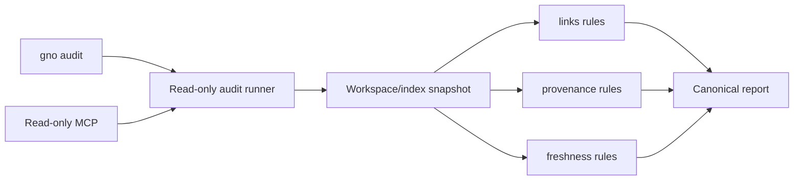

# fn-86 Read-only knowledge integrity audits

## Goal & Context
<!-- scope: business -->

Give users and agents a trustworthy, local-first answer to “what in this workspace needs attention?” through explicit read-only audits. The original dream-cycle concept mixed reports, repairs, contradiction judging, scheduling, and autonomous mutation. That scope was too broad for GNO's trust model and was deferred behind capture, provenance, page types, typed graph, and recipes; those prerequisites are now complete.

This revision promotes a bounded phase 1 only: deterministic `gno audit` reports for link integrity, provenance completeness, and freshness/index consistency. Reports are useful offline, make unavailable evidence explicit, never modify source files/config/index state, and produce stable machine-readable findings that can be diffed across runs. The feature earns any future maintenance work by proving that its read-only findings are accurate and useful first.

Target users are serious local workspace owners and agents performing maintenance triage. The product differentiator is evidence and restraint, not an autonomous “dream” brand.

## Architecture & Data Models
<!-- scope: technical -->

A shared audit runner snapshots the requested collections, canonical config/rule versions, source/index revision evidence, ignore rules, and run time/locale. Category rules consume read-only store/core ports and emit one versioned report:



Report model:

- schema/rule versions, input scope, capability snapshot, start/end time, source/index fingerprints, and completeness status;
- canonically ordered rule results and findings;
- stable finding IDs derived from rule ID, normalized subject/location, and evidence fingerprint;
- per-rule status: `pass`, `fail`, `skip`, `unavailable`, or `inconclusive`;
- report status: `complete`, `partial`, `changed_during_audit`, or `failed`;
- bounded evidence, remediation guidance, counts, timing, and truncation metadata.

Category boundaries:

- **links:** broken/unresolved parsed wiki and Markdown links, ambiguous targets, and graph orphans under an explicit root policy; reuse `src/core/links.ts`, query-time resolver behavior, and current document/activity state;
- **provenance:** missing or structurally invalid provenance fields on page types that declare them required; it does not invent citations or judge factual truth;
- **freshness:** source/index drift, unreadable sources, stale indexed revisions, and explicit age-policy signals where configured; age alone is not “wrong.”

Audits run from read-only snapshots/queries. They may write the final report only to stdout or a user-requested output path; they do not persist findings to the GNO database in v1. Content-free timing/count telemetry remains local unless an existing explicit diagnostics path is chosen.

## API Contracts
<!-- scope: technical -->

CLI first:

- `gno audit [links|provenance|freshness|all]`;
- collection/path/tag filters follow existing query grammar where meaningful;
- `--json`, bounded `--max-findings`, and explicit output path semantics;
- documented exit codes distinguish clean, findings present, partial/inconclusive, invalid input, and runtime failure.

MCP exposes a read-only audit tool using the same input/report schema and MCP `readOnlyHint`; the annotation is descriptive, while server implementation and tests prove no writes. No REST/Web UI surface is required for v1.

Structured output schemas are versioned and contract-tested. Human output is a rendering of the same report, not a second rule engine. A finding never claims “healthy” when its rule was skipped/unavailable/inconclusive.

## Edge Cases & Constraints
<!-- scope: technical -->

- No source note, index row, config, provenance record, graph edge, daemon state, or audit baseline is mutated.
- Missing collection, missing/stale index, daemon unavailable, unreadable source, parse failure, changed file during scan, and zero findings are distinct states.
- Source/index changes during a run produce `changed_during_audit` or a bounded retry; they never yield a clean report by accident.
- Traversal and findings are canonically sorted. Stable finding IDs survive scan-order changes but change when load-bearing evidence changes.
- Inactive/renamed documents, ignored paths, mirrors/duplicates, unresolved aliases, external URLs, and orphan root-policy exceptions are explicit fixtures.
- Audits are offline and LLM/network-free. Contradiction detection, web citation verification, enrichment, and truth judging are out of scope.
- Queries use bound prepared statements and indexed/batched scans. Avoid per-finding full-table queries; retain benchmark/query-plan evidence without treating `EXPLAIN QUERY PLAN` text as a stable API.
- Results are bounded and stream/progress safely on large workspaces; truncation never changes total counts or completeness semantics.
- Audit output may contain paths/headings/evidence from private notes; stdout/files follow local permissions and MCP output respects existing disclosure boundaries.

## Acceptance Criteria
<!-- scope: both -->

- **R1:** `gno audit` and shared core runner are demonstrably read-only, offline, deterministic, versioned, and produce identical semantic JSON for identical snapshots regardless of traversal order.
- **R2:** Link audit reports broken, unresolved, ambiguous, and policy-defined orphan findings using current parser/resolver/document-state semantics, with stable IDs and evidence; ignored/external/inactive/mirror cases are not falsely classified.
- **R3:** Provenance audit reports only missing/invalid requirements declared by supported page types, and freshness audit distinguishes source/index drift, unreadable/unavailable evidence, and configured age signals without claiming factual staleness.
- **R4:** Every rule/result uses `pass`, `fail`, `skip`, `unavailable`, or `inconclusive`; report status and exit codes distinguish complete, partial, changed-during-run, invalid, and failed execution so unavailable checks never appear healthy.
- **R5:** CLI human/JSON output and read-only MCP share one schema, filters, limits, rule semantics, and deterministic findings; MCP annotations do not substitute for no-write proof.
- **R6:** Representative large-index benchmarks show bounded memory/output, batched/indexed query behavior, truthful examined-row/timing metrics, and no per-finding full scans; truncation preserves totals and report status.
- **R7:** Specs/schemas, CLI/MCP/config/troubleshooting docs, README, CHANGELOG, `assets/skill/`, and `/Users/gordon/work/gno.sh` describe the exact categories and non-goals; real CLI/MCP QA proves clean, findings, partial, and changed-during-audit flows.

## Boundaries
<!-- scope: business -->

- No `gno maintain`, preview/apply repair, automatic link rewrite, citation generation, contradiction detection, LLM judge, network enrichment, scheduling, daemon job, or hidden overnight mutation.
- No REST dashboard or Web UI health panel in v1.
- No persisted audit database/baseline/suppression system; users may save JSON externally and diff stable IDs.
- No claim that age equals incorrectness or that missing provenance means a statement is false.
- Future mutation must be a separate spec after audit accuracy, usefulness, and false-positive rates are measured.

## Decision Context
<!-- scope: both — conditionally substructured -->

The original dream cycle contained a good product insight—knowledge bases degrade—but bundled too many unsafe and unproven mechanisms. A deterministic read-only audit is independently useful, builds on completed provenance/graph foundations, and fits GNO's local-first trust. Contradictions are excluded because temporal evolution and truth assessment require qualitatively different LLM/cost/evidence policy. Maintenance is excluded because trustworthy repair plans depend on trustworthy findings; fn-60 owns reference-safe mutation rather than this spec duplicating it.

## Quick commands

```bash
bun test test/audit test/cli/commands/audit.test.ts test/mcp/tools/audit.test.ts
bun run lint:check
bun run eval
```

## Early proof point

Task fn-86.1 freezes the report/status/exit contract and proves two differently ordered scans of the same fixture produce byte-equivalent semantic JSON while a mid-run change cannot report clean. If deterministic identity or read-only snapshot semantics fail, stop before adding categories.

## Requirement coverage

| Req | Description | Task(s) | Gap justification |
|---|---|---|---|
| R1 | Read-only deterministic runner/report | fn-86.1 | — |
| R2 | Link integrity audit | fn-86.2 | — |
| R3 | Provenance and freshness audits | fn-86.3 | — |
| R4 | Honest statuses and exits | fn-86.1, fn-86.4 | — |
| R5 | CLI/MCP parity | fn-86.4 | — |
| R6 | Large-index performance proof | fn-86.2, fn-86.3, fn-86.4 | — |
| R7 | Truth surfaces and runtime QA | fn-86.5 | — |

## References

- `src/core/links.ts`
- `src/core/graph-edge-confidence.ts`
- `src/store/sqlite/change-journal-store.ts:74-130`
- `src/store/sqlite/adapter.ts:508`
- `src/core/egress-audit.ts` — terminology precedent only; not the new content audit
- `src/cli/program.ts:2198-2229` — existing unrelated egress-audit command
- `src/mcp/tools/workspace-write.ts:169-173` — no-write/write-gate contrast
- SQLite transactions: https://www.sqlite.org/lang_transaction.html
- SQLite WITH/recursive CTE: https://www.sqlite.org/lang_with.html
- NIST SSDF integrity evidence: https://csrc.nist.gov/pubs/sp/800/218/final
