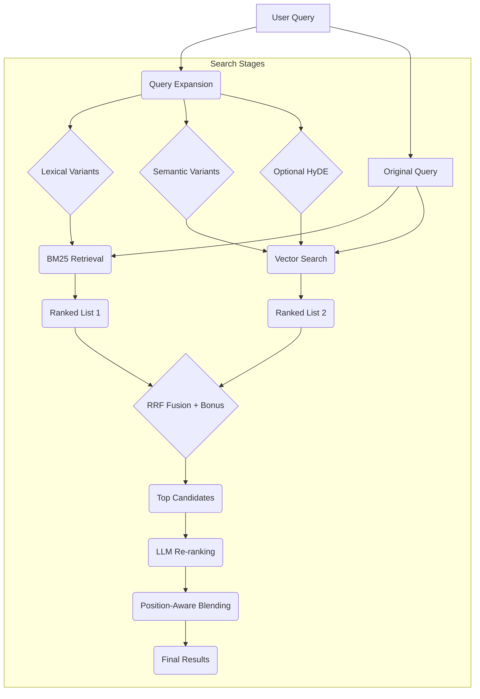

# GNO: Your Local Second Brain

**Index, Search, and Synthesize Your Entire Digital Life.**

GNO is a **Local Knowledge Engine** designed for privacy-conscious individuals and AI agents. It indexes your notes, code, documents (Markdown, PDF, Office, and more), and meeting transcripts, providing lightning-fast semantic search and AI-powered answers—all on your machine.

---

## ✨ Key Features

*   **Universal Indexing**: Effortlessly ingest and search across Markdown, PDF, DOCX, XLSX, PPTX, and plain text files.
*   **Hybrid Search Pipeline**: Combines **BM25 keyword search** with **vector semantic search** and **AI re-ranking** for unparalleled retrieval accuracy.
*   **Local LLM Integration**: Get grounded AI answers with citations using **node-llama-cpp** and auto-downloaded GGUF models. No external services, maximum privacy.
*   **Agent-First Design (MCP)**: Seamlessly integrate GNO with AI agents via the Model Context Protocol (MCP) server.
*   **Deterministic Output**: Stable, schema-driven JSON, file-line, and markdown outputs for reliable scripting.
*   **Multilingual Support**: Robust handling of multiple languages in indexing and retrieval.
*   **Privacy-Preserving**: All processing happens locally. Your data never leaves your device.
*   **World-Class Engineering**: Spec-driven development, rigorous testing, and eval gates ensure reliability and quality.

---

## 🚀 Quick Start

Get searching in minutes with the 3-command workflow:

1.  **Initialize your knowledge base**:
    ```sh
    # Create a collection for your notes (adjust path and name as needed)
    gno init ~/my-notes --name notes --pattern "**/*.md"

    # Full index: sync files + generate embeddings
    gno index
    ```

2.  **Ask a question**:
    ```sh
    # Get a direct, cited answer from your documents
    gno ask "What are the best practices for API authentication?" --collection notes

    # Search with keywords or natural language
    gno query "Q4 planning meeting summary" --collection notes
    ```

3.  **Explore your data**:
    ```sh
    # Retrieve specific document content
    gno get "notes/2024-01-15.md"

    # Get results in a machine-readable format for agents
    gno search "project deadlines" --json -n 10
    ```

---

## 🧠 For Humans & AI Agents

GNO is built for both worlds:

*   **For Humans**: A powerful, yet intuitive CLI to quickly find information, get answers, and explore your local knowledge base.
*   **For AI Agents**: Exposes a stable MCP server and structured output formats (`--json`, `--files`) for seamless integration with LLMs and agentic workflows.

---

## 🔎 Search Modes

GNO offers multiple search strategies to suit your needs:

| Command     | Mode           | Description                                                     | Best For                                         |
| :---------- | :------------- | :-------------------------------------------------------------- | :----------------------------------------------- |
| `gno search`| **BM25**       | Fast, keyword-based full-text search.                           | Exact phrase matching, known terms.              |
| `gno vsearch`| **Vector**     | Semantic search based on meaning, not just keywords.            | Natural language queries, conceptual understanding. |
| `gno query` | **Hybrid**     | Combines BM25 and Vector search with LLM reranking and fusion.  | Highest accuracy, nuanced understanding.         |
| `gno ask`   | **RAG-focused**| Hybrid search providing a synthesized, cited answer from results. | Getting direct answers to complex questions.     |

---

## 🤖 Agent Integration

GNO is designed to be the knowledge backbone for your AI agents.

### CLI Output Formats

Use `--json` or `--files` for machine-readable output:

```sh
# Get JSON results for LLM processing
gno query "meeting notes on user feedback" --json -n 5

# Get file paths and scores for agent tool use
gno search "API design" --files --min-score 0.3
```

### Skill Installation (Recommended for Claude Code/Codex/OpenCode)

Skills integrate via CLI - the agent runs GNO commands directly. No MCP overhead, no context pollution.

```bash
gno skill install --scope user    # User-wide for Claude Code
gno skill install --target codex  # For Codex
gno skill install --target all    # Both
```

After install, restart your agent. It will detect GNO and can search your indexed documents.

### MCP Server (For Claude Desktop/Cursor)

Exposes an MCP server for GUI-based AI applications.

**Tools Exposed:**
*   `gno_search` (BM25)
*   `gno_vsearch` (Vector)
*   `gno_query` (Hybrid)
*   `gno_get` (Document retrieval)
*   `gno_multi_get` (Batch retrieval)
*   `gno_status` (Index health)

**Example Claude Desktop Configuration** (`~/Library/Application Support/Claude/claude_desktop_config.json`):

```json
{
  "mcpServers": {
    "gno": {
      "command": "gno",
      "args": ["mcp"]
    }
  }
}
```

*(Adjust path and `mcpServers` key based on your agent's configuration.)*

---

## ⚙️ How It Works: The GNO Pipeline

GNO employs a sophisticated, multi-stage retrieval process for optimal results:



### Search Pipeline Details:

1.  **Query Expansion**: Generates alternative queries (lexical and semantic) and an optional synthetic "HyDE" document using a local LLM for richer retrieval.
2.  **Parallel Retrieval**: Executes BM25 (keyword) and Vector (semantic) searches concurrently.
3.  **Fusion**: Combines results using Reciprocal Rank Fusion (RRF) with a weighted boost for original query matches and a top-rank bonus.
4.  **Re-ranking**: An LLM-based cross-encoder re-scores the top candidates for final relevance.
5.  **Blending**: Dynamically adjusts the mix of retrieval vs. reranked scores based on rank position to preserve accuracy.

**Score Normalization**: Raw scores from FTS, vector distance, and reranker are normalized to a 0-1 scale for consistent fusion.

---

## 📦 Installation

Requires **Bun** >= 1.0.0.

```sh
# Install globally
bun install -g @gmickel/gno
```

**macOS users**: For optimal vector search performance, install Homebrew SQLite:
```sh
brew install sqlite3
```

Verify your installation:
```sh
gno doctor
```

---

## 🏠 Local LLM Models

GNO runs embeddings, reranking, and query expansion locally using GGUF models via `node-llama-cpp`. Models are automatically downloaded and cached on first use in `~/.cache/gno/models/`.

| Model                 | Purpose           | Size (approx.) |
| :-------------------- | :---------------- | :------------- |
| `bge-m3`              | Multilingual Embeddings | ~500MB         |
| `bge-reranker-v2-m3`  | Cross-Encoder Re-ranking | ~700MB         |
| `Qwen-Instruct`       | Query Expansion / HyDE | ~600MB         |

*(Specific GGUF versions are pinned for stability.)*

---

## 📜 Architecture Overview

GNO follows a layered, Ports and Adapters architecture for maintainability and testability:

```
┌───────────────────────────────────────────────────────────┐
│                       GNO CLI / MCP                       │
├───────────────────────────────────────────────────────────┤
│ Ports: Converter, Store, Embedding, Generation, Rerank... │
├───────────────────────────────────────────────────────────┤
│ Adapters: SQLite, FTS5, sqlite-vec, node-llama-cpp, CLI   │
├───────────────────────────────────────────────────────────┤
│ Core Domain: Identity, Mirrors, Chunking, Retrieval       │
└───────────────────────────────────────────────────────────┘
```

---

## 💻 Development

```bash
# Clone the repository
git clone https://github.com/gmickel/gno.git
cd gno

# Install dependencies
bun install

# Run tests
bun test

# Lint and format code
bun run lint

# Type check
bun run typecheck
```

---

## 📄 License

[MIT License](./LICENSE)