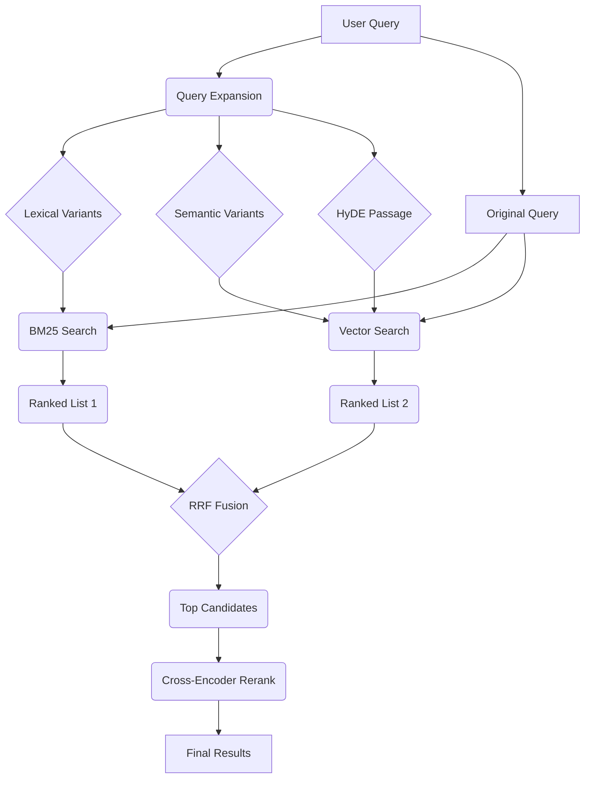

# GNO

**Your Local Second Brain** — Index, search, and synthesize your entire digital life.

[](https://www.npmjs.com/package/@gmickel/gno)
[](./LICENSE)

GNO is a local knowledge engine for privacy-conscious individuals and AI agents. Index your notes, code, PDFs, and Office docs. Get lightning-fast semantic search and AI-powered answers—all on your machine.

---

## Contents

- [Quick Start](#quick-start)
- [Installation](#installation)
- [Search Modes](#search-modes)
- [Agent Integration](#agent-integration)
- [How It Works](#how-it-works)
- [Local Models](#local-models)
- [Architecture](#architecture)
- [Development](#development)

---

## Quick Start

```bash
# Initialize with your notes folder
gno init ~/notes --name notes

# Index documents (BM25 + vectors)
gno index

# Search
gno query "authentication best practices"
gno ask "summarize the API discussion" --answer
```

---

## Installation

Requires [Bun](https://bun.sh/) >= 1.0.0.

```bash
bun install -g @gmickel/gno
```

**macOS**: Vector search requires Homebrew SQLite:
```bash
brew install sqlite3
```

Verify:
```bash
gno doctor
```

---

## Search Modes

| Command | Mode | Best For |
|:--------|:-----|:---------|
| `gno search` | BM25 | Exact phrases, known terms |
| `gno vsearch` | Vector | Natural language, concepts |
| `gno query` | Hybrid | Highest accuracy (BM25 + Vector + reranking) |
| `gno ask` | RAG | Direct answers with citations |

---

## Agent Integration

### For Claude Code / Codex / OpenCode

```bash
gno skill install --scope user    # Claude Code
gno skill install --target codex  # Codex
gno skill install --target all    # Both
```

### For Claude Desktop / Cursor

Add to `~/Library/Application Support/Claude/claude_desktop_config.json`:

```json
{
  "mcpServers": {
    "gno": { "command": "gno", "args": ["mcp"] }
  }
}
```

**MCP Tools**: `gno_search`, `gno_vsearch`, `gno_query`, `gno_get`, `gno_multi_get`, `gno_status`

### CLI Output Formats

```bash
gno query "meeting notes" --json -n 5      # JSON for LLMs
gno search "API design" --files            # File paths only
```

---

## How It Works



1. **Query Expansion** — LLM generates lexical variants, semantic variants, and [HyDE](https://arxiv.org/abs/2212.10496) passage
2. **Parallel Retrieval** — BM25 + Vector search run concurrently on all variants
3. **Fusion** — Reciprocal Rank Fusion merges results with position-based scoring
4. **Re-ranking** — Cross-encoder rescores top 20, blended with fusion scores

See [How Search Works](https://gno.sh/docs/HOW-SEARCH-WORKS/) for full pipeline details.

---

## Local Models

Models auto-download on first use to `~/.cache/gno/models/`.

| Model | Purpose | Size |
|:------|:--------|:-----|
| bge-m3 | Embeddings | ~500MB |
| bge-reranker-v2-m3 | Re-ranking | ~700MB |
| Qwen-Instruct | Query expansion | ~600MB |

---

## Architecture

```
┌─────────────────────────────────────────────────┐
│                  GNO CLI / MCP                  │
├─────────────────────────────────────────────────┤
│  Ports: Converter, Store, Embedding, Rerank     │
├─────────────────────────────────────────────────┤
│  Adapters: SQLite, FTS5, sqlite-vec, llama-cpp  │
├─────────────────────────────────────────────────┤
│  Core: Identity, Mirrors, Chunking, Retrieval   │
└─────────────────────────────────────────────────┘
```

---

## Development

```bash
git clone https://github.com/gmickel/gno.git && cd gno
bun install
bun test
bun run lint
bun run typecheck
```

See [Contributing](.github/CONTRIBUTING.md) for CI matrix, caching, and release process.

---

## License

[MIT](./LICENSE)
