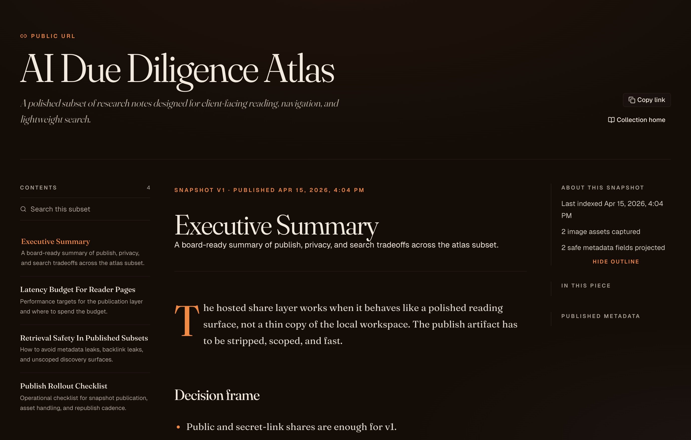
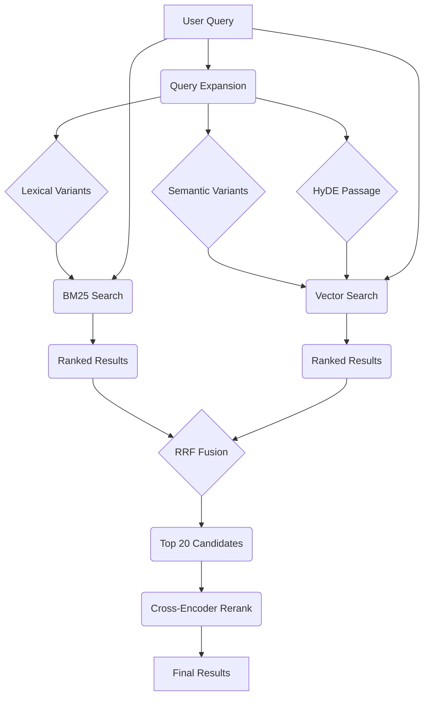

# GNO

**Local search, retrieval, and synthesis for the files you actually work in.**

[](https://www.npmjs.com/package/@gmickel/gno)
[](./LICENSE)
[](https://gno.sh)
[](https://twitter.com/gmickel)
[](https://discord.gg/nHEmyJB5tg)

> [!TIP]
> **[gno.sh/publish](https://gno.sh/publish) is live.** Turn any GNO note or collection into a polished, reader-first URL — editorial typography, scoped search, and four visibility modes from public to encrypted-before-upload. **[See the reader →](#publish-to-gnosh)**

> **ClawdHub**: GNO skills bundled for Clawdbot — [clawdhub.com/gmickel/gno](https://clawdhub.com/gmickel/gno)


GNO is a local knowledge engine for notes, code, PDFs, Office docs, meeting transcripts, and reference material. It gives you fast keyword search, semantic retrieval, grounded answers with citations, wiki-style linking, and a real workspace UI, while keeping the whole stack local by default.

CLI retrieval also uses the current repository/workspace as a transparent soft
ranking signal. A trusted local cwd or repeatable `--project-root` can add at
most `+0.03` to matching collection results; `--no-project-affinity` disables
it, and explicit roots replace cwd inference. It never overrides collection,
tag, date, exclude, or egress filters. SDK, REST, and MCP `projectHints` are
opaque, untrusted, limited to 16, and intentionally have zero ranking effect:
those surfaces never probe caller or server filesystem paths. Trusted local
diagnose output uses closed `schemaVersion: "1.1"` redacted affinity metadata;
absent, disabled, and remote/untrusted diagnose requests preserve exact legacy
v1.0 bytes and omit `affinity`.

Use it when:

- your notes live in more than one folder
- your important knowledge is split across Markdown, code, PDFs, and Office files
- you want one retrieval layer that works from the CLI, browser, MCP, and a Bun/TypeScript SDK
- you want better local context for agents without shipping your docs to a cloud API

### What GNO Gives You

- **Fast local search**: BM25 for exact hits, vectors for concepts, hybrid for best quality
- **Real retrieval surfaces**: CLI, Web UI, REST API, MCP, SDK
- **Local-first answers**: grounded synthesis with citations when you want answers, raw retrieval when you do not
- **Connected knowledge**: backlinks, related notes, graph view, cross-collection navigation
- **Shareable, not synced**: export a note or collection to [gno.sh](https://gno.sh/publish) as a polished reader page — public, secret, invite-only, or locally encrypted before upload
- **Operational fit**: daemon mode, model presets, remote GPU backends, safe config/state on disk

### One-Minute Tour

```bash
# Install
bun install -g @gmickel/gno

# Add a few collections
gno init ~/notes --name notes
gno collection add ~/work/docs --name work-docs --pattern "**/*.{md,pdf,docx}"
gno collection add ~/work/gno/src --name gno-code --pattern "**/*.{ts,tsx,js,jsx}"

# Add context so retrieval results come back with the right framing
gno context add "notes:" "Personal notes, journal entries, and long-form ideas"
gno context add "work-docs:" "Architecture docs, runbooks, RFCs, meeting notes"
gno context add "gno-code:" "Source code for the GNO application"

# Index + embed
gno update --yes
gno embed

# Search in the way that fits the question
gno search "DEC-0054"                            # exact keyword / identifier
gno vsearch "retry failed jobs with backoff"     # natural-language semantic lookup
gno query "JWT refresh token rotation" --explain # hybrid retrieval with score traces

# Retrieve documents or export context for an agent
gno get "gno://work-docs/architecture/auth.md"
gno multi-get "gno-code/**/*.ts" --max-bytes 30000 --md
gno query "deployment process" --all --files --min-score 0.35

# Run the workspace (pick one — don't run both against the same index concurrently)
gno serve            # browser/desktop session with the Web UI
gno daemon --detach  # headless continuous indexing (background; --status / --stop to manage)
```

---

## Contents

- [Quick Start](#quick-start)
- [Installation](#installation)
- [Daemon Mode](#daemon-mode)
- [Search Modes](#search-modes)
- [Agent Integration](#agent-integration)
- [Web UI](#web-ui)
- [Publish to gno.sh](#publish-to-gnosh)
- [REST API](#rest-api)
- [SDK](#sdk)
- [How It Works](#how-it-works)
- [Features](#features)
- [Local Models](#local-models)
- [Fine-Tuned Models](#fine-tuned-models)
- [Architecture](#architecture)
- [Development](#development)

---

## What's New

<!-- public-truth:current-version -->

> Current release: **v1.23.0** — see [CHANGELOG.md](./CHANGELOG.md)

<!-- /public-truth -->

> Full release history: [CHANGELOG.md](./CHANGELOG.md)

- **Project-aware retrieval affinity**: trusted local CLI searches can use the
  current workspace or explicit `--project-root` values as a transparent,
  explainable `+0.03` soft ranking signal. Filters remain hard, and untrusted
  SDK, REST, MCP, and Web hints never probe paths or affect ranking.
- **Retrieval-proven activation**: `gno status`, `gno doctor`, REST, and the
  Web/Desktop dashboard now share a per-folder lexical retrieval proof. Local
  semantic readiness remains independent, and installed MCP targets can run an
  explicit read-only retrieval smoke from Connectors.
- **One resident gateway**: `gno serve` and `gno daemon` now host stateful
  Streamable HTTP MCP at `/mcp` from the same long-lived runtime as their
  watcher, jobs, stores, and models. The packed npm smoke proves two-client
  parity, warm reuse, redacted lifecycle status, fail-closed security, restart,
  and shutdown.
- **Knowledge Delta**: `gno changes`, `gno diff`, and `gno impact` expose
  bounded metadata-only history, structural change summaries, and explainable
  dependency paths across CLI, REST, MCP, and SDK.
- **Saved Capsule freshness**: CLI-only `gno context watch`, `watches`,
  `reverify`, and `unwatch` register caller-owned Capsule files. The resident
  runtime coalesces evidence changes into canonical, non-generative freshness
  receipts and closed local metadata notifications.
- **Second-brain capture**: `gno capture`, REST `/api/capture`, SDK
  `client.capture()`, MCP `gno_capture`, and Web UI Quick Capture write
  provenance-rich notes from text, stdin, or files, including typed presets for
  ideas, people, company/projects, and meetings
- **Schema-lite content types**: optional `contentTypes` rules map configured
  frontmatter `type` values or path prefixes to canonical `contentType` metadata
  in JSON search/query results
- **Publish to [gno.sh](https://gno.sh/publish)**: new `gno publish export` CLI and Web UI action produce a self-contained artifact you upload to the hosted reader — public, secret, invite-only, or locally encrypted before upload
- **Retrieval Quality Upgrade**: stronger BM25 lexical handling, code-aware chunking, terminal result hyperlinks, and per-collection model overrides
- **Code Embedding Benchmarks**: new benchmark workflow across canonical, real-GNO, and pinned OSS slices for comparing alternate embedding models
<!-- public-truth:default-embed-model -->
- **Default Embed Model**: all four built-in presets use `Qwen3-Embedding-0.6B-GGUF`; see the dated, fixture-scoped evidence below
<!-- /public-truth -->
- **Regression Fixes**: tightened phrase/negation/hyphen/underscore BM25 behavior, cleaned non-TTY hyperlink output, improved `gno doctor` chunking and embedding fingerprint visibility, and fixed the embedding autoresearch harness

### Upgrading Existing Collections

If you already had collections indexed before the default embed-model switch to
`Qwen3-Embedding-0.6B-GGUF`, run:

```bash
gno models pull --embed
gno embed
```

That regenerates embeddings for the new default model. Old vectors are kept
until you explicitly clear stale embeddings.

If the release also changes the embedding formatting/profile behavior for your
active model, prefer one of these stronger migration paths:

```bash
gno embed --force
```

or per collection:

```bash
gno collection clear-embeddings my-collection --all
gno embed my-collection
```

If a re-embed run still reports failures, rerun with:

```bash
gno --verbose embed --force
```

Recent releases now print sample embedding errors and a concrete retry hint when
batch recovery cannot fully recover on its own.

Model guides:

- [Code Embeddings](./docs/guides/code-embeddings.md)
- [Per-Collection Models](./docs/guides/per-collection-models.md)
- [Bring Your Own Models](./docs/guides/bring-your-own-models.md)

### Fine-Tuned Model Quick Use

```yaml
models:
  activePreset: slim-tuned
  presets:
    - id: slim-tuned
      name: GNO Slim Tuned
      embed: hf:Qwen/Qwen3-Embedding-0.6B-GGUF/Qwen3-Embedding-0.6B-Q8_0.gguf
      rerank: hf:ggml-org/Qwen3-Reranker-0.6B-Q8_0-GGUF/qwen3-reranker-0.6b-q8_0.gguf
      expand: hf:guiltylemon/gno-expansion-slim-retrieval-v1/gno-expansion-auto-entity-lock-default-mix-lr95-f16.gguf
      gen: hf:unsloth/Qwen3-1.7B-GGUF/Qwen3-1.7B-Q4_K_M.gguf
```

Then:

```bash
gno models use slim-tuned
gno models pull --expand
gno models pull --gen
gno query "ECONNREFUSED 127.0.0.1:5432" --thorough
```

> Full guide: [Fine-Tuned Models](https://gno.sh/docs/FINE-TUNED-MODELS/) · [Feature page](https://gno.sh/features/fine-tuned-models/)

---

## Quick Start

```bash
gno init ~/notes --name notes    # Point at your docs
gno index                        # Build search index
gno daemon --detach              # Keep index fresh in the background (macOS/Linux)
gno query "auth best practices"  # Hybrid search
gno ask "summarize the API" --answer  # AI answer with citations
```

Manage the detached process with `gno daemon --status` and `gno daemon --stop`.


---

## Installation

### Install GNO

<!-- public-truth:runtime -->

Requires [Bun](https://bun.sh/) >=1.3.0.

<!-- /public-truth -->

```bash
bun install -g @gmickel/gno
```

**macOS**: Vector search requires Homebrew SQLite:

```bash
brew install sqlite3
```

Verify the local installation and corpus-derived lexical retrieval:

```bash
gno doctor
gno status --json
```

`gno status` is passive with respect to models and connectors and exits 0 even
when its structured activation state is degraded. `gno doctor` exits 2 when any
configured folder fails the lexical proof; semantic models may still be pending
without blocking BM25 search.

<!-- public-truth:supported-platforms -->

GNO supports macOS, Linux, and Windows. The current validated Windows target is
`windows-x64`, with a packaged
desktop beta zip now published on GitHub Releases. See
[docs/WINDOWS.md](./docs/WINDOWS.md) for support scope and validation notes.

<!-- /public-truth -->

Keep an index fresh continuously without opening the Web UI:

```bash
gno daemon            # foreground (Ctrl+C to stop)
gno daemon --detach   # background (macOS/Linux); use --status / --stop to manage
```

`gno daemon` runs the watch/sync/embed loop headless. `--detach` self-spawns a
detached child and exits 0; `gno daemon --status` and `gno daemon --stop` give
you lifecycle control without `nohup`, `launchd`, or `systemd` units.

See also: [docs/DAEMON.md](./docs/DAEMON.md)

### Connect to AI Agents

#### MCP Server (Claude Desktop, Cursor, Zed, etc.)

One command to add GNO to your AI assistant:

```bash
gno mcp install                      # Claude Desktop (default)
gno mcp install --target cursor      # Cursor
gno mcp install --target claude-code # Claude Code CLI
gno mcp install --target zed         # Zed
gno mcp install --target windsurf    # Windsurf
gno mcp install --target codex       # OpenAI Codex CLI
gno mcp install --target opencode    # OpenCode
gno mcp install --target amp         # Amp
gno mcp install --target lmstudio    # LM Studio
gno mcp install --target librechat --scope project # LibreChat
```

Each install records an absolute Bun/package entrypoint plus the active index,
config, data directory, and model cache, so desktop clients open the same GNO
workspace without relying on shell `PATH` or `GNO_*` inheritance. Inspect the
exact command, arguments, and workspace values with
`gno mcp install --dry-run --json`. If GNO is already configured in that
target, add `--force` to preview the replacement without writing it.

Check status: `gno mcp status`

#### Skills (Claude Code, Codex, OpenCode, OpenClaw)

Skills integrate via CLI with no MCP overhead and include second-brain recipe playbooks:

```bash
gno skill install --scope user        # User-wide
gno skill install --target codex      # Codex
gno skill install --target opencode   # OpenCode
gno skill install --target openclaw   # OpenClaw
gno skill install --target all        # All targets
```

> **Full setup guide**: [MCP Integration](https://gno.sh/docs/MCP/) · [CLI Reference](https://gno.sh/docs/CLI/)

---

## Daemon Mode

Use `gno daemon` when you want continuous indexing without the browser or
desktop shell open.

```bash
gno daemon                  # foreground + /mcp on 127.0.0.1:3000
gno daemon --no-sync-on-start
gno daemon --detach         # background (macOS/Linux); auto-writes pid + log files
gno daemon --status         # check the detached process
gno daemon --stop           # SIGTERM with 10s timeout, SIGKILL fallback
```

It reuses the same watch/sync/embed runtime as `gno serve`, but stays
headless. `--detach` / `--status` / `--stop` give you symmetric lifecycle
controls so you don't need `nohup`, `launchd`, or `systemd` units. The same
flag set is available on `gno serve`.

[Daemon guide →](https://gno.sh/docs/DAEMON/)

---

## SDK

Embed GNO directly in another Bun or TypeScript app. No CLI subprocesses. No local server required.

Install:

```bash
bun add @gmickel/gno
```

Minimal client:

```ts
import { createDefaultConfig, createGnoClient } from "@gmickel/gno";

const config = createDefaultConfig();
config.collections = [
  {
    name: "notes",
    path: "/Users/me/notes",
    pattern: "**/*",
    include: [],
    exclude: [],
  },
];

const client = await createGnoClient({
  config,
  dbPath: "/tmp/gno-sdk.sqlite",
});

await client.index({ noEmbed: true });

const results = await client.query("JWT token flow", {
  noExpand: true,
  noRerank: true,
});

console.log(results.results[0]?.uri);
await client.close();
```

More SDK examples:

```ts
import { createGnoClient } from "@gmickel/gno";

const client = await createGnoClient({
  configPath: "/Users/me/.config/gno/index.yml",
  indexName: "research",
});

// Fast exact search
const bm25 = await client.search("DEC-0054", {
  collection: "work-docs",
});

// Semantic code lookup
const semantic = await client.vsearch("retry failed jobs with backoff", {
  collection: "gno-code",
});

// Hybrid retrieval with explicit intent
const hybrid = await client.query("token refresh", {
  collection: "work-docs",
  intent: "JWT refresh token rotation in our auth stack",
  candidateLimit: 12,
});

// Fetch content directly
const doc = await client.get("gno://work-docs/auth/refresh.md");
const bundle = await client.multiGet(["gno-code/**/*.ts"], { maxBytes: 25000 });

// Indexing / embedding
await client.update({ collection: "work-docs" });
await client.embed({ collection: "gno-code" });

await client.close();
```

Core SDK surface:

- `createGnoClient({ config | configPath, dbPath?, indexName? })`
- `search`, `vsearch`, `query`, `ask`
- `get`, `multiGet`, `list`, `status`
- `update`, `embed`, `index`
- `close`

Full guide: [SDK docs](https://gno.sh/docs/SDK/)

---

## Search Modes

| Command            | Mode                | Best For                                  |
| :----------------- | :------------------ | :---------------------------------------- |
| `gno search`       | Document-level BM25 | Exact phrases, code identifiers           |
| `gno vsearch`      | Contextual Vector   | Natural language, concepts                |
| `gno query`        | Hybrid              | Best accuracy (BM25 + vector + reranking) |
| `gno ask --answer` | RAG                 | Direct answers with citations             |

**BM25** indexes full documents (not chunks) with Snowball stemming, so "running" matches "run".
**Vector** embeds chunks with document titles for context awareness.
All retrieval modes also support metadata filters: `--since`, `--until`, `--category`, `--author`, `--tags-all`, `--tags-any`.

```bash
gno search "handleAuth"              # Find exact matches
gno vsearch "error handling patterns" # Semantic similarity
gno query "database optimization"    # Full pipeline
gno query "meeting decisions" --since "last month" --category "meeting,notes" --author "gordon"
gno query "performance" --intent "web performance and latency"
gno query "performance" --exclude "reviews,hiring"
gno ask "what did we decide" --answer # AI synthesis
```

Output formats: `--json`, `--files`, `--csv`, `--md`, `--xml`

### Common CLI Recipes

```bash
# Search one collection
gno search "PostgreSQL connection pool" --collection work-docs

# Export retrieval results for an agent
gno query "authentication flow" --json -n 10
gno query "deployment rollback" --all --files --min-score 0.4

# Retrieve a document by URI or docid
gno get "gno://work-docs/runbooks/deploy.md"
gno get "#abc123"

# Fetch many documents at once
gno multi-get "work-docs/**/*.md" --max-bytes 20000 --md

# Inspect how the hybrid rank was assembled
gno query "refresh token rotation" --explain

# Work with filters
gno query "meeting notes" --since "last month" --category "meeting,notes"
gno search "incident review" --tags-all "status/active,team/platform"

# Export a publish artifact for gno.sh
gno publish export work-docs --out ~/Downloads/work-docs.json
gno publish export "gno://work-docs/runbooks/deploy.md" --out ~/Downloads/deploy.json
# Or let GNO choose your Downloads folder automatically
gno publish export work-docs
```

The local web UI exposes the same export flow:

- Collections page → collection menu → `Export for gno.sh`
- Document view → `Export for gno.sh`

Both actions download the same JSON artifact the CLI writes, ready for upload at
`https://gno.sh/studio`.

### Retrieval V2 Controls

Existing query calls still work. Retrieval v2 adds optional structured intent control and deeper explain output.

```bash
# Existing call (unchanged)
gno query "auth flow" --thorough

# Structured retrieval intent
gno query "auth flow" \
  --intent "web authentication and token lifecycle" \
  --candidate-limit 12 \
  --query-mode term:"jwt refresh token -oauth1" \
  --query-mode intent:"how refresh token rotation works" \
  --query-mode hyde:"Refresh tokens rotate on each use and previous tokens are revoked." \
  --explain

# Multi-line structured query document
gno query $'auth flow\nterm: "refresh token" -oauth1\nintent: how refresh token rotation works\nhyde: Refresh tokens rotate on each use and previous tokens are revoked.' --fast
```

- Modes: `term` (BM25-focused), `intent` (semantic-focused), `hyde` (single hypothetical passage)
- Explain includes stage timings, fallback/cache counters, and per-result score components
- `gno ask --json` includes `meta.answerContext` for adaptive source selection traces
- Search and Ask web text boxes also accept multi-line structured query documents with `Shift+Enter`

---

## Agent Integration

Give your local LLM agents a long-term memory. GNO integrates as a Claude Code skill or MCP server, allowing agents to search, read, and cite your local files.

### Skills

Skills add GNO search to Claude Code, Codex, OpenCode, and OpenClaw without MCP protocol overhead:

```bash
gno skill install --scope user
```


Then ask your agent: _"Search my notes for the auth discussion"_

Installed skills also include recipes for brain-first lookup, capture/file, meeting ingestion, email context, source summaries, idea capture, and citation/provenance. Preview them with `gno skill show --file recipes/brain-first-lookup.md`. Recipes use user-supplied/exported external material; they do not add native Gmail, Calendar, Slack, webhook, cron, or background-agent integrations.

Agent-friendly CLI examples:

```bash
# Structured retrieval output for an agent
gno query "authentication" --json -n 10

# File list for downstream retrieval
gno query "error handling" --all --files --min-score 0.35

# Full document content when the agent already knows the ref
gno get "gno://work-docs/api-reference.md" --full
gno multi-get "work-docs/**/*.md" --md --max-bytes 30000
```

[Skill setup guide →](https://gno.sh/docs/integrations/skills/)

### MCP Server

Connect GNO to Claude Desktop, Cursor, Raycast, and more:


GNO exposes 25 tools by default via [Model Context Protocol](https://modelcontextprotocol.io),
including the core retrieval tools below. Starting MCP with `--enable-write`
adds 15 opt-in mutation tools, for 40 total.

| Tool                 | Description                           |
| :------------------- | :------------------------------------ |
| `gno_search`         | BM25 keyword search                   |
| `gno_vsearch`        | Vector semantic search                |
| `gno_query`          | Hybrid search (recommended)           |
| `gno_context`        | Budgeted exact evidence Capsule       |
| `gno_context_verify` | Verify saved Capsule provenance       |
| `gno_ask`            | Opt-in closed-Capsule verified answer |
| `gno_get`            | Retrieve document by ID               |
| `gno_multi_get`      | Batch document retrieval              |
| `gno_links`          | Get outgoing links from document      |
| `gno_backlinks`      | Get documents linking TO document     |
| `gno_similar`        | Find semantically similar documents   |
| `gno_graph`          | Get knowledge graph (nodes and edges) |
| `gno_status`         | Index health check                    |
| `gno_trace_list`     | List private local retrieval receipts |
| `gno_trace_show`     | Inspect one bounded trace receipt     |
| `gno_changes`        | Read retained metadata-only changes   |
| `gno_diff`           | Read one structural document delta    |
| `gno_impact`         | Trace bounded dependency impact       |

**Design**: Default MCP mode is read-only: retrieval, opt-in verified synthesis,
graph, status, and job inspection. Raw retrieval tools leave synthesis to your
AI assistant. `gno_ask` runs only when the caller sends literal `verify: true`;
it verifies claims against one closed Capsule and abstains unless every
substantive claim is supported. That classification is not a general factual
guarantee beyond the retained evidence. Write tools remain available only
through the explicit `--enable-write` opt-in.

`gno serve` and `gno daemon` also expose this surface as stateful Streamable
HTTP at `http://127.0.0.1:3000/mcp`. HTTP stays read-only by default.
Authenticated non-loopback access is available through the headless daemon and
requires an explicit restrictive bearer-token file plus exact Host and Origin
allowlists; `gno serve` remains loopback-only. Authentication alone never
enables mutation tools.

[MCP setup guide →](https://gno.sh/docs/MCP/)

---

## Web UI

Visual dashboard for search, browsing, editing, and AI answers. Right in your browser.

```bash
gno serve                    # Start on port 3000
gno serve --port 8080        # Custom port
```


Open `http://localhost:3000` to:

- **Search**: BM25, vector, or hybrid modes with visual results
- **Browse**: Cross-collection tree workspace with folder detail panes and per-tab browse context
- **Edit**: Create, edit, and delete documents with live preview
- **Create in place**: New notes in the current folder/collection with presets and command-palette flows
- **Capture with provenance**: `gno capture` and Web UI Quick Capture write quick notes to an editable collection with structured `source:` metadata, typed preset scaffolds, and a receipt that separates write, sync, and embed state
- **Same capture contract everywhere**: CLI, MCP `gno_capture`, REST `/api/capture`, SDK `client.capture()`, and Web UI Quick Capture return the same provenance receipt shape
- **Ask**: AI-powered Q&A with citations
- **Manage Collections**: Add, remove, and re-index collections
- **Verify retrieval**: See each folder's lexical proof, exact failed stage,
  and remediation without waiting for semantic models
- **Connect agents**: Install core Skill/MCP integrations; explicitly verify
  configured MCP retrieval without changing client config. Skill installation
  is visible, but client runtime execution cannot be proven automatically
- **Manage files safely**: Rename, reveal, or move editable files to Trash with explicit index-vs-disk semantics
- **Refactor files safely**: Move, duplicate, and organize editable notes with reference warnings
- **Switch presets**: Change models live without restart
- **Command palette**: Jump, create, refactor, and section-navigate from one keyboard-first surface

### Search


Three retrieval modes: BM25 (keyword), Vector (semantic), or Hybrid (best of both). Adjust search depth for speed vs thoroughness.

### Document Editing


Full-featured markdown editor with:

| Feature                 | Description                                  |
| :---------------------- | :------------------------------------------- |
| **Split View**          | Side-by-side editor and live preview         |
| **Auto-save**           | 2-second debounced saves                     |
| **Syntax Highlighting** | CodeMirror 6 with markdown support           |
| **Keyboard Shortcuts**  | ⌘S save, ⌘B bold, ⌘I italic, ⌘K link         |
| **Quick Capture**       | ⌘N creates new note from anywhere            |
| **Presets**             | Structured note scaffolds and insert actions |

### Document Viewer


View documents with full context: outgoing links, backlinks, section outline, and AI-powered related notes sidebar.

### Browse Workspace


Navigate your notes like a real workspace, not just a flat list:

- Cross-collection tree sidebar
- Folder detail panes
- Create note and create folder from current browse context
- Pinned collections and per-tab browse state
- Direct jump from folder structure into notes

### Knowledge Graph


Interactive visualization of document connections. Wiki links, markdown links, and optional similarity edges rendered as a navigable constellation.

### Collections Management


- Add collections with folder path input
- View document count, chunk count, embedding status
- Re-index individual collections
- Remove collections (documents preserved)

### AI Answers


Ask questions in natural language. GNO searches your documents and synthesizes answers with inline citations linking to sources.

The Web UI and local-model path run on your machine with no account or
telemetry. Network access occurs when GNO downloads models, when you configure
an HTTP model backend, or when you explicitly upload an exported artifact to
gno.sh.

> **Detailed docs**: [Web UI Guide](https://gno.sh/docs/WEB-UI/)

---

## Publish to gno.sh

GNO is local-first, but sometimes you want a URL to send someone. [**gno.sh**](https://gno.sh/publish) is the hosted reader on top of GNO — a polished, reading-first page for a single note or a whole collection, without mounting your vault or syncing anything.



The workflow is deliberately explicit: **export locally → upload artifact → share URL**. Private and `publish: false` notes stay on your machine. Exported artifacts omit local collection paths and source URIs.

```bash
# Export a single note
gno publish export "gno://work-docs/runbooks/deploy.md" --out ~/Downloads/deploy.json

# Export a whole collection
gno publish export work-docs --out ~/Downloads/work-docs.json

# Export an encrypted note (ciphertext is created locally before upload)
gno publish export "gno://work-docs/runbooks/deploy.md" \
  --visibility encrypted \
  --passphrase "correct horse battery staple" \
  --out ~/Downloads/deploy-encrypted.json

# Let GNO pick the path in your Downloads folder
gno publish export work-docs
```

Or use the Web UI:

- **Collections page** → collection menu → **Export for gno.sh**
- **Document view** → **Export for gno.sh**

Upload the artifact at [gno.sh/studio](https://gno.sh/studio) and pick a visibility mode:

| Mode            | Use When                                                       |
| :-------------- | :------------------------------------------------------------- |
| **Public**      | Open URL, indexable — talks, blog posts, portfolios            |
| **Secret link** | Unguessable token, rotate / revoke / expire                    |
| **Invite-only** | Private space for specific people                              |
| **Encrypted**   | GNO encrypts locally before upload; readers decrypt in-browser |

**Reader experience**: editorial serif typography, drop caps, hanging punctuation, table of contents, keyboard shortcuts (`j/k`, `/`), scoped Pagefind-style search, and backlinks restricted to the published subset. Nothing leaks that you didn't publish.

Public exports also carry a deterministic agent manifest. It lists only the
sanitized published Markdown projection, with relative Markdown locators,
content hashes, exact line spans, and Capsule-compatible evidence identities.
The projection revision is stable while those published bytes and reader
metadata are unchanged. Secret-link and invite-only exports do not receive
agent capabilities or manifests. Encrypted exports remain ciphertext-only.
Reader metadata drops embedded local path or GNO/file URI tokens; canonical
and image fields accept only uncredentialed public HTTP(S) targets.

Republishing a public, secret-link, or invite-only artifact updates the same URL. Encrypted shares should be replaced from a fresh local export so the server never needs your plaintext.

Encrypted source-backed publish on `gno.sh` is intentionally disabled. For encrypted shares, use:

- `gno publish export --visibility encrypted --passphrase ...`, or
- the browser-side encrypted markdown upload path in `gno.sh/studio`

> **Full story**: [gno.sh/publish](https://gno.sh/publish) · **Try it**: [gno.sh/studio](https://gno.sh/studio)

---

## REST API

Programmatic access to all GNO features via HTTP.

```bash
# Hybrid search
curl -X POST http://localhost:3000/api/query \
  -H "Content-Type: application/json" \
  -d '{"query": "authentication patterns", "limit": 10}'

# AI answer
curl -X POST http://localhost:3000/api/ask \
  -H "Content-Type: application/json" \
  -d '{"query": "What is our deployment process?"}'

# Index status
curl http://localhost:3000/api/status

# Process liveness only
curl http://localhost:3000/api/health
```

| Endpoint                      | Method | Description                  |
| :---------------------------- | :----- | :--------------------------- |
| `/api/query`                  | POST   | Hybrid search (recommended)  |
| `/api/search`                 | POST   | BM25 keyword search          |
| `/api/ask`                    | POST   | AI-powered Q&A               |
| `/api/context`                | POST   | Build evidence Capsule       |
| `/api/context/verify`         | POST   | Verify saved Capsule         |
| `/api/changes`                | GET    | List retained changes        |
| `/api/diff`                   | GET    | Read structural delta        |
| `/api/impact`                 | GET    | Trace dependency impact      |
| `/api/docs`                   | GET    | List documents               |
| `/api/docs`                   | POST   | Create document              |
| `/api/docs/:id`               | PUT    | Update document content      |
| `/api/docs/:id/move`          | POST   | Move editable document       |
| `/api/docs/:id/duplicate`     | POST   | Duplicate editable document  |
| `/api/docs/:id/refactor-plan` | POST   | Preview file-op warnings     |
| `/api/docs/:id/deactivate`    | POST   | Remove from index            |
| `/api/doc`                    | GET    | Get document content         |
| `/api/doc/:id/sections`       | GET    | Get document sections        |
| `/api/collections`            | POST   | Add collection               |
| `/api/collections/:name`      | DELETE | Remove collection            |
| `/api/folders`                | POST   | Create folder                |
| `/api/sync`                   | POST   | Trigger re-index             |
| `/api/status`                 | GET    | Index and activation state   |
| `/api/health`                 | GET    | Process liveness only        |
| `/api/connectors/verify`      | POST   | Explicit read-only MCP proof |
| `/api/note-presets`           | GET    | List note presets            |
| `/api/presets`                | GET    | List model presets           |
| `/api/presets`                | POST   | Switch preset                |
| `/api/models/pull`            | POST   | Download models              |
| `/api/models/status`          | GET    | Download progress            |

No authentication. No rate limits. Build custom tools, automate workflows, integrate with any language.

> **Full reference**: [API Documentation](https://gno.sh/docs/API/)

---

## How It Works


```mermaid
graph TD
    A[User Query] --> B(Query Expansion)
    B --> C{Lexical Variants}
    B --> D{Semantic Variants}
    B --> E{HyDE Passage}

    C --> G(BM25 Search)
    D --> H(Vector Search)
    E --> H
    A --> G
    A --> H

    G --> I(Ranked Results)
    H --> J(Ranked Results)
    I --> K{RRF Fusion}
    J --> K

    K --> L(Top 20 Candidates)
    L --> M(Cross-Encoder Rerank)
    M --> N[Final Results]
```

0. **Strong Signal Check**: Skip expansion if BM25 has confident match (saves 1-3s)
1. **Query Expansion**: LLM generates lexical variants, semantic rephrases, and a [HyDE](https://arxiv.org/abs/2212.10496) passage
2. **Parallel Retrieval**: Document-level BM25 + chunk-level vector search on all variants
3. **Fusion**: RRF with 2× weight for original query, tiered bonus for top ranks
4. **Reranking**: Qwen3-Reranker scores best chunk per document (4K), blended with fusion

> **Deep dive**: [How Search Works](https://gno.sh/docs/HOW-SEARCH-WORKS/)

---

## Features

| Feature              | Description                                                                    |
| :------------------- | :----------------------------------------------------------------------------- |
| **Hybrid Search**    | BM25 + vector + RRF fusion + cross-encoder reranking                           |
| **Document Editor**  | Create, edit, delete docs with live markdown preview                           |
| **Web UI**           | Visual dashboard for search, browse, edit, and AI Q&A                          |
| **REST API**         | HTTP API for custom tools and integrations                                     |
| **Multi-Format**     | Markdown, PDF, DOCX, XLSX, PPTX, plain text                                    |
| **Local LLM**        | AI answers via llama.cpp, no API keys                                          |
| **Remote Inference** | Optional HTTP endpoints for embedding, reranking, expansion, and generation    |
| **Privacy First**    | Local by default; no telemetry; network use is explicit or model provisioning  |
| **MCP Server**       | 10 automatic client targets; 25 read-only tools, 40 with writes enabled        |
| **Knowledge Delta**  | Bounded metadata history, structural diffs, and dependency impact paths        |
| **Context Capsules** | Deterministic evidence bundles plus saved-file freshness reverification        |
| **Collections**      | Organize sources with patterns, excludes, contexts                             |
| **Tag Filtering**    | Frontmatter tags with hierarchical paths, filter via `--tags-any`/`--tags-all` |
| **Note Linking**     | Wiki links, backlinks, related notes, cross-collection navigation              |
| **Multilingual**     | Query classification, 7-language document detection, multilingual embeddings   |
| **Incremental**      | SHA-256 tracking, only changed files re-indexed                                |
| **Keyboard First**   | ⌘N capture, ⌘K search, ⌘/ shortcuts, ⌘S save                                   |

---

## Local Models

Models auto-download on first use to `~/.cache/gno/models/`. GNO validates cached GGUF files before loading and removes intercepted HTML/non-GGUF cache entries with a clear recovery error. For deterministic startup, set `GNO_NO_AUTO_DOWNLOAD=1` and use `gno models pull` explicitly. Alternatively, offload to a GPU server on your network using HTTP backends.

| Model                  | Purpose                                          |
| :--------------------- | :----------------------------------------------- |
| Qwen3-Embedding-0.6B   | Embeddings                                       |
| Qwen3-Reranker-0.6B    | Best-chunk-per-document cross-encoder reranking  |
| Qwen3 / Qwen2.5 family | Query expansion and standalone answer generation |

### Model Presets

| Preset       | Best For                                     |
| :----------- | :------------------------------------------- |
| `slim-tuned` | Current default; tuned query expansion       |
| `slim`       | Untuned slim query expansion                 |
| `balanced`   | Qwen2.5 3B expansion and answers             |
| `quality`    | Qwen3 4B expansion and standalone AI answers |

```bash
gno models use slim-tuned
gno models pull --all  # Optional: pre-download models (auto-downloads on first use)
```

## Fine-Tuned Models

GNO now has a published promoted retrieval model for the default slim path:

- model repo: `guiltylemon/gno-expansion-slim-retrieval-v1`
- recommended preset id: `slim-tuned`
- runtime URI:
  - `hf:guiltylemon/gno-expansion-slim-retrieval-v1/gno-expansion-auto-entity-lock-default-mix-lr95-f16.gguf`

Use it when you want the tuned retrieval expansion path immediately, without running local fine-tuning yourself.

For private/internal products, use the same workflow but keep the final GGUF
private and point `expand:` at a `file:` URI instead of publishing it to
Hugging Face. The `gen:` role remains the standalone answer model.

See:

- [Fine-Tuned Models docs](https://gno.sh/docs/FINE-TUNED-MODELS/)
- [Fine-Tuned Models feature page](https://gno.sh/features/fine-tuned-models/)

### HTTP Backends (Remote GPU)

Offload inference to a GPU server on your network:

```yaml
# ~/.config/gno/index.yml
models:
  activePreset: remote-gpu
  presets:
    - id: remote-gpu
      name: Remote GPU Server
      embed: "http://192.168.1.100:8081/v1/embeddings#qwen3-embedding-0.6b"
      rerank: "http://192.168.1.100:8082/v1/completions#reranker"
      expand: "http://192.168.1.100:8083/v1/chat/completions#gno-expand"
      gen: "http://192.168.1.100:8083/v1/chat/completions#qwen3-4b"
```

The HTTP adapter expects the OpenAI-compatible endpoint shapes documented in
[Configuration](./docs/CONFIGURATION.md). Remote servers receive the query,
chunk, or answer context sent to their configured model role; they are outside
GNO's local trust boundary.

> **Configuration**: [Model Setup](https://gno.sh/docs/CONFIGURATION/)

Remote/BYOM guides:

- [Bring Your Own Models](./docs/guides/bring-your-own-models.md)
- [Per-Collection Models](./docs/guides/per-collection-models.md)

---

## Architecture

```
┌─────────────────────────────────────────────────┐
│            GNO CLI / MCP / Web UI / API         │
├─────────────────────────────────────────────────┤
│  Ports: Converter, Store, Embedding, Rerank    │
├─────────────────────────────────────────────────┤
│  Adapters: SQLite, FTS5, sqlite-vec, llama-cpp │
├─────────────────────────────────────────────────┤
│  Core: Identity, Mirrors, Chunking, Retrieval  │
└─────────────────────────────────────────────────┘
```

> **Details**: [Architecture](https://gno.sh/docs/ARCHITECTURE/)

---

## Development

```bash
git clone https://github.com/gmickel/gno.git && cd gno
bun install
bun test
bun run lint && bun run typecheck
```

> **Contributing**: [CONTRIBUTING.md](.github/CONTRIBUTING.md)

### Evals and Benchmark Deltas

Use retrieval benchmark commands to track quality and latency over time:

```bash
gno bench docs/examples/bench-fixture.json
bun run eval:hybrid
bun run eval:hybrid:baseline
bun run eval:hybrid:delta
```

- Public fixture runner: `gno bench <fixture.json>` reports Precision@K, Recall@K, F1@K, MRR, nDCG@K, and latency across BM25/vector/hybrid modes.
- Benchmark guide: [evals/README.md](./evals/README.md)
- Latest baseline snapshot: [evals/fixtures/hybrid-baseline/latest.json](./evals/fixtures/hybrid-baseline/latest.json)

### Code Embedding Benchmark Harness

GNO also has a dedicated harness for comparing alternate embedding models on code retrieval without touching product defaults:

```bash
# Establish the current incumbent baseline
bun run bench:code-embeddings --candidate bge-m3-incumbent --write

# Add candidate model URIs to the search space, then inspect them
bun run research:embeddings:autonomous:list-search-candidates

# Benchmark one candidate explicitly
bun run research:embeddings:autonomous:run-candidate bge-m3-incumbent

# Or let the bounded search harness walk the remaining candidates later
bun run research:embeddings:autonomous:search --dry-run
```

See [research/embeddings/README.md](./research/embeddings/README.md).

If a model turns out to be better specifically for code, the intended user story is:

- keep the default global preset for mixed prose/docs collections
- use per-collection `models.embed` overrides for code collections

That lets GNO stay sane by default while still giving power users a clean path to code-specialist retrieval.

More model docs:

- [Code Embeddings](./docs/guides/code-embeddings.md)
- [Per-Collection Models](./docs/guides/per-collection-models.md)
- [Bring Your Own Models](./docs/guides/bring-your-own-models.md)

Current product stance:

- `Qwen3-Embedding-0.6B-GGUF` is already the global default embed model
- you do **not** need a collection override just to get Qwen on code collections
- use a collection override only when one collection should intentionally diverge from that default

Why Qwen is the current default:

- matches or exceeds `bge-m3` on the tiny canonical benchmark
- significantly beats `bge-m3` on the real GNO `src/serve` code slice
- also beats `bge-m3` on a pinned public-OSS code slice
- also beats `bge-m3` on the multilingual prose/docs benchmark lane

Current trade-off:

- Qwen is slower to embed than `bge-m3`
- existing users upgrading or adopting a new embedding formatting profile may need to run `gno embed` again so stored vectors match the current formatter/runtime path

### General Multilingual Embedding Benchmark

GNO also now has a separate public-docs benchmark lane for normal markdown/prose
collections:

```bash
bun run bench:general-embeddings --candidate bge-m3-incumbent --write
bun run bench:general-embeddings --candidate qwen3-embedding-0.6b --write
```

<!-- public-truth:general-embedding-benchmark -->

The immutable April 2026 FastAPI-docs run used 15 documents in five corpus
languages (`en`, `de`, `fr`, `es`, `zh`) and 13 queries:

- [bge-m3 incumbent](./evals/fixtures/general-embedding-benchmark/2026-04-06-bge-m3-incumbent.md): vector nDCG@10 `0.3503`, hybrid nDCG@10 `0.642`
- [Qwen3 Embedding 0.6B](./evals/fixtures/general-embedding-benchmark/2026-04-06-qwen3-embedding-0-6b.md): vector nDCG@10 `0.8594`, hybrid nDCG@10 `0.947`
<!-- /public-truth -->

A separate [July 2026 Nemotron screen](./research/embeddings/2026-07-21-nemotron-3-embed-1b.md)
reran the same 13-query multilingual lane after runtime/profile changes. It
measured Qwen at `0.9891` vector / `0.9891` hybrid nDCG@10 and Nemotron 3 Embed
1B at `0.9023` / `0.9461`. Nemotron used a temporary PyTorch HTTP adapter;
Qwen used GNO's production GGUF path. Their timings are not comparable, and no
official production GGUF was validated for Nemotron.

These small fixture results support keeping Qwen as the built-in default; they
do not establish general language superiority. Query-language classification
supports a broader set than the indexed-document detector (`en`, `de`, `fr`,
`it`, `zh`, `ja`, `ko`), and the committed semantic fixture covers only five
languages.

<!-- public-truth:cjk-lexical-benchmark -->

Lexical fallback has separate evidence. The immutable
[July 22, 2026 CJK result](./evals/fixtures/cjk-lexical-benchmark/2026-07-22.md)
uses 21 synthetic documents and 25 same-language queries across Chinese,
Japanese, and Korean. Production BM25 lexical results and frozen floors:

- Chinese: baseline Recall@10 `0.2222`, nDCG@10 `0.1481`, zero-result `0.7778`; promotion Recall@10 `0.4722`, nDCG@10 `0.3981`, maximum zero-result `0.5278`
- Japanese: baseline Recall@10 `0.125`, nDCG@10 `0.125`, zero-result `0.875`; promotion Recall@10 `0.375`, nDCG@10 `0.375`, maximum zero-result `0.625`
- Korean: baseline Recall@10 `0.5`, nDCG@10 `0.5`, zero-result `0.5`; promotion Recall@10 `0.75`, nDCG@10 `0.75`, maximum zero-result `0.25`

The
[promotion-gates.md](./evals/fixtures/cjk-lexical-benchmark/promotion-gates.md)
also bind MRR, non-regression, and cost requirements. This lexical result does
not reduce or replace the semantic evidence above. All positive qrels use
relevance `3`, so
nDCG measures placement but not distinctions among positive gain grades.
Production tokenization is unchanged; improvements remain gated work for
`fn-109`.

<!-- /public-truth -->

---

## License

[MIT](./LICENSE)

---

<p align="center">
  made with ❤️ by <a href="https://twitter.com/gmickel">@gmickel</a>
</p>

## Download history

[](https://skill-history.com/gmickel/gno)
