# GNO

**Local search, retrieval, and synthesis for the files you actually work in.**

[](https://www.npmjs.com/package/@gmickel/gno)
[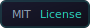](./LICENSE)
[](https://gno.sh)
[](https://twitter.com/gmickel)
[](https://discord.gg/nHEmyJB5tg)

> **ClawdHub**: GNO skills bundled for Clawdbot — [clawdhub.com/gmickel/gno](https://clawdhub.com/gmickel/gno)


GNO is a local knowledge engine for notes, code, PDFs, Office docs, meeting transcripts, and reference material. It gives you fast keyword search, semantic retrieval, grounded answers with citations, wiki-style linking, and a real workspace UI, while keeping the whole stack local by default.

Use it when:

- your notes live in more than one folder
- your important knowledge is split across Markdown, code, PDFs, and Office files
- you want one retrieval layer that works from the CLI, browser, MCP, and a Bun/TypeScript SDK
- you want better local context for agents without shipping your docs to a cloud API

### What GNO Gives You

- **Fast local search**: BM25 for exact hits, vectors for concepts, hybrid for best quality
- **Real retrieval surfaces**: CLI, Web UI, REST API, MCP, SDK
- **Local-first answers**: grounded synthesis with citations when you want answers, raw retrieval when you do not
- **Connected knowledge**: backlinks, related notes, graph view, cross-collection navigation
- **Operational fit**: daemon mode, model presets, remote GPU backends, safe config/state on disk

### One-Minute Tour

```bash
# Install
bun install -g @gmickel/gno

# Add a few collections
gno init ~/notes --name notes
gno collection add ~/work/docs --name work-docs --pattern "**/*.{md,pdf,docx}"
gno collection add ~/work/gno/src --name gno-code --pattern "**/*.{ts,tsx,js,jsx}"

# Add context so retrieval results come back with the right framing
gno context add "notes:" "Personal notes, journal entries, and long-form ideas"
gno context add "work-docs:" "Architecture docs, runbooks, RFCs, meeting notes"
gno context add "gno-code:" "Source code for the GNO application"

# Index + embed
gno update --yes
gno embed

# Search in the way that fits the question
gno search "DEC-0054"                            # exact keyword / identifier
gno vsearch "retry failed jobs with backoff"     # natural-language semantic lookup
gno query "JWT refresh token rotation" --explain # hybrid retrieval with score traces

# Retrieve documents or export context for an agent
gno get "gno://work-docs/architecture/auth.md"
gno multi-get "gno-code/**/*.ts" --max-bytes 30000 --md
gno query "deployment process" --all --files --min-score 0.35

# Run the workspace
gno serve
gno daemon
```

---

## Contents

- [Quick Start](#quick-start)
- [Installation](#installation)
- [Daemon Mode](#daemon-mode)
- [Search Modes](#search-modes)
- [Agent Integration](#agent-integration)
- [Web UI](#web-ui)
- [REST API](#rest-api)
- [SDK](#sdk)
- [How It Works](#how-it-works)
- [Features](#features)
- [Local Models](#local-models)
- [Fine-Tuned Models](#fine-tuned-models)
- [Architecture](#architecture)
- [Development](#development)

---

## What's New

> Latest release: [v0.37.0](./CHANGELOG.md#0370---2026-04-06)  
> Full release history: [CHANGELOG.md](./CHANGELOG.md)

- **Retrieval Quality Upgrade**: stronger BM25 lexical handling, code-aware chunking, terminal result hyperlinks, and per-collection model overrides
- **Code Embedding Benchmarks**: new benchmark workflow across canonical, real-GNO, and pinned OSS slices for comparing alternate embedding models
- **Default Embed Model**: built-in presets now use `Qwen3-Embedding-0.6B-GGUF` after it beat `bge-m3` on both code and multilingual prose benchmark lanes
- **Regression Fixes**: tightened phrase/negation/hyphen/underscore BM25 behavior, cleaned non-TTY hyperlink output, improved `gno doctor` chunking visibility, and fixed the embedding autoresearch harness

### Fine-Tuned Model Quick Use

```yaml
models:
  activePreset: slim-tuned
  presets:
    - id: slim-tuned
      name: GNO Slim Tuned
      embed: hf:Qwen/Qwen3-Embedding-0.6B-GGUF/Qwen3-Embedding-0.6B-Q8_0.gguf
      rerank: hf:ggml-org/Qwen3-Reranker-0.6B-Q8_0-GGUF/qwen3-reranker-0.6b-q8_0.gguf
      expand: hf:guiltylemon/gno-expansion-slim-retrieval-v1/gno-expansion-auto-entity-lock-default-mix-lr95-f16.gguf
      gen: hf:unsloth/Qwen3-1.7B-GGUF/Qwen3-1.7B-Q4_K_M.gguf
```

Then:

```bash
gno models use slim-tuned
gno models pull --expand
gno models pull --gen
gno query "ECONNREFUSED 127.0.0.1:5432" --thorough
```

> Full guide: [Fine-Tuned Models](https://gno.sh/docs/FINE-TUNED-MODELS/) · [Feature page](https://gno.sh/features/fine-tuned-models/)

---

## Quick Start

```bash
gno init ~/notes --name notes    # Point at your docs
gno index                        # Build search index
gno daemon                       # Keep index fresh in background (foreground process)
gno query "auth best practices"  # Hybrid search
gno ask "summarize the API" --answer  # AI answer with citations
```


---

## Installation

### Install GNO

Requires [Bun](https://bun.sh/) >= 1.0.0.

```bash
bun install -g @gmickel/gno
```

**macOS**: Vector search requires Homebrew SQLite:

```bash
brew install sqlite3
```

Verify everything works:

```bash
gno doctor
```

**Windows**: current validated target is `windows-x64`, with a packaged
desktop beta zip now published on GitHub Releases. See
[docs/WINDOWS.md](./docs/WINDOWS.md) for support scope and validation notes.

Keep an index fresh continuously without opening the Web UI:

```bash
gno daemon
```

`gno daemon` runs as a foreground watcher/sync/embed process. Use `nohup`,
launchd, or systemd if you want it supervised long-term.

See also: [docs/DAEMON.md](./docs/DAEMON.md)

### Connect to AI Agents

#### MCP Server (Claude Desktop, Cursor, Zed, etc.)

One command to add GNO to your AI assistant:

```bash
gno mcp install                      # Claude Desktop (default)
gno mcp install --target cursor      # Cursor
gno mcp install --target claude-code # Claude Code CLI
gno mcp install --target zed         # Zed
gno mcp install --target windsurf    # Windsurf
gno mcp install --target codex       # OpenAI Codex CLI
gno mcp install --target opencode    # OpenCode
gno mcp install --target amp         # Amp
gno mcp install --target lmstudio    # LM Studio
gno mcp install --target librechat   # LibreChat
```

Check status: `gno mcp status`

#### Skills (Claude Code, Codex, OpenCode)

Skills integrate via CLI with no MCP overhead:

```bash
gno skill install --scope user        # User-wide
gno skill install --target codex      # Codex
gno skill install --target opencode   # OpenCode
gno skill install --target openclaw   # OpenClaw
gno skill install --target all        # All targets
```

> **Full setup guide**: [MCP Integration](https://gno.sh/docs/MCP/) · [CLI Reference](https://gno.sh/docs/CLI/)

---

## Daemon Mode

Use `gno daemon` when you want continuous indexing without the browser or
desktop shell open.

```bash
gno daemon
gno daemon --no-sync-on-start
nohup gno daemon > /tmp/gno-daemon.log 2>&1 &
```

It reuses the same watch/sync/embed runtime as `gno serve`, but stays
headless. In v0.30 it is foreground-only and does not expose built-in
`start/stop/status` management.

[Daemon guide →](https://gno.sh/docs/DAEMON/)

---

## SDK

Embed GNO directly in another Bun or TypeScript app. No CLI subprocesses. No local server required.

Install:

```bash
bun add @gmickel/gno
```

Minimal client:

```ts
import { createDefaultConfig, createGnoClient } from "@gmickel/gno";

const config = createDefaultConfig();
config.collections = [
  {
    name: "notes",
    path: "/Users/me/notes",
    pattern: "**/*",
    include: [],
    exclude: [],
  },
];

const client = await createGnoClient({
  config,
  dbPath: "/tmp/gno-sdk.sqlite",
});

await client.index({ noEmbed: true });

const results = await client.query("JWT token flow", {
  noExpand: true,
  noRerank: true,
});

console.log(results.results[0]?.uri);
await client.close();
```

More SDK examples:

```ts
import { createGnoClient } from "@gmickel/gno";

const client = await createGnoClient({
  configPath: "/Users/me/.config/gno/index.yml",
});

// Fast exact search
const bm25 = await client.search("DEC-0054", {
  collection: "work-docs",
});

// Semantic code lookup
const semantic = await client.vsearch("retry failed jobs with backoff", {
  collection: "gno-code",
});

// Hybrid retrieval with explicit intent
const hybrid = await client.query("token refresh", {
  collection: "work-docs",
  intent: "JWT refresh token rotation in our auth stack",
  candidateLimit: 12,
});

// Fetch content directly
const doc = await client.get("gno://work-docs/auth/refresh.md");
const bundle = await client.multiGet(["gno-code/**/*.ts"], { maxBytes: 25000 });

// Indexing / embedding
await client.update({ collection: "work-docs" });
await client.embed({ collection: "gno-code" });

await client.close();
```

Core SDK surface:

- `createGnoClient({ config | configPath, dbPath? })`
- `search`, `vsearch`, `query`, `ask`
- `get`, `multiGet`, `list`, `status`
- `update`, `embed`, `index`
- `close`

Full guide: [SDK docs](https://gno.sh/docs/SDK/)

---

## Search Modes

| Command            | Mode                | Best For                                  |
| :----------------- | :------------------ | :---------------------------------------- |
| `gno search`       | Document-level BM25 | Exact phrases, code identifiers           |
| `gno vsearch`      | Contextual Vector   | Natural language, concepts                |
| `gno query`        | Hybrid              | Best accuracy (BM25 + vector + reranking) |
| `gno ask --answer` | RAG                 | Direct answers with citations             |

**BM25** indexes full documents (not chunks) with Snowball stemming, so "running" matches "run".
**Vector** embeds chunks with document titles for context awareness.
All retrieval modes also support metadata filters: `--since`, `--until`, `--category`, `--author`, `--tags-all`, `--tags-any`.

```bash
gno search "handleAuth"              # Find exact matches
gno vsearch "error handling patterns" # Semantic similarity
gno query "database optimization"    # Full pipeline
gno query "meeting decisions" --since "last month" --category "meeting,notes" --author "gordon"
gno query "performance" --intent "web performance and latency"
gno query "performance" --exclude "reviews,hiring"
gno ask "what did we decide" --answer # AI synthesis
```

Output formats: `--json`, `--files`, `--csv`, `--md`, `--xml`

### Common CLI Recipes

```bash
# Search one collection
gno search "PostgreSQL connection pool" --collection work-docs

# Export retrieval results for an agent
gno query "authentication flow" --json -n 10
gno query "deployment rollback" --all --files --min-score 0.4

# Retrieve a document by URI or docid
gno get "gno://work-docs/runbooks/deploy.md"
gno get "#abc123"

# Fetch many documents at once
gno multi-get "work-docs/**/*.md" --max-bytes 20000 --md

# Inspect how the hybrid rank was assembled
gno query "refresh token rotation" --explain

# Work with filters
gno query "meeting notes" --since "last month" --category "meeting,notes"
gno search "incident review" --tags-all "status/active,team/platform"
```

### Retrieval V2 Controls

Existing query calls still work. Retrieval v2 adds optional structured intent control and deeper explain output.

```bash
# Existing call (unchanged)
gno query "auth flow" --thorough

# Structured retrieval intent
gno query "auth flow" \
  --intent "web authentication and token lifecycle" \
  --candidate-limit 12 \
  --query-mode term:"jwt refresh token -oauth1" \
  --query-mode intent:"how refresh token rotation works" \
  --query-mode hyde:"Refresh tokens rotate on each use and previous tokens are revoked." \
  --explain

# Multi-line structured query document
gno query $'auth flow\nterm: "refresh token" -oauth1\nintent: how refresh token rotation works\nhyde: Refresh tokens rotate on each use and previous tokens are revoked.' --fast
```

- Modes: `term` (BM25-focused), `intent` (semantic-focused), `hyde` (single hypothetical passage)
- Explain includes stage timings, fallback/cache counters, and per-result score components
- `gno ask --json` includes `meta.answerContext` for adaptive source selection traces
- Search and Ask web text boxes also accept multi-line structured query documents with `Shift+Enter`

---

## Agent Integration

Give your local LLM agents a long-term memory. GNO integrates as a Claude Code skill or MCP server, allowing agents to search, read, and cite your local files.

### Skills

Skills add GNO search to Claude Code/Codex without MCP protocol overhead:

```bash
gno skill install --scope user
```

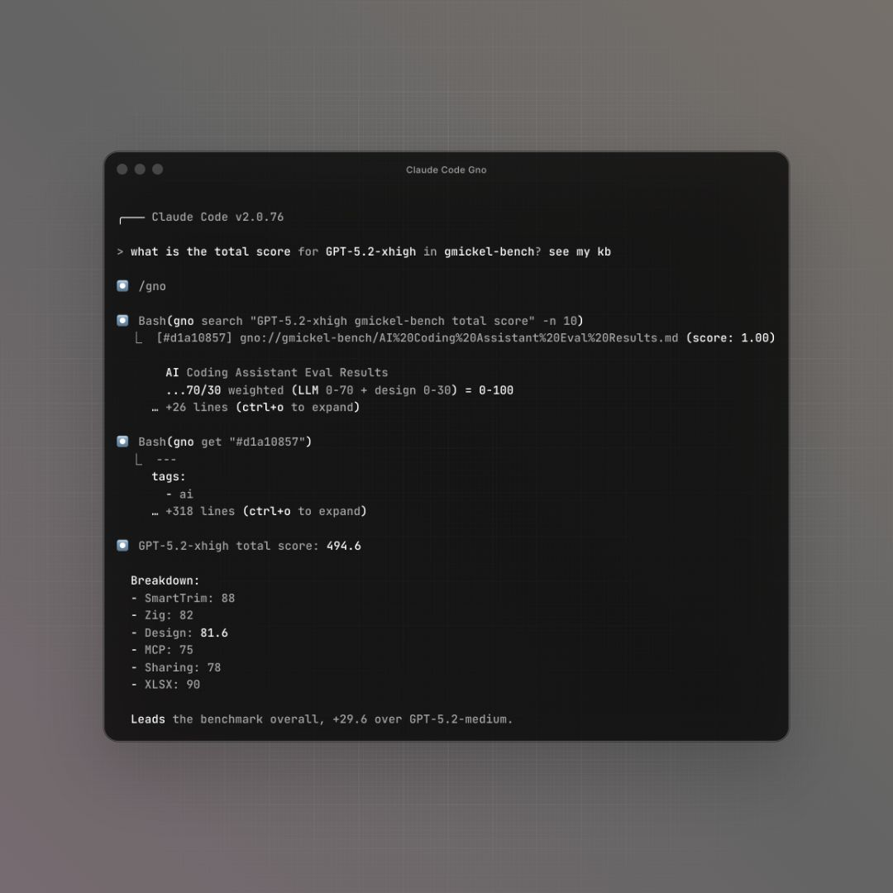

Then ask your agent: _"Search my notes for the auth discussion"_

Agent-friendly CLI examples:

```bash
# Structured retrieval output for an agent
gno query "authentication" --json -n 10

# File list for downstream retrieval
gno query "error handling" --all --files --min-score 0.35

# Full document content when the agent already knows the ref
gno get "gno://work-docs/api-reference.md" --full
gno multi-get "work-docs/**/*.md" --md --max-bytes 30000
```

[Skill setup guide →](https://gno.sh/docs/integrations/skills/)

### MCP Server

Connect GNO to Claude Desktop, Cursor, Raycast, and more:

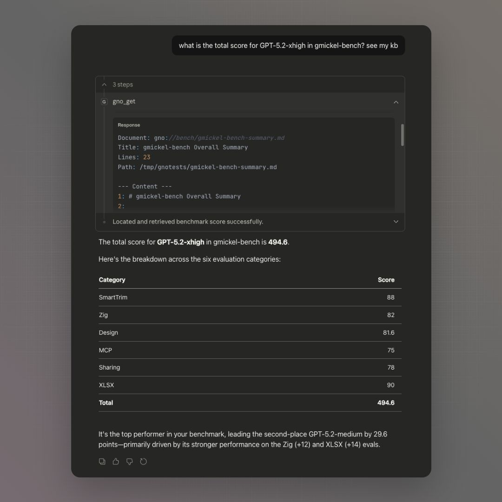

GNO exposes tools via [Model Context Protocol](https://modelcontextprotocol.io):

| Tool            | Description                           |
| :-------------- | :------------------------------------ |
| `gno_search`    | BM25 keyword search                   |
| `gno_vsearch`   | Vector semantic search                |
| `gno_query`     | Hybrid search (recommended)           |
| `gno_get`       | Retrieve document by ID               |
| `gno_multi_get` | Batch document retrieval              |
| `gno_links`     | Get outgoing links from document      |
| `gno_backlinks` | Get documents linking TO document     |
| `gno_similar`   | Find semantically similar documents   |
| `gno_graph`     | Get knowledge graph (nodes and edges) |
| `gno_status`    | Index health check                    |

**Design**: MCP tools are retrieval-only. Your AI assistant (Claude, GPT-4) synthesizes answers from retrieved context. Best retrieval (GNO) + best reasoning (your LLM).

[MCP setup guide →](https://gno.sh/docs/MCP/)

---

## Web UI

Visual dashboard for search, browsing, editing, and AI answers. Right in your browser.

```bash
gno serve                    # Start on port 3000
gno serve --port 8080        # Custom port
```

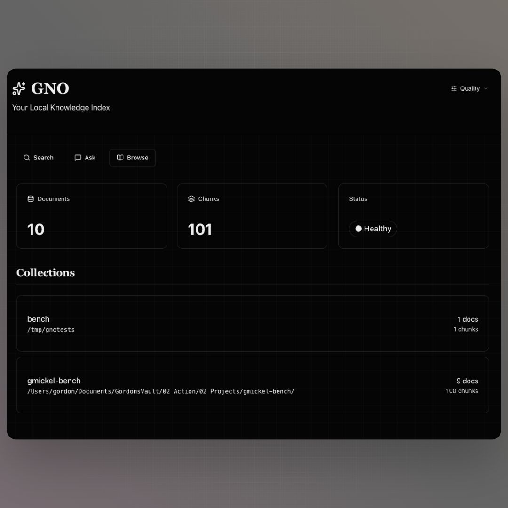

Open `http://localhost:3000` to:

- **Search**: BM25, vector, or hybrid modes with visual results
- **Browse**: Cross-collection tree workspace with folder detail panes and per-tab browse context
- **Edit**: Create, edit, and delete documents with live preview
- **Create in place**: New notes in the current folder/collection with presets and command-palette flows
- **Ask**: AI-powered Q&A with citations
- **Manage Collections**: Add, remove, and re-index collections
- **Connect agents**: Install core Skill/MCP integrations from the app
- **Manage files safely**: Rename, reveal, or move editable files to Trash with explicit index-vs-disk semantics
- **Refactor files safely**: Move, duplicate, and organize editable notes with reference warnings
- **Switch presets**: Change models live without restart
- **Command palette**: Jump, create, refactor, and section-navigate from one keyboard-first surface

### Search

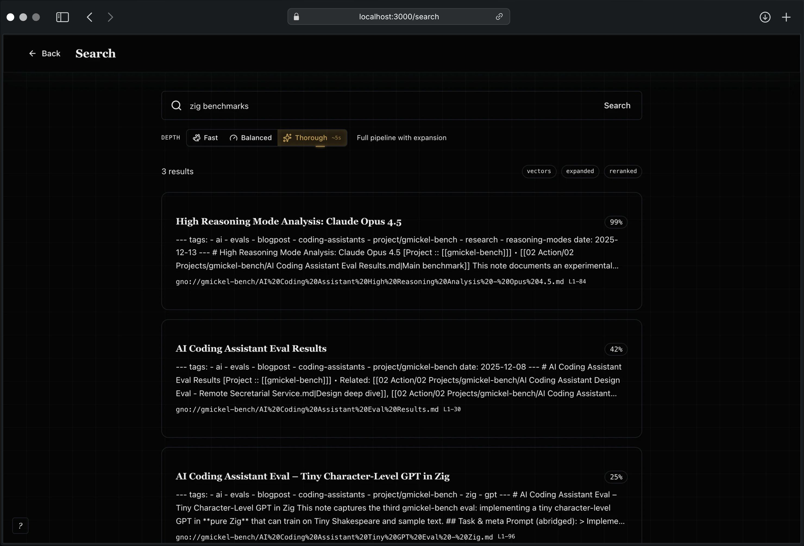

Three retrieval modes: BM25 (keyword), Vector (semantic), or Hybrid (best of both). Adjust search depth for speed vs thoroughness.

### Document Editing

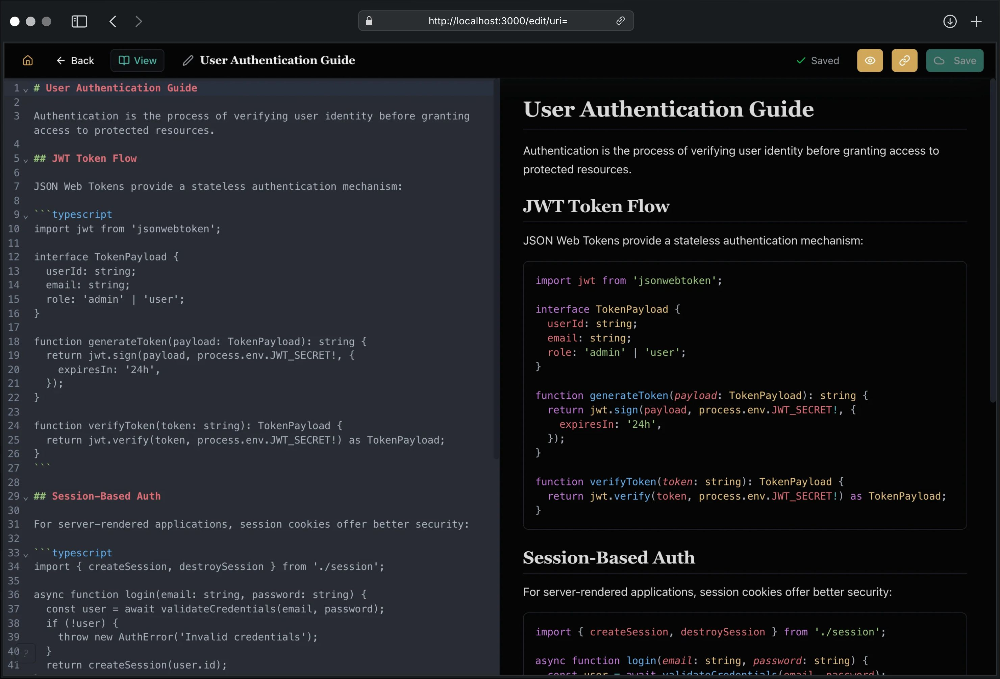

Full-featured markdown editor with:

| Feature                 | Description                                  |
| :---------------------- | :------------------------------------------- |
| **Split View**          | Side-by-side editor and live preview         |
| **Auto-save**           | 2-second debounced saves                     |
| **Syntax Highlighting** | CodeMirror 6 with markdown support           |
| **Keyboard Shortcuts**  | ⌘S save, ⌘B bold, ⌘I italic, ⌘K link         |
| **Quick Capture**       | ⌘N creates new note from anywhere            |
| **Presets**             | Structured note scaffolds and insert actions |

### Document Viewer

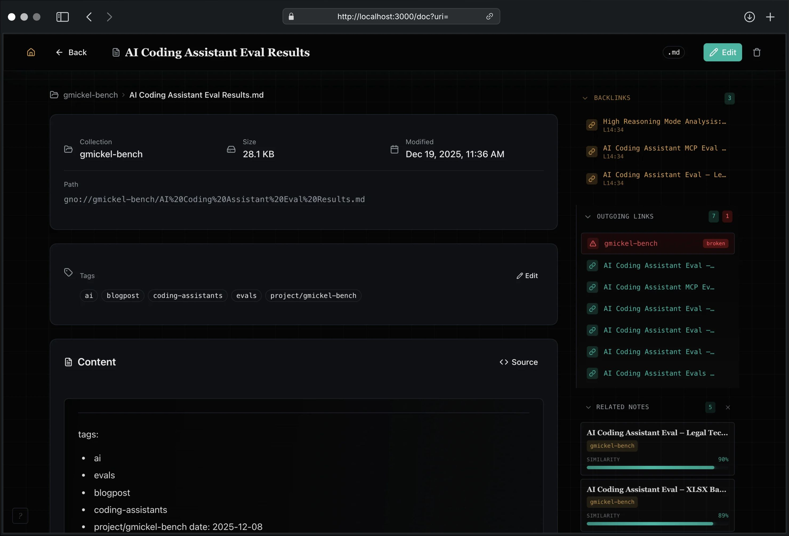

View documents with full context: outgoing links, backlinks, section outline, and AI-powered related notes sidebar.

### Browse Workspace

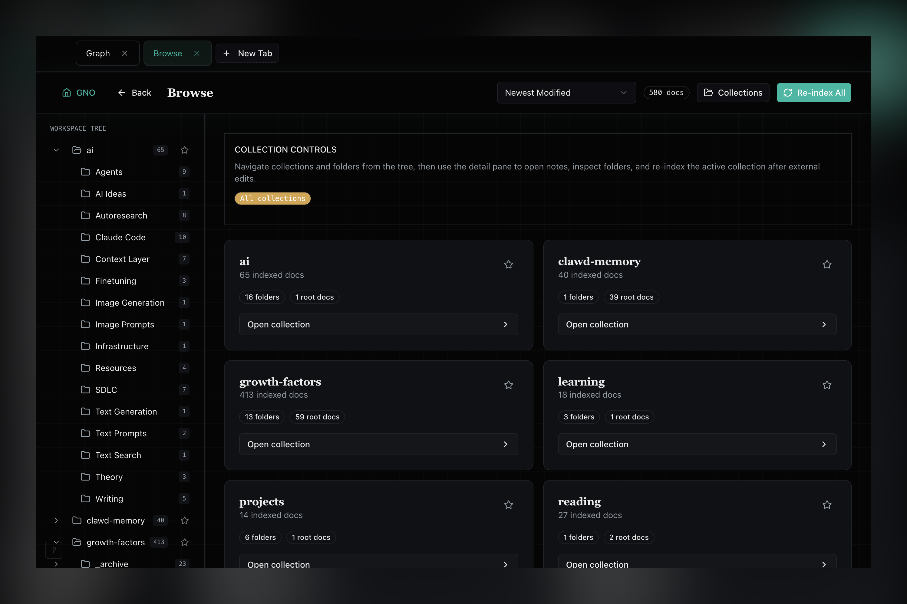

Navigate your notes like a real workspace, not just a flat list:

- Cross-collection tree sidebar
- Folder detail panes
- Create note and create folder from current browse context
- Pinned collections and per-tab browse state
- Direct jump from folder structure into notes

### Knowledge Graph

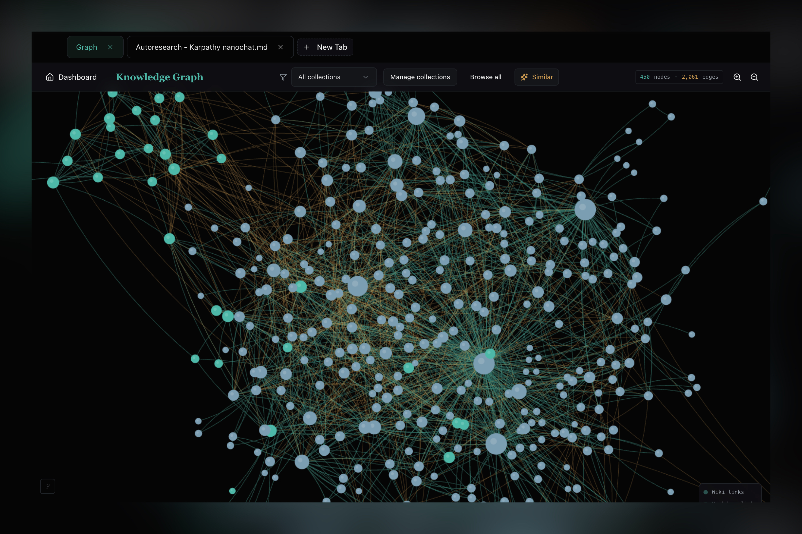

Interactive visualization of document connections. Wiki links, markdown links, and optional similarity edges rendered as a navigable constellation.

### Collections Management


- Add collections with folder path input
- View document count, chunk count, embedding status
- Re-index individual collections
- Remove collections (documents preserved)

### AI Answers

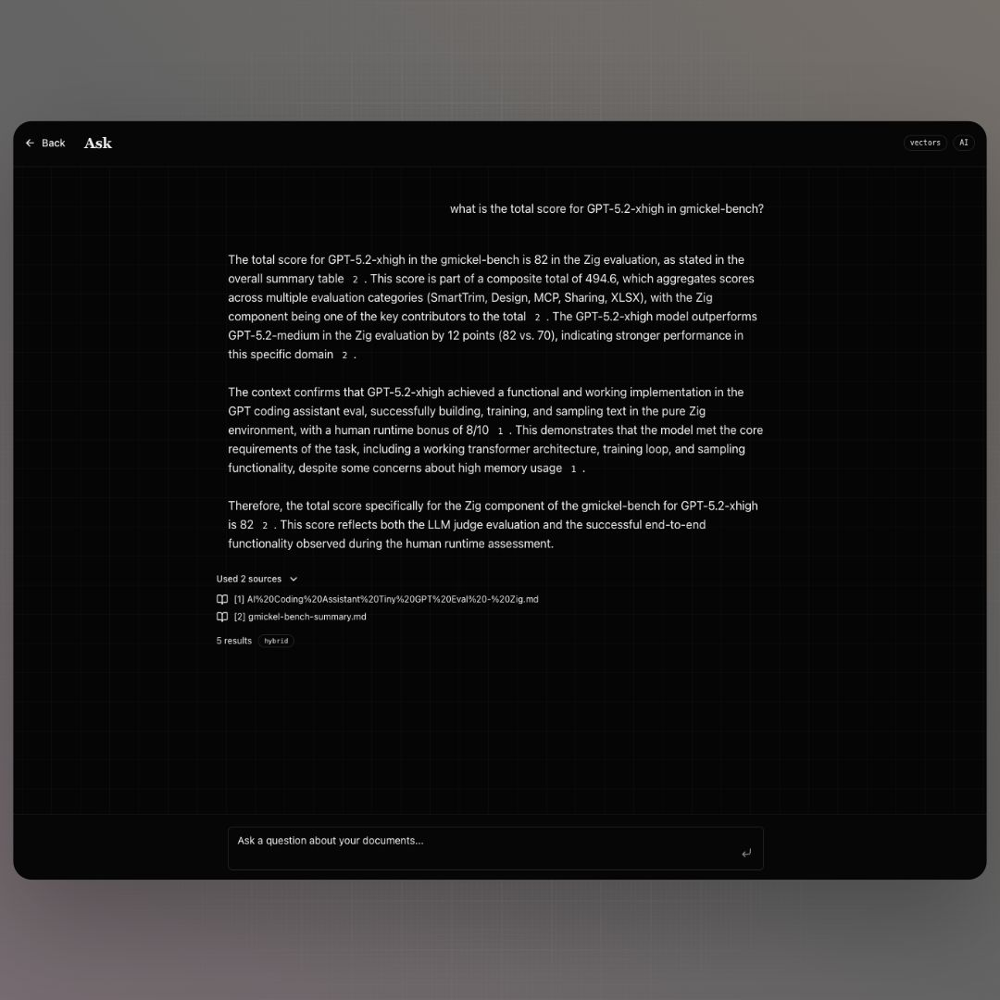

Ask questions in natural language. GNO searches your documents and synthesizes answers with inline citations linking to sources.

Everything runs locally. No cloud, no accounts, no data leaving your machine.

> **Detailed docs**: [Web UI Guide](https://gno.sh/docs/WEB-UI/)

---

## REST API

Programmatic access to all GNO features via HTTP.

```bash
# Hybrid search
curl -X POST http://localhost:3000/api/query \
  -H "Content-Type: application/json" \
  -d '{"query": "authentication patterns", "limit": 10}'

# AI answer
curl -X POST http://localhost:3000/api/ask \
  -H "Content-Type: application/json" \
  -d '{"query": "What is our deployment process?"}'

# Index status
curl http://localhost:3000/api/status
```

| Endpoint                      | Method | Description                 |
| :---------------------------- | :----- | :-------------------------- |
| `/api/query`                  | POST   | Hybrid search (recommended) |
| `/api/search`                 | POST   | BM25 keyword search         |
| `/api/ask`                    | POST   | AI-powered Q&A              |
| `/api/docs`                   | GET    | List documents              |
| `/api/docs`                   | POST   | Create document             |
| `/api/docs/:id`               | PUT    | Update document content     |
| `/api/docs/:id/move`          | POST   | Move editable document      |
| `/api/docs/:id/duplicate`     | POST   | Duplicate editable document |
| `/api/docs/:id/refactor-plan` | POST   | Preview file-op warnings    |
| `/api/docs/:id/deactivate`    | POST   | Remove from index           |
| `/api/doc`                    | GET    | Get document content        |
| `/api/doc/:id/sections`       | GET    | Get document sections       |
| `/api/collections`            | POST   | Add collection              |
| `/api/collections/:name`      | DELETE | Remove collection           |
| `/api/folders`                | POST   | Create folder               |
| `/api/sync`                   | POST   | Trigger re-index            |
| `/api/status`                 | GET    | Index statistics            |
| `/api/note-presets`           | GET    | List note presets           |
| `/api/presets`                | GET    | List model presets          |
| `/api/presets`                | POST   | Switch preset               |
| `/api/models/pull`            | POST   | Download models             |
| `/api/models/status`          | GET    | Download progress           |

No authentication. No rate limits. Build custom tools, automate workflows, integrate with any language.

> **Full reference**: [API Documentation](https://gno.sh/docs/API/)

---

## How It Works

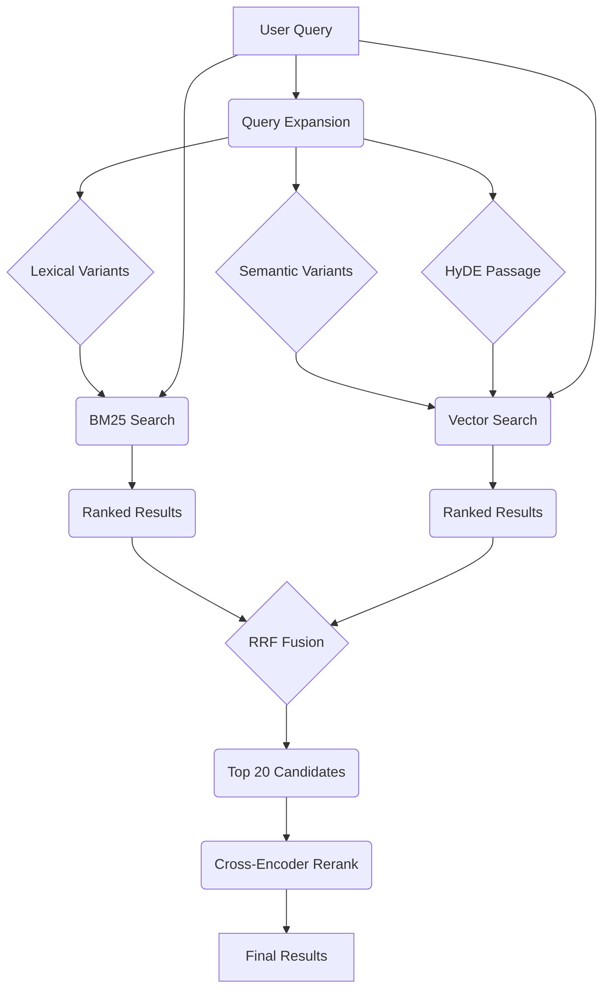
```mermaid
graph TD
    A[User Query] --> B(Query Expansion)
    B --> C{Lexical Variants}
    B --> D{Semantic Variants}
    B --> E{HyDE Passage}

    C --> G(BM25 Search)
    D --> H(Vector Search)
    E --> H
    A --> G
    A --> H

    G --> I(Ranked Results)
    H --> J(Ranked Results)
    I --> K{RRF Fusion}
    J --> K

    K --> L(Top 20 Candidates)
    L --> M(Cross-Encoder Rerank)
    M --> N[Final Results]
```

0. **Strong Signal Check**: Skip expansion if BM25 has confident match (saves 1-3s)
1. **Query Expansion**: LLM generates lexical variants, semantic rephrases, and a [HyDE](https://arxiv.org/abs/2212.10496) passage
2. **Parallel Retrieval**: Document-level BM25 + chunk-level vector search on all variants
3. **Fusion**: RRF with 2× weight for original query, tiered bonus for top ranks
4. **Reranking**: Qwen3-Reranker scores best chunk per document (4K), blended with fusion

> **Deep dive**: [How Search Works](https://gno.sh/docs/HOW-SEARCH-WORKS/)

---

## Features

| Feature              | Description                                                                    |
| :------------------- | :----------------------------------------------------------------------------- |
| **Hybrid Search**    | BM25 + vector + RRF fusion + cross-encoder reranking                           |
| **Document Editor**  | Create, edit, delete docs with live markdown preview                           |
| **Web UI**           | Visual dashboard for search, browse, edit, and AI Q&A                          |
| **REST API**         | HTTP API for custom tools and integrations                                     |
| **Multi-Format**     | Markdown, PDF, DOCX, XLSX, PPTX, plain text                                    |
| **Local LLM**        | AI answers via llama.cpp, no API keys                                          |
| **Remote Inference** | Offload to GPU servers via HTTP (llama-server, Ollama, LocalAI)                |
| **Privacy First**    | 100% offline, zero telemetry, your data stays yours                            |
| **MCP Server**       | Works with Claude Desktop, Cursor, Zed, + 8 more                               |
| **Collections**      | Organize sources with patterns, excludes, contexts                             |
| **Tag Filtering**    | Frontmatter tags with hierarchical paths, filter via `--tags-any`/`--tags-all` |
| **Note Linking**     | Wiki links, backlinks, related notes, cross-collection navigation              |
| **Multilingual**     | 30+ languages, auto-detection, cross-lingual search                            |
| **Incremental**      | SHA-256 tracking, only changed files re-indexed                                |
| **Keyboard First**   | ⌘N capture, ⌘K search, ⌘/ shortcuts, ⌘S save                                   |

---

## Local Models

Models auto-download on first use to `~/.cache/gno/models/`. For deterministic startup, set `GNO_NO_AUTO_DOWNLOAD=1` and use `gno models pull` explicitly. Alternatively, offload to a GPU server on your network using HTTP backends.

| Model                | Purpose                               | Size         |
| :------------------- | :------------------------------------ | :----------- |
| Qwen3-Embedding-0.6B | Embeddings (multilingual)             | ~640MB       |
| Qwen3-Reranker-0.6B  | Cross-encoder reranking (32K context) | ~700MB       |
| Qwen/SmolLM          | Query expansion + AI answers          | ~600MB-1.2GB |

### Model Presets

| Preset     | Disk   | Best For                     |
| :--------- | :----- | :--------------------------- |
| `slim`     | ~1GB   | Fast, good quality (default) |
| `balanced` | ~2GB   | Slightly larger model        |
| `quality`  | ~2.5GB | Best answers                 |

```bash
gno models use slim
gno models pull --all  # Optional: pre-download models (auto-downloads on first use)
```

## Fine-Tuned Models

GNO now has a published promoted retrieval model for the default slim path:

- model repo: `guiltylemon/gno-expansion-slim-retrieval-v1`
- recommended preset id: `slim-tuned`
- runtime URI:
  - `hf:guiltylemon/gno-expansion-slim-retrieval-v1/gno-expansion-auto-entity-lock-default-mix-lr95-f16.gguf`

Use it when you want the tuned retrieval expansion path immediately, without running local fine-tuning yourself.

For private/internal products, use the same workflow but keep the final GGUF private and point `gen:` at a `file:` URI instead of publishing to Hugging Face.

See:

- [Fine-Tuned Models docs](https://gno.sh/docs/FINE-TUNED-MODELS/)
- [Fine-Tuned Models feature page](https://gno.sh/features/fine-tuned-models/)

### HTTP Backends (Remote GPU)

Offload inference to a GPU server on your network:

```yaml
# ~/.config/gno/index.yml
models:
  activePreset: remote-gpu
  presets:
    - id: remote-gpu
      name: Remote GPU Server
      embed: "http://192.168.1.100:8081/v1/embeddings#bge-m3"
      rerank: "http://192.168.1.100:8082/v1/completions#reranker"
      expand: "http://192.168.1.100:8083/v1/chat/completions#gno-expand"
      gen: "http://192.168.1.100:8083/v1/chat/completions#qwen3-4b"
```

Works with llama-server, Ollama, LocalAI, vLLM, or any OpenAI-compatible server.

> **Configuration**: [Model Setup](https://gno.sh/docs/CONFIGURATION/)

---

## Architecture

```
┌─────────────────────────────────────────────────┐
│            GNO CLI / MCP / Web UI / API         │
├─────────────────────────────────────────────────┤
│  Ports: Converter, Store, Embedding, Rerank    │
├─────────────────────────────────────────────────┤
│  Adapters: SQLite, FTS5, sqlite-vec, llama-cpp │
├─────────────────────────────────────────────────┤
│  Core: Identity, Mirrors, Chunking, Retrieval  │
└─────────────────────────────────────────────────┘
```

> **Details**: [Architecture](https://gno.sh/docs/ARCHITECTURE/)

---

## Development

```bash
git clone https://github.com/gmickel/gno.git && cd gno
bun install
bun test
bun run lint && bun run typecheck
```

> **Contributing**: [CONTRIBUTING.md](.github/CONTRIBUTING.md)

### Evals and Benchmark Deltas

Use retrieval benchmark commands to track quality and latency over time:

```bash
bun run eval:hybrid
bun run eval:hybrid:baseline
bun run eval:hybrid:delta
```

- Benchmark guide: [evals/README.md](./evals/README.md)
- Latest baseline snapshot: [evals/fixtures/hybrid-baseline/latest.json](./evals/fixtures/hybrid-baseline/latest.json)

### Code Embedding Benchmark Harness

GNO also has a dedicated harness for comparing alternate embedding models on code retrieval without touching product defaults:

```bash
# Establish the current incumbent baseline
bun run bench:code-embeddings --candidate bge-m3-incumbent --write

# Add candidate model URIs to the search space, then inspect them
bun run research:embeddings:autonomous:list-search-candidates

# Benchmark one candidate explicitly
bun run research:embeddings:autonomous:run-candidate bge-m3-incumbent

# Or let the bounded search harness walk the remaining candidates later
bun run research:embeddings:autonomous:search --dry-run
```

See [research/embeddings/README.md](./research/embeddings/README.md).

If a model turns out to be better specifically for code, the intended user story is:

- keep the default global preset for mixed prose/docs collections
- use per-collection `models.embed` overrides for code collections

That lets GNO stay sane by default while still giving power users a clean path to code-specialist retrieval.

Current code-focused recommendation:

```yaml
collections:
  - name: gno-code
    path: /Users/you/work/gno/src
    pattern: "**/*.{ts,tsx,js,jsx,go,rs,py,swift,c}"
    models:
      embed: "hf:Qwen/Qwen3-Embedding-0.6B-GGUF/Qwen3-Embedding-0.6B-Q8_0.gguf"
```

GNO treats that override like any other model URI:

- auto-downloads on first use by default
- manual-only if `GNO_NO_AUTO_DOWNLOAD=1`
- offline-safe if the model is already cached

Why this is the current recommendation:

- matches `bge-m3` on the tiny canonical benchmark
- significantly beats `bge-m3` on the real GNO `src/serve` code slice
- also beats `bge-m3` on a pinned public-OSS code slice

Trade-off:

- Qwen is slower to embed than `bge-m3`
- existing users upgrading to the new default may need to run `gno embed` again so vector and hybrid retrieval catch up

### General Multilingual Embedding Benchmark

GNO also now has a separate public-docs benchmark lane for normal markdown/prose
collections:

```bash
bun run bench:general-embeddings --candidate bge-m3-incumbent --write
bun run bench:general-embeddings --candidate qwen3-embedding-0.6b --write
```

Current signal on the public multilingual FastAPI-docs fixture:

- `bge-m3`: vector nDCG@10 `0.350`, hybrid nDCG@10 `0.642`
- `Qwen3-Embedding-0.6B-GGUF`: vector nDCG@10 `0.859`, hybrid nDCG@10 `0.947`

Interpretation:

- Qwen is now the strongest general multilingual embedding model we have tested
- built-in presets now use Qwen by default
- existing users may need to run `gno embed` again after upgrading so current collections catch up

---

## License

[MIT](./LICENSE)

---

<p align="center">
  made with ❤️ by <a href="https://twitter.com/gmickel">@gmickel</a>
</p>
