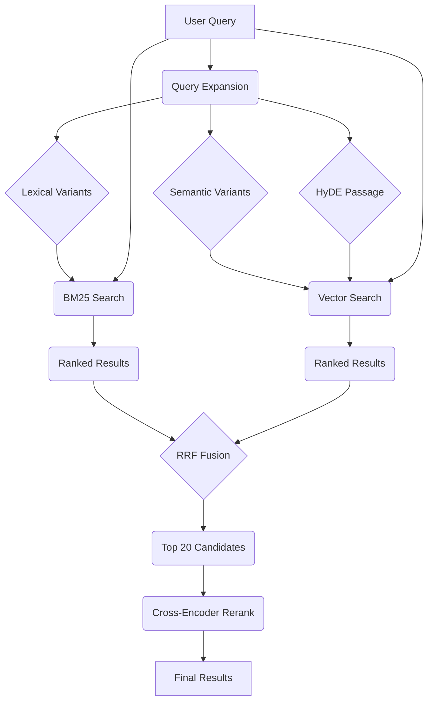

# GNO

**Your Local Second Brain**: Index, search, and synthesize your entire digital life.

[](https://www.npmjs.com/package/@gmickel/gno)
[](./LICENSE)
[](https://gno.sh)
[](https://twitter.com/gmickel)

GNO is a local knowledge engine for privacy-conscious developers and AI agents. Index your notes, code, PDFs, and Office docs. Get hybrid search (BM25 + vector + reranking) and AI-powered answers, all running 100% on your machine.

---

## Contents

- [Quick Start](#quick-start)
- [Installation](#installation)
- [Search Modes](#search-modes)
- [Agent Integration](#agent-integration)
- [Web UI](#web-ui)
- [REST API](#rest-api)
- [How It Works](#how-it-works)
- [Features](#features)
- [Local Models](#local-models)
- [Architecture](#architecture)
- [Development](#development)

---

## Quick Start

```bash
gno init ~/notes --name notes    # Point at your docs
gno index                        # Build search index
gno query "auth best practices"  # Hybrid search
gno ask "summarize the API" --answer  # AI answer with citations
```


---

## Installation

### Install GNO

Requires [Bun](https://bun.sh/) >= 1.0.0.

```bash
bun install -g @gmickel/gno
```

**macOS**: Vector search requires Homebrew SQLite:

```bash
brew install sqlite3
```

Verify everything works:

```bash
gno doctor
```

### Connect to AI Agents

#### MCP Server (Claude Desktop, Cursor, Zed, etc.)

One command to add GNO to your AI assistant:

```bash
gno mcp install                      # Claude Desktop (default)
gno mcp install --target cursor      # Cursor
gno mcp install --target claude-code # Claude Code CLI
gno mcp install --target zed         # Zed
gno mcp install --target windsurf    # Windsurf
gno mcp install --target codex       # OpenAI Codex CLI
gno mcp install --target opencode    # OpenCode
gno mcp install --target amp         # Amp
gno mcp install --target lmstudio    # LM Studio
gno mcp install --target librechat   # LibreChat
```

Check status: `gno mcp status`

#### Skills (Claude Code, Codex, OpenCode)

Skills integrate via CLI with no MCP overhead:

```bash
gno skill install --scope user       # User-wide
gno skill install --target codex     # Codex
gno skill install --target all       # Both Claude + Codex
```

> **Full setup guide**: [MCP Integration](https://gno.sh/docs/MCP/) · [CLI Reference](https://gno.sh/docs/CLI/)

---

## Search Modes

| Command            | Mode                | Best For                                  |
| :----------------- | :------------------ | :---------------------------------------- |
| `gno search`       | Document-level BM25 | Exact phrases, code identifiers           |
| `gno vsearch`      | Contextual Vector   | Natural language, concepts                |
| `gno query`        | Hybrid              | Best accuracy (BM25 + vector + reranking) |
| `gno ask --answer` | RAG                 | Direct answers with citations             |

**BM25** indexes full documents (not chunks) with Snowball stemming, so "running" matches "run".
**Vector** embeds chunks with document titles for context awareness.

```bash
gno search "handleAuth"              # Find exact matches
gno vsearch "error handling patterns" # Semantic similarity
gno query "database optimization"    # Full pipeline
gno ask "what did we decide" --answer # AI synthesis
```

Output formats: `--json`, `--files`, `--csv`, `--md`, `--xml`

---

## Agent Integration

Give your local LLM agents a long-term memory. GNO integrates as a Claude Code skill or MCP server, allowing agents to search, read, and cite your local files.

### Skills

Skills add GNO search to Claude Code/Codex without MCP protocol overhead:

```bash
gno skill install --scope user
```


Then ask your agent: _"Search my notes for the auth discussion"_

[Skill setup guide →](https://gno.sh/docs/integrations/skills/)

### MCP Server

Connect GNO to Claude Desktop, Cursor, Raycast, and more:


GNO exposes 6 tools via [Model Context Protocol](https://modelcontextprotocol.io):

| Tool            | Description                 |
| :-------------- | :-------------------------- |
| `gno_search`    | BM25 keyword search         |
| `gno_vsearch`   | Vector semantic search      |
| `gno_query`     | Hybrid search (recommended) |
| `gno_get`       | Retrieve document by ID     |
| `gno_multi_get` | Batch document retrieval    |
| `gno_status`    | Index health check          |

**Design**: MCP tools are retrieval-only. Your AI assistant (Claude, GPT-4) synthesizes answers from retrieved context. Best retrieval (GNO) + best reasoning (your LLM).

[MCP setup guide →](https://gno.sh/docs/MCP/)

---

## Web UI

Visual dashboard for search, browsing, editing, and AI answers. Right in your browser.

```bash
gno serve                    # Start on port 3000
gno serve --port 8080        # Custom port
```


Open `http://localhost:3000` to:

- **Search**: BM25, vector, or hybrid modes with visual results
- **Browse**: Paginated document list, filter by collection
- **Edit**: Create, edit, and delete documents with live preview
- **Ask**: AI-powered Q&A with citations
- **Manage Collections**: Add, remove, and re-index collections
- **Switch presets**: Change models live without restart

### Search


Three retrieval modes: BM25 (keyword), Vector (semantic), or Hybrid (best of both). Adjust search depth for speed vs thoroughness.

### Document Editing


Full-featured markdown editor with:

| Feature                 | Description                          |
| :---------------------- | :----------------------------------- |
| **Split View**          | Side-by-side editor and live preview |
| **Auto-save**           | 2-second debounced saves             |
| **Syntax Highlighting** | CodeMirror 6 with markdown support   |
| **Keyboard Shortcuts**  | ⌘S save, ⌘B bold, ⌘I italic, ⌘K link |
| **Quick Capture**       | ⌘N creates new note from anywhere    |

### Collections Management


- Add collections with folder path input
- View document count, chunk count, embedding status
- Re-index individual collections
- Remove collections (documents preserved)

### AI Answers


Ask questions in natural language. GNO searches your documents and synthesizes answers with inline citations linking to sources.

Everything runs locally. No cloud, no accounts, no data leaving your machine.

> **Detailed docs**: [Web UI Guide](https://gno.sh/docs/WEB-UI/)

---

## REST API

Programmatic access to all GNO features via HTTP.

```bash
# Hybrid search
curl -X POST http://localhost:3000/api/query \
  -H "Content-Type: application/json" \
  -d '{"query": "authentication patterns", "limit": 10}'

# AI answer
curl -X POST http://localhost:3000/api/ask \
  -H "Content-Type: application/json" \
  -d '{"query": "What is our deployment process?"}'

# Index status
curl http://localhost:3000/api/status
```

| Endpoint                   | Method | Description                 |
| :------------------------- | :----- | :-------------------------- |
| `/api/query`               | POST   | Hybrid search (recommended) |
| `/api/search`              | POST   | BM25 keyword search         |
| `/api/ask`                 | POST   | AI-powered Q&A              |
| `/api/docs`                | GET    | List documents              |
| `/api/docs`                | POST   | Create document             |
| `/api/docs/:id`            | PUT    | Update document content     |
| `/api/docs/:id/deactivate` | POST   | Remove from index           |
| `/api/doc`                 | GET    | Get document content        |
| `/api/collections`         | POST   | Add collection              |
| `/api/collections/:name`   | DELETE | Remove collection           |
| `/api/sync`                | POST   | Trigger re-index            |
| `/api/status`              | GET    | Index statistics            |
| `/api/presets`             | GET    | List model presets          |
| `/api/presets`             | POST   | Switch preset               |
| `/api/models/pull`         | POST   | Download models             |
| `/api/models/status`       | GET    | Download progress           |

No authentication. No rate limits. Build custom tools, automate workflows, integrate with any language.

> **Full reference**: [API Documentation](https://gno.sh/docs/API/)

---

## How It Works



0. **Strong Signal Check**: Skip expansion if BM25 has confident match (saves 1-3s)
1. **Query Expansion**: LLM generates lexical variants, semantic rephrases, and a [HyDE](https://arxiv.org/abs/2212.10496) passage
2. **Parallel Retrieval**: Document-level BM25 + chunk-level vector search on all variants
3. **Fusion**: RRF with 2× weight for original query, tiered bonus for top ranks
4. **Reranking**: Qwen3-Reranker scores best chunk per document (4K), blended with fusion

> **Deep dive**: [How Search Works](https://gno.sh/docs/HOW-SEARCH-WORKS/)

---

## Features

| Feature             | Description                                                                    |
| :------------------ | :----------------------------------------------------------------------------- |
| **Hybrid Search**   | BM25 + vector + RRF fusion + cross-encoder reranking                           |
| **Document Editor** | Create, edit, delete docs with live markdown preview                           |
| **Web UI**          | Visual dashboard for search, browse, edit, and AI Q&A                          |
| **REST API**        | HTTP API for custom tools and integrations                                     |
| **Multi-Format**    | Markdown, PDF, DOCX, XLSX, PPTX, plain text                                    |
| **Local LLM**       | AI answers via llama.cpp, no API keys                                          |
| **Privacy First**   | 100% offline, zero telemetry, your data stays yours                            |
| **MCP Server**      | Works with Claude Desktop, Cursor, Zed, + 8 more                               |
| **Collections**     | Organize sources with patterns, excludes, contexts                             |
| **Tag Filtering**   | Frontmatter tags with hierarchical paths, filter via `--tags-any`/`--tags-all` |
| **Multilingual**    | 30+ languages, auto-detection, cross-lingual search                            |
| **Incremental**     | SHA-256 tracking, only changed files re-indexed                                |
| **Keyboard First**  | ⌘N capture, ⌘K search, ⌘/ shortcuts, ⌘S save                                   |

---

## Local Models

Models auto-download on first use to `~/.cache/gno/models/`.

| Model               | Purpose                               | Size         |
| :------------------ | :------------------------------------ | :----------- |
| bge-m3              | Embeddings (1024-dim, multilingual)   | ~500MB       |
| Qwen3-Reranker-0.6B | Cross-encoder reranking (32K context) | ~700MB       |
| Qwen/SmolLM         | Query expansion + AI answers          | ~600MB-1.2GB |

### Model Presets

| Preset     | Disk   | Best For                     |
| :--------- | :----- | :--------------------------- |
| `slim`     | ~1GB   | Fast, good quality (default) |
| `balanced` | ~2GB   | Slightly larger model        |
| `quality`  | ~2.5GB | Best answers                 |

```bash
gno models use slim
gno models pull --all  # Optional: pre-download models (auto-downloads on first use)
```

> **Configuration**: [Model Setup](https://gno.sh/docs/CONFIGURATION/)

---

## Architecture

```
┌─────────────────────────────────────────────────┐
│            GNO CLI / MCP / Web UI / API         │
├─────────────────────────────────────────────────┤
│  Ports: Converter, Store, Embedding, Rerank    │
├─────────────────────────────────────────────────┤
│  Adapters: SQLite, FTS5, sqlite-vec, llama-cpp │
├─────────────────────────────────────────────────┤
│  Core: Identity, Mirrors, Chunking, Retrieval  │
└─────────────────────────────────────────────────┘
```

> **Details**: [Architecture](https://gno.sh/docs/ARCHITECTURE/)

---

## Development

```bash
git clone https://github.com/gmickel/gno.git && cd gno
bun install
bun test
bun run lint && bun run typecheck
```

> **Contributing**: [CONTRIBUTING.md](.github/CONTRIBUTING.md)

---

## License

[MIT](./LICENSE)

---

<p align="center">
  made with ❤️ by <a href="https://twitter.com/gmickel">@gmickel</a>
</p>
