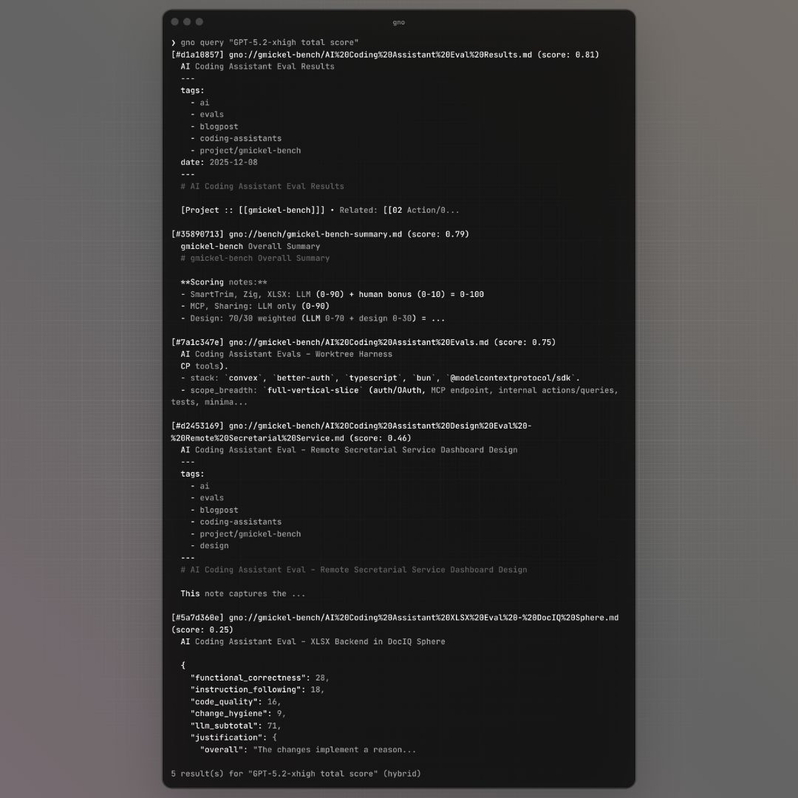

# CLI Reference

GNO command-line interface guide.

> **Full specification**: See [spec/cli.md](../spec/cli.md) for exhaustive command documentation.



## Quick Reference

| Command       | Description                     |
| ------------- | ------------------------------- |
| `gno init`    | Initialize config and database  |
| `gno update`  | Index all collections           |
| `gno search`  | BM25 full-text search           |
| `gno vsearch` | Vector similarity search        |
| `gno query`   | Hybrid search (BM25 + vector)   |
| `gno ask`     | Search with AI answer           |
| `gno get`     | Retrieve document content       |
| `gno ls`      | List indexed documents          |
| `gno serve`   | Start web UI server             |
| `gno models`  | Manage models (list, pull, use) |
| `gno skill`   | Install GNO skill for AI agents |
| `gno doctor`  | Check system health             |

## Global Flags

All commands accept:

```
--index <name>    Use alternate index (default: "default")
--config <path>   Override config file path
--no-color        Disable colored output
--verbose         Enable verbose logging
--yes             Non-interactive mode
--offline         Use cached models only (no auto-download)
```

**Offline mode**: Use `--offline` or set `HF_HUB_OFFLINE=1` to prevent auto-downloading models. Set `GNO_NO_AUTO_DOWNLOAD=1` to disable auto-download while still allowing explicit `gno models pull`.

**Output format flags** (`--json`, `--files`, `--csv`, `--md`, `--xml`) are per-command.
See [spec/cli.md](../spec/cli.md#output-format-support-matrix) for which commands support which formats.

## Search Commands

### gno search

Full-text search using document-level BM25 with Snowball stemmer.

```bash
gno search "project deadlines"
gno search "error handling" -n 5
gno search "auth" --json
gno search "meeting" --files
```

**Document-level indexing**: Finds documents where terms appear anywhere, even across sections. "authentication JWT" matches docs with those terms in different parts.

**Snowball stemming**: "running" matches "run", "scored" matches "score", plurals match singulars.

Options:

- `-n, --limit <n>` - Limit results (default: 5; 20 with --json/--files)
- `--min-score <n>` - Minimum score threshold (0-1)
- `--full` - Show full document content (not just snippet)
- `--line-numbers` - Show line numbers in snippets
- `--lang <code>` - Filter by detected language in code blocks

### gno vsearch

Semantic similarity search using vector embeddings with contextual chunking.

```bash
gno vsearch "how to handle errors gracefully"
gno vsearch "authentication best practices" --json
```

**Contextual embeddings**: Each chunk is embedded with its document title prepended, helping the model distinguish context (e.g., "configuration" in React vs database docs).

Same options as `gno search`. Requires embed model.

### gno query

Hybrid search combining BM25 and vector results. This is the recommended search command for most use cases.

```bash
gno query "database optimization"
gno query "API design patterns" --explain
gno query "auth" --fast              # Fastest: ~0.7s
gno query "auth" --thorough          # Full pipeline: ~5-8s
```

**Search modes**:

- **Default** (~2-3s): Skip expansion, with reranking. Best balance of speed and quality.
- `--fast` (~0.7s): Skip both expansion and reranking. Use for quick lookups.
- `--thorough` (~5-8s): Full pipeline with LLM expansion and reranking. Best recall.

**Pipeline features**:

- **Strong signal detection**: Skips expensive LLM expansion when BM25 has confident match
- **2× weight for original query**: Prevents dilution by LLM-generated variants
- **Tiered top-rank bonus**: +0.05 for #1, +0.02 for #2-3
- **Chunk-level reranking**: Best chunk per doc (4K max) for 25× faster reranking

Additional options:

- `--fast` - Skip expansion and reranking (fastest, ~0.7s)
- `--thorough` - Enable query expansion (slower, ~5-8s)
- `--no-expand` - Disable query expansion
- `--no-rerank` - Disable cross-encoder reranking
- `--explain` - Show detailed scoring breakdown (to stderr)

The `--explain` flag outputs:

- BM25 scores per result
- Vector similarity scores
- RRF fusion scores (with variant weights)
- `skipped_strong` indicator if expansion was skipped
- Rerank scores (if enabled)
- Final blended scores

See [How Search Works](HOW-SEARCH-WORKS.md) for details on the scoring pipeline.

### gno ask

Search and optionally generate an AI answer. Combines retrieval with optional LLM-generated response.

```bash
gno ask "what is the project goal"
gno ask "summarize the auth discussion" --answer
gno ask "explain the auth flow" --answer --show-sources
gno ask "quick lookup" --fast            # Fastest retrieval
gno ask "complex topic" --thorough       # Best recall
```

**Full-document context**: When `--answer` is used, GNO passes complete document content to the generation model, not truncated snippets. This ensures the LLM sees tables, code examples, and full context needed for accurate answers.

**Preset requirement**: For documents with markdown tables or structured data, use the `quality` preset (`gno models use quality`). Smaller models cannot reliably parse tabular content. This only applies to standalone `--answer` usage. When AI agents (Claude Code, Codex) call GNO via MCP/skill/CLI, they handle answer generation.

Options:

- `--fast` - Skip expansion and reranking (fastest)
- `--thorough` - Enable query expansion (slower, better recall)
- `--answer` - Generate grounded AI answer (requires gen model)
- `--no-answer` - Force retrieval-only output
- `--max-answer-tokens <n>` - Limit answer length
- `--show-sources` - Show all retrieved sources, not just cited ones
- `-n, --limit <n>` - Max source results
- `-c, --collection <name>` - Filter by collection
- `--lang <code>` - Language hint (BCP-47)

## Document Commands

### gno get

Retrieve document content by reference. Supports multiple reference formats:

- `#abc123` - Document ID (hash prefix)
- `gno://collection/path/to/file` - Virtual URI
- `collection/path` - Collection + relative path

```bash
gno get abc123def456
gno get "gno://notes/projects/readme.md"
gno get notes/projects/readme.md --json
gno get abc123 --from 50 -l 100  # Lines 50-150
```

Options:

- `--from <line>` - Start output at line number (1-indexed)
- `-l, --limit <lines>` - Limit to N lines
- `--line-numbers` - Prefix lines with numbers
- `--source` - Include source metadata

### gno multi-get

Retrieve multiple documents at once.

```bash
gno multi-get abc123 def456 ghi789
gno multi-get abc123 def456 --max-bytes 10000
```

Options:

- `--max-bytes <n>` - Limit bytes per document (truncates long docs)

### gno ls

List indexed documents. Optional scope argument filters results.

```bash
gno ls                    # All documents
gno ls notes              # Documents in 'notes' collection
gno ls gno://notes/proj   # Documents under path prefix
gno ls --json
gno ls --files
```

Options:

- `[scope]` - Filter by collection name or URI prefix

## Collection Commands

### gno collection add

Add a collection to index.

```bash
gno collection add ~/notes --name notes
gno collection add ~/code --name code --pattern "**/*.ts" --exclude node_modules
```

Options:

- `-n, --name <name>` - Collection identifier (required)
- `--pattern <glob>` - File matching pattern
- `--include <exts>` - Extension allowlist (CSV)
- `--exclude <patterns>` - Exclude patterns (CSV)
- `--update <cmd>` - Shell command to run before indexing

### gno collection list

List configured collections.

```bash
gno collection list
gno collection list --json
```

### gno collection remove

Remove a collection.

```bash
gno collection remove notes
```

### gno collection rename

Rename a collection.

```bash
gno collection rename notes work-notes
```

## Indexing Commands

### gno update

Sync files from disk into the index (BM25/FTS only, no embeddings). Incremental - only processes files changed since last sync.

```bash
gno update
gno update --git-pull       # Pull git repos first
```

Options:

- `--git-pull` - Run `git pull` in git repositories

Use `gno update` when you only need keyword search, or when you want to quickly sync changes and run `gno embed` separately.

### gno index

Full index end-to-end: runs `gno update` then `gno embed`. This is the recommended command for most users.

```bash
gno index                   # Index all collections
gno index notes             # Index specific collection
gno index --no-embed        # Skip embedding (same as gno update)
gno index --git-pull        # Pull git repos first
```

Options:

- `--collection <name>` - Scope to single collection
- `--no-embed` - Skip embedding phase
- `--models-pull` - Download models if missing
- `--git-pull` - Run `git pull` in git repositories

**Incremental**: Both `gno index` and `gno update` are incremental. Files are tracked by SHA-256 hash. Only new or modified files are processed. Unchanged files are skipped instantly.

### gno embed

Generate embeddings for indexed chunks.

```bash
gno embed
gno embed notes
```

## Context Commands

Contexts add semantic hints to improve search relevance.

### gno context add

```bash
gno context add "/" "Global search context"
gno context add "notes:" "Personal notes and journal entries"
gno context add "gno://notes/projects" "Active project documentation"
```

### gno context list

```bash
gno context list
```

### gno context check

Validate context configuration.

```bash
gno context check
```

### gno context rm

```bash
gno context rm "/"
```

## Model Commands

### gno models list

List available and cached models.

```bash
gno models list
gno models list --json
```

### gno models use

Switch model preset. Changes take effect on next search.

```bash
gno models use slim       # Fast, ~1GB disk
gno models use balanced   # Default, ~2GB disk
gno models use quality    # Best answers, ~2.5GB disk
```

### gno models pull

Download models.

```bash
gno models pull --all
gno models pull --embed
gno models pull --rerank
gno models pull --gen
gno models pull --force   # Re-download even if cached
```

### gno models clear

Remove cached models.

```bash
gno models clear
```

### gno models path

Show model cache directory.

```bash
gno models path
```

## Skill Commands

Install GNO as a skill for AI coding assistants (Claude Code, Codex).

### gno skill install

Install the GNO skill files.

```bash
gno skill install                    # Project scope, Claude target
gno skill install --scope user       # User-wide installation
gno skill install --target codex     # For Codex instead of Claude
gno skill install --target all       # Both Claude and Codex
gno skill install --force            # Overwrite existing
```

Options:

- `--scope <project|user>` - Installation scope (default: project)
- `--target <claude|codex|all>` - Target agent (default: claude)
- `--force` - Overwrite existing installation

### gno skill uninstall

Remove installed skill.

```bash
gno skill uninstall
gno skill uninstall --scope user
gno skill uninstall --target all
```

Options:

- `-s, --scope <project|user>` - Scope to uninstall from (default: project)
- `-t, --target <claude|codex|all>` - Target to uninstall from (default: claude)

### gno skill show

Preview skill files without installing.

```bash
gno skill show
gno skill show --file SKILL.md
gno skill show --all
```

Options:

- `--file <name>` - Show specific file only
- `--all` - Show all skill files

### gno skill paths

Show installation paths for all scope/target combinations.

```bash
gno skill paths
gno skill paths --json
```

See [Using GNO with AI Agents](USE-CASES.md#ai-agent-integration) for setup guide.

## Admin Commands

### gno status

Show index status.

```bash
gno status
gno status --json
```

### gno doctor

Check system health.

```bash
gno doctor
gno doctor --json
```

### gno cleanup

Remove orphaned content.

```bash
gno cleanup
```

### gno reset

Reset to fresh state.

```bash
gno reset --confirm
```

## Output Formats

| Format   | Flag      | Use Case            |
| -------- | --------- | ------------------- |
| Terminal | (default) | Human reading       |
| JSON     | `--json`  | Scripting, parsing  |
| Files    | `--files` | Pipe to other tools |
| CSV      | `--csv`   | Spreadsheet import  |
| Markdown | `--md`    | Documentation       |
| XML      | `--xml`   | XML tooling         |

Example:

```bash
# Get file URIs for piping
gno search "important" --files | xargs gno get

# Parse JSON in scripts
gno search "test" --json | jq '.results[].uri'
```

## Exit Codes

| Code | Meaning                       |
| ---- | ----------------------------- |
| 0    | Success                       |
| 1    | Validation error (bad input)  |
| 2    | Runtime error (IO, DB, model) |

## Web UI

### gno serve

Start a local web server for visual search and document browsing.

```bash
gno serve
gno serve --port 8080
```

Options:

- `-p, --port <num>` - Port to listen on (default: 3000)

**Features:**

- **Dashboard** (`/`) - Index stats, collection overview, health status
- **Search** (`/search`) - Full-text BM25 search with highlighted snippets
- **Browse** (`/browse`) - Collection and document list with filtering
- **Document View** (`/doc`) - Rendered document content with syntax highlighting

**API Endpoints:**

- `GET /api/health` - Health check
- `GET /api/status` - Index status (documents, chunks, collections)
- `GET /api/collections` - List collections
- `GET /api/docs` - List documents (paginated: `?limit=20&offset=0&collection=name`)
- `GET /api/doc` - Get document content (`?uri=gno://collection/path`)
- `POST /api/search` - Search (`{"query": "...", "limit": 10}`)

**Security:**

- Binds to `127.0.0.1` only (no LAN exposure)
- Content Security Policy headers
- CSRF protection for mutations
- DNS rebinding protection

**Example:**

```bash
# Start server
gno serve --port 3001

# Open in browser
open http://localhost:3001
```

## MCP Server

Start MCP server for AI assistant integration.

```bash
gno mcp
```

See [MCP Integration](MCP.md) for setup details.
