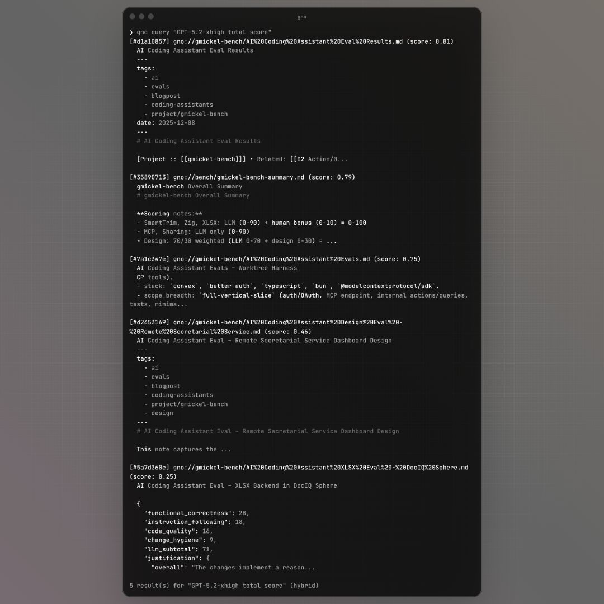

# CLI Reference

GNO command-line interface guide.

> **Full specification**: See [spec/cli.md](../spec/cli.md) for exhaustive command documentation.



## Quick Reference

| Command          | Description                       |
| ---------------- | --------------------------------- |
| `gno init`       | Initialize config and database    |
| `gno index`      | Full index (sync + embed)         |
| `gno update`     | Sync files from disk (no embed)   |
| `gno embed`      | Generate embeddings only          |
| `gno search`     | BM25 full-text search             |
| `gno vsearch`    | Vector similarity search          |
| `gno query`      | Hybrid search (BM25 + vector)     |
| `gno ask`        | Search with AI answer             |
| `gno get`        | Retrieve document content         |
| `gno ls`         | List indexed documents            |
| `gno daemon`     | Headless continuous indexing      |
| `gno links`      | List outgoing links from document |
| `gno backlinks`  | List documents linking to target  |
| `gno similar`    | Find semantically similar docs    |
| `gno graph`      | Export knowledge graph            |
| `gno serve`      | Start web UI server               |
| `gno mcp`        | Start MCP server for AI clients   |
| `gno models`     | Manage models (list, pull, use)   |
| `gno skill`      | Install GNO skill for AI agents   |
| `gno tags`       | Manage document tags              |
| `gno completion` | Shell tab completion              |
| `gno vec`        | Vector index maintenance          |
| `gno doctor`     | Check system health               |

## Global Flags

All commands accept:

```
--index <name>    Use alternate index (default: "default")
--config <path>   Override config file path
--no-color        Disable colored output
--no-pager        Disable automatic paging of long output
--verbose         Enable verbose logging
--yes             Non-interactive mode
--offline         Use cached models only (no auto-download)
--skill           Output SKILL.md for agent discovery and exit
```

**Pager**: Long output is automatically piped through a pager when in terminal mode. Uses `$PAGER` if set, otherwise `less -R` (Unix) or `more` (Windows). Disable with `--no-pager`.

**Offline mode**: Use `--offline` or set `HF_HUB_OFFLINE=1` to prevent auto-downloading models. Set `GNO_NO_AUTO_DOWNLOAD=1` to disable auto-download while still allowing explicit `gno models pull`.

**Force CPU-only for testing**: Set `NODE_LLAMA_CPP_GPU=false` on the `gno`
process to disable Metal/CUDA/Vulkan and force the CPU backend:

```bash
NODE_LLAMA_CPP_GPU=false gno doctor --json
NODE_LLAMA_CPP_GPU=false gno embed --yes
```

Accepted values from `node-llama-cpp`: `false`, `off`, `none`, `disable`,
`disabled`.

> **Note:** the first CPU-only run may build or download a separate CPU backend
> if you only have GPU-backed binaries cached. Use the second run for timing.

**Output format flags** (`--json`, `--files`, `--csv`, `--md`, `--xml`) are per-command.
See [spec/cli.md](../spec/cli.md#output-format-support-matrix) for which commands support which formats.

## Search Commands

### gno search

Full-text search using document-level BM25 with Snowball stemmer.

```bash
gno search "project deadlines"
gno search "error handling" -n 5
gno search "auth" --json
gno search "meeting" --files
```

**Document-level indexing**: Finds documents where terms appear anywhere, even across sections. "authentication JWT" matches docs with those terms in different parts.

**Snowball stemming**: "running" matches "run", "scored" matches "score", plurals match singulars.

**Recency intent sorting**: Queries containing `latest`, `newest`, or `recent` are ordered newest-first using frontmatter date when present, falling back to file modified time.

Options:

- `-n, --limit <n>` - Limit results (default: 5; 20 with --json/--files)
- `--min-score <n>` - Minimum score threshold (0-1)
- `--full` - Show full document content (not just snippet)
- `--line-numbers` - Show line numbers in snippets
- `--lang <code>` - Filter by detected language in code blocks
- `--since <date>` - Modified-at lower bound (ISO date/time or token like `today`, `last week`, `recent`)
- `--until <date>` - Modified-at upper bound (ISO date/time or token)
- `--category <values>` - Require matching category/content type (comma-separated)
- `--author <text>` - Author contains text (case-insensitive)
- `--intent <text>` - Disambiguating context for ambiguous queries; steers snippet selection without searching on this text
- `--exclude <values>` - Exclude docs containing any comma-separated term in title/path/body
- `--tags-all <tags>` - Filter: docs must have ALL tags (comma-separated)
- `--tags-any <tags>` - Filter: docs must have ANY tag (comma-separated)

### gno vsearch

Semantic similarity search using vector embeddings with contextual chunking.

```bash
gno vsearch "how to handle errors gracefully"
gno vsearch "authentication best practices" --json
```

**Contextual embeddings**: Each chunk is embedded with its document title prepended, helping the model distinguish context (e.g., "configuration" in React vs database docs).

Same options as `gno search`, including temporal/category/author and tag filters. Requires embed model.

If `--intent` is provided, vector search uses it only to steer snippet selection toward the intended interpretation. It is not embedded or searched directly.

### gno query

Hybrid search combining BM25 and vector results. This is the recommended search command for most use cases.

```bash
gno query "database optimization"
gno query "API design patterns" --explain
gno query "auth" --fast              # Fastest: ~0.7s
gno query "auth" --thorough          # Full pipeline: ~5-8s
gno query "auth" --tags-all work,backend   # Filter by tags
gno query "performance" --intent "web performance and latency"
gno query "auth flow" --query-mode term:"jwt refresh token" --query-mode intent:"how refresh token rotation works"
gno query $'auth flow\nterm: "refresh token"\nintent: token rotation'
```

**Search modes**:

- **Default** (~2-3s on slim): Preset-aware balanced mode. On `slim` / `slim-tuned`, uses expansion + reranking; on larger presets, keeps reranking on and expansion off by default.
- `--fast` (~0.7s): Skip both expansion and reranking. Use for quick lookups.
- `--thorough` (~5-8s): Expansion + reranking with a wider candidate pool. Best recall.

**Pipeline features**:

- **Strong signal detection**: Skips expensive LLM expansion when BM25 has confident match
- **2× weight for original query**: Prevents dilution by LLM-generated variants
- **Tiered top-rank bonus**: +0.05 for #1, +0.02 for #2-3
- **Chunk-level reranking**: Best chunk per doc (4K max) for 25× faster reranking
- **Lexical top-hit protection**: Preserves original BM25 #1 exact hits against rerank-only demotion

Additional options:

- `--fast` - Skip expansion and reranking (fastest, ~0.7s)
- `--thorough` - Use the widest retrieval/rerank budget (slower, best recall)
- `--no-expand` - Disable query expansion
- `--no-rerank` - Disable cross-encoder reranking
- `--intent <text>` - Disambiguating context for ambiguous queries. Steers expansion, rerank chunk/snippet choice, and disables strong-signal bypass, but is not searched directly.
- `--exclude <values>` - Hard-prune docs containing any comma-separated term in title/path/body
- `-C, --candidate-limit <n>` - Max candidates passed to reranking (default: 20)
- `--query-mode <mode:text>` - Structured expansion hints; repeat for multiple entries. Modes: `term`, `intent`, `hyde`
- `--explain` - Show detailed scoring breakdown (to stderr)
- `--since <date>` - Modified-at lower bound (ISO date/time or token)
- `--until <date>` - Modified-at upper bound (ISO date/time or token)
- `--category <values>` - Require matching category/content type
- `--author <text>` - Author contains text (case-insensitive)
- `--tags-all <tags>` - Filter: docs must have ALL tags
- `--tags-any <tags>` - Filter: docs must have ANY tag

**Migration notes (retrieval v2):**

- Existing calls keep working (`gno query "..."`, `--fast`, `--thorough`, `--no-expand`, `--no-rerank`).
- `--intent` is orthogonal to `--query-mode`: intent steers scoring/prompting, while query modes inject caller-provided retrieval expansions.
- `--query-mode` is opt-in for explicit intent control and replaces generated expansion for that query.
- Use `term` for exact lexical constraints, `intent` for semantic reformulations, and `hyde` for one hypothetical answer passage.
- Multi-line structured query documents are also supported. See [Structured Query Syntax](./SYNTAX.md).

```bash
# Existing call (still valid)
gno query "auth flow" --thorough

# Retrieval v2 structured call
gno query "auth flow" \
  --query-mode term:"jwt refresh token -oauth1" \
  --query-mode intent:"how refresh token rotation works" \
  --query-mode hyde:"Refresh tokens rotate on each use and previous tokens are revoked."

# Multi-line structured query document
gno query $'auth flow\nterm: "refresh token" -oauth1\nintent: how refresh token rotation works\nhyde: Refresh tokens rotate on each use and previous tokens are revoked.'
```

The `--explain` flag outputs:

- BM25 scores per result
- Vector similarity scores
- RRF fusion scores (with variant weights)
- `skipped_strong` indicator if expansion was skipped
- Rerank scores (if enabled)
- Final blended scores
- Per-stage timing breakdown (`lang`, `expansion`, `bm25`, `vector`, `fusion`, `rerank`, `assembly`, `total`)
- Fallback/counter summary (`fallbacks=...`, cache counters for expansion/rerank)

See [How Search Works](HOW-SEARCH-WORKS.md) for details on the scoring pipeline.

### gno ask

Search and optionally generate an AI answer. Combines retrieval with optional LLM-generated response.

```bash
gno ask "what is the project goal"
gno ask "summarize the auth discussion" --answer
gno ask "explain the auth flow" --answer --show-sources
gno ask "quick lookup" --fast            # Fastest retrieval
gno ask "complex topic" --thorough       # Best recall
gno ask "performance" --intent "web latency and vitals"
gno ask "performance" --query-mode term:"web performance budgets" --query-mode intent:"latency and vitals" --no-answer
gno ask $'term: web performance budgets\nintent: latency and vitals' --no-answer
```

**Full-document context**: When `--answer` is used, GNO passes complete document content to the generation model, not truncated snippets. This ensures the LLM sees tables, code examples, and full context needed for accurate answers.

**Adaptive source selection**: `gno ask --answer` picks context sources using relevance + query coverage + facet coverage (instead of fixed top-N). Comparison queries (`vs`, `compare`, `difference`) force at least two competing sources when available.

**Preset requirement**: For documents with markdown tables or structured data, use the `quality` preset (`gno models use quality`). Smaller models cannot reliably parse tabular content. This only applies to standalone `--answer` usage. When AI agents (Claude Code, Codex) call GNO via MCP/skill/CLI, they handle answer generation.

Options:

- `--fast` - Skip expansion and reranking (fastest)
- `--thorough` - Enable query expansion (slower, better recall)
- `--intent <text>` - Disambiguating context for ambiguous questions without searching on that text
- `--exclude <values>` - Hard-prune docs containing any comma-separated term in title/path/body
- `--query-mode <mode:text>` - Structured expansion hints; repeat for multiple entries. Modes: `term`, `intent`, `hyde`
- Multi-line structured query documents are also supported. See [Structured Query Syntax](./SYNTAX.md).
- `-C, --candidate-limit <n>` - Max candidates passed to reranking (default: 20)
- `--answer` - Generate grounded AI answer (requires gen model)
- `--no-answer` - Force retrieval-only output
- `--max-answer-tokens <n>` - Limit answer length
- `--show-sources` - Show all retrieved sources, not just cited ones
- `-n, --limit <n>` - Max source results
- `--since <date>` - Modified-at lower bound (ISO date/time or token)
- `--until <date>` - Modified-at upper bound (ISO date/time or token)
- `--category <values>` - Require matching category/content type
- `--author <text>` - Author contains text (case-insensitive)

JSON output includes `meta.answerContext` with selected/dropped source explain details.
JSON output also includes `meta.queryModes` when structured query modes are supplied.

- `-c, --collection <name>` - Filter by collection
- `--lang <code>` - Language hint (BCP-47)
- `--tags-all <tags>` - Filter: docs must have ALL tags
- `--tags-any <tags>` - Filter: docs must have ANY tag

## Document Commands

### gno get

Retrieve document content by reference. Supports multiple reference formats:

- `#abc123` - Document ID (hash prefix)
- `gno://collection/path/to/file` - Virtual URI
- `collection/path` - Collection + relative path

```bash
gno get abc123def456
gno get "gno://notes/projects/readme.md"
gno get notes/projects/readme.md --json
gno get abc123 --from 50 -l 100  # Lines 50-150
```

Options:

- `--from <line>` - Start output at line number (1-indexed)
- `-l, --limit <lines>` - Limit to N lines
- `--line-numbers` - Prefix lines with numbers
- `--source` - Include source metadata

### gno multi-get

Retrieve multiple documents at once.

```bash
gno multi-get abc123 def456 ghi789
gno multi-get abc123 def456 --max-bytes 10000
```

Options:

- `--max-bytes <n>` - Limit bytes per document (truncates long docs)

### gno ls

List indexed documents. Optional scope argument filters results.

```bash
gno ls                    # All documents
gno ls notes              # Documents in 'notes' collection
gno ls gno://notes/proj   # Documents under path prefix
gno ls --json
gno ls --files
```

Options:

- `[scope]` - Filter by collection name or URI prefix

## Collection Commands

### gno collection add

Add a collection to index.

```bash
gno collection add ~/notes --name notes
gno collection add ~/code --name code --pattern "**/*.ts" --exclude node_modules
```

Options:

- `-n, --name <name>` - Collection identifier (required)
- `--pattern <glob>` - File matching pattern
- `--include <exts>` - Extension allowlist (CSV)
- `--exclude <patterns>` - Exclude patterns (CSV)
- `--update <cmd>` - Shell command to run before indexing

### gno collection list

List configured collections.

```bash
gno collection list
gno collection list --json
```

### gno collection remove

Remove a collection.

```bash
gno collection remove notes
```

### gno collection rename

Rename a collection.

```bash
gno collection rename notes work-notes
```

## Indexing Commands

### gno update

Sync files from disk into the index (BM25/FTS only, no embeddings). Incremental - only processes files changed since last sync.

```bash
gno update
gno update --git-pull       # Pull git repos first
```

Options:

- `--git-pull` - Run `git pull` in git repositories

Use `gno update` when you only need keyword search, or when you want to quickly sync changes and run `gno embed` separately.

### gno index

Full index end-to-end: runs `gno update` then `gno embed`. This is the recommended command for most users.

```bash
gno index                   # Index all collections
gno index notes             # Index specific collection
gno index --no-embed        # Skip embedding (same as gno update)
gno index --git-pull        # Pull git repos first
```

Options:

- `--collection <name>` - Scope to single collection
- `--no-embed` - Skip embedding phase
- `--models-pull` - Download models if missing
- `--git-pull` - Run `git pull` in git repositories

**Incremental**: Both `gno index` and `gno update` are incremental. Files are tracked by SHA-256 hash. Only new or modified files are processed. Unchanged files are skipped instantly.

### gno embed

Generate embeddings for indexed chunks.

On CPU-only machines, GNO uses a small adaptive pool of embedding contexts to
keep more cores busy. If RAM is tight, it automatically falls back to fewer
contexts.

```bash
gno embed
gno embed notes
```

## Context Commands

Contexts add semantic hints to improve search relevance.

### gno context add

```bash
gno context add "/" "Global search context"
gno context add "notes:" "Personal notes and journal entries"
gno context add "gno://notes/projects" "Active project documentation"
```

### gno context list

```bash
gno context list
```

### gno context check

Validate context configuration.

```bash
gno context check
```

### gno context rm

```bash
gno context rm "/"
```

## Model Commands

### gno models list

List available and cached models.

```bash
gno models list
gno models list --json
```

### gno models use

Switch model preset. Changes take effect on next search.

```bash
gno models use slim       # Default, fast, ~1GB disk
gno models use balanced   # Larger model, ~2GB disk
gno models use quality    # Best answers, ~2.5GB disk
```

### gno models pull

Download models.

```bash
gno models pull --all
gno models pull --embed
gno models pull --rerank
gno models pull --expand
gno models pull --gen
gno models pull --force   # Re-download even if cached
```

### Using A Fine-Tuned GGUF

If you have exported a fine-tuned GGUF, point a custom preset at it:

```yaml
models:
  activePreset: slim-tuned
  presets:
    - id: slim-tuned
      name: GNO Slim Tuned
      embed: hf:gpustack/bge-m3-GGUF/bge-m3-Q4_K_M.gguf
      rerank: hf:ggml-org/Qwen3-Reranker-0.6B-Q8_0-GGUF/qwen3-reranker-0.6b-q8_0.gguf
      expand: hf:guiltylemon/gno-expansion-slim-retrieval-v1/gno-expansion-auto-entity-lock-default-mix-lr95-f16.gguf
      gen: hf:unsloth/Qwen3-1.7B-GGUF/Qwen3-1.7B-Q4_K_M.gguf
```

Then use it normally:

```bash
gno models use slim-tuned
gno query "ECONNREFUSED 127.0.0.1:5432" --thorough
```

Recommended workflow:

1. benchmark the exported model first
2. keep the tuned model in a custom preset
3. only replace defaults after repeated measured wins

See [Fine-Tuned Models](FINE-TUNED-MODELS.md) for the full promotion and troubleshooting workflow.

### gno models clear

Remove cached models.

```bash
gno models clear
```

### gno models path

Show model cache directory.

```bash
gno models path
```

## Skill Commands

Install GNO as a skill for AI coding assistants (Claude Code, Codex).

### gno skill install

Install the GNO skill files.

```bash
gno skill install                    # Project scope, Claude target
gno skill install --scope user       # User-wide installation
gno skill install --target codex     # For Codex instead of Claude
gno skill install --target all       # Both Claude and Codex
gno skill install --force            # Overwrite existing
```

Options:

- `--scope <project|user>` - Installation scope (default: project)
- `--target <claude|codex|opencode|openclaw|all>` - Target agent (default: claude)
- `--force` - Overwrite existing installation

Supported targets: Claude Code, Codex, OpenCode, OpenClaw. Use `all` to install to every target.

### gno skill uninstall

Remove installed skill.

```bash
gno skill uninstall
gno skill uninstall --scope user
gno skill uninstall --target all
```

Options:

- `-s, --scope <project|user>` - Scope to uninstall from (default: project)
- `-t, --target <claude|codex|opencode|openclaw|all>` - Target to uninstall from (default: claude)

### gno skill show

Preview skill files without installing.

```bash
gno skill show
gno skill show --file SKILL.md
gno skill show --all
```

Options:

- `--file <name>` - Show specific file only
- `--all` - Show all skill files

### gno skill paths

Show installation paths for all scope/target combinations.

```bash
gno skill paths
gno skill paths --json
```

See [Using GNO with AI Agents](USE-CASES.md#ai-agent-integration) for setup guide.

## Tag Commands

Manage document tags. Tags are extracted from markdown frontmatter during sync.

**Tag format**: lowercase alphanumeric, hyphens, dots, slashes for hierarchy (e.g., `project/web`, `status.active`).

### gno tags

List all tags with document counts.

```bash
gno tags                    # All tags
gno tags --collection notes # Tags in collection
gno tags --json
```

### gno tags add

Add tag(s) to a document.

```bash
gno tags add abc123 work
gno tags add abc123 project/alpha urgent
```

### gno tags rm

Remove tag(s) from a document.

```bash
gno tags rm abc123 obsolete
gno tags rm abc123 draft wip
```

Tag changes update the document's YAML frontmatter on disk.

## Link Commands

Navigate document relationships via wiki links and markdown links.

### gno links

List outgoing links from a document.

```bash
gno links gno://notes/source.md        # List all links
gno links #abc123 --type wiki          # Wiki links only
gno links source.md --json
```

Options:

- `--type <wiki|markdown>` - Filter by link type
- `--json`, `--md` - Output format

Shows link type, target, display text, line/column, and whether the target resolves to an indexed document.

### gno backlinks

List documents that link TO a target document.

```bash
gno backlinks gno://notes/target.md
gno backlinks #abc123 --collection notes
gno backlinks target.md --json
```

Options:

- `-c, --collection <name>` - Filter by source collection
- `--json`, `--md` - Output format

### gno similar

Find semantically similar documents using vector embeddings.

```bash
gno similar gno://notes/note.md
gno similar #abc123 --limit 10 --threshold 0.5
gno similar doc.md --cross-collection --json
```

Options:

- `-n, --limit <num>` - Max results (default: 5)
- `--threshold <num>` - Minimum similarity (default: 0.7)
- `--cross-collection` - Search across all collections
- `--json`, `--md` - Output format

**Requirements**: Embeddings must be generated with `gno embed` or `gno index`.
**Similarity basis**: Uses the doc's `seq=0` embedding (falls back to first chunk).

### gno graph

Export knowledge graph of document links (wiki links, markdown links, similarity edges).

```bash
gno graph                           # JSON output (default)
gno graph --dot                     # Graphviz DOT format
gno graph --mermaid                 # Mermaid diagram format
gno graph -c notes                  # Single collection
gno graph --include-similar         # Add similarity edges
```

Options:

- `-c, --collection <name>` - Filter to single collection
- `--limit <n>` - Max nodes (default: 2000)
- `--edge-limit <n>` - Max edges (default: 10000)
- `--include-similar` - Include similarity edges
- `--threshold <num>` - Similarity threshold (default: 0.7)
- `--include-isolated` - Include nodes with no links
- `--similar-top-k <n>` - Similar docs per node (default: 5)
- `--json` - JSON output (default)
- `--dot` - Graphviz DOT format
- `--mermaid` - Mermaid diagram format

**Pipeline to Graphviz**:

```bash
gno graph --dot | dot -Tsvg > graph.svg
```

**Pipeline to Mermaid Live**:

```bash
gno graph --mermaid | pbcopy
# Paste into https://mermaid.live
```

Similarity edges use `seq=0` embeddings only.

## Admin Commands

### gno status

Show index status.

```bash
gno status
gno status --json
```

### gno doctor

Check system health.

```bash
gno doctor
gno doctor --json
```

Checks include:

- config + database presence
- SQLite FTS5 availability
- vendored `fts5-snowball` extension loading
- `sqlite-vec` extension loading
- local model cache readiness

### gno cleanup

Remove orphaned content.

```bash
gno cleanup
```

### gno reset

Reset to fresh state.

```bash
gno reset --confirm
```

### gno vec

Vector index maintenance. Use when vector search returns empty despite embeddings existing.

```bash
gno vec sync      # Sync vec0 index with content_vectors
gno vec rebuild   # Full rebuild of vec0 index
```

- `sync` - Fast incremental sync, fixes drift after failed inserts
- `rebuild` - Full rebuild, use when sync isn't enough
- `--json` - JSON output format

**When to use**: If `gno similar` returns empty results but embeddings exist, run `gno vec sync`.

## Output Formats

| Format   | Flag      | Use Case            |
| -------- | --------- | ------------------- |
| Terminal | (default) | Human reading       |
| JSON     | `--json`  | Scripting, parsing  |
| Files    | `--files` | Pipe to other tools |
| CSV      | `--csv`   | Spreadsheet import  |
| Markdown | `--md`    | Documentation       |
| XML      | `--xml`   | XML tooling         |

Example:

```bash
# Get file URIs for piping
gno search "important" --files | xargs gno get

# Parse JSON in scripts
gno search "test" --json | jq '.results[].uri'
```

## Exit Codes

| Code | Meaning                       |
| ---- | ----------------------------- |
| 0    | Success                       |
| 1    | Validation error (bad input)  |
| 2    | Runtime error (IO, DB, model) |

## Long-Running Processes

### gno daemon

Start a headless long-running watcher process for continuous indexing.

```bash
gno daemon
gno daemon --no-sync-on-start
```

Options:

- `--no-sync-on-start` - Skip the initial sync pass and only watch future file changes

**Behavior:**

- Opens the selected index DB and loads config
- Starts the same watcher + embed scheduler used by `gno serve`
- Runs an initial sync by default, then embeds backlog immediately
- Stays in the foreground until `SIGINT` / `SIGTERM`
- Does **not** start the web server or open any port

**Use it when:**

- you want continuous indexing without a browser or desktop shell
- you are supervising GNO with `nohup`, launchd, or systemd
- you want CLI / MCP queries to hit a fresh local index

**Notes:**

- Avoid running `gno daemon` and `gno serve` against the same index at the same time until explicit cross-process coordination exists.
- For normie/local UI usage, prefer the desktop app or `gno serve`.

**Examples:**

```bash
# Run in foreground
gno daemon

# Service-friendly shell backgrounding
nohup gno daemon > /tmp/gno-daemon.log 2>&1 &

# Watch only future changes
gno daemon --no-sync-on-start
```

### gno serve

Start a local web server for visual search and document browsing.

```bash
gno serve
gno serve --port 8080
```

Options:

- `-p, --port <num>` - Port to listen on (default: 3000)

**Features:**

- **Dashboard** (`/`) - Index stats, collection overview, health status
- **First run** (`/`) - Guided folder setup, preset chooser, and health center
- **Search** (`/search`) - Full-text BM25 search with highlighted snippets
- **Browse** (`/browse`) - Collection and document list with filtering
- **Document View** (`/doc`) - Rendered document content with syntax highlighting

**API Endpoints:**

- `GET /api/health` - Health check
- `GET /api/status` - Index status plus onboarding and health-center state
- `GET /api/collections` - List collections
- `GET /api/docs` - List documents (paginated: `?limit=20&offset=0&collection=name`)
- `GET /api/doc` - Get document content (`?uri=gno://collection/path`)
- `POST /api/search` - Search (`{"query": "...", "limit": 10}`)

**Security:**

- Binds to `127.0.0.1` only (no LAN exposure)
- Content Security Policy headers
- CSRF protection for mutations
- DNS rebinding protection

**Example:**

```bash
# Start server
gno serve --port 3001

# Open in browser
open http://localhost:3001
```

> Want live indexing without the browser? Use `gno daemon`.

## Shell Completion

Enable tab completion for gno commands.

### Install Automatically

```bash
gno completion install
```

Auto-detects your shell and installs to the appropriate config file.

### Manual Installation

```bash
# Bash (add to ~/.bashrc)
gno completion bash >> ~/.bashrc

# Zsh (add to ~/.zshrc)
gno completion zsh >> ~/.zshrc

# Fish
gno completion fish > ~/.config/fish/completions/gno.fish
```

Restart your shell or source the config file to activate.

### Completion Features

- Commands and subcommands
- All flags and options
- Collection names (dynamic, when DB available)

## MCP Server

Start MCP server for AI assistant integration.

```bash
gno mcp
```

See [MCP Integration](MCP.md) for setup details.
