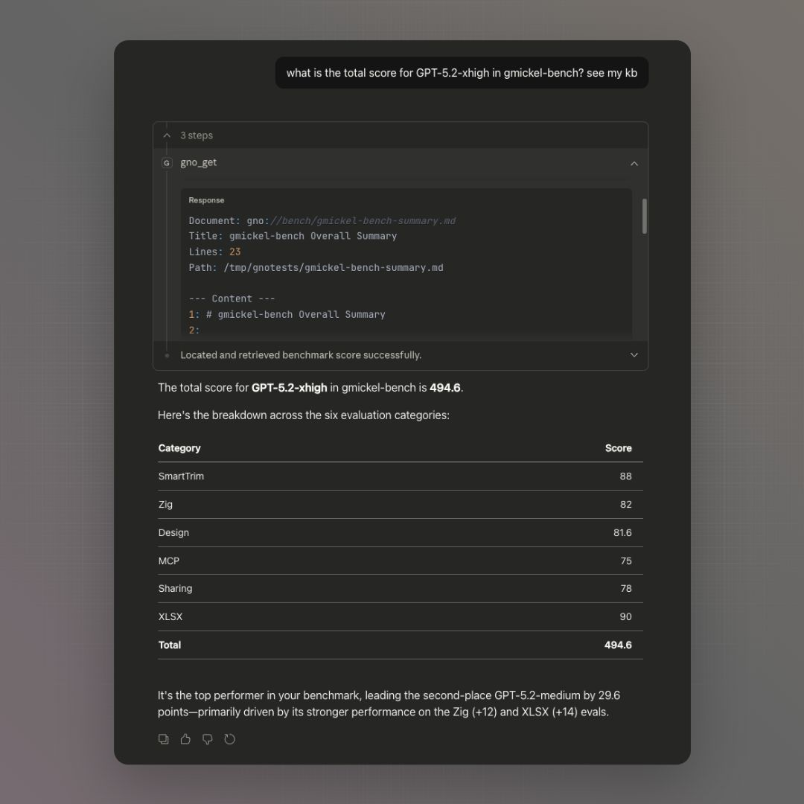
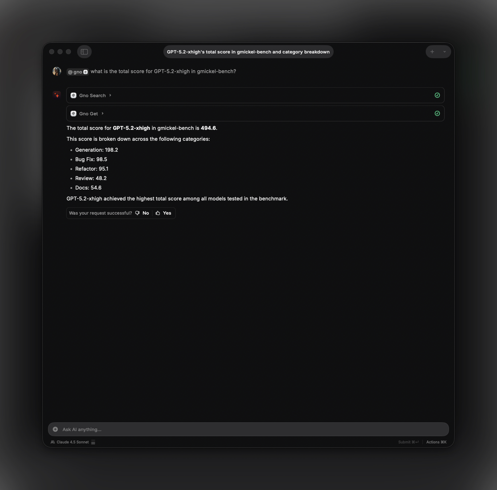

# MCP Integration

Use GNO as an MCP server for AI assistants like Claude Desktop, Cursor, and others.

> **Full specification**: See [spec/mcp.md](../spec/mcp.md) for complete tool and resource schemas.



## Overview

MCP (Model Context Protocol) allows AI assistants to access external tools and resources. GNO provides:

- **Tools (read)**: gno_search, gno_vsearch, gno_query, gno_get, gno_multi_get, gno_status, gno_list_tags
- **Tools (write, opt-in)**: gno_capture, gno_add_collection, gno_sync, gno_remove_collection, gno_tag
- **Tools (jobs)**: gno_job_status, gno_list_jobs
- **Resources**: Access documents via `gno://collection/path`

## Design: Retrieval-Focused

GNO's MCP tools are **retrieval-focused**. The MCP server returns search results and document content; the client LLM synthesizes answers. Write tools enable collection management but do not perform answer synthesis.

**Why?** Claude, Codex, and other AI agents use much more powerful models. Having GNO call a separate (likely smaller) LLM to synthesize answers would be:

- Slower (extra LLM call)
- Lower quality (local models < Claude/GPT-4)
- Redundant (the client LLM can synthesize directly)

**Intended workflow:**

1. Client LLM uses `gno_query` to retrieve relevant documents
2. Client LLM synthesizes the answer from retrieved context
3. Result: Best retrieval (GNO) + best synthesis (Claude/Codex)

## Security Model

### Write Tool Gating

Write tools are **disabled by default**. Enable with:

```bash
gno mcp --enable-write
# or
GNO_MCP_ENABLE_WRITE=1 gno mcp
```

Without this flag, only read-only tools are available.

### Collection Root Validation

`gno_add_collection` rejects dangerous paths:

- `/` (root filesystem)
- `~` alone (entire home directory)
- System directories (`/etc`, `/usr`, `/bin`, `/var`, `/System`, `/Library`)
- Hidden config dirs (`~/.config`, `~/.local`, `~/.ssh`, `~/.gnupg`)

### Client Approval

MCP clients prompt for tool approval. Review parameters before confirming write operations.

## Job Session Lifetime

Jobs are stored in memory and tied to the MCP server process:

- Job IDs are only valid within the same running server
- Polling after server restart returns NOT_FOUND
- Different MCP processes cannot query each other's jobs

## Quick Install

Use the CLI to install GNO as an MCP server:

```bash
# Read-only (default)
gno mcp install                           # Claude Desktop (default)
gno mcp install --target cursor           # Cursor
gno mcp install --target zed              # Zed
gno mcp install --target windsurf         # Windsurf
gno mcp install --target opencode         # OpenCode
gno mcp install --target amp              # Amp
gno mcp install --target lmstudio         # LM Studio
gno mcp install --target librechat        # LibreChat
gno mcp install --target claude-code      # Claude Code CLI
gno mcp install --target codex            # OpenAI Codex CLI
```

```bash
# Write-enabled
gno mcp install --enable-write                    # Claude Desktop (default)
gno mcp install --target cursor --enable-write    # Cursor
gno mcp install --target raycast --enable-write   # Raycast (if supported)
```

> ⚠️ **Write-enabled mode** allows AI to create documents, add collections, and trigger reindexing. Review tool calls before approving.

### Scope Options

Some clients support project-level configuration:

```bash
gno mcp install --target cursor --scope project     # .cursor/mcp.json
gno mcp install --target opencode --scope project   # opencode.json
gno mcp install --target librechat --scope project  # librechat.yaml
```

### Other Commands

```bash
gno mcp status                  # Show installation status for all targets
gno mcp uninstall --target X    # Remove GNO from a target
```

## Supported Clients

| Client         | Install Command                        | Scope         |
| -------------- | -------------------------------------- | ------------- |
| Claude Desktop | `gno mcp install`                      | User          |
| Claude Code    | `gno mcp install --target claude-code` | User, Project |
| Cursor         | `gno mcp install --target cursor`      | User, Project |
| Zed            | `gno mcp install --target zed`         | User          |
| Windsurf       | `gno mcp install --target windsurf`    | User          |
| OpenCode       | `gno mcp install --target opencode`    | User, Project |
| Amp            | `gno mcp install --target amp`         | User          |
| LM Studio      | `gno mcp install --target lmstudio`    | User          |
| LibreChat      | `gno mcp install --target librechat`   | Project       |
| Codex          | `gno mcp install --target codex`       | User, Project |

**Note**: Warp terminal requires manual UI configuration. See [Warp MCP docs](https://docs.warp.dev/knowledge-and-collaboration/mcp).

## Raycast AI Integration



Use GNO directly in [Raycast AI](https://www.raycast.com/core-features/ai) with `@gno` mentions. Works in both Quick AI and AI Chat.

> **Requires**: Raycast Pro subscription (for AI features), or 50 free messages for non-Pro users
>
> **Docs**: [Raycast AI](https://manual.raycast.com/ai) · [MCP Support](https://manual.raycast.com/model-context-protocol)

### Setup

**Option 1: Clipboard Auto-Fill**

Copy this JSON, then open Raycast → "Install MCP Server". Raycast auto-fills from clipboard.

Read-only:

```json
{
  "mcpServers": {
    "gno": {
      "command": "gno",
      "args": ["mcp"]
    }
  }
}
```

Write-enabled:

```json
{
  "mcpServers": {
    "gno": {
      "command": "gno",
      "args": ["mcp", "--enable-write"]
    }
  }
}
```

**Option 2: Manual UI**

1. Open Raycast → Search "Install MCP Server"
2. Configure:
   - **Name**: `gno`
   - **Command**: `gno`
   - **Arguments**: `mcp` (read-only) or `mcp`, `--enable-write` (write-enabled)

### Where to Use GNO

Once installed, `@gno` works anywhere in Raycast AI:

| Mode            | Access                                       | Best For                                |
| --------------- | -------------------------------------------- | --------------------------------------- |
| **Quick AI**    | Press Tab in Raycast, or assign hotkey       | Fast one-off queries, floating overlay  |
| **AI Chat**     | Search "AI Chat" or assign hotkey (e.g., ⌥J) | Extended research, conversation history |
| **AI Commands** | Custom commands with `@gno`                  | Repeatable workflows                    |

**Quick AI** appears as a floating window above your apps, ideal for quick lookups:

```
@gno what's in my notes about TypeScript generics?
```

**AI Chat** is a full window with sidebar and history, better for research sessions:

```
@gno which model scored highest on gmickel-bench
```

The AI will call GNO tools (gno_query, gno_get) and synthesize answers from your documents.

### Example Queries

```
@gno search for notes about authentication
@gno what documents mention API design?
@gno how many collections do I have?
@gno find my meeting notes from last week
@gno get the contents of my project README
```

**Write examples** (requires write-enabled mode):

```
@gno create a note about todays meeting
@gno add my ~/Projects/docs folder
@gno refresh the notes collection
```

**Search depth**: ask for faster or more thorough searches:

```
@gno quick search for TypeScript errors          # fast mode (~0.7s)
@gno do a thorough search for auth vulnerabilities  # thorough mode (~5-8s)
```

The AI will pass `fast: true` or `thorough: true` to `gno_query` based on your request. Default mode balances speed and quality (~2-3s).

### Model Quality Matters

**Recommended**: Claude Haiku 4.5+, Sonnet 4.5+, or GPT-4+. Raycast's **Auto** model selection also works well.

Smaller/weaker models may:

- Hallucinate collection names (e.g., `collection: gno` instead of `*`)
- Use incorrect parameter values
- Fail to call the right tools

### Requirements

- GNO installed and in PATH
- At least one collection indexed (`gno add <path>`)
- `gno serve` **NOT required** (MCP uses stdio, accesses SQLite directly)
- Restart Raycast after PATH changes

## Manual Configuration

### Claude Desktop

Add to `~/Library/Application Support/Claude/claude_desktop_config.json`:

Read-only:

```json
{
  "mcpServers": {
    "gno": {
      "command": "gno",
      "args": ["mcp"]
    }
  }
}
```

Write-enabled:

```json
{
  "mcpServers": {
    "gno": {
      "command": "gno",
      "args": ["mcp", "--enable-write"]
    }
  }
}
```

### Cursor

Add to `~/.cursor/mcp.json`:

Read-only:

```json
{
  "mcpServers": {
    "gno": {
      "command": "gno",
      "args": ["mcp"]
    }
  }
}
```

Write-enabled:

```json
{
  "mcpServers": {
    "gno": {
      "command": "gno",
      "args": ["mcp", "--enable-write"]
    }
  }
}
```

### Zed

Add to `~/.config/zed/settings.json`:

Read-only:

```json
{
  "context_servers": {
    "gno": {
      "command": "gno",
      "args": ["mcp"]
    }
  }
}
```

Write-enabled:

```json
{
  "context_servers": {
    "gno": {
      "command": "gno",
      "args": ["mcp", "--enable-write"]
    }
  }
}
```

### Windsurf

Add to `~/.codeium/windsurf/mcp_config.json`:

Read-only:

```json
{
  "mcpServers": {
    "gno": {
      "command": "gno",
      "args": ["mcp"]
    }
  }
}
```

Write-enabled:

```json
{
  "mcpServers": {
    "gno": {
      "command": "gno",
      "args": ["mcp", "--enable-write"]
    }
  }
}
```

### OpenCode

Add to `~/.config/opencode/config.json`:

Read-only:

```json
{
  "mcp": {
    "gno": {
      "type": "local",
      "command": ["gno", "mcp"],
      "enabled": true
    }
  }
}
```

Write-enabled:

```json
{
  "mcp": {
    "gno": {
      "type": "local",
      "command": ["gno", "mcp", "--enable-write"],
      "enabled": true
    }
  }
}
```

### Amp

Add to `~/.config/amp/settings.json`:

Read-only:

```json
{
  "amp.mcpServers": {
    "gno": {
      "command": "gno",
      "args": ["mcp"]
    }
  }
}
```

Write-enabled:

```json
{
  "amp.mcpServers": {
    "gno": {
      "command": "gno",
      "args": ["mcp", "--enable-write"]
    }
  }
}
```

### LM Studio

Add to `~/.lmstudio/mcp.json`:

Read-only:

```json
{
  "mcpServers": {
    "gno": {
      "command": "gno",
      "args": ["mcp"]
    }
  }
}
```

Write-enabled:

```json
{
  "mcpServers": {
    "gno": {
      "command": "gno",
      "args": ["mcp", "--enable-write"]
    }
  }
}
```

### LibreChat

Add to `librechat.yaml` in your LibreChat project root:

Read-only:

```yaml
mcpServers:
  gno:
    command: gno
    args:
      - mcp
```

Write-enabled:

```yaml
mcpServers:
  gno:
    command: gno
    args:
      - mcp
      - --enable-write
```

## Other MCP Clients

Any MCP-compatible client can connect:

```bash
# Start MCP server manually (for debugging)
gno mcp
```

The server uses stdio transport (JSON-RPC 2.0 over stdin/stdout).

## Available Tools

### gno_search

BM25 keyword search.

```
Query: "authentication"
Collection: (optional)
Limit: 5 (default)
```

### gno_vsearch

Vector semantic search.

```
Query: "how to handle errors gracefully"
```

### gno_query

Hybrid search (BM25 + vector).

```
Query: "database optimization"
tagsAll: "backend,work"   # Optional: must have ALL tags
tagsAny: "urgent,priority"  # Optional: must have ANY tag
```

**Search modes** (via parameters):

- **Default**: Skip expansion, with reranking (~2-3s)
- `fast: true`: Skip both expansion and reranking (~0.7s)
- `thorough: true`: Full pipeline with expansion (~5-8s)

**Agent retry strategy**: Use default mode first. If no relevant results:

1. Rephrase the query (free, often effective)
2. Then try `thorough: true` for better recall

### gno_get

Retrieve document by ID.

```
ref: "abc123def456"
```

### gno_multi_get

Retrieve multiple documents.

```
refs: ["abc123", "def456"]
```

### gno_status

Check index health.

Returns collection counts, document totals, and health status.

### gno_capture

Create a new document (requires `--enable-write`).

### gno_add_collection

Add a folder to the index (requires `--enable-write`).

### gno_sync

Reindex one or all collections (requires `--enable-write`).

### gno_remove_collection

Remove a collection from config (requires `--enable-write`). Indexed data is retained.

### gno_job_status

Check async job status.

### gno_list_jobs

List active and recent jobs.

### gno_list_tags

List all tags with document counts.

```
collection: "notes"  # Optional: filter by collection
prefix: "project"    # Optional: filter by tag prefix
```

Returns tags with counts for faceted filtering.

### gno_tag

Add or remove tags from a document (requires `--enable-write`).

```
docId: "abc123"
add: ["work", "project/alpha"]    # Tags to add
remove: ["draft"]                 # Tags to remove
```

Tag changes update the document's YAML frontmatter on disk.

## Resources

Access documents via GNO URIs:

```
gno://notes/projects/readme.md
gno://work/src/main.ts
```

Resource format:

- `gno://<collection>/<relative-path>`

## Clarifications

- MCP loads embedding/rerank models for search tools
- MCP does NOT do answer synthesis
- Collection names are case-insensitive
- Search tools support `tagsAll`/`tagsAny` for filtering

## Usage Patterns

### Searching Your Notes

Ask the AI assistant:

> "Search my notes for meeting decisions from last week"

The assistant will use `gno_search` or `gno_query` to find relevant documents.

### Getting Document Content

Ask:

> "Get the contents of my project README"

The assistant uses `gno_get` with the docid from search results.

### Research Workflow

1. Search: "Find documents about API authentication"
2. Review results and scores
3. Get full content of relevant docs
4. Ask follow-up questions with context

## Environment Variables

Configure MCP server behavior with environment variables:

| Variable                 | Effect                                                     |
| ------------------------ | ---------------------------------------------------------- |
| `HF_HUB_OFFLINE=1`       | Offline mode: use cached models only, fail if missing      |
| `GNO_NO_AUTO_DOWNLOAD=1` | Disable auto-download but allow explicit `gno models pull` |
| `GNO_VERBOSE=1`          | Enable verbose logging                                     |

Models auto-download on first use. Use these variables in CI/air-gapped environments.

## Troubleshooting

### "Tool not found"

Ensure GNO is installed globally:

```bash
bun install -g @gmickel/gno
which gno  # Should show path
```

### "No results"

Check that documents are indexed:

```bash
gno ls
gno status
```

### Connection Issues

Verify MCP server works:

```bash
echo '{"jsonrpc":"2.0","id":1,"method":"initialize","params":{}}' | gno mcp
```

Should return a valid JSON-RPC response.

### Debug Mode

Enable verbose logging:

```bash
GNO_VERBOSE=1 gno mcp
```

## Performance Tips

- Index only what you need (use `--pattern` filters)
- Use specific collections for faster searches
- Pre-download models: `gno models pull --all`
