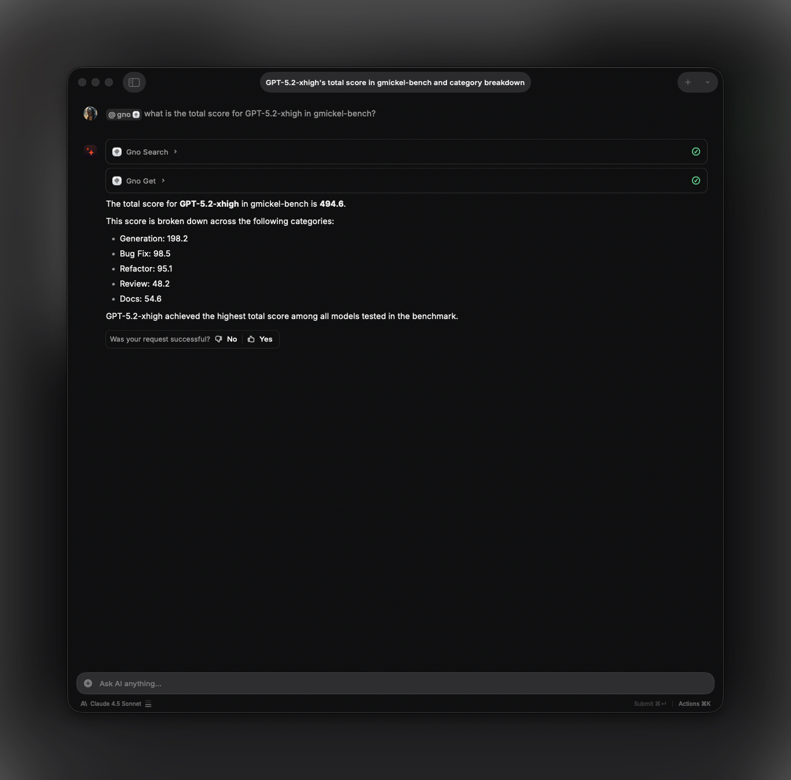

# MCP Integration

Use GNO as a local MCP server for Claude Desktop, Cursor, Zed, Windsurf, Amp, Raycast, and other AI clients that need grounded access to your own documents.

> **Full specification**: See [spec/mcp.md](../spec/mcp.md) for complete tool and resource schemas.


## Overview

MCP (Model Context Protocol) allows AI assistants to access external tools and resources. GNO provides:

- **Tools (read)**: gno_search, gno_vsearch, gno_query, gno_query_diagnose, gno_get, gno_multi_get, gno_status, gno_list_tags, gno_links, gno_backlinks, gno_similar, gno_graph, gno_graph_query, gno_graph_neighbors, gno_graph_path
- **Tools (write, opt-in)**: gno_capture, gno_add_collection, gno_sync, gno_embed, gno_index, gno_remove_collection
- **Tools (jobs)**: gno_job_status, gno_list_jobs
- **Resources**: Access documents via `gno://collection/path`

## Design: Retrieval-Focused

GNO's MCP tools are **retrieval-focused**. The MCP server returns search results and document content; the client LLM synthesizes answers. Write tools enable collection management but do not perform answer synthesis.

**Why?** Claude, Codex, and other AI agents use much more powerful models. Having GNO call a separate (likely smaller) LLM to synthesize answers would be:

- Slower (extra LLM call)
- Lower quality (local models < Claude/GPT-4)
- Redundant (the client LLM can synthesize directly)

**Intended workflow:**

1. Client LLM uses `gno_query` to retrieve relevant documents
2. Client LLM synthesizes the answer from retrieved context
3. Result: Best retrieval (GNO) + best synthesis (Claude/Codex)

## Agent Retrieval Playbook

For most questions, start with `gno_query`. It combines BM25, vector search, and reranking, then returns `uri`, `docid`, snippets, and line anchors for follow-up retrieval.

Use the narrower tools when the request is explicit:

| Tool                 | Use When                                                                      | Follow-up                                         |
| -------------------- | ----------------------------------------------------------------------------- | ------------------------------------------------- |
| `gno_search`         | Exact phrases, filenames, identifiers, error messages, known symbols          | `gno_get` around result `line`                    |
| `gno_vsearch`        | Conceptual similarity where exact wording may differ                          | `gno_get` or `gno_multi_get` top results          |
| `gno_query`          | Default choice; mixed lexical + semantic + reranked retrieval                 | `gno_multi_get` for top URIs                      |
| `gno_query_diagnose` | Important target doc is missing or you need stage-by-stage retrieval evidence | Adjust filters/query mode, then retry `gno_query` |
| `gno_get`            | One known `gno://` URI, `#docid`, or `collection/path`                        | Use `fromLine` + `lineCount` first                |
| `gno_multi_get`      | Batch several top result refs or glob-matched docs                            | Keep `maxBytes` bounded                           |
| `gno_status`         | Results look stale, vector search fails, or embeddings may be missing         | Run write-enabled `gno_index` or `gno_embed`      |

For ambiguous terms, pass `intent` instead of stuffing extra words into `query`:

```json
{
  "query": "python",
  "intent": "programming language, not the animal"
}
```

For structured retrieval, use `queryModes` to combine typed strategies:

```json
{
  "query": "API rate limiting",
  "queryModes": [
    { "mode": "term", "text": "token bucket" },
    { "mode": "intent", "text": "HTTP middleware throttling" },
    {
      "mode": "hyde",
      "text": "A design note describing request throttling with per-client refill windows."
    }
  ]
}
```

When a search result includes `line`, fetch a bounded range first:

```json
{
  "ref": "gno://work/service.ts",
  "fromLine": 120,
  "lineCount": 40
}
```

Use `gno_multi_get` after search/query when several top documents are needed. Pass the result `uri` or `docid` values as `refs`, and cap `maxBytes` to avoid flooding the client context.

Structured `gno_search`, `gno_vsearch`, and `gno_query` results may also contain
`context`. This is user-configured guidance resolved for that exact `uri` and
`docid`, ordered global → collection → broad-to-specific path prefix. Apply it
when interpreting the result, but cite the retrieved source content—not the
guidance—as evidence. Results without matching configuration omit the field.

## Security Model

### Write Tool Gating

Write tools are **disabled by default**. Enable with:

```bash
gno mcp --enable-write
# or
GNO_MCP_ENABLE_WRITE=1 gno mcp
```

Without this flag, only read-only tools are available.

### Collection Root Validation

`gno_add_collection` rejects dangerous paths:

- `/` (root filesystem)
- `~` alone (entire home directory)
- System directories (`/etc`, `/usr`, `/bin`, `/var`, `/System`, `/Library`)
- Hidden config dirs (`~/.config`, `~/.local`, `~/.ssh`, `~/.gnupg`)

### Client Approval

MCP clients prompt for tool approval. Review parameters before confirming write operations.

## Job Session Lifetime

Jobs are stored in memory and tied to the MCP server process:

- Job IDs are only valid within the same running server
- Polling after server restart returns NOT_FOUND
- Different MCP processes cannot query each other's jobs

## Quick Install

Use the CLI to install GNO as an MCP server:

```bash
# Read-only (default)
gno mcp install                           # Claude Desktop (default)
gno mcp install --target cursor           # Cursor
gno mcp install --target zed              # Zed
gno mcp install --target windsurf         # Windsurf
gno mcp install --target opencode         # OpenCode
gno mcp install --target amp              # Amp
gno mcp install --target lmstudio         # LM Studio
gno mcp install --target librechat --scope project # LibreChat
gno mcp install --target claude-code      # Claude Code CLI
gno mcp install --target codex            # OpenAI Codex CLI
```

Every install pins the workspace that was active when the command ran. The
generated entry uses the absolute Bun executable, `run`, the current installed
package's absolute `src/index.ts`, then `--index <active>` and
`--config <absolute>` before `mcp`. It also stores absolute `GNO_DATA_DIR` and
`GNO_CACHE_DIR` values (`env`, or OpenCode's `environment`). This keeps desktop
clients on the same index, config, database, and model cache even when they do
not inherit your shell environment. Codex uses its native
`~/.codex/config.toml` or project `.codex/config.toml` tables. Run
`gno mcp install --dry-run --json` to inspect the exact command, arguments, and
workspace values before writing them. If the target already has GNO configured,
add `--force` to preview the replacement without writing it.

JSON client configs are edited as JSONC, preserving comments, trailing commas,
and unrelated layout. For OpenCode and Amp, GNO reuses an existing supported
`.jsonc` alternate instead of creating a duplicate `.json` config.

```bash
# Write-enabled
gno mcp install --enable-write                    # Claude Desktop (default)
gno mcp install --target cursor --enable-write    # Cursor
```

> ⚠️ **Write-enabled mode** allows AI to create documents, add collections, and trigger reindexing. Review tool calls before approving.

### Scope Options

Some clients support project-level configuration:

```bash
gno mcp install --target cursor --scope project     # .cursor/mcp.json
gno mcp install --target codex --scope project      # .codex/config.toml
gno mcp install --target opencode --scope project   # opencode.json
gno mcp install --target librechat --scope project  # librechat.yaml
```

### Other Commands

```bash
gno mcp status                  # Show installation status for all targets
gno mcp uninstall --target X    # Remove GNO from a target
```

## Supported Clients

| Client         | Install Command                                      | Scope         |
| -------------- | ---------------------------------------------------- | ------------- |
| Claude Desktop | `gno mcp install`                                    | User          |
| Claude Code    | `gno mcp install --target claude-code`               | User, Project |
| Cursor         | `gno mcp install --target cursor`                    | User, Project |
| Zed            | `gno mcp install --target zed`                       | User          |
| Windsurf       | `gno mcp install --target windsurf`                  | User          |
| OpenCode       | `gno mcp install --target opencode`                  | User, Project |
| Amp            | `gno mcp install --target amp`                       | User          |
| LM Studio      | `gno mcp install --target lmstudio`                  | User          |
| LibreChat      | `gno mcp install --target librechat --scope project` | Project       |
| Codex          | `gno mcp install --target codex`                     | User, Project |

**Note**: Warp terminal requires manual UI configuration. See [Warp MCP docs](https://docs.warp.dev/knowledge-and-collaboration/mcp).

## Raycast AI Integration



Use GNO directly in [Raycast AI](https://www.raycast.com/core-features/ai) with `@gno` mentions. Works in both Quick AI and AI Chat.

> **Requires**: Raycast Pro subscription (for AI features), or 50 free messages for non-Pro users
>
> **Docs**: [Raycast AI](https://manual.raycast.com/ai) · [MCP Support](https://manual.raycast.com/model-context-protocol)

### Setup

**Option 1: Clipboard Auto-Fill**

Run `gno mcp install --dry-run --json`, substitute its absolute values into this
JSON, then open Raycast → "Install MCP Server". Raycast auto-fills from the
clipboard. Raycast is a manual target; `--target raycast` is not supported.

Read-only:

```json
{
  "mcpServers": {
    "gno": {
      "command": "/absolute/path/to/bun",
      "args": [
        "run",
        "/absolute/path/to/@gmickel/gno/src/index.ts",
        "--index",
        "default",
        "--config",
        "/absolute/path/to/index.yml",
        "mcp"
      ],
      "env": {
        "GNO_DATA_DIR": "/absolute/path/to/data",
        "GNO_CACHE_DIR": "/absolute/path/to/cache"
      }
    }
  }
}
```

Write-enabled:

```json
{
  "mcpServers": {
    "gno": {
      "command": "/absolute/path/to/bun",
      "args": [
        "run",
        "/absolute/path/to/@gmickel/gno/src/index.ts",
        "--index",
        "default",
        "--config",
        "/absolute/path/to/index.yml",
        "mcp",
        "--enable-write"
      ],
      "env": {
        "GNO_DATA_DIR": "/absolute/path/to/data",
        "GNO_CACHE_DIR": "/absolute/path/to/cache"
      }
    }
  }
}
```

**Option 2: Manual UI**

1. Open Raycast → Search "Install MCP Server"
2. Configure:
   - **Name**: `gno`
   - **Command**: the absolute Bun executable from the dry-run JSON
   - **Arguments**: copy the full generated argument array; append `--enable-write` only for write-enabled mode

### Where to Use GNO

Once installed, `@gno` works anywhere in Raycast AI:

| Mode            | Access                                       | Best For                                |
| --------------- | -------------------------------------------- | --------------------------------------- |
| **Quick AI**    | Press Tab in Raycast, or assign hotkey       | Fast one-off queries, floating overlay  |
| **AI Chat**     | Search "AI Chat" or assign hotkey (e.g., ⌥J) | Extended research, conversation history |
| **AI Commands** | Custom commands with `@gno`                  | Repeatable workflows                    |

**Quick AI** appears as a floating window above your apps, ideal for quick lookups:

```
@gno what's in my notes about TypeScript generics?
```

**AI Chat** is a full window with sidebar and history, better for research sessions:

```
@gno which model scored highest on gmickel-bench
```

The AI will call GNO tools (gno_query, gno_get) and synthesize answers from your documents.

### Example Queries

```
@gno search for notes about authentication
@gno what documents mention API design?
@gno how many collections do I have?
@gno find my meeting notes from last week
@gno get the contents of my project README
```

**Write examples** (requires write-enabled mode):

```
@gno create a note about todays meeting
@gno add my ~/Projects/docs folder
@gno refresh the notes collection
```

**Search depth**: ask for faster or more thorough searches:

```
@gno quick search for TypeScript errors          # fast mode (~0.7s)
@gno do a thorough search for auth vulnerabilities  # thorough mode (~5-8s)
```

The AI will pass `fast: true` or `thorough: true` to `gno_query` based on your request. Default mode balances speed and quality (~2-3s).

### Model Quality Matters

**Recommended**: Claude Haiku 4.5+, Sonnet 4.5+, or GPT-4+. Raycast's **Auto** model selection also works well.

Smaller/weaker models may:

- Hallucinate collection names (e.g., `collection: gno` instead of `*`)
- Use incorrect parameter values
- Fail to call the right tools

### Requirements

- GNO installed and in PATH
- At least one collection indexed (`gno add <path>`)
- `gno serve` **NOT required** (MCP uses stdio, accesses SQLite directly)
- Restart Raycast after PATH changes

## Manual Configuration

The examples below show the canonical installed command shape. Replace every
`/absolute/path/to/...` placeholder with values from
`gno mcp install --dry-run --json`; also replace `default` if another index is
active. Keep both absolute workspace environment values. Do not shorten the
entry to `gno mcp`: GUI clients may have a different `PATH` and do not reliably
inherit `GNO_*` variables.

### Claude Desktop

Add to `~/Library/Application Support/Claude/claude_desktop_config.json`:

Read-only:

```json
{
  "mcpServers": {
    "gno": {
      "command": "/absolute/path/to/bun",
      "args": [
        "run",
        "/absolute/path/to/@gmickel/gno/src/index.ts",
        "--index",
        "default",
        "--config",
        "/absolute/path/to/index.yml",
        "mcp"
      ],
      "env": {
        "GNO_DATA_DIR": "/absolute/path/to/data",
        "GNO_CACHE_DIR": "/absolute/path/to/cache"
      }
    }
  }
}
```

Write-enabled:

```json
{
  "mcpServers": {
    "gno": {
      "command": "/absolute/path/to/bun",
      "args": [
        "run",
        "/absolute/path/to/@gmickel/gno/src/index.ts",
        "--index",
        "default",
        "--config",
        "/absolute/path/to/index.yml",
        "mcp",
        "--enable-write"
      ],
      "env": {
        "GNO_DATA_DIR": "/absolute/path/to/data",
        "GNO_CACHE_DIR": "/absolute/path/to/cache"
      }
    }
  }
}
```

### Cursor

Add to `~/.cursor/mcp.json`:

Read-only:

```json
{
  "mcpServers": {
    "gno": {
      "command": "/absolute/path/to/bun",
      "args": [
        "run",
        "/absolute/path/to/@gmickel/gno/src/index.ts",
        "--index",
        "default",
        "--config",
        "/absolute/path/to/index.yml",
        "mcp"
      ],
      "env": {
        "GNO_DATA_DIR": "/absolute/path/to/data",
        "GNO_CACHE_DIR": "/absolute/path/to/cache"
      }
    }
  }
}
```

Write-enabled:

```json
{
  "mcpServers": {
    "gno": {
      "command": "/absolute/path/to/bun",
      "args": [
        "run",
        "/absolute/path/to/@gmickel/gno/src/index.ts",
        "--index",
        "default",
        "--config",
        "/absolute/path/to/index.yml",
        "mcp",
        "--enable-write"
      ],
      "env": {
        "GNO_DATA_DIR": "/absolute/path/to/data",
        "GNO_CACHE_DIR": "/absolute/path/to/cache"
      }
    }
  }
}
```

### Codex

Add to `~/.codex/config.toml` (user) or `.codex/config.toml` (project):

```toml
[mcp_servers.gno]
command = "/absolute/path/to/bun"
args = ["run", "/absolute/path/to/@gmickel/gno/src/index.ts", "--index", "default", "--config", "/absolute/path/to/index.yml", "mcp"]

[mcp_servers.gno.env]
GNO_DATA_DIR = "/absolute/path/to/data"
GNO_CACHE_DIR = "/absolute/path/to/cache"
```

For write-enabled mode, append `"--enable-write"` after `"mcp"` in `args`.
`gno mcp install --target codex` updates only these two GNO tables and preserves
unrelated TOML and comments.

### Zed

Add to `~/.config/zed/settings.json` on macOS/Linux or
`%APPDATA%\Zed\settings.json` on Windows:

Read-only:

```json
{
  "context_servers": {
    "gno": {
      "command": "/absolute/path/to/bun",
      "args": [
        "run",
        "/absolute/path/to/@gmickel/gno/src/index.ts",
        "--index",
        "default",
        "--config",
        "/absolute/path/to/index.yml",
        "mcp"
      ],
      "env": {
        "GNO_DATA_DIR": "/absolute/path/to/data",
        "GNO_CACHE_DIR": "/absolute/path/to/cache"
      }
    }
  }
}
```

Write-enabled:

```json
{
  "context_servers": {
    "gno": {
      "command": "/absolute/path/to/bun",
      "args": [
        "run",
        "/absolute/path/to/@gmickel/gno/src/index.ts",
        "--index",
        "default",
        "--config",
        "/absolute/path/to/index.yml",
        "mcp",
        "--enable-write"
      ],
      "env": {
        "GNO_DATA_DIR": "/absolute/path/to/data",
        "GNO_CACHE_DIR": "/absolute/path/to/cache"
      }
    }
  }
}
```

### Windsurf

Add to `~/.codeium/windsurf/mcp_config.json`:

Read-only:

```json
{
  "mcpServers": {
    "gno": {
      "command": "/absolute/path/to/bun",
      "args": [
        "run",
        "/absolute/path/to/@gmickel/gno/src/index.ts",
        "--index",
        "default",
        "--config",
        "/absolute/path/to/index.yml",
        "mcp"
      ],
      "env": {
        "GNO_DATA_DIR": "/absolute/path/to/data",
        "GNO_CACHE_DIR": "/absolute/path/to/cache"
      }
    }
  }
}
```

Write-enabled:

```json
{
  "mcpServers": {
    "gno": {
      "command": "/absolute/path/to/bun",
      "args": [
        "run",
        "/absolute/path/to/@gmickel/gno/src/index.ts",
        "--index",
        "default",
        "--config",
        "/absolute/path/to/index.yml",
        "mcp",
        "--enable-write"
      ],
      "env": {
        "GNO_DATA_DIR": "/absolute/path/to/data",
        "GNO_CACHE_DIR": "/absolute/path/to/cache"
      }
    }
  }
}
```

### OpenCode

Add to `~/.config/opencode/opencode.json` (or the existing
`~/.config/opencode/opencode.jsonc`):

Read-only:

```json
{
  "mcp": {
    "gno": {
      "type": "local",
      "command": [
        "/absolute/path/to/bun",
        "run",
        "/absolute/path/to/@gmickel/gno/src/index.ts",
        "--index",
        "default",
        "--config",
        "/absolute/path/to/index.yml",
        "mcp"
      ],
      "environment": {
        "GNO_DATA_DIR": "/absolute/path/to/data",
        "GNO_CACHE_DIR": "/absolute/path/to/cache"
      },
      "enabled": true
    }
  }
}
```

Write-enabled:

```json
{
  "mcp": {
    "gno": {
      "type": "local",
      "command": [
        "/absolute/path/to/bun",
        "run",
        "/absolute/path/to/@gmickel/gno/src/index.ts",
        "--index",
        "default",
        "--config",
        "/absolute/path/to/index.yml",
        "mcp",
        "--enable-write"
      ],
      "environment": {
        "GNO_DATA_DIR": "/absolute/path/to/data",
        "GNO_CACHE_DIR": "/absolute/path/to/cache"
      },
      "enabled": true
    }
  }
}
```

### Amp

Add to `~/.config/amp/settings.json`:

Read-only:

```json
{
  "amp.mcpServers": {
    "gno": {
      "command": "/absolute/path/to/bun",
      "args": [
        "run",
        "/absolute/path/to/@gmickel/gno/src/index.ts",
        "--index",
        "default",
        "--config",
        "/absolute/path/to/index.yml",
        "mcp"
      ],
      "env": {
        "GNO_DATA_DIR": "/absolute/path/to/data",
        "GNO_CACHE_DIR": "/absolute/path/to/cache"
      }
    }
  }
}
```

Write-enabled:

```json
{
  "amp.mcpServers": {
    "gno": {
      "command": "/absolute/path/to/bun",
      "args": [
        "run",
        "/absolute/path/to/@gmickel/gno/src/index.ts",
        "--index",
        "default",
        "--config",
        "/absolute/path/to/index.yml",
        "mcp",
        "--enable-write"
      ],
      "env": {
        "GNO_DATA_DIR": "/absolute/path/to/data",
        "GNO_CACHE_DIR": "/absolute/path/to/cache"
      }
    }
  }
}
```

### LM Studio

Add to `~/.lmstudio/mcp.json`:

Read-only:

```json
{
  "mcpServers": {
    "gno": {
      "command": "/absolute/path/to/bun",
      "args": [
        "run",
        "/absolute/path/to/@gmickel/gno/src/index.ts",
        "--index",
        "default",
        "--config",
        "/absolute/path/to/index.yml",
        "mcp"
      ],
      "env": {
        "GNO_DATA_DIR": "/absolute/path/to/data",
        "GNO_CACHE_DIR": "/absolute/path/to/cache"
      }
    }
  }
}
```

Write-enabled:

```json
{
  "mcpServers": {
    "gno": {
      "command": "/absolute/path/to/bun",
      "args": [
        "run",
        "/absolute/path/to/@gmickel/gno/src/index.ts",
        "--index",
        "default",
        "--config",
        "/absolute/path/to/index.yml",
        "mcp",
        "--enable-write"
      ],
      "env": {
        "GNO_DATA_DIR": "/absolute/path/to/data",
        "GNO_CACHE_DIR": "/absolute/path/to/cache"
      }
    }
  }
}
```

### LibreChat

Add to `librechat.yaml` in your LibreChat project root:

Read-only:

```yaml
mcpServers:
  gno:
    command: /absolute/path/to/bun
    args:
      - run
      - /absolute/path/to/@gmickel/gno/src/index.ts
      - --index
      - default
      - --config
      - /absolute/path/to/index.yml
      - mcp
    env:
      GNO_DATA_DIR: /absolute/path/to/data
      GNO_CACHE_DIR: /absolute/path/to/cache
```

Write-enabled:

```yaml
mcpServers:
  gno:
    command: /absolute/path/to/bun
    args:
      - run
      - /absolute/path/to/@gmickel/gno/src/index.ts
      - --index
      - default
      - --config
      - /absolute/path/to/index.yml
      - mcp
      - --enable-write
    env:
      GNO_DATA_DIR: /absolute/path/to/data
      GNO_CACHE_DIR: /absolute/path/to/cache
```

## Other MCP Clients

Any MCP-compatible client can connect:

```bash
# Start MCP server manually (for debugging)
gno mcp
```

The server uses stdio transport (JSON-RPC 2.0 over stdin/stdout).

## Available Tools

### gno_search

BM25 keyword search.

```
Query: "authentication"
Collection: (optional)
since: "last month"         # Optional temporal lower bound
until: "today"              # Optional temporal upper bound
categories: ["meeting"]     # Optional category/content-type filters
author: "gordon"            # Optional author contains filter
tagsAll: ["backend"]        # Optional: must have ALL tags
tagsAny: ["urgent"]         # Optional: must have ANY tag
Limit: 5 (default)
```

Structured search results include per-result `contentType` and `categories`
fields, alongside `tags`, `docid`, `uri`, scores, and source metadata. Use those
fields when an agent needs to distinguish canonical typed pages from broader
category filters.

### gno_vsearch

Vector semantic search.

```
Query: "how to handle errors gracefully"
since: "2025-01-01"
until: "today"
categories: ["notes", "code"]
author: "gordon"
```

### gno_query

Hybrid search (BM25 + vector).

```
Query: "database optimization"
intent: "postgres query latency and indexing"
candidateLimit: 12
exclude: ["hiring", "reviews"]
since: "last month"
until: "today"
categories: ["backend", "notes"]
author: "gordon"
tagsAll: ["backend", "work"]   # Optional: must have ALL tags
tagsAny: ["urgent", "priority"]  # Optional: must have ANY tag
queryModes:
  - { mode: "term", text: "\"refresh token\" -oauth1" }
  - { mode: "intent", text: "how token rotation is implemented" }
  - { mode: "hyde", text: "Refresh tokens rotate on each use and old tokens are invalidated." }
```

**Search modes** (via parameters):

- **Default**: Preset-aware balanced mode. On `slim` / `slim-tuned`, expansion + reranking; on larger presets, reranking only by default (~2-3s)
- `fast: true`: Skip both expansion and reranking (~0.7s)
- `thorough: true`: Expansion + wider rerank pool (~5-8s)

**Agent retry strategy**: Use default mode first. If no relevant results:

1. Rephrase the query (free, often effective)
2. Then try `thorough: true` for better recall

Recency intent (`latest`, `newest`, `recent`) sorts results newest-first by canonical frontmatter date when present, with file modified time as fallback.

When `queryModes` is provided, GNO uses those entries directly:

- `term`: BM25-focused phrase/keyword query
- `intent`: semantic/vector-focused reformulation
- `hyde`: hypothetical passage for vector retrieval
- Validation: `text` is trimmed and must be non-empty; at most one `hyde` entry is allowed

Optional steering controls:

- `intent`: disambiguating context for ambiguous queries. It steers expansion, reranking, and snippet selection without being searched directly.
- `candidateLimit`: max candidates sent to reranking. Lower it for faster responses on CPU-heavy or low-memory setups.
- `exclude`: hard-prune docs containing any excluded term in title/path/body.

**Migration notes (retrieval v2):**

- Existing `gno_query` calls remain valid with no payload changes required.
- `intent` is complementary to `queryModes`: use intent for background context, `queryModes` for caller-supplied lexical/semantic expansions.
- `queryModes` is optional and only needed when your client wants explicit retrieval intent control.
- If `queryModes` is set, generated expansion is skipped for that query and the provided entries are used directly.
- The `query` string itself may also be a multi-line structured query document using `term:`, `intent:`, and `hyde:` lines. See [Structured Query Syntax](./SYNTAX.md).

```yaml
# Existing payload (still valid)
query: "auth flow"
thorough: true

# Retrieval v2 payload (explicit intent control)
query: "auth flow"
queryModes:
  - { mode: "term", text: "\"refresh token\" -oauth1" }
  - { mode: "intent", text: "how token rotation is implemented" }
  - { mode: "hyde", text: "Refresh tokens rotate on each use and old tokens are revoked." }

# Or put the structure directly into the query field:
query: |
  auth flow
  term: "refresh token" -oauth1
  intent: how token rotation is implemented
```

### gno_query_diagnose

Diagnose why one target document does or does not retrieve for a query.

```yaml
query: "Alice Acme"
target: "gno://notes/people/alice.md"
fast: true
graph: false
tagsAll: ["crm"]
```

Use this when an expected document is missing from `gno_query` results or when
you need evidence before changing filters, query modes, graph expansion, or
reranking. The structured response matches `query-diagnose.schema.json` and
reports target status (`not_found`, `inactive`, `no_indexed_content`,
`filtered_out`, or `diagnosed`), typed metadata, graph hints, chunk/line choice,
and BM25/vector/fusion/graph/rerank stage survival.
For low-latency or CPU-only checks, `fast: true` keeps MCP diagnose BM25-only
and avoids initializing embedding/rerank models.

### gno_get

Retrieve document by ID.

```
ref: "abc123def456"
```

The response includes source metadata such as `absPath`, `sourceHash`, MIME/ext, and document capability metadata so clients can distinguish editable source files from read-only converted documents.

An indexed URI such as `gno://notes/plan.md?index=research` opens and reads the
named index, even when the MCP server itself is using another index. A missing
named index returns an error and is never created as a side effect.

Named indexes use 1–64 UTF-16 code units drawn from Unicode letters, marks,
numbers, internal ASCII spaces, `.`, `_`, or `-`. They start with a letter or
number, cannot end with a space or `.`, and cannot contain `..`. Absolute paths,
path separators, controls, and platform-invalid punctuation are rejected before
filesystem access. Case and canonically equivalent Unicode spellings share one
NFC/case-folded identity. Its 242-byte UTF-8 budget keeps the complete
`index-<identity>.sqlite` filename within the portable 255-byte component limit.

### gno_multi_get

Retrieve multiple documents.

```
refs: ["abc123", "def456"]
```

All refs in one call must resolve to the same index. Split mixed-index batches
into one `gno_multi_get` call per index.

### gno_status

Check index health.

Returns collection counts, document totals, and health status.

### gno_capture

Create a new document (requires `--enable-write`).

Common fields:

```yaml
collection: "notes"
title: "Project Plan"
folderPath: "projects/gno" # Optional
collisionPolicy: "create_with_suffix" # Optional: error|open_existing|create_with_suffix
presetId: "project-note" # Optional: blank|project-note|research-note|decision-note|prompt-pattern|source-summary|idea-original|person|company-project|meeting
content: "# Project Plan\n" # Optional when preset provides scaffold
source:
  kind: "web" # direct|web|email|meeting|chat|file|api|unknown
  url: "https://example.com/source"
  title: "Source page"
tags: ["project/gno"]
```

`gno_capture` writes the same structured `source:` frontmatter and returns the
same provenance receipt contract as CLI, REST, and SDK capture. The MCP result
also preserves legacy fields: `docid`, `absPath`, `overwritten`, and
`serverInstanceId`.

Collision handling checks both indexed documents and disk-only files. Use
`collisionPolicy: "open_existing"` to return an existing receipt without
rewriting content, `create_with_suffix` to create the next available filename,
or legacy `overwrite: true` to replace the target path and return
`collisionPolicyResult: "overwritten"`. Capture content must be text, and
non-overwrite captures fail instead of replacing a late-arriving file.

MCP capture runs under the server write lock and syncs the written file into FTS
before returning `sync.status: "completed"`. It does not auto-embed; run
`gno_embed` or `gno_index` when vector search should include the new note.

### gno_add_collection

Add a folder to the index (requires `--enable-write`).

### gno_sync

Reindex one or all collections (requires `--enable-write`). FTS sync only (no embedding).

### gno_embed

Generate embeddings for unembedded chunks (requires `--enable-write`). Runs as background job.

Poll job status with `gno_job_status`. Fails fast if embedding model not cached.

Optional input:

```yaml
collection: "notes" # limit embedding work to one collection
```

### gno_index

Full index: sync files + generate embeddings (requires `--enable-write`). Runs as background job.

```
collection: "notes"  # Optional: limit to one collection
gitPull: false       # Optional: run git pull before sync
```

Equivalent to CLI `gno index`. Runs sync then embed as single job.

### gno_remove_collection

Remove a collection from config (requires `--enable-write`). Indexed data is retained.

### gno_clear_collection_embeddings

Clear stale or all embeddings for one collection (requires `--enable-write`).

```yaml
collection: "notes"
mode: "stale" # or "all"
```

Use `mode: "stale"` to remove embeddings for models that are no longer the
active embed model for that collection. Use `mode: "all"` to wipe every
embedding for that collection before rebuilding.

### gno_job_status

Check async job status.

### gno_list_jobs

List active and recent jobs.

### gno_list_tags

List all tags with document counts.

```
collection: "notes"  # Optional: filter by collection
prefix: "project"    # Optional: filter by tag prefix
```

Returns tags with counts for faceted filtering.

### gno_links

Get outgoing links from a document.

```
ref: "notes/readme.md"  # Document reference (URI, collection/path, or #docid)
type: "wiki"            # Optional: filter by link type ("wiki" or "markdown")
```

Returns all outgoing links from the document, including wiki links (`[[Target]]`) and markdown links (`[text](path.md)`).

### gno_backlinks

Get documents that link TO this document.

```
ref: "notes/target.md"    # Target document reference
collection: "notes"       # Optional: filter source documents by collection
```

Returns all documents that reference the target document. Useful for discovering related content and navigating document graphs.

### gno_similar

Find semantically similar documents using vector embeddings.

```
ref: "notes/readme.md"     # Source document reference
limit: 5                   # Max results (1-50, default: 5)
threshold: 0.7             # Min similarity score (0-1)
crossCollection: false     # Include docs from other collections (default: false)
```

Uses document embeddings to find semantically related content. The algorithm:

1. Retrieves embeddings for all chunks of the source document
2. Computes the average embedding
3. Searches for nearest neighbors using sqlite-vec
4. Returns top N similar documents (excluding the source itself)

**Note**: Requires documents to be embedded (`gno embed` or `gno index`). Vector search must be available (sqlite-vec installed).

### gno_graph

Get knowledge graph of document connections (nodes and edges).

```
collection: "notes"        # Optional: filter to single collection
limit: 2000                # Max nodes (1-5000, default: 2000)
edgeLimit: 10000           # Max edges (1-50000, default: 10000)
includeSimilar: false      # Include similarity edges (default: false)
threshold: 0.7             # Similarity threshold (0-1, default: 0.7)
linkedOnly: true           # Exclude isolated nodes (default: true)
similarTopK: 5             # Similar docs per node (1-20, default: 5)
```

Returns graph data with nodes (documents), links (edges), and a report with
hubs, bridge candidates, isolated documents, unresolved links, and edge-type
counts. The report also includes deterministic community summaries and node
`communityId` assignments when the returned graph is small enough to analyze.
Each edge also includes `confidence` (`explicit`, `inferred`,
`ambiguous`, or `similarity`) and `audit` metadata describing exact matches,
fallback matches, collision-prone matches, or similarity scores.

**Use cases**:

- Explore document relationships programmatically
- Build custom visualizations
- Analyze knowledge graph structure
- Find highly connected "hub" documents
- Spot clusters/communities for agent navigation

### gno_graph_query

Run bounded traversal over the typed `doc_edges` relationship layer from one
root document.

```yaml
ref: "gno://notes/people/alice.md"
direction: "both" # "out", "in", or "both"
edgeType: "works_at" # Optional semantic edge filter
maxDepth: 2 # 1-6
maxNodes: 100 # 1-1000
frontierLimit: 100 # 1-1000
visitedLimit: 500 # 1-5000
```

`relation` is an alias for `edgeType`; if both are set they must match. The
structured response matches `graph-query.schema.json` and includes
`schemaVersion`, resolved `root`, typed `nodes`/`edges`, traversal caps,
returned counts, warnings, and `truncated`.

### gno_graph_neighbors

Find graph neighbors for a document or graph node.

```
ref: "notes/readme.md"     # URI, #docid, collection/path, relPath, or exact title
direction: "both"          # "both", "out", or "in" (default: "both")
collection: "notes"        # Optional: filter to single collection
includeSimilar: false      # Optional: include similarity edges
```

Use this when an agent already has a seed document and needs relationship
context, nearby references, or likely missed related docs. For normal content
questions, start with `gno_query`; follow graph neighbors with `gno_get` on the
returned refs.

### gno_graph_path

Find the shortest relationship path between two documents or graph nodes.

```
from: "notes/a.md"         # Starting ref
to: "notes/b.md"           # Target ref
maxDepth: 6                # Max hops (1-12, default: 6)
collection: "notes"        # Optional
includeSimilar: false      # Optional
```

Use this for "how are X and Y connected?" prompts. If either endpoint is
unknown, run `gno_query` first to find candidate refs, then use `gno_get` on
path nodes for grounded evidence.

## Resources

Access documents via GNO URIs:

```
gno://notes/projects/readme.md
gno://work/src/main.ts
```

Resource format:

- `gno://<collection>/<relative-path>`
- Non-default indexes appear as round-trip metadata:
  `gno://<collection>/<relative-path>?index=<name>`. Document resources and
  read tools open that named index; mixed-index multi-get requests must be split
  by index.

## Clarifications

- MCP loads embedding/rerank models for search tools
- MCP does NOT do answer synthesis
- Collection names are case-insensitive
- Search tools support `tagsAll`/`tagsAny` for filtering

## Usage Patterns

### Searching Your Notes

Ask the AI assistant:

> "Search my notes for meeting decisions from last week"

The assistant will use `gno_search` or `gno_query` to find relevant documents.

### Getting Document Content

Ask:

> "Get the contents of my project README"

The assistant uses `gno_get` with the docid from search results.

### Research Workflow

1. Search: "Find documents about API authentication"
2. Review results and scores
3. Get full content of relevant docs
4. Ask follow-up questions with context

## Environment Variables

Configure MCP server behavior with environment variables:

| Variable                 | Effect                                                     |
| ------------------------ | ---------------------------------------------------------- |
| `HF_HUB_OFFLINE=1`       | Offline mode: use cached models only, fail if missing      |
| `GNO_NO_AUTO_DOWNLOAD=1` | Disable auto-download but allow explicit `gno models pull` |
| `GNO_VERBOSE=1`          | Enable verbose logging                                     |

Models auto-download on first use. Use these variables in CI/air-gapped environments.

## Troubleshooting

### "Tool not found"

Ensure GNO is installed globally:

```bash
bun install -g @gmickel/gno
which gno  # Should show path
```

### "No results"

Check that documents are indexed:

```bash
gno ls
gno status
```

### Connection Issues

Verify MCP server works:

```bash
echo '{"jsonrpc":"2.0","id":1,"method":"initialize","params":{}}' | gno mcp
```

Should return a valid JSON-RPC response.

`gno mcp status` and connector installation prove configuration presence, not
that a client can retrieve. The Web Connectors page offers an explicit read-only
verification for supported installed MCP targets. It starts only the configured,
trusted local GNO command, requires `gno_status` and `gno_search`, and confirms a
collection-scoped corpus result. Package-runner/bootstrap commands such as
`bunx`, `bun x`, or `npx` are not accepted for this verification path.

Skill installations cannot be executed through a safe generic client hook.
They remain `target_runtime_unverifiable` until the owning client exposes a
read-only verification interface; installed must never be interpreted as
retrieval passed.

### Debug Mode

Enable verbose logging:

```bash
GNO_VERBOSE=1 gno mcp
```

## Performance Tips

- Index only what you need (use `--pattern` filters)
- Use specific collections for faster searches
- Pre-download models: `gno models pull --all`
