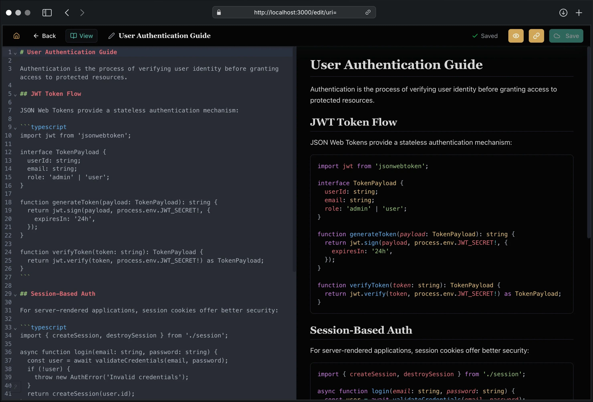
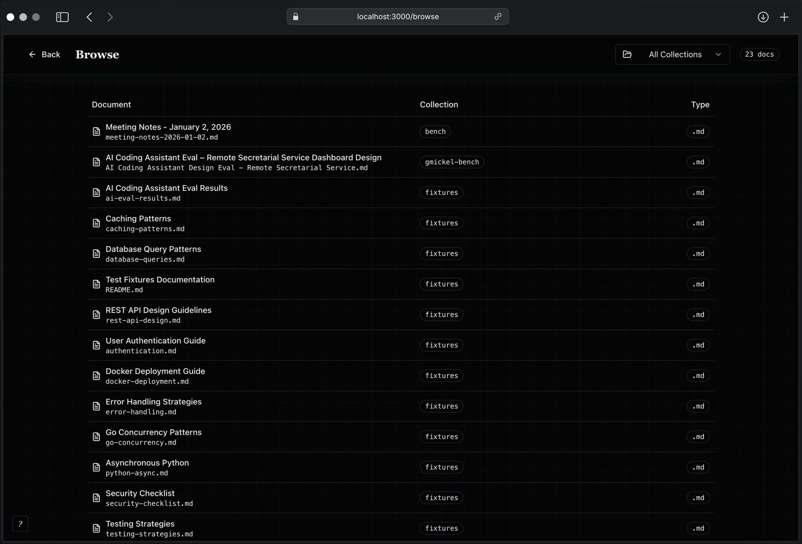
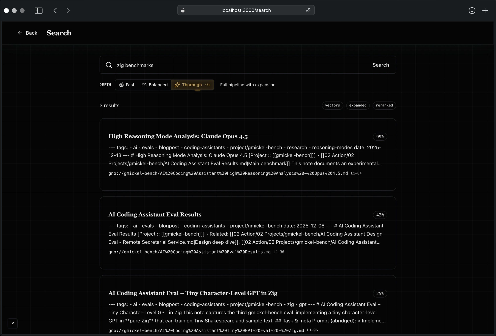
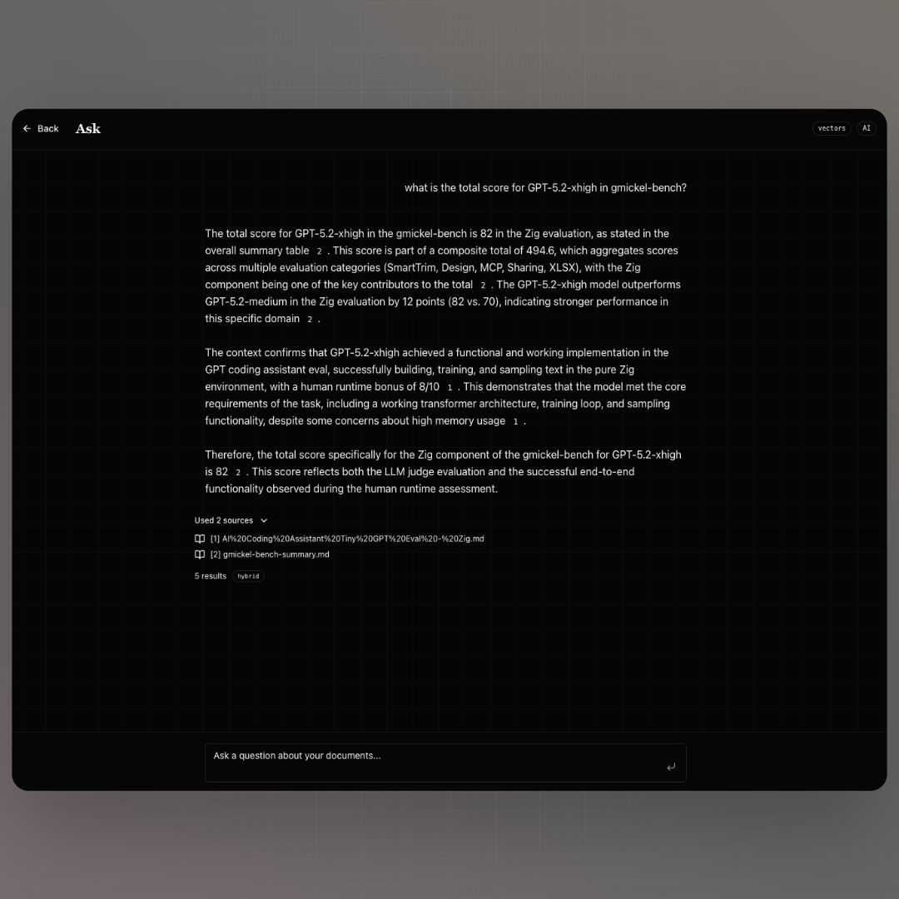

# Web UI

A local web dashboard for visual search, document browsing, editing, and AI-powered answers.

```bash
gno serve
# Open http://localhost:3000
```


---

## Overview

The GNO Web UI provides a complete graphical interface to your local knowledge index. Create, edit, search, and manage your documents, all running on your machine with no cloud dependencies.

| Page            | Purpose                                           |
| :-------------- | :------------------------------------------------ |
| **Dashboard**   | Index stats, collections, quick capture           |
| **Search**      | BM25, vector, or hybrid search with mode selector |
| **Browse**      | Paginated document list, filter by collection     |
| **Doc View**    | View document with edit/delete actions            |
| **Editor**      | Split-view markdown editor with live preview      |
| **Collections** | Add, remove, and re-index collections             |
| **Ask**         | AI-powered Q&A with citations                     |

---

## Quick Start

### 1. Start the Server

```bash
gno serve                    # Default port 3000
gno serve --port 8080        # Custom port
gno serve --index research   # Use named index
```

### 2. Open Your Browser

Navigate to `http://localhost:3000`. The dashboard shows:

- **Document count**: Total indexed documents
- **Chunk count**: Text segments for search
- **Collections**: Click to browse by source
- **Quick Capture**: Create new notes instantly

### 3. Create a Note

Press **N** (or click the floating + button) to open Quick Capture:

1. Enter a title
2. Write your content (markdown supported)
3. Select a collection
4. Click **Create note**

The document is saved to disk and indexed automatically.

### 4. Search

Click **Search** or press **/**. Choose your mode:

| Mode   | Description                |
| :----- | :------------------------- |
| BM25   | Exact keyword matching     |
| Vector | Semantic similarity        |
| Hybrid | Best of both (recommended) |

### 5. Ask Questions

Click **Ask** for AI-powered answers. Type your question. GNO searches your documents and synthesizes an answer with citations.

> **Note**: Models auto-download on first use. Initial startup may take a moment.

---

## Document Editing

### Editor Features



The split-view editor provides:

| Feature              | Description                                |
| :------------------- | :----------------------------------------- |
| **CodeMirror 6**     | Modern editor with markdown syntax support |
| **Live Preview**     | Side-by-side markdown rendering            |
| **Auto-save**        | 2-second debounced saves                   |
| **Syntax Highlight** | Code blocks with Shiki highlighting        |
| **Unsaved Warning**  | Confirmation dialog before losing changes  |
| **Toggle Preview**   | Show/hide preview pane                     |

### Keyboard Shortcuts

Press **?** to view all shortcuts. Single-key shortcuts (no modifier needed) work anywhere outside text inputs, like GitHub and Gmail.

#### Global Shortcuts

| Shortcut | Action             |
| :------- | :----------------- |
| N        | New note           |
| /        | Focus search       |
| T        | Cycle search depth |
| ?        | Show help          |
| Esc      | Close modal        |

#### Editor Shortcuts

| Shortcut | Action           |
| :------- | :--------------- |
| Ctrl+S   | Save immediately |
| Ctrl+B   | Bold selection   |
| Ctrl+I   | Italic selection |
| Ctrl+K   | Insert link      |
| Escape   | Close editor     |

### Opening the Editor

From any document view, click **Edit** to open the split-view editor. Changes are auto-saved after 2 seconds of inactivity.

### Creating Documents

Use Quick Capture (N) for new notes:

1. Enter a title (generates filename automatically)
2. Write content in markdown
3. Select target collection
4. Click **Create note**

The file is written to the collection's folder and indexed immediately.

### Deleting Documents

From document view, click the trash icon. This:

- Removes the document from the search index
- Does **NOT** delete the file from disk
- Document may re-appear on next sync unless excluded

---

## Collections Management

### Collections Page



View and manage your document collections:

- **Document count**: Files indexed
- **Chunk count**: Text segments created
- **Embedded %**: Vector embedding progress
- **Re-index**: Update collection index
- **Remove**: Delete collection from config

### Adding Collections

Click **Add Collection** and provide:

1. **Path**: Folder path (e.g., `~/Documents/notes`)
2. **Name**: Optional (defaults to folder name)
3. **Pattern**: Glob pattern (e.g., `**/*.md`)

The collection is added to config and indexed immediately.

### Removing Collections

Click the menu (⋮) on any collection card and select **Remove**. This:

- Removes collection from configuration
- Keeps indexed documents in database
- Documents won't appear in future syncs

---

## Features

### Model Presets

Switch between model presets without restarting:

1. Click the preset selector (top-right of header)
2. Choose: **Slim** (default), **Balanced**, or **Quality** (best answers)
3. GNO reloads models automatically

| Preset   | Disk   | Best For                     |
| :------- | :----- | :--------------------------- |
| Slim     | ~1GB   | Fast, good quality (default) |
| Balanced | ~2GB   | Slightly larger model        |
| Quality  | ~2.5GB | Best answer quality          |

### Model Download

If models aren't downloaded, the preset selector shows a warning icon. Download directly from the UI:

1. Click the preset selector
2. Click **Download Models** button
3. Watch progress bar as models download
4. Capabilities auto-enable when complete

### Indexing Progress

When syncing or adding collections, a progress indicator shows:

- Current phase (scanning, parsing, chunking, embedding)
- Files processed
- Elapsed time

### Search Modes



The Search page offers three retrieval modes:

**BM25**: Traditional keyword search. Best for exact phrases, code identifiers, known terms.

**Vector**: Semantic similarity search. Best for concepts, natural language questions, finding related content.

**Hybrid**: Combines BM25 + vector with RRF fusion and optional reranking. Best accuracy for most queries.

### Document Browser

Browse all indexed documents:

- Filter by collection
- Paginated results (20 per page)
- Click any document to view content
- Breadcrumb navigation within collections
- Edit and delete actions on each document

### AI Answers



The Ask page provides RAG-powered Q&A:

1. Enter your question
2. GNO runs hybrid search
3. Local LLM synthesizes answer from top results
4. Citations link to source documents

---

## Configuration

### Command Line Options

```bash
gno serve [options]
```

| Flag               | Description       | Default |
| :----------------- | :---------------- | :------ |
| `-p, --port <num>` | Port to listen on | 3000    |
| `--index <name>`   | Use named index   | default |

### Environment Variables

| Variable                 | Description                                              |
| :----------------------- | :------------------------------------------------------- |
| `NODE_ENV=production`    | Disable HMR, stricter CSP                                |
| `GNO_VERBOSE=1`          | Enable debug logging                                     |
| `HF_HUB_OFFLINE=1`       | Offline mode: use cached models only                     |
| `GNO_NO_AUTO_DOWNLOAD=1` | Disable auto-download (allow explicit `gno models pull`) |

---

## Security

The Web UI is designed for local use only:

| Protection                | Description                                       |
| :------------------------ | :------------------------------------------------ |
| **Loopback only**         | Binds to `127.0.0.1`, not accessible from network |
| **CSP headers**           | Strict Content-Security-Policy on all responses   |
| **CORS protection**       | Cross-origin requests blocked                     |
| **No external resources** | No CDN fonts, scripts, or tracking                |
| **Path traversal guard**  | Write operations validate paths stay within root  |

> **Warning**: Do not expose `gno serve` to the internet. It has no authentication.

> **Pro tip**: Want remote access? Use a tunnel:
>
> - [Tailscale Serve](https://tailscale.com/kb/1312/serve): Expose to your Tailnet
> - [Cloudflare Tunnel](https://developers.cloudflare.com/cloudflare-one/connections/connect-networks/): Free tier with auth
> - [ngrok](https://ngrok.com/): Quick setup, supports basic auth

---

## Architecture

```
Browser
   │
   ▼
┌─────────────────────────────────────┐
│  Bun.serve() on 127.0.0.1:3000     │
│  ├── React SPA                      │
│  │   ├── Dashboard (/, stats)       │
│  │   ├── Search (/search)           │
│  │   ├── Browse (/browse)           │
│  │   ├── DocView (/doc)             │
│  │   ├── Editor (/edit)             │
│  │   ├── Collections (/collections) │
│  │   └── Ask (/ask)                 │
│  └── REST API (/api/*)              │
├─────────────────────────────────────┤
│  ServerContext                      │
│  ├── SqliteAdapter (FTS5)          │
│  ├── EmbeddingPort (vectors)       │
│  ├── GenerationPort (answers)      │
│  └── RerankPort (reranking)        │
└─────────────────────────────────────┘
```

---

## Troubleshooting

### "Port already in use"

```bash
gno serve --port 3001
# Or find and kill the process:
lsof -i :3000
kill -9 <PID>
```

### "No results" in search

```bash
gno status
gno ls
# If empty, run:
gno index
```

### AI answers not working

```bash
gno models list
gno models pull
```

### Editor not loading content

Refresh the page. If content still doesn't appear, check browser console for errors.

### Changes not saving

- Check browser console for API errors
- Verify collection folder has write permissions
- Check disk space

---

## API Access

The Web UI is powered by a REST API. See [API Reference](./API.md) for details.

```bash
# Create document
curl -X POST http://localhost:3000/api/docs \
  -H "Content-Type: application/json" \
  -d '{"collection": "notes", "relPath": "new-note.md", "content": "# Hello"}'

# Update document
curl -X PUT http://localhost:3000/api/docs/abc123 \
  -H "Content-Type: application/json" \
  -d '{"content": "# Updated content"}'
```
