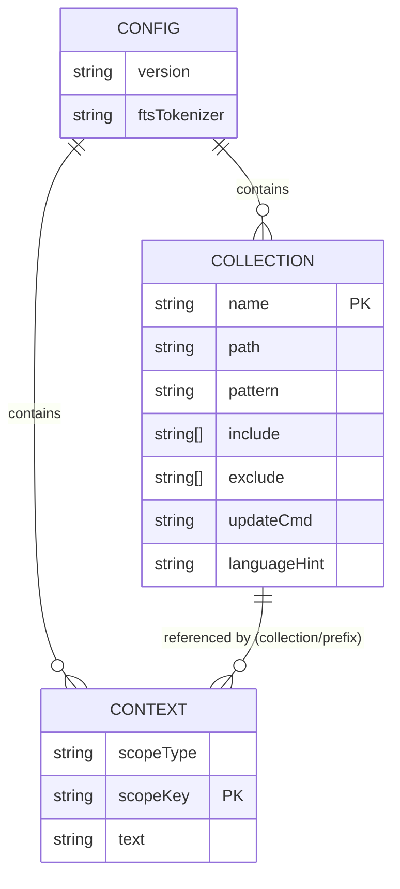

# EPIC 2: Config, Collections, Contexts

**Beads ID:** gno-du9
**Type:** Feature Epic
**Priority:** P0
**Status:** Open
**Dependencies:** gno-8db (EPIC 0: Repo scaffold) ✓ CLOSED

---

## Overview

Implement the configuration layer for GNO, a local knowledge indexing CLI. This includes YAML config management, collection definitions, context scoping, and the `init` command. This epic unblocks EPICs 3-5 (store, converters, indexing).

## Problem Statement

GNO needs a configuration system that:

- Stores collection definitions (paths, patterns, exclusions)
- Manages context metadata for search enhancement
- Follows XDG Base Directory conventions (cross-platform)
- Supports environment variable overrides for CI/testing
- Provides idempotent initialization

## Proposed Solution

### Architecture

```
src/
  config/
    types.ts        # Zod schemas + TypeScript types
    loader.ts       # YAML parsing + validation
    saver.ts        # Atomic YAML writes
    paths.ts        # Platform-specific path resolution
    defaults.ts     # Default values + exclude patterns
    index.ts        # Public API
  cli/
    commands/
      init.ts
      collection.ts
      context.ts
```

### Config Schema (YAML)

```yaml
# ~/.config/gno/index.yml (Linux)
# ~/Library/Application Support/gno/config/index.yml (macOS)
# %APPDATA%\gno\config\index.yml (Windows)

version: "1.0"

# Index-level settings (immutable after init)
ftsTokenizer: unicode61 # unicode61 | porter | trigram

# Collection definitions
collections:
  - name: notes
    path: /Users/gordon/notes
    pattern: "**/*.md"
    include: [] # extension allowlist (empty = all)
    exclude: # path patterns to skip
      - .git
      - node_modules
    updateCmd: "git pull" # optional shell command before indexing
    languageHint: en # optional BCP-47 hint

# Context metadata for search enhancement
contexts:
  - scopeType: global # global | collection | prefix
    scopeKey: /
    text: "Personal knowledge base for software engineering"
  - scopeType: collection
    scopeKey: "collection:notes"
    text: "Daily notes and meeting minutes"
  - scopeType: prefix
    scopeKey: "gno://notes/projects"
    text: "Active project documentation"
```

### Technical Approach

**T2.1 - Config Schema + Loader/Saver**

1. Create Zod schemas in `src/config/types.ts`:

   ```typescript
   const CollectionSchema = z.object({
     name: z.string().regex(/^[a-z0-9][a-z0-9_-]{0,63}$/i),
     path: z.string(),
     pattern: z.string().default("**/*"),
     include: z.array(z.string()).default([]),
     exclude: z.array(z.string()).default(DEFAULT_EXCLUDES),
     updateCmd: z.string().optional(),
     languageHint: z.string().optional(),
   });
   ```

2. Implement loader with validation in `src/config/loader.ts`:
   - Use Bun.YAML (native, v1.2.21+) or js-yaml fallback
   - Validate with Zod, return Result type
   - Normalize paths (resolve ~ to home)

3. Implement atomic saver in `src/config/saver.ts`:
   - Write to temp file first
   - Rename to target (atomic on POSIX)
   - Preserve comments if possible (use `yaml` lib's parseDocument)

**T2.2 - Collection Commands**

| Command                                | Description              | Exit Codes                  |
| -------------------------------------- | ------------------------ | --------------------------- |
| `gno collection add <path> --name <n>` | Add collection           | 0=ok, 1=exists, 2=invalid   |
| `gno collection list [--json]`         | List all                 | 0=ok                        |
| `gno collection remove <name>`         | Remove (checks contexts) | 0=ok, 1=not found, 3=in use |
| `gno collection rename <old> <new>`    | Rename + update contexts | 0=ok                        |

**T2.3 - Context Commands**

| Command                            | Description           | Exit Codes            |
| ---------------------------------- | --------------------- | --------------------- |
| `gno context add <scope> "<text>"` | Add context           | 0=ok, 1=invalid scope |
| `gno context list [--json]`        | List all              | 0=ok                  |
| `gno context check`                | Validate all contexts | 0=valid, 1=invalid    |
| `gno context rm <scope>`           | Remove context        | 0=ok, 1=not found     |

Scope formats:

- Global: `/`
- Collection: `collection:<name>`
- Prefix: `gno://<collection>/<path>`

**T2.4 - Init Command**

```bash
gno init [<path>] [--name <name>] [--pattern <glob>] [--tokenizer <name>] [--yes]
```

Behavior:

1. Check if already initialized (config exists + DB exists)
   - If yes: print status, exit 0 (idempotent)
2. Create directories: config, data, cache
3. Write default config.yaml
4. Create SQLite DB with migrations
5. If `<path>` provided: call `collection add`
6. Print summary of what was created

**T2.5 - Multilingual Config**

- `languageHint`: BCP-47 code (en, de, fr, it, zh-CN, und)
- `ftsTokenizer`: Per-index setting (set at init, immutable)
  - `unicode61`: Default, multilingual-safe
  - `porter`: English stemming
  - `trigram`: Character-based (larger index)

## Implementation Phases

### Phase 1: Core Config (T2.1) - Blocks everything else

```
src/config/
├── types.ts       # Zod schemas, TypeScript types
├── paths.ts       # Platform path resolution (uses constants.ts)
├── defaults.ts    # DEFAULT_EXCLUDES, default config
├── loader.ts      # loadConfig() -> Result<Config>
├── saver.ts       # saveConfig() -> Result<void>
└── index.ts       # Public exports
```

**Files to create:**

- `src/config/types.ts` - Config schema
- `src/config/paths.ts` - Path resolution (wraps constants.ts)
- `src/config/defaults.ts` - Default values
- `src/config/loader.ts` - YAML loading + validation
- `src/config/saver.ts` - Atomic config writes
- `test/config/loader.test.ts` - Loader tests
- `test/config/saver.test.ts` - Saver tests
- `test/fixtures/config/valid-minimal.yml` - Test fixture
- `test/fixtures/config/valid-full.yml` - Test fixture
- `test/fixtures/config/invalid-*.yml` - Error case fixtures

**Dependencies to add:**

```bash
bun add zod
# js-yaml only if Bun.YAML not available
```

### Phase 2: Collection Commands (T2.2)

```
src/cli/commands/
├── collection/
│   ├── add.ts
│   ├── list.ts
│   ├── remove.ts
│   ├── rename.ts
│   └── index.ts
```

**Files to create:**

- `src/cli/commands/collection/add.ts`
- `src/cli/commands/collection/list.ts`
- `src/cli/commands/collection/remove.ts`
- `src/cli/commands/collection/rename.ts`
- `test/cli/collection.test.ts` - Integration tests

### Phase 3: Context Commands (T2.3)

```
src/cli/commands/
├── context/
│   ├── add.ts
│   ├── list.ts
│   ├── check.ts
│   ├── rm.ts
│   └── index.ts
```

**Files to create:**

- `src/cli/commands/context/add.ts`
- `src/cli/commands/context/list.ts`
- `src/cli/commands/context/check.ts`
- `src/cli/commands/context/rm.ts`
- `test/cli/context.test.ts` - Integration tests

### Phase 4: Init Command (T2.4)

**Files to create/modify:**

- `src/cli/commands/init.ts` - Init command
- `test/cli/init.test.ts` - Idempotency tests

### Phase 5: Multilingual Support (T2.5)

- Add `languageHint` validation to collection schema
- Add `ftsTokenizer` to config schema
- Update init to accept `--tokenizer` flag
- Add tests for BCP-47 validation

## Acceptance Criteria

### Functional Requirements

- [ ] Config loads from platform-specific default path
- [ ] Config loads from `GNO_CONFIG_DIR` env override
- [ ] Config loads from `--config` flag override
- [ ] Config validates against Zod schema on load
- [ ] Config saves atomically (no partial writes)
- [ ] `collection add` validates path exists
- [ ] `collection add` prevents duplicate names
- [ ] `collection remove` blocks if contexts reference it
- [ ] `collection rename` updates context scopes
- [ ] `context add` validates scope format
- [ ] `context check` detects invalid references
- [ ] `init` is idempotent (safe to run twice)
- [ ] `init --yes` runs non-interactively

### Non-Functional Requirements

- [ ] Config operations < 50ms
- [ ] Unit test coverage > 80%
- [ ] All CLI commands have `--json` output
- [ ] Exit codes follow spec (0=ok, 1=error, 2=usage)

### Quality Gates

- [ ] `bun test` passes
- [ ] `bun run lint` passes
- [ ] Contract tests validate JSON output schemas
- [ ] Golden fixtures for valid/invalid configs

## Success Metrics

- First-time user can run `gno init ~/notes --name notes` and have working config
- Config round-trips through load/save without data loss
- Collection/context commands complete in < 100ms

## Dependencies & Prerequisites

**Requires (complete):**

- EPIC 0 complete (repo scaffold) ✓

**Blocks:**

- EPIC 3 (Store layer) - needs config types
- EPIC 4 (Converters) - needs collection definitions
- EPIC 5 (Indexing) - needs config + collections

**External Dependencies:**

- `zod` - Schema validation
- Bun.YAML or `js-yaml` - YAML parsing
- `bun:sqlite` - DB creation in init

## Risk Analysis & Mitigation

| Risk                            | Impact | Mitigation                             |
| ------------------------------- | ------ | -------------------------------------- |
| YAML parser incompatibility     | High   | Test both Bun.YAML and js-yaml         |
| Platform path edge cases        | Medium | Comprehensive path tests per OS        |
| Atomic write failure on Windows | Medium | Use temp file + rename pattern         |
| Config schema migration         | Low    | Version field enables future migration |

## Open Questions (Resolved)

1. **Q:** Config stores absolute or relative paths?
   **A:** Absolute paths. User enters `~/docs`, stored as `/Users/gordon/docs`.

2. **Q:** Collection names case-sensitive?
   **A:** Case-insensitive, stored lowercase. `MyNotes` → `mynotes`.

3. **Q:** What happens when collection removed but contexts exist?
   **A:** Block removal. Error: "Context 'x' references collection. Remove context first or use --force."

4. **Q:** Where is ftsTokenizer stored?
   **A:** In config.yaml. Validated at DB creation (init). Cannot change after init without re-init.

5. **Q:** Include/exclude on CLI?
   **A:** Repeatable flags: `--exclude ".git" --exclude "node_modules"`

## References

### Internal References

- PRD §2.1-2.3: Directory resolution rules - `/Users/gordon/work/gno/PRD.md:78-90`
- PRD §4.1-4.5: Collection/Context definitions - `/Users/gordon/work/gno/PRD.md:150-206`
- PRD §7.1: Config features - `/Users/gordon/work/gno/PRD.md:265-297`
- PRD §9.2: Database schema - `/Users/gordon/work/gno/PRD.md:598-656`
- Constants module: `/Users/gordon/work/gno/src/app/constants.ts`
- CLI spec: `/Users/gordon/work/gno/spec/cli.md`

### External References

- [Zod documentation](https://zod.dev/)
- [XDG Base Directory Specification](https://specifications.freedesktop.org/basedir/latest/)
- [Bun YAML docs](https://bun.com/docs/api/yaml)
- [BCP-47 language tags](https://www.ietf.org/rfc/bcp/bcp47.txt)

### Related Work

- Beads: gno-du9 (this epic), gno-du9.1 through gno-du9.5 (tasks)
- EPIC 0: gno-8db (dependency, closed)

---

## Task Breakdown (from Beads)

| Task ID   | Description                            | Priority | Status | Blocks           |
| --------- | -------------------------------------- | -------- | ------ | ---------------- |
| gno-du9.1 | T2.1 Config schema + loader/saver      | P0       | open   | T2.2, T2.3, T2.4 |
| gno-du9.2 | T2.2 collection add/list/remove/rename | P1       | open   | -                |
| gno-du9.3 | T2.3 context add/list/check/rm         | P1       | open   | -                |
| gno-du9.4 | T2.4 init command                      | P0       | open   | -                |
| gno-du9.5 | T2.5 Multilingual config               | P2       | open   | -                |

**Critical Path:** T2.1 → T2.2 + T2.3 + T2.4 (parallel) → T2.5

---

## ERD: Config Domain Model



## File Structure After EPIC 2

```
src/
├── app/
│   └── constants.ts          # Existing (platform paths, URI scheme)
├── config/
│   ├── types.ts              # NEW: Zod schemas, TS types
│   ├── paths.ts              # NEW: Path resolution
│   ├── defaults.ts           # NEW: Default values
│   ├── loader.ts             # NEW: YAML loading
│   ├── saver.ts              # NEW: YAML saving
│   └── index.ts              # NEW: Public API
├── cli/
│   └── commands/
│       ├── init.ts           # NEW
│       ├── collection/
│       │   ├── add.ts        # NEW
│       │   ├── list.ts       # NEW
│       │   ├── remove.ts     # NEW
│       │   ├── rename.ts     # NEW
│       │   └── index.ts      # NEW
│       └── context/
│           ├── add.ts        # NEW
│           ├── list.ts       # NEW
│           ├── check.ts      # NEW
│           ├── rm.ts         # NEW
│           └── index.ts      # NEW
test/
├── config/
│   ├── loader.test.ts        # NEW
│   └── saver.test.ts         # NEW
├── cli/
│   ├── init.test.ts          # NEW
│   ├── collection.test.ts    # NEW
│   └── context.test.ts       # NEW
└── fixtures/
    └── config/
        ├── valid-minimal.yml # NEW
        ├── valid-full.yml    # NEW
        └── invalid-*.yml     # NEW (multiple)
spec/
└── output-schemas/
    ├── collection-list.json  # NEW
    └── context-list.json     # NEW
```
