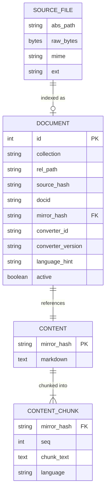

# EPIC 4: Converter Subsystem (Node-Only, Deterministic)

**Type**: Feature Epic
**Priority**: P0 (Foundation for all downstream operations)
**PRD Reference**: §8 (Converter subsystem)
**Depends on**: EPIC 0-2 (complete), EPIC 3 (store layer - parallel implementation possible)

---

## Overview

Implement the document converter subsystem that transforms source files (PDF, DOCX, XLSX, TXT, MD) into canonical Markdown mirrors for indexing and retrieval. This is the foundation for all downstream operations (chunking, embedding, search).

**Hard constraints:**

- No Python dependencies anywhere
- Deterministic output (same input → same canonical markdown)
- Local-only (no external services)

**Scope adjustments from review:**

- `.pptx` via officeparser: markitdown-ts has incomplete PPTX; use officeparser (239 stars, 119K downloads)
- `maxBytes` enforcement: Handled in EPIC 5 (stat-based, before file read) - see `gno-nqu`
- Timeout process isolation: Future work (current: best-effort Promise.race timeout)

**Timeout semantics (MVP):**

- Adapters wrap conversion in `Promise.race([conversion, timeoutPromise])`
- If timeout fires first, return `TIMEOUT` error immediately
- Underlying library work may continue (known limitation)
- True abort requires process isolation (future work)
- AbortController only used if library explicitly supports it

---

## Problem Statement

GNO needs to index mixed-format document archives. Users have PDFs, Word docs, Excel sheets, and Markdown files they want to search. The converter subsystem:

1. Detects file types via MIME/extension
2. Routes to appropriate converter adapter
3. Produces canonical Markdown mirrors
4. Handles errors gracefully (fail-soft, never crash the update)

---

## Technical Approach

### Architecture

```
┌─────────────────────────────────────────────────────────────┐
│                     Converter Pipeline                       │
├─────────────────────────────────────────────────────────────┤
│  File Bytes → MIME Detector → Registry Router → Converter   │
│                                      ↓                       │
│                              Canonicalizer → Mirror + Hash   │
└─────────────────────────────────────────────────────────────┘
```

**Module Structure:**

```
src/converters/
  ├── types.ts              # ConverterId, ConvertInput, ConvertOutput, ConvertResult
  ├── errors.ts             # ConvertErrorCode, ConvertError, helpers
  ├── registry.ts           # ConverterRegistry, routing logic
  ├── pipeline.ts           # ConversionPipeline: canonicalize + mirrorHash (entry point)
  ├── mime.ts               # MimeDetector, extension map, magic bytes
  ├── canonicalize.ts       # Markdown normalization (deterministic)
  ├── native/
  │   ├── markdown.ts       # Passthrough converter for .md
  │   └── plaintext.ts      # .txt → MD converter
  └── adapters/
      ├── markitdownTs/
      │   └── adapter.ts    # markitdown-ts wrapper (PDF, DOCX, XLSX)
      └── officeparser/
          └── adapter.ts    # officeparser wrapper (PPTX)
```

### Key Dependencies

| Package         | Purpose                  | Status                                        |
| --------------- | ------------------------ | --------------------------------------------- |
| `markitdown-ts` | PDF/DOCX/XLSX conversion | npm v0.0.8 (85 stars, active)                 |
| `officeparser`  | PPTX conversion          | npm v5.2.0 (239 stars, 119K weekly downloads) |
| `bun:test`      | Testing                  | Built-in                                      |
| `bun:sqlite`    | Storage (EPIC 3)         | Built-in                                      |

**Why markitdown-ts over markitdown-js:**

- More active: 85 stars vs 7, last commit Nov 2025 vs Feb 2025
- No native binaries (markitdown-js uses exiftool-vendored)
- Buffer-based conversion (serverless-friendly, better for our use case)
- Zero open issues vs 1

**Why officeparser for PPTX:**

- markitdown-ts has incomplete PPTX support
- officeparser: 239 stars, 119K weekly downloads, actively maintained
- In-memory extraction (no disk writes)
- Full TypeScript support
- Speaker notes extraction supported

---

## Implementation Phases

### Phase 1: Core Types & Interfaces

**Files to create:**

#### `src/converters/types.ts`

```typescript
export type ConverterId =
  | "native/markdown"
  | "native/plaintext"
  | "adapter/markitdown-ts"
  | string;

export type ConvertInput = {
  sourcePath: string; // absolute
  relativePath: string; // within collection
  collection: string;
  bytes: Uint8Array;
  mime: string;
  ext: string; // ".pdf"
  limits: {
    maxBytes: number; // default: 100MB
    timeoutMs: number; // default: 60000
  };
};

export type ConvertWarning = {
  code:
    | "LOSSY"
    | "TRUNCATED"
    | "PARTIAL"
    | "UNSUPPORTED_FEATURE"
    | "LOW_CONFIDENCE";
  message: string;
  details?: Record<string, unknown>;
};

export type ConvertOutput = {
  markdown: string; // raw (pipeline canonicalizes); NOT canonical
  title?: string;
  languageHint?: string; // BCP-47 or "und"
  meta: {
    converterId: ConverterId;
    converterVersion: string;
    sourceMime: string;
    warnings?: ConvertWarning[];
  };
};

export type ConvertResult =
  | { ok: true; value: ConvertOutput }
  | { ok: false; error: ConvertError };

export interface Converter {
  readonly id: ConverterId;
  readonly version: string;
  canHandle(mime: string, ext: string): boolean;
  convert(input: ConvertInput): Promise<ConvertResult>;
}

/**
 * ConversionArtifact wraps ConvertOutput with pipeline-computed fields.
 * This is the OUTPUT of the pipeline (what consumers receive).
 * Includes mirrorHash computed from canonical markdown.
 */
export type ConversionArtifact = {
  /** Canonical markdown after pipeline normalization */
  markdown: string;
  /** SHA-256 hex of canonical markdown - content-addressed key */
  mirrorHash: string;
  /** Title from conversion (or derived from filename) */
  title?: string;
  /** Language hint from conversion */
  languageHint?: string;
  /** Conversion metadata */
  meta: ConvertOutput["meta"];
};

export type PipelineResult =
  | { ok: true; value: ConversionArtifact }
  | { ok: false; error: ConvertError };
```

#### `src/converters/errors.ts`

```typescript
export type ConvertErrorCode =
  | "UNSUPPORTED"
  | "TOO_LARGE"
  | "TIMEOUT"
  | "CORRUPT"
  | "PERMISSION"
  | "IO"
  | "ADAPTER_FAILURE"
  | "INTERNAL";

export type ConvertError = {
  code: ConvertErrorCode;
  message: string;
  retryable: boolean;
  fatal: boolean; // reserved for store corruption
  converterId: string;
  sourcePath: string;
  mime: string;
  ext: string;
  cause?: unknown;
  details?: Record<string, unknown>;
};

export function convertError(
  code: ConvertErrorCode,
  opts: Omit<ConvertError, "code">
): ConvertError {
  return { code, ...opts };
}

export function isRetryable(code: ConvertErrorCode): boolean {
  return ["TIMEOUT", "IO", "ADAPTER_FAILURE"].includes(code);
}
```

**Acceptance criteria:**

- [ ] Types exported and usable by other modules
- [ ] Result pattern matches existing StoreResult pattern
- [ ] Error codes cover all failure modes in PRD §8.3

---

### Phase 2: MIME Detection

**File to create:** `src/converters/mime.ts`

```typescript
export type MimeDetection = {
  mime: string;
  ext: string;
  confidence: "high" | "medium" | "low";
  via: "sniff" | "ext" | "fallback";
};

export interface MimeDetector {
  detect(path: string, bytes: Uint8Array): MimeDetection;
}
```

**Extension map (PRD §8.5):**
| Extension | MIME Type |
|-----------|-----------|
| `.md` | `text/markdown` |
| `.txt` | `text/plain` |
| `.pdf` | `application/pdf` |
| `.docx` | `application/vnd.openxmlformats-officedocument.wordprocessingml.document` |
| `.pptx` | `application/vnd.openxmlformats-officedocument.presentationml.presentation` |
| `.xlsx` | `application/vnd.openxmlformats-officedocument.spreadsheetml.sheet` |

**Magic byte sniffing:**
| Signature | MIME Type |
|-----------|-----------|
| `%PDF-` (first 5 bytes) | `application/pdf` |
| `PK\x03\x04` + ext in {docx,pptx,xlsx} | OOXML MIME |

**Detection priority:**

1. Magic bytes (sniff) → high confidence
2. Extension map → medium confidence
3. Fallback `application/octet-stream` → low confidence

**Key decisions:**

- **Buffer size for sniffing**: First 512 bytes
- **Conflict resolution**: Magic bytes always win over extension
- **Unsupported fallback**: `application/octet-stream`

**Acceptance criteria:**

- [ ] Extension-based detection works for all MVP types
- [ ] Magic byte sniffing detects PDF and OOXML
- [ ] Confidence levels correctly assigned
- [ ] Unit tests for each detection path

---

### Phase 3: Canonicalization

**File to create:** `src/converters/canonicalize.ts`

**Canonicalization rules (PRD §8.4):**

1. Normalize to `\n` newlines (no `\r`)
2. Apply NFC Unicode normalization (cross-platform hash stability)
3. Strip control chars U+0000-U+001F and U+007F except `\n` (U+000A) and `\t` (U+0009)
4. Trim trailing whitespace per line
5. Treat whitespace-only lines as blank (trim first, then count)
6. Collapse 3+ consecutive blank lines to exactly 2
7. Ensure exactly one final `\n`

**Critical constraints:**

- **Deterministic**: Same input → same output always
- **No timestamps**: Never inject run-specific data
- **No paths**: Source paths surfaced via metadata, not in mirror
- **Pipeline-only**: Converters MUST NOT call canonicalize() - only pipeline.ts does

**Versioning contract:**
Canonicalization rules are a **compatibility contract**. If these rules change:

- All existing `mirror_hash` values become invalid
- Documents must be re-converted to get new hashes
- Content deduplication breaks silently

**Decision**: Canonicalization is versioned via `converterVersion`. The version format is:

- `<converter>@<canonicalizer>` e.g., `native/markdown@1.0.0`
- When canonicalization rules change, ALL converter versions bump together
- This is simpler than tracking a separate `canonicalizerVersion`

```typescript
export function canonicalize(markdown: string): string {
  // Implementation per rules above
}

export function mirrorHash(canonical: string): string {
  // sha256 hex of canonical markdown
  const hasher = new Bun.CryptoHasher("sha256");
  hasher.update(canonical);
  return hasher.digest("hex");
}
```

**Acceptance criteria:**

- [ ] All 7 canonicalization rules implemented
- [ ] Deterministic across macOS/Linux (NFC normalization)
- [ ] Unit tests for each rule
- [ ] Edge cases: empty input, whitespace-only, unicode edge cases

---

### Phase 4: Native Converters

#### `src/converters/native/markdown.ts`

Passthrough converter for `.md` files:

- Read file as text (raw, no normalization)
- Extract title from first `# ` heading if present
- Return ConvertOutput (pipeline handles canonicalization)

```typescript
export const markdownConverter: Converter = {
  id: "native/markdown",
  version: "1.0.0",
  canHandle: (mime, ext) => mime === "text/markdown" || ext === ".md",
  convert: async (input) => {
    const text = new TextDecoder().decode(input.bytes);
    // NOTE: Do NOT canonicalize here - pipeline.ts handles all normalization
    const title = extractFirstHeading(text);
    return ok({
      markdown: text, // raw; pipeline canonicalizes
      title,
      meta: {
        converterId: "native/markdown",
        converterVersion: "1.0.0",
        sourceMime: input.mime,
      },
    });
  },
};
```

#### `src/converters/native/plaintext.ts`

Convert `.txt` to Markdown:

- Decode as UTF-8 with replacement for invalid bytes
- Strip UTF-8 BOM if present (`\uFEFF`)
- Pass through as paragraphs (no code fence wrapping - better for search)
- Derive title from filename (without extension)
- Return raw text (pipeline handles canonicalization)

**Encoding policy (deterministic):**

```typescript
// 1. Always decode as UTF-8
const decoder = new TextDecoder("utf-8", {
  fatal: false, // Don't throw on invalid bytes
  ignoreBOM: false, // We'll strip manually for determinism
});

// 2. Strip BOM if present
let text = decoder.decode(input.bytes);
if (text.charCodeAt(0) === 0xfeff) {
  text = text.slice(1);
}

// 3. Invalid bytes become U+FFFD (replacement character) deterministically
```

**Rationale:**

- UTF-8 is the de facto standard; Latin-1/other encodings are edge cases we don't auto-detect
- BOM stripping ensures consistent hashes regardless of editor that saved the file
- Replacement character (�) is visible to users, indicating encoding issues

**Acceptance criteria:**

- [ ] Markdown passthrough preserves structure
- [ ] Title extraction from headings works
- [ ] Plaintext conversion handles edge cases
- [ ] UTF-8 BOM stripped deterministically
- [ ] Invalid bytes produce U+FFFD (not throw)
- [ ] Both converters are deterministic

---

### Phase 5: markitdown-ts Adapter

**File to create:** `src/converters/adapters/markitdownTs/adapter.ts`

**CRITICAL**: Use `convertBuffer()` with bytes, NOT `convert()` with path. Path-based conversion breaks determinism (could re-read modified file).

```typescript
import { MarkItDown } from "markitdown-ts";

const MARKITDOWN_VERSION = "0.0.8"; // single source of truth

export const markitdownAdapter: Converter = {
  id: "adapter/markitdown-ts",
  version: MARKITDOWN_VERSION,
  canHandle: (mime, ext) => {
    // Note: .pptx deferred until markitdown-ts support matures
    return [".pdf", ".docx", ".xlsx"].includes(ext);
  },
  convert: async (input) => {
    // 1. Check size limit (defense in depth; EPIC 5 does stat-based pre-check)
    if (input.bytes.length > input.limits.maxBytes) {
      return err(convertError("TOO_LARGE", { ... }));
    }

    // 2. Wrap conversion in Promise.race for timeout enforcement
    // Note: markitdown-ts doesn't support AbortSignal, so underlying
    // work may continue after timeout (known limitation; process isolation future work)
    const timeoutPromise = new Promise<never>((_, reject) =>
      setTimeout(() => reject(new Error("TIMEOUT")), input.limits.timeoutMs)
    );

    try {
      const converter = new MarkItDown();
      // IMPORTANT: Use convertBuffer with bytes for determinism
      // Path-based convert() could re-read a modified file
      const result = await Promise.race([
        converter.convertBuffer(
          Buffer.from(input.bytes),
          { file_extension: input.ext }
        ),
        timeoutPromise,
      ]);

      if (!result?.markdown) {
        return err(convertError("CORRUPT", { message: "Empty conversion result" }));
      }

      // NOTE: Canonicalization happens in pipeline.ts, not here
      // Individual converters return raw markdown

      // Emit warnings for suspicious output
      const warnings: ConvertWarning[] = [];
      if (result.markdown.length < 10 && input.bytes.length > 1000) {
        warnings.push({ code: "LOSSY", message: "Suspiciously short output" });
      }

      return ok({
        markdown: result.markdown, // raw; pipeline canonicalizes
        title: result.title,
        meta: {
          converterId: "adapter/markitdown-ts",
          converterVersion: MARKITDOWN_VERSION,
          sourceMime: input.mime,
          warnings: warnings.length > 0 ? warnings : undefined,
        },
      });
    } catch (err) {
      if (err instanceof Error && err.message === "TIMEOUT") {
        return err(convertError("TIMEOUT", { ... }));
      }
      return mapAdapterError(err, input);
    }
  },
};
```

**Exception mapping:**
| Library Error | ConvertErrorCode |
|---------------|------------------|
| "File not found" | IO |
| "Permission denied" | PERMISSION |
| "Could not convert" | CORRUPT |
| Promise.race timeout | TIMEOUT |
| OutOfMemory | TOO_LARGE |
| All others | ADAPTER_FAILURE |

**Acceptance criteria:**

- [ ] Converts PDF, DOCX, XLSX successfully
- [ ] Respects maxBytes limit
- [ ] Respects timeoutMs limit with Promise.race (best-effort)
- [ ] Maps exceptions to correct error codes
- [ ] Emits warnings for suspicious output
- [ ] Version locked to package.json
- [ ] Uses convertBuffer() with bytes (not path-based convert())

---

### Phase 5b: officeparser PPTX Adapter

**File to create:** `src/converters/adapters/officeparser/adapter.ts`

```typescript
import { parseOfficeAsync, OfficeParserConfig } from "officeparser";

export const officeparserAdapter: Converter = {
  id: "adapter/officeparser",
  version: "5.2.0", // lock to package version
  canHandle: (mime, ext) => {
    return ext === ".pptx" ||
           mime === "application/vnd.openxmlformats-officedocument.presentationml.presentation";
  },
  convert: async (input) => {
    // Size check (defense in depth; EPIC 5 does pre-read check)
    if (input.bytes.length > input.limits.maxBytes) {
      return err(convertError("TOO_LARGE", { ... }));
    }

    const config: OfficeParserConfig = {
      newlineDelimiter: "\n",
      ignoreNotes: false,  // Include speaker notes
    };

    try {
      // officeparser accepts Buffer or path
      const buffer = Buffer.from(input.bytes);
      const text = await parseOfficeAsync(buffer, config);

      if (!text || text.trim().length === 0) {
        return err(convertError("CORRUPT", { message: "Empty extraction result" }));
      }

      // Convert plain text to Markdown structure
      // Each slide is separated by newlines; format as sections
      const markdown = formatPptxAsMarkdown(text, input.relativePath);
      // NOTE: Do NOT canonicalize here - pipeline.ts handles all normalization

      const warnings: ConvertWarning[] = [];
      if (markdown.length < 10 && input.bytes.length > 1000) {
        warnings.push({ code: "LOSSY", message: "Suspiciously short output" });
      }

      return ok({
        markdown, // raw; pipeline canonicalizes
        title: extractTitleFromFilename(input.relativePath),
        meta: {
          converterId: "adapter/officeparser",
          converterVersion: "5.2.0",
          sourceMime: input.mime,
          warnings: warnings.length > 0 ? warnings : undefined,
        },
      });
    } catch (err) {
      return mapOfficeparserError(err, input);
    }
  },
};

function formatPptxAsMarkdown(text: string, filename: string): string {
  // officeparser returns plain text with slide content separated by newlines
  // Format with a heading based on filename
  const title = extractTitleFromFilename(filename);
  return `# ${title}\n\n${text}`;
}
```

**Exception mapping:**
| Library Error | ConvertErrorCode |
|---------------|------------------|
| File read error | IO |
| Invalid ZIP/PPTX | CORRUPT |
| All others | ADAPTER_FAILURE |

**Acceptance criteria:**

- [ ] Converts PPTX successfully
- [ ] Extracts speaker notes (ignoreNotes: false)
- [ ] Respects maxBytes limit
- [ ] Maps exceptions to correct error codes
- [ ] Version locked to package.json

---

### Phase 6: Converter Registry

**File to create:** `src/converters/registry.ts`

```typescript
export class ConverterRegistry {
  private converters: Converter[] = [];

  register(converter: Converter): void {
    this.converters.push(converter);
  }

  select(mime: string, ext: string): Converter | undefined {
    return this.converters.find(c => c.canHandle(mime, ext));
  }

  async convert(input: ConvertInput): Promise<ConvertResult> {
    const converter = this.select(input.mime, input.ext);
    if (!converter) {
      return err(convertError("UNSUPPORTED", {
        message: `No converter for ${input.mime} (${input.ext})`,
        ...
      }));
    }
    return converter.convert(input);
  }
}

// Default registry with MVP converters
export function createDefaultRegistry(): ConverterRegistry {
  const registry = new ConverterRegistry();
  // Priority order per PRD §8.6
  registry.register(markdownConverter);
  registry.register(plaintextConverter);
  registry.register(markitdownAdapter);    // PDF, DOCX, XLSX
  registry.register(officeparserAdapter);  // PPTX
  return registry;
}
```

**Routing priority (PRD §8.6):**

1. `native/markdown` - handles `.md`
2. `native/plaintext` - handles `.txt`
3. `adapter/markitdown-ts` - handles `.pdf`, `.docx`, `.xlsx`
4. `adapter/officeparser` - handles `.pptx`

**Acceptance criteria:**

- [ ] Priority order enforced
- [ ] First matching converter wins
- [ ] UNSUPPORTED error for unknown types
- [ ] Registry is reusable (stateless)

---

### Phase 6b: Conversion Pipeline

**File to create:** `src/converters/pipeline.ts`

The pipeline is the **single entry point** for all conversions. It:

1. Calls the registry to find and invoke the appropriate converter
2. Canonicalizes the raw markdown output (centralized, not per-converter)
3. Computes mirrorHash from canonical markdown
4. Returns ConversionArtifact (not ConvertOutput)

**CRITICAL**: Canonicalization is **only** done in the pipeline, not in individual converters. This ensures:

- Single source of truth for normalization rules
- Easier to update rules (one location)
- Converters return raw markdown; pipeline normalizes

```typescript
import { canonicalize, mirrorHash } from "./canonicalize";
import { ConverterRegistry, createDefaultRegistry } from "./registry";
import type { ConvertInput, ConversionArtifact, PipelineResult } from "./types";

export class ConversionPipeline {
  constructor(
    private readonly registry: ConverterRegistry = createDefaultRegistry()
  ) {}

  async convert(input: ConvertInput): Promise<PipelineResult> {
    // 1. Delegate to registry (finds converter + invokes)
    const result = await this.registry.convert(input);

    if (!result.ok) {
      return result; // Pass through error
    }

    // 2. Canonicalize the raw markdown output
    const canonical = canonicalize(result.value.markdown);

    // 3. Compute content-addressed hash
    const hash = mirrorHash(canonical);

    // 4. Return artifact with all pipeline-computed fields
    const artifact: ConversionArtifact = {
      markdown: canonical,
      mirrorHash: hash,
      title: result.value.title,
      languageHint: result.value.languageHint,
      meta: result.value.meta,
    };

    return { ok: true, value: artifact };
  }
}

// Singleton for simple usage
let defaultPipeline: ConversionPipeline | null = null;

export function getDefaultPipeline(): ConversionPipeline {
  if (!defaultPipeline) {
    defaultPipeline = new ConversionPipeline();
  }
  return defaultPipeline;
}
```

**Why pipeline-level canonicalization?**

- Converters focus on extraction, not normalization
- Single place to update canonicalization rules
- Easier to test canonicalization in isolation
- mirrorHash is always computed after normalization (never on raw output)

**Acceptance criteria:**

- [ ] Pipeline is the only entry point for external consumers
- [ ] Canonicalization happens once, in pipeline (not in converters)
- [ ] mirrorHash is computed from canonical markdown
- [ ] ConversionArtifact returned (not ConvertOutput)
- [ ] All converter errors pass through correctly

---

### Phase 7: Golden Fixtures & Tests

**Directory structure (PRD §8.8):**

```
test/fixtures/conversion/
  pdf/
    simple.pdf              # Simple single-page PDF
    simple.expected.md      # Expected canonical output
  docx/
    headings.docx           # Doc with H1, H2, paragraphs
    headings.expected.md
  xlsx/
    sheet1.xlsx             # Simple spreadsheet
    sheet1.expected.md
  pptx/
    deck1.pptx              # Simple slide deck
    deck1.expected.md
  md/
    sample.md               # Markdown with various elements
    sample.expected.md
  txt/
    plain.txt
    plain.expected.md
  edge-cases/
    empty.pdf               # Empty document
    empty.expected.md
    unicode.txt             # Unicode edge cases
    unicode.expected.md
```

**Golden test pattern:**

**CRITICAL**: Tests should assert **pipeline output**, not individual converter output. Fixtures contain canonical markdown (after pipeline normalization).

```typescript
import { test, expect } from "bun:test";
import { join } from "node:path"; // OK: no Bun path utils
import { getDefaultPipeline } from "../src/converters/pipeline";

const FIXTURES_DIR = join(import.meta.dir, "fixtures/conversion");

test("PDF: simple.pdf matches golden fixture", async () => {
  const inputPath = join(FIXTURES_DIR, "pdf/simple.pdf");
  const expectedPath = join(FIXTURES_DIR, "pdf/simple.expected.md");

  const pipeline = getDefaultPipeline();
  const result = await pipeline.convert(await prepareInput(inputPath));
  const expected = await Bun.file(expectedPath).text();

  expect(result.ok).toBe(true);
  if (result.ok) {
    // Assert canonical markdown from pipeline (not raw converter output)
    expect(result.value.markdown).toBe(expected);
    // mirrorHash should be deterministic
    expect(result.value.mirrorHash).toMatch(/^[a-f0-9]{64}$/);
  }
});
```

**Fixture update process:**

1. CI fails on mismatch
2. Developer reviews diff manually
3. If change is intentional, run `bun test:update-fixtures`
4. Commit updated `.expected.md` files with explanation

**Acceptance criteria:**

- [ ] All MVP file types have fixtures
- [ ] Golden tests verify exact output match
- [ ] Edge case fixtures for empty, corrupt, unicode
- [ ] Fixture update script exists

---

## Acceptance Criteria (Full Epic)

### Functional Requirements

- [ ] MIME detection correctly identifies all MVP file types
- [ ] Converters produce canonical Markdown for PDF, DOCX, XLSX, TXT, MD
- [ ] Canonicalization is deterministic across platforms (NFC normalized)
- [ ] Errors are classified correctly and don't crash the system
- [ ] Warnings are emitted for suspicious/lossy conversions
- [ ] UTF-8 encoding with BOM stripping for plaintext

### Non-Functional Requirements

- [ ] No Python dependencies
- [ ] Timeout enforcement via AbortController (best-effort; process isolation is future work)
- [ ] Size limits: converter validates; EPIC 5 enforces pre-read via stat
- [ ] Golden fixtures pass in CI
- [ ] Pipeline is single entry point; converters return raw markdown
- [ ] mirrorHash always computed from canonical markdown (in pipeline)

### Quality Gates

- [ ] Unit tests for canonicalization, MIME detection, error mapping
- [ ] Golden fixture tests for all converters
- [ ] Integration test: end-to-end conversion pipeline
- [ ] `bun run lint` passes
- [ ] `bun run typecheck` passes

---

## Success Metrics

| Metric                                | Target                                    |
| ------------------------------------- | ----------------------------------------- |
| Conversion success rate (valid files) | >99%                                      |
| Golden fixture determinism            | 100% (no flaky tests)                     |
| Timeout compliance                    | All conversions abort within 2x timeoutMs |
| Memory efficiency                     | Peak memory <2x input file size           |

---

## Dependencies & Prerequisites

**External:**

- `markitdown-ts` npm package (v0.0.8)
- `officeparser` npm package (v5.2.0)
- No Python anywhere in the toolchain

**Internal (can be parallel):**

- EPIC 3 (Store layer) - not blocking; converters work standalone
- EPIC 5 (Indexing) - will consume converter output

---

## Risk Analysis & Mitigation

| Risk                                 | Likelihood | Impact | Mitigation                                     |
| ------------------------------------ | ---------- | ------ | ---------------------------------------------- |
| markitdown-ts missing format support | Medium     | High   | Fall back to UNSUPPORTED, doc in release notes |
| Timeout not honored by native code   | Medium     | Medium | Use process-level timeout as backstop          |
| Unicode normalization breaks content | Low        | High   | Extensive fixture testing, NFC is conservative |
| Large file OOM                       | Medium     | Medium | Check size before allocating, streaming future |

---

## Future Considerations

- **Additional converters**: pdf.js, mammoth, SheetJS as separate adapters
- **Streaming conversion**: For very large files
- **OCR support**: For scanned PDFs (optional, via Tesseract if available)
- **Dynamic converter registration**: Plugin architecture (post-MVP)

---

## References

### Internal

- PRD.md §8 (Converter subsystem specification)
- PRD.md §8.2 (Converter interfaces)
- PRD.md §8.3 (Error model)
- PRD.md §8.4 (Canonical Markdown conventions)
- PRD.md §8.5 (MIME detection strategy)
- PRD.md §8.6 (Converter registry)
- PRD.md §8.7 (markitdown-js adapter requirements)
- PRD.md §8.8 (Golden fixture plan)
- src/store/types.ts (Result pattern reference)

### External

- [markitdown-ts npm](https://www.npmjs.com/package/markitdown-ts)
- [Bun File I/O](https://bun.sh/docs/runtime/file-io)
- [BCP-47 Language Tags](https://www.rfc-editor.org/rfc/bcp/bcp47.txt)

### Research Findings

- markitdown-ts v0.0.8 supports PDF, DOCX, XLSX (PPTX incomplete → officeparser)
- Use `convertBuffer()` with bytes for determinism (not path-based `convert()`)
- Use AbortController for timeout enforcement
- NFC Unicode normalization required for cross-platform hash stability
- Magic bytes: first 512 bytes sufficient for detection

---

## ERD: Converter Data Flow



---

## Task Breakdown

| Task                           | Effort | Dependencies            |
| ------------------------------ | ------ | ----------------------- |
| T4.1: types.ts + errors.ts     | 2h     | None                    |
| T4.2: mime.ts (detection)      | 3h     | T4.1                    |
| T4.3: canonicalize.ts          | 4h     | T4.1                    |
| T4.4: native/markdown.ts       | 2h     | T4.1                    |
| T4.5: native/plaintext.ts      | 2h     | T4.1                    |
| T4.6: adapters/markitdownTs    | 6h     | T4.1, npm install       |
| T4.6b: adapters/officeparser   | 3h     | T4.1, npm install       |
| T4.7: registry.ts              | 2h     | T4.4, T4.5, T4.6, T4.6b |
| T4.7b: pipeline.ts             | 2h     | T4.3, T4.7              |
| T4.8: Golden fixtures (create) | 4h     | None                    |
| T4.9: Unit tests (all)         | 4h     | T4.1-T4.7b              |
| T4.10: Integration test        | 2h     | T4.7b, T4.8             |
| **Total**                      | ~36h   |                         |

---

## Open Questions (Answered)

| Question                           | Answer                                                       |
| ---------------------------------- | ------------------------------------------------------------ |
| MIME sniffing buffer size?         | 512 bytes                                                    |
| Extension vs magic bytes priority? | Magic bytes always win                                       |
| Unicode normalization?             | NFC (cross-platform stability)                               |
| Default maxBytes?                  | 100MB                                                        |
| Default timeoutMs?                 | 60000 (60s)                                                  |
| Timeout mechanism?                 | AbortController (best-effort); process isolation future work |
| Empty output handling?             | LOSSY warning, metadata-only record                          |
| Title fallback?                    | Derive from filename (no extension)                          |
| Language hint validation?          | Normalize to lowercase, accept 2-3 letter codes              |
| Fixture update process?            | CI fails, manual review, script to regenerate                |
| markitdown-js vs markitdown-ts?    | markitdown-ts (more active, no native deps, buffer support)  |
| maxBytes enforcement location?     | EPIC 5 stat-based pre-read check (see gno-nqu)               |
| Canonicalization versioning?       | Part of converterVersion; all bump together on rule change   |
| Non-UTF8 .txt handling?            | UTF-8 decode with replacement (U+FFFD), strip BOM            |
| PPTX support?                      | Yes, via officeparser (239 stars, 119K downloads)            |
| Where is mirrorHash computed?      | pipeline.ts only (after canonicalization)                    |
| Where is canonicalization done?    | pipeline.ts only (converters return raw markdown)            |
| markitdown-ts bytes or path?       | bytes via convertBuffer() for determinism                    |
