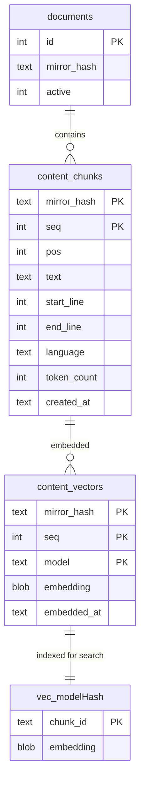

# EPIC 7: Vector Index and Embeddings Workflow (gno embed)

**Issue ID:** gno-ia1
**Priority:** P0
**Type:** Epic
**Dependencies:** EPIC 5 (Indexing/FTS), EPIC 6 (LLM subsystem) - both completed
**Blocks:** EPIC 8 (Search pipelines), EPIC 13 (Raycast extension)
**Last Updated:** 2025-12-24 (post-review revision 3 - all issues addressed)

---

## Overview

Implement vector embedding workflow that transforms chunked document content into searchable vector representations. This epic enables semantic search by:

1. Integrating sqlite-vec as optional vector **search acceleration** layer
2. Detecting which chunks need embeddings (backlog) for active model
3. Batch-embedding chunks via node-llama-cpp EmbeddingPort
4. Storing vectors keyed by (mirror_hash, seq, model) with per-model vec indices

**First-run UX goal:** `gno embed` just works - auto-downloads model if missing, embeds all chunks, shows progress.

---

## Critical Issues Addressed (Post-Review)

The following issues were identified in architectural reviews and are resolved in this plan:

**Review 1 Issues:**

1. **EmbeddingPort.dimensions() throws before embed()** - Fixed via lazy dimensions discovery (probe embedding)
2. **Multi-model vec index collision** - Resolved with per-model vec tables (`vec_<modelHash>`)
3. **StorePort.open() signature change** - Avoided via separate VectorIndexPort factory
4. **Backlog may include orphan chunks** - Fixed with `EXISTS` subquery (not JOIN to avoid dups)
5. **Vec index maintenance on chunk deletion** - Handled via explicit `syncVecIndex()` after rechunking

**Review 2 Issues:** 6. **StorePort.getDb() doesn't exist** - Fixed via `SqliteDbProvider` type guard interface 7. **Backlog query duplicates** - Fixed using `EXISTS` instead of `INNER JOIN` 8. **ESM require() incompatible** - Fixed using `await import("sqlite-vec")` 9. **CLI spec misalignment** - Aligned: batch default=32, document `--dry-run` in spec 10. **Embed errors persistence** - Reuse `ingest_errors` table with EMBED\_\* codes 11. **Foreign key enforcement** - Require `PRAGMA foreign_keys = ON` 12. **BLOB encoding footgun** - Added canonical encode/decode helpers 13. **Backlog pagination** - Added `limit`/`offset` params to `getBacklog()`

---

## Architecture Context

### Existing Infrastructure (from EPIC 5 & 6)

**LLM Subsystem (EPIC 6 - Complete):**

- `EmbeddingPort` interface: `src/llm/types.ts:78-84`
  - `embed(text)`, `embedBatch(texts)`, `dimensions()`, `dispose()`
- `NodeLlamaCppEmbedding` adapter: `src/llm/nodeLlamaCpp/embedding.ts`
- `LlmAdapter.createEmbeddingPort()`: `src/llm/nodeLlamaCpp/adapter.ts:26-119`
- Model presets with bge-m3 default: `src/config/types.ts:154-200`

**Store Layer (EPIC 3/5 - Complete):**

- `content_chunks` table: `(mirror_hash, seq)` PK
- `content_vectors` table already in schema: `src/store/migrations/001-initial.ts:133-143`
- `ChunkRow` type: `src/store/types.ts:115-126`
- Status tracking: `IndexStatus.embeddingBacklog`, `CollectionStatus.embeddedChunks`

**Key Interfaces:**

```typescript
// EmbeddingPort (src/llm/types.ts:78-84)
export type EmbeddingPort = {
  readonly modelUri: string;
  embed(text: string): Promise<LlmResult<number[]>>;
  embedBatch(texts: string[]): Promise<LlmResult<number[][]>>;
  dimensions(): number;
  dispose(): Promise<void>;
};

// ChunkRow (src/store/types.ts:115-126)
export type ChunkRow = {
  mirrorHash: string;
  seq: number;
  pos: number;
  text: string;
  startLine: number;
  endLine: number;
  language: string | null;
  tokenCount: number | null;
  createdAt: string;
};
```

---

## Task Breakdown

### T7.1: sqlite-vec Integration (P0)

**Goal:** Optional vector **search acceleration** with graceful degradation. Vector storage always works via `content_vectors` table; sqlite-vec enables fast KNN search.

#### 7.1.0 Architecture Decision: Separate VectorIndexPort + SqliteDbProvider

**Problem:** Existing `StorePort.open()` signature cannot accept embedding dimensions early (unknown until model loads and embeds first chunk). Also, vector layer needs raw DB access but `StorePort` doesn't expose it.

**Solution:**

1. Create a standalone `VectorIndexPort` factory, NOT a sub-port of StorePort
2. Add `SqliteDbProvider` type guard to safely access raw DB from sqlite adapter only

```typescript
// src/store/sqlite/types.ts
import type { Database } from "bun:sqlite";

/**
 * Type guard interface for accessing raw SQLite DB.
 * Only implemented by SqliteAdapter, not part of StorePort contract.
 */
export type SqliteDbProvider = {
  getRawDb(): Database;
};

export function isSqliteDbProvider(store: unknown): store is SqliteDbProvider {
  return (
    store !== null &&
    typeof store === "object" &&
    "getRawDb" in store &&
    typeof (store as SqliteDbProvider).getRawDb === "function"
  );
}
```

```typescript
// src/store/vector/index.ts
export async function createVectorIndexPort(
  db: Database,
  options: {
    model: string;
    dimensions: number;
    distanceMetric?: "cosine" | "l2";
  }
): Promise<StoreResult<VectorIndexPort>>;
```

This preserves StorePort stability while enabling lazy vector index creation.

#### 7.1.1 Create VectorIndexPort Interface

File: `src/store/vector/types.ts`

```typescript
import type { StoreResult } from "../types";

export type VectorRow = {
  mirrorHash: string;
  seq: number;
  model: string;
  embedding: Float32Array;
  embeddedAt: string;
};

export type VectorSearchResult = {
  mirrorHash: string;
  seq: number;
  distance: number;
};

/**
 * VectorIndexPort handles vector search acceleration via sqlite-vec.
 * Storage is ALWAYS via content_vectors table (works without sqlite-vec).
 * This port adds KNN search capability when sqlite-vec is available.
 */
export type VectorIndexPort = {
  /** True if sqlite-vec loaded successfully */
  readonly searchAvailable: boolean;
  /** Model this index is configured for */
  readonly model: string;
  /** Vector dimensions */
  readonly dimensions: number;

  // Storage (always works, uses content_vectors table)
  upsertVectors(rows: VectorRow[]): Promise<StoreResult<void>>;
  deleteVectorsForMirror(mirrorHash: string): Promise<StoreResult<void>>;

  // Search (requires sqlite-vec)
  searchNearest(
    embedding: Float32Array,
    k: number,
    options?: { minScore?: number }
  ): Promise<StoreResult<VectorSearchResult[]>>;

  // Index maintenance
  rebuildVecIndex(): Promise<StoreResult<void>>;
  syncVecIndex(): Promise<StoreResult<{ added: number; removed: number }>>;
};

/**
 * Separate port for backlog/stats queries (model-aware).
 * Works without sqlite-vec.
 */
export type VectorStatsPort = {
  countVectors(model: string): Promise<StoreResult<number>>;
  getBacklog(
    model: string,
    options?: { limit?: number; offset?: number }
  ): Promise<StoreResult<BacklogItem[]>>;
  countBacklog(model: string): Promise<StoreResult<number>>;
};

export type BacklogItem = {
  mirrorHash: string;
  seq: number;
  text: string;
  reason: "new" | "changed";
};
```

#### 7.1.2 Implement sqlite-vec Adapter (Per-Model Tables)

File: `src/store/vector/sqliteVec.ts`

**Key Design:** Per-model vec tables to avoid dimension/collision issues:

- Table name: `vec_<modelHash>` where modelHash = first 8 chars of SHA256(modelUri)
- Each model gets its own vec0 virtual table with correct dimensions
- **ESM-compatible:** Use dynamic `import()` not `require()`
- **FK enforcement:** Require `PRAGMA foreign_keys = ON` for cascade deletes

```typescript
import type { Database } from "bun:sqlite";
import type { VectorIndexPort, VectorRow, VectorSearchResult } from "./types";
import type { StoreResult } from "../types";
import { createHash } from "node:crypto";

// ─────────────────────────────────────────────────────────────────────────────
// BLOB Encoding Helpers (avoid Buffer.buffer footgun)
// ─────────────────────────────────────────────────────────────────────────────

/**
 * Encode Float32Array to Uint8Array for SQLite BLOB storage.
 * Creates a copy to avoid shared ArrayBuffer issues.
 */
export function encodeEmbedding(f32: Float32Array): Uint8Array {
  return new Uint8Array(
    f32.buffer.slice(f32.byteOffset, f32.byteOffset + f32.byteLength)
  );
}

/**
 * Decode Uint8Array from SQLite BLOB to Float32Array.
 * Creates a copy to avoid shared ArrayBuffer issues.
 */
export function decodeEmbedding(blob: Uint8Array): Float32Array {
  const copy = new Uint8Array(blob); // Ensure we own the buffer
  return new Float32Array(copy.buffer, copy.byteOffset, copy.byteLength / 4);
}

// ─────────────────────────────────────────────────────────────────────────────
// Core Implementation
// ─────────────────────────────────────────────────────────────────────────────

function modelTableName(modelUri: string): string {
  const hash = createHash("sha256").update(modelUri).digest("hex").slice(0, 8);
  return `vec_${hash}`;
}

export async function createVectorIndexPort(
  db: Database,
  options: {
    model: string;
    dimensions: number;
    distanceMetric?: "cosine" | "l2";
  }
): Promise<StoreResult<VectorIndexPort>> {
  const { model, dimensions, distanceMetric = "cosine" } = options;
  const tableName = modelTableName(model);

  // NOTE: FK enforcement should also be set in SqliteAdapter.open() as baseline invariant
  // This ensures cascades work during ingestion/rechunking even without vector init
  db.exec("PRAGMA foreign_keys = ON");

  // Try loading sqlite-vec extension (ESM dynamic import)
  let searchAvailable = false;
  try {
    const sqliteVec = await import("sqlite-vec");
    sqliteVec.load(db);
    searchAvailable = true;
  } catch {
    // sqlite-vec not available - storage still works, search disabled
  }

  // Create per-model vec0 table if extension available
  if (searchAvailable) {
    db.exec(`
      CREATE VIRTUAL TABLE IF NOT EXISTS ${tableName} USING vec0(
        chunk_id TEXT PRIMARY KEY,
        embedding FLOAT[${dimensions}] distance_metric=${distanceMetric}
      );
    `);
  }

  // Prepared statements
  const upsertVectorStmt = db.prepare(`
    INSERT OR REPLACE INTO content_vectors (mirror_hash, seq, model, embedding, embedded_at)
    VALUES (?, ?, ?, ?, datetime('now'))
  `);

  const upsertVecStmt = searchAvailable
    ? db.prepare(
        `INSERT OR REPLACE INTO ${tableName} (chunk_id, embedding) VALUES (?, ?)`
      )
    : null;

  const searchStmt = searchAvailable
    ? db.prepare(`
        SELECT chunk_id, distance
        FROM ${tableName}
        WHERE embedding MATCH ?
          AND k = ?
      `)
    : null;

  const deleteVecStmt = searchAvailable
    ? db.prepare(`DELETE FROM ${tableName} WHERE chunk_id LIKE ? || ':%'`)
    : null;

  return {
    ok: true,
    value: {
      searchAvailable,
      model,
      dimensions,

      async upsertVectors(rows: VectorRow[]): Promise<StoreResult<void>> {
        try {
          db.transaction(() => {
            for (const row of rows) {
              const chunkId = `${row.mirrorHash}:${row.seq}`;
              // Always store in content_vectors (using safe encoding)
              upsertVectorStmt.run(
                row.mirrorHash,
                row.seq,
                row.model,
                encodeEmbedding(row.embedding)
              );
              // Also store in vec0 if available
              if (upsertVecStmt) {
                upsertVecStmt.run(chunkId, row.embedding);
              }
            }
          })();
          return { ok: true, value: undefined };
        } catch (e) {
          return {
            ok: false,
            error: { code: "VECTOR_WRITE_FAILED", message: String(e) },
          };
        }
      },

      async deleteVectorsForMirror(
        mirrorHash: string
      ): Promise<StoreResult<void>> {
        try {
          db.transaction(() => {
            db.prepare(
              `DELETE FROM content_vectors WHERE mirror_hash = ? AND model = ?`
            ).run(mirrorHash, model);
            if (deleteVecStmt) {
              deleteVecStmt.run(mirrorHash);
            }
          })();
          return { ok: true, value: undefined };
        } catch (e) {
          return {
            ok: false,
            error: { code: "VECTOR_DELETE_FAILED", message: String(e) },
          };
        }
      },

      async searchNearest(
        embedding,
        k,
        options
      ): Promise<StoreResult<VectorSearchResult[]>> {
        if (!searchAvailable || !searchStmt) {
          return {
            ok: false,
            error: {
              code: "VEC_SEARCH_UNAVAILABLE",
              message:
                "Vector search requires sqlite-vec. Embeddings stored but KNN search disabled.",
            },
          };
        }

        try {
          const results = searchStmt.all(embedding, k) as {
            chunk_id: string;
            distance: number;
          }[];
          return {
            ok: true,
            value: results.map((r) => {
              const [mirrorHash, seqStr] = r.chunk_id.split(":");
              return {
                mirrorHash,
                seq: Number.parseInt(seqStr, 10),
                distance: r.distance,
              };
            }),
          };
        } catch (e) {
          return {
            ok: false,
            error: { code: "VEC_SEARCH_FAILED", message: String(e) },
          };
        }
      },

      async rebuildVecIndex(): Promise<StoreResult<void>> {
        if (!searchAvailable) {
          return { ok: true, value: undefined }; // No-op if no vec support
        }

        try {
          // Drop and recreate vec table from content_vectors
          db.exec(`DROP TABLE IF EXISTS ${tableName}`);
          db.exec(`
            CREATE VIRTUAL TABLE ${tableName} USING vec0(
              chunk_id TEXT PRIMARY KEY,
              embedding FLOAT[${dimensions}] distance_metric=${distanceMetric}
            );
          `);

          // Repopulate from content_vectors
          const rows = db
            .prepare(
              `
            SELECT mirror_hash, seq, embedding FROM content_vectors WHERE model = ?
          `
            )
            .all(model) as {
            mirror_hash: string;
            seq: number;
            embedding: Uint8Array;
          }[];

          const insertStmt = db.prepare(`
            INSERT INTO ${tableName} (chunk_id, embedding) VALUES (?, ?)
          `);

          db.transaction(() => {
            for (const row of rows) {
              const chunkId = `${row.mirror_hash}:${row.seq}`;
              insertStmt.run(chunkId, decodeEmbedding(row.embedding));
            }
          })();

          return { ok: true, value: undefined };
        } catch (e) {
          return {
            ok: false,
            error: { code: "VEC_REBUILD_FAILED", message: String(e) },
          };
        }
      },

      async syncVecIndex(): Promise<
        StoreResult<{ added: number; removed: number }>
      > {
        // Sync vec table with content_vectors (add missing, remove orphans)
        if (!searchAvailable) {
          return { ok: true, value: { added: 0, removed: 0 } };
        }

        try {
          let added = 0;
          let removed = 0;

          // 1. Remove orphans from vec table (not in content_vectors for this model)
          const orphanResult = db
            .prepare(
              `
            DELETE FROM ${tableName}
            WHERE chunk_id NOT IN (
              SELECT mirror_hash || ':' || seq
              FROM content_vectors
              WHERE model = ?
            )
          `
            )
            .run(model);
          removed = orphanResult.changes;

          // 2. Add missing entries (in content_vectors but not in vec table)
          const missing = db
            .prepare(
              `
            SELECT cv.mirror_hash, cv.seq, cv.embedding
            FROM content_vectors cv
            WHERE cv.model = ?
              AND (cv.mirror_hash || ':' || cv.seq) NOT IN (
                SELECT chunk_id FROM ${tableName}
              )
          `
            )
            .all(model) as {
            mirror_hash: string;
            seq: number;
            embedding: Uint8Array;
          }[];

          if (missing.length > 0) {
            const insertStmt = db.prepare(`
              INSERT INTO ${tableName} (chunk_id, embedding) VALUES (?, ?)
            `);
            db.transaction(() => {
              for (const row of missing) {
                const chunkId = `${row.mirror_hash}:${row.seq}`;
                insertStmt.run(chunkId, decodeEmbedding(row.embedding));
              }
            })();
            added = missing.length;
          }

          return { ok: true, value: { added, removed } };
        } catch (e) {
          return {
            ok: false,
            error: { code: "VEC_SYNC_FAILED", message: String(e) },
          };
        }
      },
    },
  };
}
```

#### 7.1.3 VectorStatsPort Implementation

File: `src/store/vector/stats.ts`

**Purpose:** Backlog detection and vector stats. Works without sqlite-vec.

**Key Design:** Use `EXISTS` instead of `INNER JOIN` to avoid duplicate rows when multiple active documents share the same mirror_hash.

```typescript
import type { Database } from "bun:sqlite";
import type { VectorStatsPort, BacklogItem } from "./types";
import type { StoreResult } from "../types";

export function createVectorStatsPort(db: Database): VectorStatsPort {
  return {
    async countVectors(model: string): Promise<StoreResult<number>> {
      try {
        const result = db
          .prepare(
            `
          SELECT COUNT(*) as count FROM content_vectors WHERE model = ?
        `
          )
          .get(model) as { count: number };
        return { ok: true, value: result.count };
      } catch (e) {
        return {
          ok: false,
          error: { code: "QUERY_FAILED", message: String(e) },
        };
      }
    },

    async countBacklog(model: string): Promise<StoreResult<number>> {
      try {
        // Count chunks needing embedding (fast for progress display)
        const result = db
          .prepare(
            `
          SELECT COUNT(*) as count
          FROM content_chunks c
          WHERE EXISTS (
            SELECT 1 FROM documents d
            WHERE d.mirror_hash = c.mirror_hash AND d.active = 1
          )
          AND NOT EXISTS (
            SELECT 1 FROM content_vectors v
            WHERE v.mirror_hash = c.mirror_hash
              AND v.seq = c.seq
              AND v.model = ?
              AND v.embedded_at >= c.created_at
          )
        `
          )
          .get(model) as { count: number };
        return { ok: true, value: result.count };
      } catch (e) {
        return {
          ok: false,
          error: { code: "QUERY_FAILED", message: String(e) },
        };
      }
    },

    async getBacklog(
      model: string,
      options?: { limit?: number; offset?: number }
    ): Promise<StoreResult<BacklogItem[]>> {
      try {
        const limit = options?.limit ?? 1000; // Default batch for memory safety
        const offset = options?.offset ?? 0;

        // CRITICAL: Use EXISTS to avoid duplicates when multiple docs share mirror_hash
        const results = db
          .prepare(
            `
          SELECT c.mirror_hash, c.seq, c.text,
            CASE
              WHEN NOT EXISTS (
                SELECT 1 FROM content_vectors v
                WHERE v.mirror_hash = c.mirror_hash
                  AND v.seq = c.seq
                  AND v.model = ?
              ) THEN 'new'
              ELSE 'changed'
            END as reason
          FROM content_chunks c
          -- Only chunks from ACTIVE documents (no duplicates via EXISTS)
          WHERE EXISTS (
            SELECT 1 FROM documents d
            WHERE d.mirror_hash = c.mirror_hash AND d.active = 1
          )
          -- Missing or stale vectors
          AND NOT EXISTS (
            SELECT 1 FROM content_vectors v
            WHERE v.mirror_hash = c.mirror_hash
              AND v.seq = c.seq
              AND v.model = ?
              AND v.embedded_at >= c.created_at
          )
          ORDER BY c.mirror_hash, c.seq
          LIMIT ? OFFSET ?
        `
          )
          .all(model, model, limit, offset) as BacklogItem[];

        return { ok: true, value: results };
      } catch (e) {
        return {
          ok: false,
          error: { code: "QUERY_FAILED", message: String(e) },
        };
      }
    },
  };
}
```

#### 7.1.4 Update StoreErrorCode

File: `src/store/types.ts` - Add new error codes:

```typescript
export type StoreErrorCode =
  | /* existing codes */
  | 'VECTOR_WRITE_FAILED'
  | 'VECTOR_DELETE_FAILED'
  | 'VEC_SEARCH_UNAVAILABLE'
  | 'VEC_SEARCH_FAILED'
  | 'VEC_REBUILD_FAILED'
  | 'VEC_SYNC_FAILED';
```

#### 7.1.5 Integration Pattern (No StorePort Changes)

**Key:** StorePort.open() signature remains unchanged. Vector index is created separately using type-guarded raw DB access:

```typescript
import { isSqliteDbProvider } from "../store/sqlite/types";

// In gno embed command or service layer
async function initEmbedding(
  config: Config,
  store: StorePort
): Promise<{
  embedPort: EmbeddingPort;
  vectorIndex: VectorIndexPort;
  stats: VectorStatsPort;
}> {
  // 0. Require SQLite adapter for vector operations
  if (!isSqliteDbProvider(store)) {
    throw new Error("Vector operations require SQLite store backend");
  }
  const db = store.getRawDb();

  // 1. Get model URI from config
  const modelUri = config.models.presets.find(
    (p) => p.id === config.models.activePreset
  )?.embed;
  if (!modelUri) {
    throw new Error(
      "No embedding model configured. Set models.activePreset in config."
    );
  }

  // 2. Create embedding port (from EPIC 6)
  const llm = new LlmAdapter(config);
  const embedResult = await llm.createEmbeddingPort(modelUri);
  if (!embedResult.ok) throw new Error(embedResult.error.message);
  const embedPort = embedResult.value;

  // 3. Discover dimensions via probe embedding
  const probeResult = await embedPort.embed("dimension probe");
  if (!probeResult.ok) throw new Error(probeResult.error.message);
  const dimensions = probeResult.value.length;

  // 4. Create vector index port (NOW we know dimensions)
  const vectorResult = await createVectorIndexPort(db, {
    model: modelUri,
    dimensions,
  });
  if (!vectorResult.ok) throw new Error(vectorResult.error.message);

  // 5. Create stats port
  const stats = createVectorStatsPort(db);

  return { embedPort, vectorIndex: vectorResult.value, stats };
}
```

**Acceptance Criteria:**

- [ ] `VectorIndexPort` interface defined with storage + search methods
- [ ] `VectorStatsPort` interface defined for backlog/stats
- [ ] sqlite-vec loads successfully on macOS/Linux
- [ ] Per-model vec tables created with correct dimensions
- [ ] Backlog query excludes inactive documents (joins to active docs)
- [ ] Storage works without sqlite-vec (search disabled with clear error)
- [ ] `gno doctor` reports vector search capability status
- [ ] Unit tests for both sqlite-vec and fallback paths
- [ ] New error codes added to `StoreErrorCode`

---

### T7.2: Embedding Backlog Detection (P1)

**Goal:** Query chunks needing embeddings for current model, report in status.

#### 7.2.1 Backlog Detection Algorithm

**Note:** Backlog detection is now implemented in `VectorStatsPort.getBacklog()` (see T7.1.3). This section documents the high-level algorithm.

File: `src/indexing/backlog.ts` - Thin wrapper over VectorStatsPort

```typescript
import { isSqliteDbProvider } from "../store/sqlite/types";
import { createVectorStatsPort } from "../store/vector/stats";

export type BacklogOptions = {
  model: string;
  includeChanged?: boolean; // Re-embed if content changed after embedding
  limit?: number;
  offset?: number;
};

export async function detectBacklog(
  store: StorePort,
  options: BacklogOptions
): Promise<StoreResult<BacklogItem[]>> {
  if (!isSqliteDbProvider(store)) {
    return {
      ok: false,
      error: { code: "UNSUPPORTED_STORE", message: "Backlog requires SQLite" },
    };
  }

  const stats = createVectorStatsPort(store.getRawDb());
  return stats.getBacklog(options.model, {
    limit: options.limit,
    offset: options.offset,
  });
}
```

#### 7.2.2 Status Integration

**Note:** Backlog calculation must use the same logic as `VectorStatsPort.countBacklog()` to avoid definition mismatch (active docs + stale vectors).

Update `src/store/types.ts` and `SqliteAdapter`:

```typescript
// Already defined in types.ts - ensure these queries work
export type IndexStatus = {
  // ... existing fields
  totalChunks: number;
  embeddingBacklog: number;  // chunks without embeddings (active docs only)
  embeddedChunks: number;
  activeModel: string | null;
};

// In SqliteAdapter.getStatus() - delegate to VectorStatsPort for consistency
async getStatus(model?: string): Promise<StoreResult<IndexStatus>> {
  const totalChunks = this.db.prepare(`
    SELECT COUNT(*) as count FROM content_chunks c
    WHERE EXISTS (SELECT 1 FROM documents d WHERE d.mirror_hash = c.mirror_hash AND d.active = 1)
  `).get() as { count: number };

  // Use VectorStatsPort logic for accurate backlog (same EXISTS-based query)
  const stats = createVectorStatsPort(this.db);
  const backlogResult = model ? await stats.countBacklog(model) : { ok: true, value: 0 };
  const embeddedResult = model ? await stats.countVectors(model) : { ok: true, value: 0 };

  return {
    ok: true,
    value: {
      totalChunks: totalChunks.count,
      embeddedChunks: embeddedResult.ok ? embeddedResult.value : 0,
      embeddingBacklog: backlogResult.ok ? backlogResult.value : 0,
      activeModel: model ?? null
    }
  };
}
```

#### 7.2.3 CLI Status Output

Update `gno status` to show embedding backlog:

```
Index Status:
  Documents: 1,234 (23 with errors)
  Chunks: 45,678
  Embeddings: 40,123 / 45,678 (88%)
  Backlog: 5,555 chunks need embedding
  Model: hf:BAAI/bge-m3-gguf/bge-m3-q8_0.gguf
```

**Acceptance Criteria:**

- [ ] Backlog query correctly identifies new chunks
- [ ] Backlog query identifies changed chunks (content updated after embedding)
- [ ] `gno status` shows backlog count and percentage
- [ ] `gno status --json` includes `embeddingBacklog` field per schema
- [ ] Performance: backlog query <100ms for 100k chunks

---

### T7.3: Batch Embed Chunks and Store Vectors (P0)

**Goal:** `gno embed` command that embeds pending chunks in batches.

#### 7.3.1 Embed Command Implementation

File: `src/cli/commands/embed.ts`

```typescript
import { parseArgs } from "node:util";
import type { Config } from "../../config/types";
import { isSqliteDbProvider } from "../store/sqlite/types";

/**
 * gno embed command
 *
 * NOTE: --dry-run and interactive prompts are extensions to spec/cli.md.
 * Update spec/cli.md to document these before implementation.
 */
export async function embedCommand(
  args: string[],
  config: Config
): Promise<number> {
  const { values, positionals } = parseArgs({
    args,
    options: {
      force: { type: "boolean", default: false },
      model: { type: "string" },
      "batch-size": { type: "string", default: "32" }, // Per spec/cli.md
      "dry-run": { type: "boolean", default: false }, // Extension to spec
      yes: { type: "boolean", short: "y", default: false },
    },
    allowPositionals: false,
  });

  const batchSize = Number.parseInt(values["batch-size"], 10);
  const modelUri = values.model ?? config.models.presets[0].embed;
  const force = values.force;
  const dryRun = values["dry-run"];

  // 1. Open store
  const store = await openStore(config);

  // 2. Initialize embedding (probe for dimensions)
  const { embedPort, vectorIndex, stats } = await initEmbedding(config, store);

  if (!vectorIndex.searchAvailable) {
    console.warn(
      "Warning: sqlite-vec not available. Embeddings will be stored but KNN search disabled."
    );
  }

  // 3. Detect backlog
  const backlogResult = await stats.getBacklog(modelUri);
  if (!backlogResult.ok) {
    console.error(`Error detecting backlog: ${backlogResult.error.message}`);
    return 2;
  }

  let backlog = backlogResult.value;
  if (force) {
    // Force: get ALL chunks from active documents
    const allChunks = await store.getAllActiveChunks();
    if (!allChunks.ok) return 2;
    backlog = allChunks.value.map((c) => ({ ...c, reason: "force" as const }));
  }

  if (backlog.length === 0) {
    console.log("No chunks need embedding. All up to date.");
    return 0;
  }

  // 4. Confirm if large backlog
  if (backlog.length > 1000 && !values.yes) {
    const confirm = await prompt(
      `Embed ${backlog.length.toLocaleString()} chunks? [y/N] `
    );
    if (confirm?.toLowerCase() !== "y") {
      console.log("Aborted.");
      return 1;
    }
  }

  if (dryRun) {
    console.log(
      `Dry run: would embed ${backlog.length} chunks with model ${modelUri}`
    );
    return 0;
  }

  // 5. Batch embed with progress
  const startTime = Date.now();
  let embedded = 0;
  let errors = 0;

  for (let i = 0; i < backlog.length; i += batchSize) {
    const batch = backlog.slice(i, i + batchSize);
    const texts = batch.map((b) => b.text);

    const embedResult = await embedPort.embedBatch(texts);
    if (!embedResult.ok) {
      console.error(
        `Batch ${Math.floor(i / batchSize) + 1} failed: ${embedResult.error.message}`
      );
      errors += batch.length;
      continue;
    }

    // Store vectors
    const vectors: VectorRow[] = batch.map((b, idx) => ({
      mirrorHash: b.mirrorHash,
      seq: b.seq,
      model: modelUri,
      embedding: new Float32Array(embedResult.value[idx]),
      embeddedAt: new Date().toISOString(),
    }));

    const storeResult = await vectorIndex.upsertVectors(vectors);
    if (!storeResult.ok) {
      console.error(`Failed to store batch: ${storeResult.error.message}`);
      errors += batch.length;
      continue;
    }

    embedded += batch.length;

    // Progress
    const pct = (((i + batch.length) / backlog.length) * 100).toFixed(1);
    const elapsed = (Date.now() - startTime) / 1000;
    const rate = embedded / elapsed;
    const eta = (backlog.length - embedded) / rate;

    process.stdout.write(
      `\rEmbedding: ${embedded.toLocaleString()}/${backlog.length.toLocaleString()} (${pct}%) | ${rate.toFixed(1)} chunks/s | ETA ${formatDuration(eta)}`
    );
  }

  console.log(); // newline after progress

  const duration = (Date.now() - startTime) / 1000;
  console.log(
    `Embedded ${embedded.toLocaleString()} chunks in ${formatDuration(duration)}`
  );
  if (errors > 0) {
    console.log(`${errors} chunks failed to embed.`);
    return 2;
  }

  await embedPort.dispose();
  return 0;
}
```

#### 7.3.2 Batch Processing Strategy

```typescript
// Optimal batch sizing based on model context and memory
export function calculateBatchSize(
  modelContextSize: number,
  avgChunkTokens: number,
  maxMemoryMb: number = 2048
): number {
  // Conservative: don't exceed 50% of context per batch
  const contextLimit = Math.floor(modelContextSize / avgChunkTokens / 2);

  // Memory limit: ~4KB per float32 embedding * 768 dimensions
  const memoryLimit = Math.floor((maxMemoryMb * 1024) / (768 * 4));

  // Default reasonable batch
  const defaultBatch = 64;

  return Math.min(contextLimit, memoryLimit, defaultBatch);
}
```

#### 7.3.3 Error Handling

**Design Decision:** Reuse existing `ingest_errors` table with EMBED\_\* error codes. No new migration needed.

```typescript
// Error codes for embedding failures (use with ingest_errors table)
export const EMBED_ERROR_CODES = {
  EMBED_TOO_LONG: "EMBED_TOO_LONG", // Chunk exceeds model context
  EMBED_INFERENCE_FAILED: "EMBED_INFERENCE_FAILED", // Model inference error
  EMBED_MALFORMED: "EMBED_MALFORMED", // Invalid chunk content
} as const;

export type EmbedError = {
  mirrorHash: string;
  seq: number;
  code: keyof typeof EMBED_ERROR_CODES;
  message: string;
  model: string;
};

// Store failed chunks in ingest_errors for retry/debugging
// Actual schema: ingest_errors(id, collection, rel_path, occurred_at, code, message, details_json)
// Strategy: resolve (mirror_hash, seq) → (collection, rel_path) via documents table
async function recordEmbedError(
  db: Database,
  error: EmbedError
): Promise<void> {
  // Find a document for this mirror_hash to get collection/rel_path
  // If multiple docs share mirror, pick first active one (deterministic via ORDER BY)
  const doc = db
    .prepare(
      `
    SELECT collection, rel_path FROM documents
    WHERE mirror_hash = ? AND active = 1
    ORDER BY id LIMIT 1
  `
    )
    .get(error.mirrorHash) as { collection: string; rel_path: string } | null;

  if (!doc) {
    // No active document - chunk is orphaned, skip error recording
    return;
  }

  const detailsJson = JSON.stringify({
    mirrorHash: error.mirrorHash,
    seq: error.seq,
    model: error.model,
  });

  // Note: ingest_errors has no UNIQUE constraint, so we just INSERT
  // Multiple errors for same file are allowed (shows history)
  db.prepare(
    `
    INSERT INTO ingest_errors (collection, rel_path, code, message, details_json, occurred_at)
    VALUES (?, ?, ?, ?, ?, datetime('now'))
  `
  ).run(doc.collection, doc.rel_path, error.code, error.message, detailsJson);
}
```

**Acceptance Criteria:**

- [ ] `gno embed` embeds all backlog chunks
- [ ] Progress shows chunks/total, rate, ETA
- [ ] `--batch-size` controls batch size
- [ ] `--model` allows specifying different model
- [ ] Interrupted job resumes from backlog (already-embedded chunks skipped)
- [ ] Errors logged but don't stop entire job
- [ ] `--dry-run` shows what would be embedded
- [ ] Exit code 0 on success, 2 on errors

---

### T7.4: --force Re-embed Support (P2)

**Goal:** `gno embed --force` re-embeds all chunks even if vectors exist.

#### 7.4.1 Force Mode Implementation

Already integrated in T7.3 via:

```typescript
if (force) {
  // Get ALL chunks regardless of existing embeddings
  const allChunks = await store.getAllActiveChunks();
  backlog = allChunks.value;
}
```

#### 7.4.2 Confirmation and Safety

```typescript
// Force mode requires confirmation for large corpus
if (force && backlog.length > 100 && !values.yes) {
  const existing = await stats.countVectors(modelUri);
  console.log(`Warning: --force will re-embed ${backlog.length} chunks.`);
  console.log(`This will replace ${existing.value} existing embeddings.`);
  const confirm = await prompt("Continue? [y/N] ");
  if (confirm?.toLowerCase() !== "y") {
    console.log("Aborted.");
    return 1;
  }
}
```

#### 7.4.3 Model Switching Detection

```typescript
// Warn if switching models
async function checkModelSwitch(
  store: StorePort,
  newModel: string
): Promise<{ switching: boolean; oldModel?: string; count?: number }> {
  const stats = await store.query(`
    SELECT model, COUNT(*) as count
    FROM content_vectors
    GROUP BY model
  `);

  const existing = stats.value.find((s) => s.model !== newModel);
  if (existing) {
    return { switching: true, oldModel: existing.model, count: existing.count };
  }
  return { switching: false };
}
```

**Acceptance Criteria:**

- [ ] `--force` re-embeds all chunks
- [ ] Confirmation prompt for large corpus
- [ ] Warning when switching models
- [ ] `--yes` skips confirmation
- [ ] Old embeddings are replaced (not appended)

---

## Technical Decisions

### Decision 1: Multi-Model Support

**Decision:** Support multiple embedding models simultaneously via composite PK `(mirror_hash, seq, model)`.

**Rationale:**

- Allows experimentation with different models
- Enables gradual migration without re-embedding entire corpus
- Search can specify which model to use

**Implications:**

- Per-model vec tables (`vec_<modelHash>`)
- Need to track "active model" in config
- `gno status` shows per-model stats

### Decision 2: Transaction Boundaries

**Decision:** Commit per-batch, not per-chunk or per-job.

**Rationale:**

- Per-chunk: too slow (many small transactions)
- Per-job: too risky (lose all progress on crash)
- Per-batch: good balance (resume from last batch)

**Implementation:**

```typescript
db.transaction(() => {
  for (const row of batch) {
    // Insert into content_vectors AND vec0 table together
    upsertVectorStmt.run(row);
    if (upsertVecStmt) upsertVecStmt.run(row);
  }
})();
```

### Decision 3: sqlite-vec Installation

**Decision:** Bundle sqlite-vec via npm, lazy-load at runtime using ESM dynamic import.

**Rationale:**

- No separate installation step for users
- Graceful degradation if native module fails
- `gno doctor` reports availability
- ESM-compatible (no require())

**Implementation:**

```typescript
try {
  const sqliteVec = await import("sqlite-vec");
  sqliteVec.load(db);
} catch {
  console.warn("sqlite-vec unavailable, vector search disabled");
  // Storage still works via content_vectors table
}
```

### Decision 4: Auto-Download Models

**Decision:** `gno embed` auto-downloads default model if missing (with confirmation).

**Rationale:**

- First-run UX: user shouldn't need separate `gno models pull`
- Confirmation prevents surprise large downloads
- `--yes` flag for scripted usage

### Decision 5: Spec Update Required Before Implementation

**Decision:** Update `spec/cli.md` before implementing the following extensions:

```markdown
# Required additions to spec/cli.md embed section:

gno embed [--force] [--model <uri>] [--batch-size <n>] [--dry-run] [--yes]

Options:
--dry-run Show what would be embedded without doing it
--yes, -y Skip confirmation prompts (for scripted usage)

Interactive behavior:

- If backlog > 1000 chunks, prompt for confirmation (unless --yes)
- If model not available, prompt to download (unless --yes exits with code 2)

Exit codes:
0: Success
1: User cancelled
2: Model not available or embedding failure
```

### Decision 6: Foreign Key Enforcement at Adapter Level

**Decision:** Enable `PRAGMA foreign_keys = ON` in `SqliteAdapter.open()` as a baseline invariant.

**Rationale:**

- Cascade deletes from `content_chunks` → `content_vectors` must work during ingestion/rechunking
- Without FK enforcement, old vectors may persist as orphans
- Enabling in adapter ensures it's always on, not just when vector layer is initialized

**Implementation:**

```typescript
// In SqliteAdapter.open() - add after opening connection
this.db.exec("PRAGMA foreign_keys = ON");
```

### Decision 7: Vec Index Sync Points

**Decision:** Call `syncVecIndex()` at these points to maintain consistency:

1. **After rechunking** - When `upsertChunks()` changes chunk sequences for a mirror
2. **Before vector search** - If stale results are unacceptable (optional, adds latency)
3. **On `gno embed --force`** - After forced re-embedding to clean orphans
4. **Periodic maintenance** - Via `gno doctor --fix` if drift detected

**Implementation in walker:**

```typescript
// After rechunking a document
async function onDocumentRechunked(mirrorHash: string, store: StorePort) {
  if (!isSqliteDbProvider(store)) return;
  const db = store.getRawDb();

  // Get all models that have vectors for this mirror
  const models = db
    .prepare(
      `
    SELECT DISTINCT model FROM content_vectors WHERE mirror_hash = ?
  `
    )
    .all(mirrorHash) as { model: string }[];

  for (const { model } of models) {
    // Probe for dimensions (use cached if available)
    const dims = await getModelDimensions(model);
    if (dims) {
      const vecPort = await createVectorIndexPort(db, {
        model,
        dimensions: dims,
      });
      if (vecPort.ok) {
        await vecPort.value.syncVecIndex();
      }
    }
  }
}
```

---

## Testing Plan

### Unit Tests

```typescript
// test/store/vector/sqliteVec.test.ts
describe("sqlite-vec adapter", () => {
  test("upsertVectors stores embeddings correctly", async () => {});
  test("searchNearest returns ranked results", async () => {});
  test("handles dimension mismatch gracefully", async () => {});
  test("per-model table naming is deterministic", async () => {});
  test("rebuildVecIndex recreates from content_vectors", async () => {});
});

// test/store/vector/stats.test.ts
describe("vector stats port", () => {
  test("getBacklog identifies new chunks", async () => {});
  test("getBacklog identifies changed chunks (created_at > embedded_at)", async () => {});
  test("getBacklog excludes inactive document chunks", async () => {});
  test("getBacklog respects model filter", async () => {});
  test("countVectors returns correct count per model", async () => {});
});

// test/cli/embed.test.ts
describe("gno embed", () => {
  test("embeds all backlog chunks", async () => {});
  test("--force re-embeds everything for specified model", async () => {});
  test("--batch-size controls batch size", async () => {});
  test("resumes interrupted job (partial embeddings preserved)", async () => {});
  test("--dry-run shows plan without embedding", async () => {});
  test("discovers dimensions via probe embedding", async () => {});
});
```

### Critical Edge Case Tests (Post-Review)

```typescript
// test/store/vector/multiModel.test.ts
describe("multi-model support", () => {
  test("same chunk can have embeddings from multiple models", async () => {
    // Embed chunk with model A
    // Embed same chunk with model B
    // Verify both rows exist in content_vectors
    // Verify each model has its own vec table
  });

  test("vector search uses correct model's vec table", async () => {
    // Embed with model A and B
    // Search with model A embedding
    // Verify results come from model A's vec table
  });
});

// test/store/vector/rechunk.test.ts
describe("rechunking invalidates vectors", () => {
  test("upsertChunks with different seqs cleans up old vectors", async () => {
    // Embed mirror with chunks [0,1,2]
    // Re-chunk same mirror with [0,1] (chunk 2 removed)
    // Verify chunk 2 vectors are removed from both tables
  });
});

// test/store/vector/fallback.test.ts
describe("storage without sqlite-vec", () => {
  test("upsertVectors works when sqlite-vec unavailable", async () => {
    // Mock sqlite-vec load failure
    // Verify embeddings stored in content_vectors
    // Verify searchNearest returns VEC_SEARCH_UNAVAILABLE error
  });
});

// test/llm/embedding/dimensions.test.ts
describe("dimensions discovery", () => {
  test("dimensions discovered via probe embedding", async () => {
    // Create embedding port
    // Call embed() first to discover dimensions
    // Verify dimensions() returns correct value
  });

  test("dimensions() throws if called before embed()", async () => {
    // Create embedding port
    // Call dimensions() without embed()
    // Expect error
  });
});
```

### Integration Tests

```typescript
// test/integration/embed.test.ts
describe("embedding workflow", () => {
  test("full workflow: update -> embed -> vsearch", async () => {
    // 1. Index fixture files
    await runCmd("gno", ["update", "--collection", "test"]);

    // 2. Embed chunks
    const embedResult = await runCmd("gno", ["embed", "--yes"]);
    expect(embedResult.exitCode).toBe(0);

    // 3. Verify vectors stored
    const status = await runCmd("gno", ["status", "--json"]);
    expect(JSON.parse(status.stdout).embeddingBacklog).toBe(0);

    // 4. Vector search works (if sqlite-vec available)
    const search = await runCmd("gno", ["vsearch", "test query", "--json"]);
    expect(JSON.parse(search.stdout).results.length).toBeGreaterThan(0);
  });

  test("incremental embed only processes new chunks", async () => {
    // 1. Index and embed initial corpus
    // 2. Add new files to collection
    // 3. Run update and embed
    // 4. Verify only new chunks embedded (backlog = 0)
  });

  test("model switching creates separate vec index", async () => {
    // 1. Embed with model A
    // 2. Embed with model B (--model flag)
    // 3. Verify two vec tables exist
    // 4. Status shows correct counts per model
  });
});
```

### Fixtures

```
test/fixtures/embedding/
  small-corpus/       # 10 chunks, quick tests
  medium-corpus/      # 1000 chunks, performance tests
  edge-cases/
    empty-chunk.md
    unicode-chunk.md
    very-long-chunk.md (>model context)
    binary-garbage.bin # Test malformed input handling
```

---

## Implementation Order

1. **T7.1.1-7.1.2:** VectorIndexPort interface + sqlite-vec adapter with per-model tables
2. **T7.1.3:** VectorStatsPort for backlog detection
3. **T7.1.4-7.1.5:** Error codes + integration pattern (no StorePort changes)
4. **T7.2:** Status integration with model-aware backlog
5. **T7.3:** `gno embed` command with probe embedding for dimensions
6. **T7.4:** `--force` re-embed support
7. **Tests:** Unit + edge case + integration tests
8. **Docs:** Update CLI help, README

**Estimated effort:** 2-3 days

---

## Critical Design Decisions Requiring Confirmation

### 1. Model Auto-Download

**Question:** Should `gno embed` auto-download missing models?

**Proposed:** Yes, with confirmation prompt (skipped with `--yes`).

### 2. Backlog Definition

**Question:** Should changed chunks (content updated after embedding) be included in backlog?

**Proposed:** Yes, by default. `gno embed` re-embeds changed content.

### 3. Force Scope

**Question:** Does `--force` re-embed ALL chunks or only for current model?

**Proposed:** Re-embed all chunks for the specified/default model only.

### 4. Concurrent Embed Protection

**Question:** Should we prevent concurrent `gno embed` processes?

**Proposed:** Yes, use SQLite advisory lock. Second process fails with clear error.

---

## References

### Internal

- PRD: `docs/prd.md` §11 (LLM subsystem), §14 (CLI spec)
- Schema: `src/store/migrations/001-initial.ts:133-143`
- EmbeddingPort: `src/llm/types.ts:78-84`
- Adapter: `src/llm/nodeLlamaCpp/embedding.ts`

### External

- sqlite-vec: https://github.com/asg017/sqlite-vec
- node-llama-cpp embedding: https://node-llama-cpp.withcat.ai/guide/embedding
- bge-m3: https://huggingface.co/BAAI/bge-m3

---

## ERD: Vector Storage



---

## Success Metrics

1. **First-run UX:** `gno embed` works without manual model setup
2. **Performance:** >50 chunks/sec embedding on M1 Mac
3. **Reliability:** Resume from interruption without data loss
4. **Graceful degradation:** Clear error when sqlite-vec unavailable, storage still works
5. **Search enablement:** EPIC 8 can use vectors for semantic search
