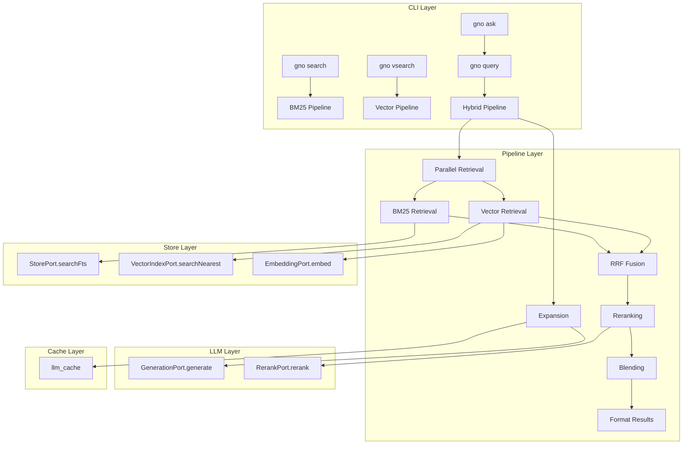

# EPIC 8: Search Pipelines

**Type:** Enhancement
**Priority:** P1 (High)
**Status:** Planning
**Created:** 2025-12-25

---

## Overview

Implement the search pipeline layer for GNO with four search commands: `gno search` (BM25), `gno vsearch` (vector), `gno query` (hybrid), and `gno ask` (human-friendly wrapper). The hybrid pipeline includes query expansion, parallel retrieval, RRF fusion, cross-encoder reranking, and position-aware score blending.

## Problem Statement

GNO has completed:

- **EPIC 5:** Indexing with FTS5 (`StorePort.searchFts()`)
- **EPIC 6:** LLM subsystem (`EmbeddingPort`, `RerankPort`, `GenerationPort`)
- **EPIC 7:** Vector embeddings (`VectorIndexPort.searchNearest()`)

Missing: Search command layer that orchestrates these primitives into user-facing commands with hybrid retrieval, expansion, fusion, and explainability.

## Technical Approach

### Architecture

Create `src/pipeline/` module with layered components:

```
src/pipeline/
  types.ts           # Pipeline interfaces (SearchPipelinePort, etc.)
  search.ts          # BM25-only wrapper
  vsearch.ts         # Vector-only wrapper
  expansion.ts       # Query expansion via GenerationPort
  fusion.ts          # RRF implementation
  rerank.ts          # Rerank integration with blending
  hybrid.ts          # Main orchestrator
  explain.ts         # Explainability formatter
  index.ts           # Exports
```

### Key Design Decisions

1. **Port-based architecture**: All components implement ports for testability
2. **Result-based errors**: Use existing `StoreResult<T>` pattern
3. **Graceful degradation**: Missing vectors/models degrade with annotations
4. **Deterministic outputs**: Stable tie-breaking, cached expansion

### Parameters (Clarified)

| Parameter             | Default   | Configurable | Source                       |
| --------------------- | --------- | ------------ | ---------------------------- |
| `rrfK`                | 60        | Yes (config) | RRF constant                 |
| `topRankBonus`        | 0.1       | Yes (config) | Added if in top-5 both modes |
| `expansionTimeout`    | 5000ms    | Yes (config) | Gen model timeout            |
| `rerankCandidates`    | 20        | Yes (config) | Max candidates to rerank     |
| Blending (ranks 1-3)  | 0.75/0.25 | Yes (config) | fusion/rerank weights        |
| Blending (ranks 4-10) | 0.60/0.40 | Yes (config) | fusion/rerank weights        |
| Blending (ranks 11+)  | 0.40/0.60 | Yes (config) | fusion/rerank weights        |

---

## Implementation Phases

### Phase 1: Core Search Commands (search, vsearch)

**Tasks:**

- [ ] T8.1.1: Create `src/pipeline/types.ts` with `SearchPipelinePort` interface
- [ ] T8.1.2: Implement `src/pipeline/search.ts` - BM25 wrapper over `StorePort.searchFts()`
- [ ] T8.1.3: Implement `src/pipeline/vsearch.ts` - Vector wrapper over `VectorIndexPort`
- [ ] T8.1.4: Add `gno search` CLI command (`src/cli/commands/search.ts`)
- [ ] T8.1.5: Add `gno vsearch` CLI command (`src/cli/commands/vsearch.ts`)
- [ ] T8.1.6: Add schema contract tests for search result outputs
- [ ] T8.1.7: Integration tests with fixture corpus

**File References:**

- `src/store/sqlite/adapter.ts:550-623` - Existing FTS search implementation
- `src/store/vector/sqlite-vec.ts:357-380` - Existing vector search
- `spec/cli.md:386-420` - CLI spec for search commands
- `spec/output-schemas/search-result.schema.json` - Output schema

**Acceptance Criteria:**

- `gno search` returns BM25 results with correct schema
- `gno vsearch` returns vector results or structured error if unavailable
- Both support `-n`, `--collection`, `--min-score`, `--lang`, output formats

---

### Phase 2: Query Expansion

**Tasks:**

- [ ] T8.2.1: Define expansion JSON schema in `spec/output-schemas/expansion.schema.json`
- [ ] T8.2.2: Implement `src/pipeline/expansion.ts`:
  - Prompt template selection by language
  - Schema validation with fallback
  - Cache key generation: `hash(promptVersion, modelUri, query, lang)`
  - Timeout handling (5s default)
- [ ] T8.2.3: Add expansion prompt templates in `src/pipeline/prompts/`:
  - `expansion-en.txt` - English template
  - `expansion-de.txt` - German template
  - `expansion-multilingual.txt` - Fallback
- [ ] T8.2.4: Unit tests for expansion schema validation
- [ ] T8.2.5: Unit tests for cache key generation

**Expansion Schema:**

```json
{
  "lexicalQueries": ["variant1", "variant2"],
  "vectorQueries": ["semantic1", "semantic2"],
  "hyde": "optional hypothetical document",
  "notes": "optional debug notes"
}
```

**Cache Key Structure:**

```typescript
// Cache key for llm_cache table
const cacheKey = sha256(
  [
    EXPANSION_PROMPT_VERSION, // e.g., "v1"
    modelUri, // e.g., "hf:Qwen/..."
    query,
    lang ?? "auto",
  ].join("\0")
);
```

**Acceptance Criteria:**

- Expansion returns valid schema or null on failure
- Cache hits return identical results
- Timeout gracefully falls back to no expansion

---

### Phase 3: Parallel Retrieval & RRF Fusion

**Tasks:**

- [ ] T8.3.1: Implement `src/pipeline/fusion.ts`:
  - RRF formula: `1 / (k + rank)`
  - Weighted sources (original: 1.0, variant: 0.5, hyde: 0.7)
  - Top-rank bonus (+0.1 if in top-5 both modes)
  - Deterministic tie-breaking by docid
- [ ] T8.3.2: Implement parallel retrieval coordinator in `src/pipeline/hybrid.ts`:
  - BM25: original + lexical variants
  - Vector: original + semantic variants + HyDE
  - Promise.all() for parallelism
- [ ] T8.3.3: Unit tests for RRF math
- [ ] T8.3.4: Unit tests for tie-breaking stability

**RRF Formula:**

```typescript
function rrfScore(
  doc: string,
  bm25Rank: number | null,
  vecRank: number | null,
  k = 60,
  weights = { bm25: 1.0, vec: 1.0, bonus: 0.1 }
): number {
  let score = 0;
  if (bm25Rank !== null) {
    score += weights.bm25 / (k + bm25Rank);
  }
  if (vecRank !== null) {
    score += weights.vec / (k + vecRank);
  }
  // Top-rank bonus if in top-5 of both
  if (bm25Rank !== null && bm25Rank <= 5 && vecRank !== null && vecRank <= 5) {
    score += weights.bonus;
  }
  return score;
}
```

**Acceptance Criteria:**

- RRF produces stable, reproducible rankings
- Parallel retrieval completes without race conditions
- Tie-breaking is deterministic by docid

---

### Phase 4: Reranking & Blending

**Tasks:**

- [ ] T8.4.1: Implement `src/pipeline/rerank.ts`:
  - Integration with `RerankPort`
  - Position-aware blending schedule
  - Graceful skip if model unavailable
- [ ] T8.4.2: Implement blending logic:
  ```
  Ranks 1-3:   0.75 * fusion + 0.25 * rerank
  Ranks 4-10:  0.60 * fusion + 0.40 * rerank
  Ranks 11+:   0.40 * fusion + 0.60 * rerank
  ```
- [ ] T8.4.3: Unit tests for blending math
- [ ] T8.4.4: Integration tests with mock reranker

**Blending Implementation:**

```typescript
function blend(
  fusionScore: number,
  rerankScore: number,
  position: number,
  schedule = DEFAULT_BLENDING_SCHEDULE
): number {
  const tier = schedule.find((t) => position <= t.maxRank) ?? schedule.at(-1)!;
  return tier.fusionWeight * fusionScore + tier.rerankWeight * rerankScore;
}

const DEFAULT_BLENDING_SCHEDULE = [
  { maxRank: 3, fusionWeight: 0.75, rerankWeight: 0.25 },
  { maxRank: 10, fusionWeight: 0.6, rerankWeight: 0.4 },
  { maxRank: Infinity, fusionWeight: 0.4, rerankWeight: 0.6 },
];
```

**Acceptance Criteria:**

- Rerank gracefully skips when model unavailable
- Blending produces stable rankings
- `meta.reranked` correctly indicates reranking status

---

### Phase 5: Hybrid Query Command

**Tasks:**

- [ ] T8.5.1: Implement `src/pipeline/hybrid.ts` orchestrator:
  - Strong BM25 check (sigmoid normalized, dual threshold)
  - Expansion decision logic
  - Parallel retrieval coordination
  - Fusion → Rerank → Blend pipeline
- [ ] T8.5.2: Implement `src/pipeline/explain.ts`:
  - Stderr formatter for `--explain`
  - JSON meta structure
- [ ] T8.5.3: Add `gno query` CLI command
- [ ] T8.5.4: Integration tests with full pipeline
- [ ] T8.5.5: Graceful degradation tests (no vectors, no gen, no rerank)

**Pipeline Flow:**

```typescript
async function hybridSearch(
  query: string,
  opts: HybridSearchOptions
): Promise<StoreResult<SearchResult[]>> {
  // 1. Check if expansion needed
  const shouldExpand =
    !opts.noExpand && (await checkBm25Strength(query)) < STRONG_BM25_THRESHOLD;

  // 2. Run expansion if needed
  const expansion = shouldExpand ? await expand(query, opts.lang) : null;

  // 3. Parallel retrieval
  const [bm25, vector] = await Promise.all([
    retrieveBm25(query, expansion?.lexicalQueries ?? []),
    retrieveVector(query, expansion?.vectorQueries ?? [], expansion?.hyde),
  ]);

  // 4. RRF Fusion
  const fused = rrfFuse(bm25, vector);

  // 5. Rerank (if available)
  const reranked = opts.noRerank
    ? { results: fused, reranked: false }
    : await rerankCandidates(query, fused.slice(0, 20));

  // 6. Position-aware blending
  const blended = blend(fused, reranked.results);

  // 7. Format results
  return ok(formatResults(blended, opts));
}
```

**Acceptance Criteria:**

- `gno query` uses hybrid pipeline with all stages
- `--no-expand`, `--no-rerank` flags work correctly
- `--explain` outputs pipeline details to stderr
- Graceful degradation annotated in `meta`

---

### Phase 6: Ask Command

**Tasks:**

- [ ] T8.6.1: Add `gno ask` CLI command:
  - Wrapper over `gno query`
  - Citations-first output format
  - `--answer` flag for grounded generation
  - `--no-answer` to force retrieval-only
- [ ] T8.6.2: Implement answer generation:
  - Grounded synthesis prompt
  - Citation extraction
  - Max token cap (configurable)
- [ ] T8.6.3: Add `spec/output-schemas/ask-result.schema.json`
- [ ] T8.6.4: Schema contract tests for ask output
- [ ] T8.6.5: Integration tests

**Ask Output Schema:**

```json
{
  "query": "string",
  "mode": "hybrid",
  "queryLanguage": "auto",
  "answer": "optional grounded answer",
  "citations": [
    { "docid": "#a1b2c3", "uri": "gno://...", "startLine": 10, "endLine": 15 }
  ],
  "results": [],
  "meta": {
    "expanded": true,
    "reranked": true,
    "vectorsUsed": true
  }
}
```

**Acceptance Criteria:**

- `gno ask` returns citations-first format
- `--answer` generates grounded response when gen model available
- Falls back to citations-only when gen model unavailable

---

### Phase 7: Eval Harness Integration

**Tasks:**

- [ ] T8.7.1: Create eval corpus with multilingual queries (DE/FR/IT/EN)
- [ ] T8.7.2: Implement recall@k and nDCG@k metrics
- [ ] T8.7.3: Add expansion stability checks (same query → same expansion)
- [ ] T8.7.4: Add ranking regression tests
- [ ] T8.7.5: CI gate integration (soft fail initially)

**Eval Metrics:**

- recall@5, recall@10
- nDCG@5, nDCG@10
- Expansion determinism: 100% (same input → same output)
- Latency budget: p95 < 5s for hybrid search

---

## Acceptance Criteria

### Functional Requirements

- [ ] `gno search` returns BM25 results matching schema
- [ ] `gno vsearch` returns vector results or VECTORS_UNAVAILABLE error
- [ ] `gno query` runs full hybrid pipeline with expansion, fusion, reranking
- [ ] `gno ask` returns citations-first output with optional grounded answer
- [ ] All commands support `-n`, `--collection`, `--min-score`, `--lang`, `--json`, `--files`
- [ ] `gno query --explain` outputs pipeline details to stderr
- [ ] Graceful degradation when models/vectors unavailable

### Non-Functional Requirements

- [ ] Hybrid search p95 < 5s on typical corpus
- [ ] Deterministic results for same query
- [ ] Schema contract tests pass for all output formats
- [ ] Eval metrics meet baseline thresholds

### Quality Gates

- [ ] Unit tests for RRF math, blending, expansion schema
- [ ] Integration tests with fixture corpus
- [ ] Schema contract tests (extend existing 94 tests)
- [ ] Eval harness with ranking metrics

---

## Dependencies & Prerequisites

### Internal Dependencies

- [x] **EPIC 5:** Indexing + FTS5 (`StorePort.searchFts()`)
- [x] **EPIC 6:** LLM subsystem (`EmbeddingPort`, `RerankPort`, `GenerationPort`)
- [x] **EPIC 7:** Vector embeddings (`VectorIndexPort.searchNearest()`)

### External Dependencies

- `bun:sqlite` - Database layer
- `node-llama-cpp` - LLM inference (already in EPIC 6)
- `sqlite-vec` - Vector search (already in EPIC 7)

---

## Risk Analysis & Mitigation

| Risk                        | Impact               | Mitigation                       |
| --------------------------- | -------------------- | -------------------------------- |
| Gen model slow/unavailable  | Expansion fails      | Timeout + graceful skip          |
| Rerank model OOM            | Results not reranked | Skip rerank, use fusion scores   |
| sqlite-vec not loaded       | No vector search     | Degrade to BM25-only             |
| Expansion returns garbage   | Bad query variants   | Schema validation + skip invalid |
| RRF produces unstable order | Flaky tests          | Deterministic tie-breaking       |

---

## File Changes Summary

### New Files

```
src/pipeline/
  types.ts           # ~100 lines
  search.ts          # ~50 lines
  vsearch.ts         # ~80 lines
  expansion.ts       # ~150 lines
  fusion.ts          # ~100 lines
  rerank.ts          # ~100 lines
  hybrid.ts          # ~200 lines
  explain.ts         # ~80 lines
  index.ts           # ~20 lines
  prompts/
    expansion-en.txt
    expansion-de.txt
    expansion-multilingual.txt

src/cli/commands/
  search.ts          # ~80 lines
  vsearch.ts         # ~80 lines
  query.ts           # ~120 lines
  ask.ts             # ~100 lines

spec/output-schemas/
  expansion.schema.json
  ask-result.schema.json

test/pipeline/
  fusion.test.ts
  expansion.test.ts
  rerank.test.ts
  hybrid.test.ts

test/cli/
  search.test.ts
  vsearch.test.ts
  query.test.ts
  ask.test.ts
```

### Modified Files

```
src/config/types.ts          # Add search pipeline config
src/cli/index.ts             # Register new commands
spec/cli.md                  # Already has specs, verify alignment
```

---

## ERD: Search Pipeline Data Flow



---

## References

### Internal References

- `src/store/sqlite/adapter.ts:550-623` - FTS search implementation
- `src/store/vector/sqlite-vec.ts:357-380` - Vector search
- `src/llm/types.ts:78-96` - LLM port interfaces
- `spec/cli.md:386-499` - CLI command specs
- `spec/output-schemas/search-result.schema.json` - Output schema

### External References

- [sqlite-vec Hybrid Search](https://alexgarcia.xyz/blog/2024/sqlite-vec-hybrid-search/index.html)
- [RRF TypeScript Implementation](https://alexop.dev/tils/reciprocal-rank-fusion-typescript-vue/)
- [node-llama-cpp Ranking Guide](https://node-llama-cpp.withcat.ai/guide/embedding)
- [SQLite FTS5 BM25](https://www.sqlite.org/fts5.html)

### Related Work

- PRD §12: Search modes and pipelines
- PRD §14: CLI specification
- PRD §15: Output contracts

---

## MVP Checklist

- [ ] Phase 1: search + vsearch commands
- [ ] Phase 2: Query expansion with caching
- [ ] Phase 3: RRF fusion
- [ ] Phase 4: Reranking + blending
- [ ] Phase 5: Hybrid query command
- [ ] Phase 6: Ask command
- [ ] Phase 7: Eval harness (soft gate)
